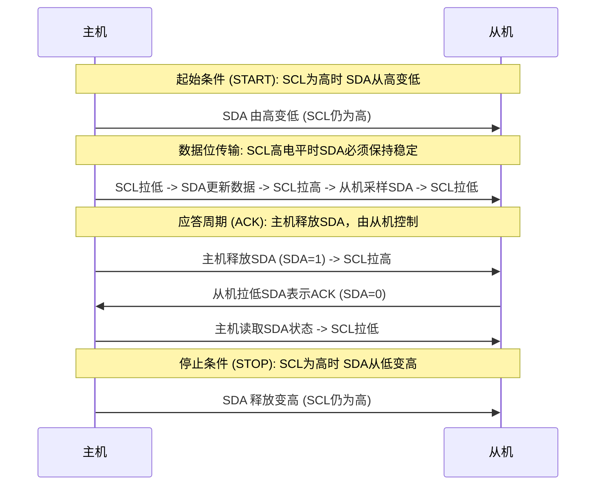

# GPIO 软件模拟时序与物理电平

软件模拟 I2C 驱动的核心在于：通过微控制器的通用输入输出引脚（GPIO）精确控制总线的电平状态，以满足 I2C 协议规范的建立时间与保持时间要求。要编写出稳定、高性能的模拟驱动，我们首先必须理解 I2C 物理层的电平特征。

---

## 1. I2C 物理层与电平特征

I2C 协议在物理层采用双线双向总线：**SDA（串行数据线）** 与 **SCL（串行时钟线）**。

### 开漏输出与线与逻辑

I2C 总线上的所有器件（包括 Master 和 Slave）的 GPIO 引脚都必须配置为**开漏输出（Open-Drain）**模式。其内部等效电路如下所示：

```mermaid
graph TD
    VCC[VCC / 3.3V] -->|上拉电阻 R_pullup| SDA_Bus(SDA 总线)
    VCC -->|上拉电阻 R_pullup| SCL_Bus(SCL 总线)
    
    subgraph Master (主机)
        M_SDA_IN[输入缓冲器 / IDR] <--> SDA_Bus
        M_SDA_OUT[开漏 NMOS 驱动器] --> SDA_Bus
        M_SCL_IN[输入缓冲器 / IDR] <--> SCL_Bus
        M_SCL_OUT[开漏 NMOS 驱动器] --> SCL_Bus
    end

    subgraph Slave (从机)
        S_SDA_IN[输入缓冲器] <--> SDA_Bus
        S_SDA_OUT[开漏 NMOS] --> SDA_Bus
        S_SCL_IN[输入缓冲器] <--> SCL_Bus
        S_SCL_OUT[开漏 NMOS] --> SCL_Bus
    end
```

这种设计的关键物理特性包括：
1. **被动上拉**：当所有器件都输出高电平（即内部 NMOS 截止）时，总线由外部上拉电阻 $R_{pullup}$ 强制拉高至 $V_{CC}$。总线自身不具备主动驱动高电平的能力。
2. **主动下拉**：任何一个器件导通内部 NMOS 时，都会将总线强制拉低至地电平（$V_{SS}$）。
3. **线与（Wired-AND）逻辑**：只要有一个器件输出低电平，整条总线的状态即为低电平。只有当所有器件都释放总线（输出高电平）时，总线才呈现高电平。这为多主机制裁、冲突检测以及**时钟拉伸（Clock Stretching）**提供了物理基础。

### 上拉电阻与时序约束

由于总线高电平是通过上拉电阻充电实现的，因此总线电平由低变高的上升沿时间（$t_r$）取决于**总线寄生电容（$C_b$）**和**上拉电阻（$R_{pullup}$）**构成的 RC 时间常数：

$$t_r \approx 0.8473 \times R_{pullup} \times C_b$$

* **电阻过大**：会导致波形上升沿过于缓慢，无法在高速时钟周期内达到高电平阈值（$V_{IH} = 0.7V_{CC}$），从而引发通信错误。
* **电阻过小**：虽然能加快上升沿，但会导致器件导通时灌入电流过大，增加功耗，并可能超出引脚的最大容许灌电流（通常 STM32 GPIO 为 $20\text{mA}$，I2C 规范建议灌电流限制在 $3\text{mA}$ 以内）。
* **推荐阻值**：标准模式（$100\text{kbps}$）下一般选用 $4.7\text{k}\Omega$ 至 $10\text{k}\Omega$；快速模式（$400\text{kbps}$）下一般选用 $1.5\text{k}\Omega$ 至 $2.2\text{k}\Omega$。

### 时钟拉伸（Clock Stretching）

在同步通信中，如果从机处理速度跟不上主机的时钟频率，从机可以通过**拉低 SCL 总线**来强制主机进入等待状态。
* **物理过程**：主机释放 SCL（准备让其变为高电平），但由于从机内部的 NMOS 仍处于导通状态，SCL 线物理上保持低电平。
* **主机应对**：主机在释放 SCL 后，必须通过其输入缓冲器**反读 SCL 线的物理电平**。如果检测到 SCL 仍然为低，主机必须挂起时钟计数器，等待从机释放 SCL（即反读到高电平）后，才能继续接下来的通信。
* **软件要求**：这意味着软件模拟驱动在每次拉高 SCL 时，都**不能盲目延时**，而是必须读取 SCL 引脚状态，执行时钟拉伸等待。

---

## 2. STM32 GPIO 寄存器级控制

为了实现高效率的软件模拟，我们需要直接操作 STM32 的 GPIO 寄存器。

### 免引脚方向切换（No Direction Switch）优化

许多低端或编写粗糙的模拟 I2C 驱动会在读/写 SDA 时频繁地将 GPIO 配置为输入或输出模式。例如：
* 写数据：调用 `GPIO_Init` 将 SDA 配置为输出模式。
* 读应答/数据：调用 `GPIO_Init` 将 SDA 配置为输入模式。

这种操作非常低效。在 STM32 中，修改 GPIO 的模式寄存器（如 F1 系列的 `CRL/CRH`，F4/L4/G0 系列的 `MODER`）需要进行“读-改-写”操作，这会消耗数十个 CPU 时钟周期，极大地限制了通信速率。

**优化方案**：利用开漏输出模式的固有特性。
在 GPIO 处于**开漏输出**模式时：
1. 其**输入缓冲器（Input Buffer）仍然是使能的**。可以通过输入数据寄存器（`IDR`）实时读取引脚上的物理电平。
2. 当我们向输出数据寄存器（`ODR`）写入 `1` 时，内部 NMOS 截止，引脚处于高阻态（High-Impedance），此时其物理电平完全由外部上拉电阻或从机驱动。
3. 因此，**我们只需将 SDA 和 SCL 永久初始化为开漏输出模式**，即可实现双向通信：
   * 需要输出高电平或读取数据时，向该引脚输出 `1`（释放总线），随后直接读取 `IDR`。
   * 需要输出低电平时，向该引脚输出 `0`。

```
                    STM32 GPIO Pad (开漏配置)
                 +-----------------------------+
                 |                             |
    Write ODR=1  |        +---+                |
    ------------>|  x---> |   |    (PMOS 禁用)  |
                 |        |   |--[X]           |
                 |  +---> |   |                |
    Write ODR=0  |  |     +---+                |   Physical Pin (SDA/SCL)
    ------------>|--+     +---+                |===========*===========
                 |        |   |                |           |
                 |        |   |------[NMOS]----+           |
                 |        +---+                            |
                 |                                         |
    Read IDR     |        +---+                            |
    <------------|<-------| / |<---------------------------+
                 |        +---+ (输入缓冲器常开)
                 +-----------------------------+
```

### 寄存器原子操作：BSRR 与 BRR

在 STM32 中，修改 `ODR` 寄存器如果采用非原子操作（如 `GPIOx->ODR |= Pin`），可能会被中断打断，导致非预期的引脚状态改变。
我们应该使用 **端口位设置/清除寄存器（BSRR）**。
* 往 `BSRR` 的低 16 位写 `1`：对应引脚置高（原子操作）。
* 往 `BSRR` 的高 16 位写 `1`（或者在支持 `BRR` 寄存器的芯片中向 `BRR` 写 `1`）：对应引脚置低（原子操作）。

---

## 3. 时序阶段的精确模拟

I2C 协议的基本时序可划分为：**起始信号、停止信号、数据传输、应答信号**。



### 延时机制：基于 Cortex-M DWT 计数器

使用简单的 `for` 循环延时极易受到编译器优化等级（-O0/-O2/-O3）以及系统主频变化的影响。
在 Cortex-M3、M4、M7 内核中，内置了**数据观察点和跟踪（DWT）**外设，提供了一个 32 位的时钟周期计数器（`CYCCNT`）。它以 CPU 主频进行自增，可以提供极其精确且与优化等级无关的微秒级延时。

---

## 4. C 语言生产级时序实现

以下为基于 STM32 HAL 库/寄存器混合编写的生产级软件模拟 I2C 驱动。

### 头文件定义 `soft_i2c_hal.h`

```c
#ifndef __SOFT_I2C_HAL_H
#define __SOFT_I2C_HAL_H

#include "stm32f4xx_hal.h" // 根据具体芯片修改，如 stm32f1xx_hal.h

// I2C 引脚定义结构体
typedef struct {
    GPIO_TypeDef *SCL_Port;
    uint16_t SCL_Pin;
    GPIO_TypeDef *SDA_Port;
    uint16_t SDA_Pin;
    uint32_t Delay_us;     // 时序半周期延时，通常 400kHz 设为 2~3us
    uint32_t Timeout;      // 时钟拉伸与应答超时阈值（次数计数）
} SoftI2C_Configt;

// API 声明
void SoftI2C_Init(const SoftI2C_Configt *config);
void SoftI2C_Start(const SoftI2C_Configt *config);
void SoftI2C_Stop(const SoftI2C_Configt *config);
HAL_StatusTypeDef SoftI2C_WriteByte(const SoftI2C_Configt *config, uint8_t byte);
uint8_t SoftI2C_ReadByte(const SoftI2C_Configt *config, uint8_t ack_action);

#endif /* __SOFT_I2C_HAL_H */
```

### 驱动源文件 `soft_i2c_hal.c`

```c
#include "soft_i2c_hal.h"

/* ==================== 1. 高精度微秒延时实现 (DWT) ==================== */

static inline void DWT_Init(void) {
    // 启用 DWT 计数器
    if (!(CoreDebug->DEMCR & CoreDebug_DEMCR_TRCENA_Msk)) {
        CoreDebug->DEMCR |= CoreDebug_DEMCR_TRCENA_Msk;
    }
    DWT->CYCCNT = 0;
    DWT->CTRL |= DWT_CTRL_CYCCNTENA_Msk;
}

static inline void Delay_us(uint32_t us) {
    uint32_t start_tick = DWT->CYCCNT;
    // 计算所需时钟周期数：us * (SystemCoreClock / 1000000)
    uint32_t delay_ticks = us * (SystemCoreClock / 1000000);
    while ((DWT->CYCCNT - start_tick) < delay_ticks) {
        // 等待周期累加完成
    }
}

/* ==================== 2. GPIO 寄存器快速控制宏 ==================== */

#define SDA_HIGH(cfg)   ((cfg)->SDA_Port->BSRR = (cfg)->SDA_Pin)
#define SDA_LOW(cfg)    ((cfg)->SDA_Port->BSRR = ((uint32_t)(cfg)->SDA_Pin << 16))
#define SCL_HIGH(cfg)   ((cfg)->SCL_Port->BSRR = (cfg)->SCL_Pin)
#define SCL_LOW(cfg)    ((cfg)->SCL_Port->BSRR = ((uint32_t)(cfg)->SCL_Pin << 16))

#define READ_SDA(cfg)   (((cfg)->SDA_Port->IDR & (cfg)->SDA_Pin) ? 1 : 0)
#define READ_SCL(cfg)   (((cfg)->SCL_Port->IDR & (cfg)->SCL_Pin) ? 1 : 0)

/* ==================== 3. 初始化与基本时序 ==================== */

/**
 * @brief  初始化 I2C 相关的 GPIO 引脚为开漏输出模式
 */
void SoftI2C_Init(const SoftI2C_Configt *config) {
    GPIO_InitTypeDef GPIO_InitStruct = {0};

    // 初始化 DWT 计数器
    DWT_Init();

    // 启用 GPIO 端口时钟 (假设调用者已在外围使能，或在此动态开启)
    // 这里建议在外层应用初始化中使能 GPIO 时钟

    // 配置 SCL 为开漏输出，上拉
    GPIO_InitStruct.Pin = config->SCL_Pin;
    GPIO_InitStruct.Mode = GPIO_MODE_OUTPUT_OD;
    GPIO_InitStruct.Pull = GPIO_PULLUP;
    GPIO_InitStruct.Speed = GPIO_SPEED_FREQ_HIGH;
    HAL_GPIO_Init(config->SCL_Port, &GPIO_InitStruct);

    // 配置 SDA 为开漏输出，上拉
    GPIO_InitStruct.Pin = config->SDA_Pin;
    HAL_GPIO_Init(config->SDA_Port, &GPIO_InitStruct);

    // 释放总线处于空闲状态 (高电平)
    SDA_HIGH(config);
    SCL_HIGH(config);
    Delay_us(config->Delay_us);
}

/**
 * @brief  产生 I2C 起始条件
 * @note   SCL 高电平时，SDA 产生下降沿
 */
void SoftI2C_Start(const SoftI2C_Configt *config) {
    SDA_HIGH(config);
    SCL_HIGH(config);
    Delay_us(config->Delay_us);
    
    // 确保 SCL 确实高电平 (处理从机时钟拉伸的情况)
    uint32_t timeout = config->Timeout;
    while (READ_SCL(config) == 0 && timeout > 0) {
        timeout--;
        Delay_us(1);
    }

    SDA_LOW(config); // SCL为高，SDA从高拉低
    Delay_us(config->Delay_us);
    SCL_LOW(config); // 拉低时钟线，准备发送数据
    Delay_us(config->Delay_us);
}

/**
 * @brief  产生 I2C 停止条件
 * @note   SCL 高电平时，SDA 产生上升沿
 */
void SoftI2C_Stop(const SoftI2C_Configt *config) {
    SDA_LOW(config);
    Delay_us(config->Delay_us);
    SCL_HIGH(config);
    
    // 时钟拉伸等待
    uint32_t timeout = config->Timeout;
    while (READ_SCL(config) == 0 && timeout > 0) {
        timeout--;
        Delay_us(1);
    }
    Delay_us(config->Delay_us);
    
    SDA_HIGH(config); // SCL为高，SDA从低拉高
    Delay_us(config->Delay_us);
}

/* ==================== 4. 数据传输与应答控制 ==================== */

/**
 * @brief  写入一个字节数据并获取应答
 * @retval HAL_OK: 发送成功且收到应答; HAL_ERROR: 无应答或超时
 */
HAL_StatusTypeDef SoftI2C_WriteByte(const SoftI2C_Configt *config, uint8_t byte) {
    // 循环发送 8 个数据位，从 MSB 开始
    for (uint8_t i = 0; i < 8; i++) {
        if (byte & 0x80) {
            SDA_HIGH(config);
        } else {
            SDA_LOW(config);
        }
        byte <<= 1;
        Delay_us(config->Delay_us);

        SCL_HIGH(config); // 释放 SCL，通知从机读取数据
        
        // 时钟拉伸处理
        uint32_t timeout = config->Timeout;
        while (READ_SCL(config) == 0 && timeout > 0) {
            timeout--;
            Delay_us(1);
        }
        
        Delay_us(config->Delay_us);
        SCL_LOW(config); // 拉低 SCL，允许下一次 SDA 改变
    }

    // 第 9 个时钟周期：读取从机的应答信号 (ACK/NACK)
    SDA_HIGH(config); // 主机释放 SDA 线
    Delay_us(config->Delay_us);
    SCL_HIGH(config); // 释放 SCL

    // 等待 SCL 变高 (时钟拉伸)
    uint32_t timeout = config->Timeout;
    while (READ_SCL(config) == 0 && timeout > 0) {
        timeout--;
        Delay_us(1);
    }

    // 采样应答电平
    uint8_t ack = READ_SDA(config);
    Delay_us(config->Delay_us);
    SCL_LOW(config); // 结束应答周期
    Delay_us(config->Delay_us);

    // I2C 规定：0 表示有效应答 (ACK)，1 表示非应答 (NACK)
    if (ack == 0) {
        return HAL_OK;
    } else {
        return HAL_ERROR;
    }
}

/**
 * @brief  读取一个字节数据并发送应答/非应答
 * @param  ack_action: 0 表示发送 ACK, 1 表示发送 NACK
 * @retval 读取到的字节数据
 */
uint8_t SoftI2C_ReadByte(const SoftI2C_Configt *config, uint8_t ack_action) {
    uint8_t byte = 0;

    SDA_HIGH(config); // 确保主机释放了 SDA
    Delay_us(config->Delay_us);

    for (uint8_t i = 0; i < 8; i++) {
        SCL_HIGH(config); // 释放 SCL，要求从机输出数据位
        
        // 时钟拉伸处理
        uint32_t timeout = config->Timeout;
        while (READ_SCL(config) == 0 && timeout > 0) {
            timeout--;
            Delay_us(1);
        }

        byte <<= 1;
        if (READ_SDA(config)) {
            byte |= 0x01; // 采样高电平
        }
        
        Delay_us(config->Delay_us);
        SCL_LOW(config); // 拉低 SCL
        Delay_us(config->Delay_us);
    }

    // 发送应答/非应答位
    if (ack_action == 0) {
        SDA_LOW(config);  // 发送 ACK (0)
    } else {
        SDA_HIGH(config); // 发送 NACK (1)
    }
    Delay_us(config->Delay_us);
    SCL_HIGH(config); // 拉高时钟线

    // 等待从机释放时钟
    uint32_t timeout = config->Timeout;
    while (READ_SCL(config) == 0 && timeout > 0) {
        timeout--;
        Delay_us(1);
    }
    
    Delay_us(config->Delay_us);
    SCL_LOW(config); // 拉低时钟，结束应答
    SDA_HIGH(config); // 释放 SDA 线
    Delay_us(config->Delay_us);

    return byte;
}
```

该驱动已在物理层与寄存器操作上进行了深度优化。接下来的章节中，我们将基于这一底层时序进一步实现防止死锁的总线恢复逻辑与上层封装。
