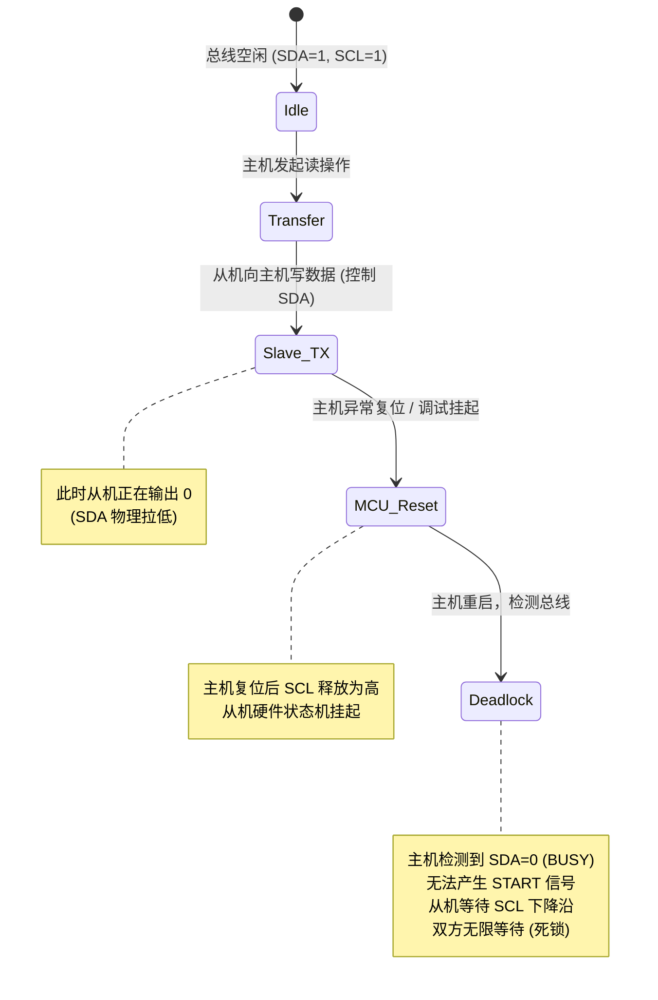

# STM32 硬件 Bug 与从机死锁成因

在嵌入式开发中，I2C 故障排查是许多工程师的噩梦。本章将深入分析为什么 STM32 硬件 I2C 容易卡死，以及在主从机通信过程中最常见的“从机拉低 SDA 导致总线死锁”的物理成因，并提供工业级的解决方案。

---

## 1. STM32 硬件 I2C 硅缺陷剖析

STM32F1xx 系列等早期 MCU 的硬件 I2C 控制器由于内部状态机设计缺陷（著名的 Silicon Bugs），在很多项目中被开发者弃用。其核心缺陷表现在：

### 状态寄存器清除时序缺陷

根据 ST 官方勘误手册（Errata Sheet），硬件 I2C 的事件状态清除逻辑存在时序上的不稳定性。例如：
* **ADDR（地址发送完成）** 标志需要通过读取 `SR1` 寄存器，然后读取 `SR2` 寄存器来清除。
* **TXE（发送缓冲区空）** 或 **BTF（字节传输结束）** 标志的清除同样依赖特定的寄存器读取顺序。

如果在读取 `SR1` 之后、读取 `SR2` 之前，CPU 被一个高优先级中断（如 SysTick、DMA 或串口中断）抢占，这期间总线上的硬件状态可能已经发生改变。当 CPU 从中断返回并继续读取 `SR2` 时，硬件状态机的内部同步机制会发生错乱，导致：
1. `BUSY` 标志位永久置 1，即使总线上已经没有任何电平跳变。
2. SCL 或 SDA 被硬件控制器永久拉低。
3. 产生不合规范的短脉冲（Glitch），导致从机进入错误状态。

### 软件层面的规避代价

为了在使用硬件 I2C 时避免这些 Bug，开发者必须在清除状态标志时关闭全局中断：
```c
__disable_irq();
// 执行清除 ADDR 标志的寄存器读写
volatile uint32_t temp = I2C1->SR1;
temp = I2C1->SR2;
__enable_irq();
```
然而，在对实时性要求极高的系统中，频繁关闭中断会严重增加中断延迟。此外，一旦总线受到强电磁干扰（EMI），硬件 I2C 控制器很容易直接锁死，唯一的恢复手段是彻底复位整个 I2C 外设（通过 RCC 复位寄存器），这使得硬件驱动的编写变得异常繁琐和脆弱。

---

## 2. 从机死锁（拉低 SDA）的物理成因

相比于 MCU 的硬件 Bug，**从机拉低 SDA 导致总线死锁**是一个跨平台的物理级问题，任何 I2C 驱动（硬件或软件模拟）如果处理不当，都会遇到这一现象。

### 死锁场景复现



### 死锁产生的物理步骤：
1. **主机发起读传输**：主机从某个传感器（如 EEPROM、陀螺仪）读取数据。
2. **从机控制 SDA**：在读传输中途，从机往主机发送字节。假设当前从机发送的数据位是 `0`（此时从机内部的 NMOS 导通，将 SDA 强行拉低）。
3. **主机发生意外复位**：就在从机将 SDA 拉低的这一瞬间，主机因看门狗超时、电源欠压复位、代码崩溃复位或工程师在 IDE 中点击了“复位”或“暂停”按钮。
4. **SCL 释放，从机挂起**：主机复位后，GPIO 默认恢复为输入浮空状态，SCL 在上拉电阻的作用下回到高电平。然而，从机并不知道主机已经复位，它的硬件状态机仍然停留在“等待主机将 SCL 拉低以读取下一个数据位”的阶段。
5. **死锁达成**：
   * **从机视角**：它在等待 SCL 变低。在 SCL 变低之前，它会一直让内部 NMOS 导通，强行把 SDA 线拉低。
   * **主机视角（重启后）**：主机复位启动，准备初始化 I2C 通信。在发送起始条件（START）之前，主机必须检测到总线空闲（SDA 和 SCL 均为高电平）。但此时 SDA 被从机死死拉低，主机认为总线一直处于“BUSY”状态。
   * **结果**：主机不敢发送 START，从机在等待 SCL 脉冲，两者陷入了死循环。

---

## 3. 总线恢复逻辑（Bus Recovery）

要打破上述“从机拉低 SDA”的死锁，主机必须主动干预总线。因为从机内部是一个移位寄存器状态机，它唯一的出路是“接收到足够的 SCL 脉冲以完成当前字节的发送”，从而释放 SDA。

这个恢复序列在工业界通常被称为 **"Clocks of Death"（死亡脉冲）**。

### 恢复步骤详解

1. **引脚重配置**：将 SCL 临时配置为普通推挽或开漏输出模式，SDA 配置为输入模式。
2. **状态检测**：检测 SDA 引脚电平。如果 SDA 为高电平，说明总线正常，无需恢复；如果 SDA 为低电平，则启动恢复机制。
3. **脉冲发送**：主机手动往 SCL 引脚发送脉冲（拉低 -> 延时 -> 拉高 -> 延时）。最多发送 **9 个脉冲**。
   * *为什么是 9 个脉冲？* 一个完整的 I2C 字节传输包含 8 位数据加 1 位应答（ACK）。最坏的情况是从机刚刚开始发送一个字节的第一位（数据 `0`），发送 9 个时钟脉冲能够强制让从机把移位寄存器中的其余位以及 ACK/NACK 周期跑完。
   * 在脉冲发送过程中，主机在 SCL 处于高电平时持续采样 SDA。一旦发现 SDA 变高（表明从机已经释放了 SDA），即可提前中止脉冲发送。
4. **产生 STOP 条件**：在 SDA 被释放变高后，主机必须立刻手动产生一个 START 信号，紧接着产生一个 STOP 信号。这会使所有挂在总线上的从机的 I2C 状态机强行复位到“IDLE”空闲状态。
5. **恢复引脚配置**：重新将 SCL 和 SDA 初始化为软件模拟 I2C 的开漏模式，继续后续正常的通信。

---

## 4. 工业级总线恢复 C 代码实现

以下为在 `soft_i2c_hal` 基础上扩展的总线恢复函数，可无缝集成到驱动初始化和错误处理流程中。

```c
#include "soft_i2c_hal.h"

/**
 * @brief  尝试恢复死锁的 I2C 总线
 * @param  config: I2C 配置结构体指针
 * @retval HAL_OK: 成功恢复总线或总线本身正常; 
 *         HAL_ERROR: 恢复失败（SDA 仍被强行拉低，可能硬件损坏）
 */
HAL_StatusTypeDef SoftI2C_RecoverBus(const SoftI2C_Configt *config) {
    GPIO_InitTypeDef GPIO_InitStruct = {0};
    uint8_t clocks = 9;
    uint8_t sda_state = 1;

    // 1. 将 SDA 暂时配置为输入模式，以准确读取物理引脚电平
    GPIO_InitStruct.Pin = config->SDA_Pin;
    GPIO_InitStruct.Mode = GPIO_MODE_INPUT;
    GPIO_InitStruct.Pull = GPIO_PULLUP;
    HAL_GPIO_Init(config->SDA_Port, &GPIO_InitStruct);

    // 2. 将 SCL 配置为普通推挽输出模式，用以手动产生时钟脉冲
    GPIO_InitStruct.Pin = config->SCL_Pin;
    GPIO_InitStruct.Mode = GPIO_MODE_OUTPUT_PP;
    GPIO_InitStruct.Speed = GPIO_SPEED_FREQ_HIGH;
    HAL_GPIO_Init(config->SCL_Port, &GPIO_InitStruct);

    // 默认让 SCL 处于高电平
    HAL_GPIO_WritePin(config->SCL_Port, config->SCL_Pin, GPIO_PIN_SET);
    HAL_Delay(1); // 稳定电平

    // 3. 检查 SDA 是否被拉低，如果已经是高电平，说明不需要恢复
    if (HAL_GPIO_ReadPin(config->SDA_Port, config->SDA_Pin) == GPIO_PIN_SET) {
        // 重新初始化回开漏输出，退出
        SoftI2C_Init(config);
        return HAL_OK;
    }

    // 4. 开始发送最多 9 个时钟脉冲强制释放 SDA
    for (uint8_t i = 0; i < clocks; i++) {
        // SCL 拉低
        HAL_GPIO_WritePin(config->SCL_Port, config->SCL_Pin, GPIO_PIN_RESET);
        // 时钟半周期延时 (20us 确保兼容各种慢速从机)
        HAL_Delay(1); 

        // SCL 释放高
        HAL_GPIO_WritePin(config->SCL_Port, config->SCL_Pin, GPIO_PIN_SET);
        HAL_Delay(1);

        // 采样 SDA 物理状态
        if (HAL_GPIO_ReadPin(config->SDA_Port, config->SDA_Pin) == GPIO_PIN_SET) {
            sda_state = 1;
            break; // 从机已释放 SDA，跳出循环
        }
        sda_state = 0;
    }

    // 5. 如果 SDA 成功变高，发送一个 START 和 STOP 信号使从机状态机复位
    if (sda_state == 1) {
        // 手动用 GPIO 模拟 START 条件 (SCL 为高时拉低 SDA)
        // 此时 SDA 还是输入，需要重新配置为输出以拉低
        GPIO_InitStruct.Pin = config->SDA_Pin;
        GPIO_InitStruct.Mode = GPIO_MODE_OUTPUT_PP;
        HAL_GPIO_Init(config->SDA_Port, &GPIO_InitStruct);

        // START 信号
        HAL_GPIO_WritePin(config->SDA_Port, config->SDA_Pin, GPIO_PIN_RESET); // SDA 拉低
        HAL_Delay(1);
        HAL_GPIO_WritePin(config->SCL_Port, config->SCL_Pin, GPIO_PIN_RESET); // SCL 拉低
        HAL_Delay(1);

        // STOP 信号
        HAL_GPIO_WritePin(config->SCL_Port, config->SCL_Pin, GPIO_PIN_SET);   // SCL 拉高
        HAL_Delay(1);
        HAL_GPIO_WritePin(config->SDA_Port, config->SDA_Pin, GPIO_PIN_SET);   // SDA 拉高
        HAL_Delay(1);
    }

    // 6. 重新将两个引脚初始化为标准的开漏输出模式
    SoftI2C_Init(config);

    // 7. 最终物理检查，如果 SDA 仍为低，说明无法恢复
    if (HAL_GPIO_ReadPin(config->SDA_Port, config->SDA_Pin) == GPIO_PIN_RESET) {
        return HAL_ERROR; // 恢复失败，可能属于硬件电路损坏、寄生电容过大或从机物理损坏
    }

    return HAL_OK; // 成功恢复总线
}
```

通过这一层强力的故障检测与总线自恢复逻辑，软件模拟 I2C 驱动在面对断电复位、强电磁干扰时，展现出了硬件 I2C 根本无法企及的稳健性。在下一章中，我们将展示如何结合此机制，设计一个完整的面向对象、非阻塞超时、并发安全的健壮 I2C 驱动框架。
