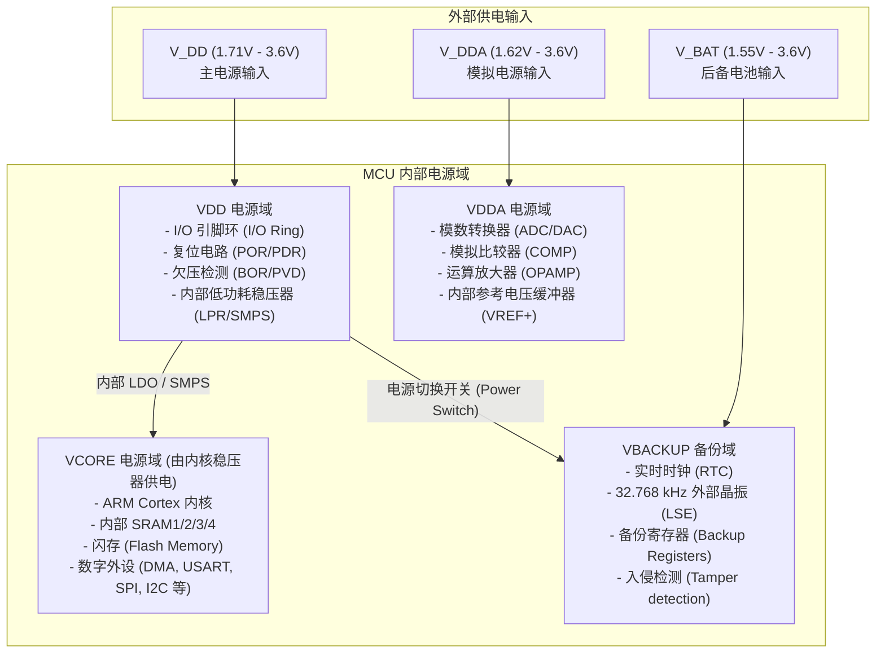
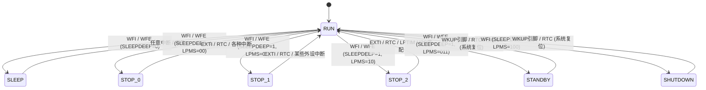

# STM32 低功耗模式深度剖析

在进行 STM32 低功耗设计时，首先必须清晰理解其内部的**电源架构（Power Architecture）**与**低功耗模式转换机制**。STM32 并非一个单一的整体供电芯片，而是由多个独立的物理电源域和电压调节器（Regulators）组合而成的复杂系统。

---

## 1. STM32 电源架构与电源域划分

为了实现微安级甚至纳安级的低功耗，STM32 采用了“分而治之”的电源管理策略，将芯片内部划分为多个不同的逻辑电源域：



### 1.1 VDD 电源域
$V_{\text{DD}}$ 是芯片的主电源，直接为 I/O 引脚、复位模块（POR/PDR）、欠压复位（BOR）和电源电压监测器（PVD）供电。此外，$V_{\text{DD}}$ 也是芯片内部电压调节器（Internal Regulator）的输入源。

### 1.2 VDDA 电源域
$V_{\text{DDA}}$ 专为模拟外设供电。为了减小数字噪声对模拟信号的干扰，设计上通常将 $V_{\text{DDA}}$ 用 LC 滤波电路与 $V_{\text{DD}}$ 隔离。即使在 MCU 进入休眠时，若不关闭模拟外设（如未关闭 ADC 或比较器），$V_{\text{DDA}}$ 域仍会产生显著的静态电流。

### 1.3 VCORE 电源域
$V_{\text{CORE}}$ 是 MCU 的核心数字域，包含 CPU 内核、系统时钟树（SYSCLK/HCLK/PCLK）、数字外设（如 SPI、USART、I2C）、Flash 闪存以及 SRAM。该域的电压并非直接来自外部，而是由内部的 **主电压调节器（Main Regulator, MR）** 或 **低功耗调节器（Low-Power Regulator, LPR）** 将 $V_{\text{DD}}$ 降压后供给。在不同的低功耗模式下，$V_{\text{CORE}}$ 可以被降低、关闭或者将其时钟完全门控。

### 1.4 VBACKUP 备份域
当主电源 $V_{\text{DD}}$ 断开时，系统会自动将电源切换至 $V_{\text{BAT}}$ 引脚，以保证实时时钟（RTC）和备份寄存器（Backup Registers）的数据不丢失。该域仅包含 LSE（32.768kHz 晶振）和 RTC 核心逻辑，其功耗通常在数百纳安（$\text{nA}$）级别。

---

## 2. 内核电压调节器：LDO 与 SMPS

在 STM32 的较新系列（如 STM32L4+、STM32U5）中，为了优化**运行（Run）模式**和**低功耗模式**下的效率，引入了双稳压器架构：

1. **LDO (Low-Dropout Regulator)**：
   * **特点**：线性稳压器，瞬态响应快，外围无电感，但效率较低。
   * **效率计算**：$\eta \approx \frac{V_{\text{CORE}}}{V_{\text{DD}}}$。当 $V_{\text{DD}} = 3.3\text{V}$，而内核电压 $V_{\text{CORE}} = 1.0\text{V}$ 时，LDO 效率仅约 $30\%$。其余 $70\%$ 的能量全部转化为热量耗散。
2. **SMPS (Switched-Mode Power Supply)**：
   * **特点**：高效率降压开关电源（Buck Converter），需要外接电感和电容。
   * **效率计算**：在合适负载下，效率可达 $85\% \sim 90\%$。在 Run 模式和某些 Stop 模式下，开启 SMPS 可以使系统活动功耗降低约 $50\% \sim 60\%$。

### 2.1 动态电压调整 (Dynamic Voltage Scaling, VOS)
在 Run 模式下，系统支持通过配置 `PWR_CR1` 寄存器中的 `VOS` 位来改变 $V_{\text{CORE}}$ 的输出电压。
* **Range 1 (High Performance)**：$V_{\text{CORE}}$ 处于最高电压（例如 $1.2\text{V}$），允许 CPU 运行在最高主频（如 $80\text{MHz}$ 或 $160\text{MHz}$）。
* **Range 2 (Low Power)**：$V_{\text{CORE}}$ 降低（例如 $1.0\text{V}$），限制 CPU 最高主频（如 $26\text{MHz}$）。由于 CMOS 芯片的动态功耗公式为：
  $$P_{\text{dynamic}} = C \cdot V^2 \cdot f$$
  将电压从 $1.2\text{V}$ 降至 $1.0\text{V}$，功耗与电压平方成正比，可直接带来约 $30\%$ 的功耗降幅。

---

## 3. STM32 低功耗模式详解

当 CPU 闲置时，可以通过执行汇编指令 `WFI` (Wait For Interrupt) 或 `WFE` (Wait For Event) 进入不同的低功耗模式。STM32 的低功耗模式呈阶梯式分布，功耗越低，恢复时间越长，保持的数据越少：



### 3.1 运行模式下的功耗优化 (Run Mode)
* **时钟分频与时钟门控**：在不需要高算力时，主动降低主频。通过外设时钟使能寄存器（如 `RCC_AHB1ENR`、`RCC_APB1ENR`）关闭未使用外设的时钟。
* **低功耗运行模式 (Low-Power Run, LPRun)**：内部调节器切换至 LPR，内核时钟限制在 $2\text{MHz}$ 以下，Flash 处于低功耗模式或断电状态，通过 SRAM 运行代码。

### 3.2 睡眠模式 (Sleep Mode)
* **状态**：仅 CPU 内核停止时钟，所有外设（如果其时钟未被 RCC 关闭）仍可运行。
* **功耗**：通常在 $mA$ 级别（取决于主频和开启的外设数量）。
* **唤醒**：任意中断或事件均可在 1~2 个时钟周期内无缝唤醒 CPU。

### 3.3 停止模式 (Stop 0 / Stop 1 / Stop 2)
在 Stop 模式下，$V_{\text{CORE}}$ 域的所有时钟（包括 PLL、HSE 和 HSI）均被关闭，但内核和 SRAM 的数据得以完整保持。
* **Stop 0**：主稳压器（MR）保持开启。提供最快的唤醒速度（通常约 $3\sim 5\,\mu\text{s}$），但静态电流较高（通常约 $100\sim 200\,\mu\text{A}$）。
* **Stop 1**：主稳压器关闭，低功耗稳压器（LPR）工作。唤醒时间稍长（约 $5\sim 10\,\mu\text{s}$），底电流降至 $10\sim 20\,\mu\text{A}$。
* **Stop 2（超低功耗停止）**：内核电压处于极低水平，大多数外设断电。SRAM2 可以选择保留，而 SRAM1/3 可选择断电以进一步节电。底电流降至 **$1\sim 3\,\mu\text{A}$**，唤醒时间约 $5\sim 15\,\mu\text{s}$。这是低功耗设备最常采用的深度休眠模式。

### 3.4 待机模式 (Standby Mode)
* **状态**：整个 $V_{\text{CORE}}$ 域完全断电，所有寄存器和 SRAM1/3 的数据全部丢失。仅备份域（RTC、备份寄存器）和待机电路工作。部分型号支持 SRAM2 保留（会略微增加底电流）。
* **功耗**：底电流降至 **$300\sim 800\,\text{nA}$**。
* **唤醒**：只能通过 WKUP 引脚上升沿/下降沿、RTC 闹钟/周期唤醒、独立看门狗（IWDG）复位或复位引脚唤醒。唤醒后，**系统等同于重新上电复位（Reset）**，代码将从 `main` 函数重新执行。

### 3.5 关断模式 (Shutdown Mode)
* **状态**：内部稳压器彻底关闭，$V_{\text{CORE}}$ 降为 $0\text{V}$。SRAM2 无法保留，LVD（低压检测）也停止工作。这是功耗极限模式。
* **功耗**：底电流仅为 **$10\sim 50\,\text{nA}$**。
* **唤醒**：与 Standby 类似，唤醒后相当于硬件冷复位。

---

## 4. 低功耗模式性能与功耗对比表

以典型的 **STM32L476**（$V_{\text{DD}} = 3.0\text{V}$，无外部 SMPS，温度 $25^\circ\text{C}$）为例：

| 模式 | 稳压器 (Regulator) | SRAM 保持状态 | 时钟状态 | 典型电流消耗 | 唤醒源 | 唤醒时间 |
| :--- | :--- | :--- | :--- | :--- | :--- | :--- |
| **Run (80MHz)** | MR (Range 1) | 全部保持 | 所有时钟工作 | $\approx 8.5\,\text{mA}$ | N/A | 0 |
| **LPRun (2MHz)** | LPR (Range 2) | 全部保持 | 限 $2\,\text{MHz}$ 以下 | $\approx 280\,\mu\text{A}$ | N/A | 0 |
| **Sleep** | MR | 全部保持 | CPU 停止，外设工作 | $\approx 1.5\,\text{mA}$ (24MHz) | 任意中断 | $6$ 个时钟周期 |
| **Stop 0** | MR | 全部保持 | 振荡器关闭 | $\approx 110\,\mu\text{A}$ | 任意 EXTI, RTC, I2C | $\approx 4\,\mu\text{s}$ |
| **Stop 1** | LPR | 全部保持 | 振荡器关闭 | $\approx 12\,\mu\text{A}$ | 任意 EXTI, RTC, I2C | $\approx 8\,\mu\text{s}$ |
| **Stop 2** | LPR | SRAM2/Regs 保持 | 振荡器关闭 | **$\approx 1.1\,\mu\text{A}$** | EXTI, RTC, LPTIM, I2C | $\approx 5\sim 8\,\mu\text{s}$ (从MSI唤醒) |
| **Standby** | OFF | 丢失 (可单独保留SRAM2) | 全部关闭 (除LSE/LSI) | **$\approx 350\,\text{nA}$** | WKUP引脚, RTC, IWDG | $\approx 14\,\mu\text{s}$ (冷启动) |
| **Shutdown** | OFF | 全部丢失 | 全部关闭 (除LSE) | **$\approx 30\,\text{nA}$** | WKUP引脚, RTC | $\approx 50\,\mu\text{s}$ (冷启动) |

---

## 5. 低功耗切换寄存器级控制原理

要让 Cortex-M 内核进入深度休眠，核心在于配置系统控制寄存器（System Control Register, SCR）以及 STM32 的电源控制寄存器（PWR_CRx）。

### 5.1 Cortex-M System Control Register (SCR)
在 ARM 内核层面，控制低功耗状态的寄存器是系统控制寄存器（SCR，地址 `0xE000ED10`）：

| 位 (Bit) | 字段名 | 作用 |
| :---: | :--- | :--- |
| **Bit 1** | `SLEEPONEXIT` | **退出时休眠**。若置 1，当从中断服务程序（ISR）返回时，MCU 自动重新进入休眠，无需返回主程序。适用于纯中断驱动型系统。 |
| **Bit 2** | `SLEEPDEEP` | **深睡眠控制**。若置 1，执行 `WFI` 后进入 Stop/Standby/Shutdown；若置 0，执行 `WFI` 后仅进入 Sleep 模式。 |
| **Bit 4** | `SEVONPEND` | **悬起事件唤醒**。若置 1，即使中断被屏蔽（通过 PRIMASK），中断挂起也会产生事件唤醒 WFE。 |

### 5.2 STM32 PWR 寄存器配置步骤 (以 Stop 2 模式为例)
要进入 Stop 2 模式，需要通过操作 `PWR->CR1` 寄存器的 `LPMS`（Low-Power Mode Selection）位来配合内核的 `SLEEPDEEP`：

1. **清除唤醒标志位**：向 `PWR->SCR` 寄存器写入对应位，清除原有的唤醒标志（WUF）。
2. **选择休眠模式**：配置 `PWR->CR1` 的 `LPMS[2:0]` 字段为 `010` (Stop 2 mode)。
3. **启用深度睡眠**：设置内核 `SCB->SCR` 的 `SLEEPDEEP` 位。
4. **闪存低功耗配置**：在进入 Stop 2 前，可以选择将 Flash 置于 Power-down 状态以进一步省电（配置 `PWR_CR1->FPDR`）。
5. **执行指令**：调用 `__WFI()` 汇编指令，挂起 CPU。

---

## 6. 寄存器级与 LL 库代码实现

以下为使用 **STM32 LL 库**直接操作寄存器，实现“在主频 24MHz 运行模式下降低内核电压，并配置进入 Stop 2 模式”的生产级代码示例。

```c
#include "stm32l4xx_ll_pwr.h"
#include "stm32l4xx_ll_system.h"
#include "stm32l4xx_ll_utils.h"

/**
  * @brief  将内核供电调整为 Range 2 (低功耗运行，主频限制在 26MHz 以下)
  * @param  None
  * @retval None
  */
void System_Voltage_Scaling_To_Range2(void)
{
    /* 1. 判断当前是否已经使能了 Range 2 */
    if (LL_PWR_GetRegulVoltageScaling() != LL_PWR_REGU_VOLTAGE_SCALE2)
    {
        /* 2. 设置内核电压等级为 Range 2 */
        LL_PWR_SetRegulVoltageScaling(LL_PWR_REGU_VOLTAGE_SCALE2);
        
        /* 3. 等待电压调节器稳定在新的电压等级 */
        while (LL_PWR_IsActiveFlag_VOSF() != 0)
        {
            /* 等待 VOSF (Voltage Scaling Flag) 清零 */
        }
    }
}

/**
  * @brief  配置系统进入 Stop 2 模式
  * @param  None
  * @retval None
  */
void Enter_Stop2_Mode(void)
{
    /* 1. 确保清除了所有的唤醒标志位 (Wakeup Flags) */
    LL_PWR_ClearFlag_WU();

    /* 2. 进入 Stop 2 模式的低功耗模式选择 */
    /* 对应寄存器：PWR->CR1 的 LPMS[2:0] = 010 */
    LL_PWR_SetPowerMode(LL_PWR_MODE_STOP2);

    /* 3. 设置 Cortex 内核系统控制寄存器 (SCR) 的 SLEEPDEEP 位 */
    /* 对应内核寄存器：SCB->SCR 的 SLEEPDEEP 位置 1 */
    SCB->SCR |= SCB_SCR_SLEEPDEEP_Msk;

    /* 4. （可选）配置 Flash 在 Stop 2 模式下进入 Power-down 状态 */
    /* 唤醒时会有微秒级的 Flash 启动延迟，但可节省大约 10-20uA 电流 */
    LL_PWR_EnableFlashPowerDownInStop();

    /* 5. 执行数据同步屏障 (Data Synchronization Barrier)，确保之前的寄存器写入完成 */
    __DSB();
    __ISB();

    /* 6. 调用 WFI 指令进入低功耗状态 */
    __WFI();

    /* ---------------- MCU 被中断唤醒后将从此处继续执行 ---------------- */
    
    /* 7. 唤醒后，清除 SLEEPDEEP 位以防止意外再次进入休眠 */
    SCB->SCR &= ~SCB_SCR_SLEEPDEEP_Msk;
    
    /* 8. 禁用 Flash Power Down */
    LL_PWR_DisableFlashPowerDownInStop();
}
```

> [!NOTE]
> 在从 Stop 2 模式唤醒后，**系统时钟会自动切换回内部高速振荡器（MSI 或 HSI）**，原本配置的 PLL 以及 HSE 会失效。因此，唤醒后的第一步操作必须是**重新初始化系统时钟树**，详情将在第三章进行实战讲解。
