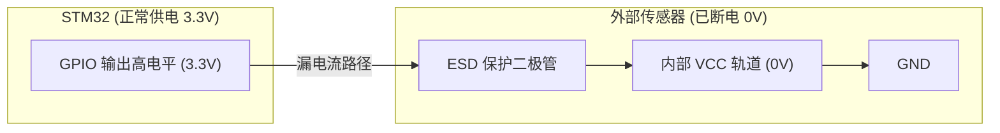

# GPIO 漏电流控制与引脚上下拉设计

在许多低功耗项目的开发中，工程师常遇到“MCU 已经成功进入了 Stop 模式，但整机电流依然有数百微安甚至毫安级”的问题。这种现象往往不是由于 MCU 内核没有休眠，而是由 **GPIO 漏电流（Leakage Current）** 以及**外部电路倒灌电流**引起的。

本章将从硬件底层物理结构出发，深度解析 GPIO 漏电流的产生机制，并给出低功耗 GPIO 配置的黄金法则。

---

## 1. GPIO 漏电流的物理机制

要彻底解决漏电流问题，必须先理解 GPIO 的内部等效电路及其在不同状态下的表现。

### 1.1 悬空引脚（Floating Input）与施密特触发器振荡

当 GPIO 配置为**浮空输入（Floating Input）**且未连接任何外部确定电平时，该引脚上的电压会受空气电磁干扰、PCB 走线耦合等影响，处于 $V_{\text{IL}}$ 与 $V_{\text{IH}}$ 之间的中间不确定电压状态。

```mermaid
circuit
    %% 悬空引脚的输入缓冲器横流现象
    VDD [V_DD]
    GND [V_SS / GND]
    Input [悬空输入引脚]
    
    subgraph CMOS_Inverter ["内部输入缓冲器 (CMOS 反相器)"]
        PMOS
        NMOS
    end
    
    VDD --> PMOS
    PMOS --> NMOS
    NMOS --> GND
    
    Input --> PMOS [G]
    Input --> NMOS [G]
```

**横流（Shoot-through Current）机制**：
STM32 的数字输入通道中包含一个施密特触发器（Schmitt Trigger），其本质上是由 CMOS 反相器构成。当输入电压处于中间状态时：
1. 上方的 PMOS 管开始部分导通。
2. 下方的 NMOS 管也处于部分导通状态。
3. 这导致了从 $V_{\text{DD}}$ 直接流向 $V_{\text{SS}}$（地）的低阻抗通路，形成显著的**横流（数十至数百微安）**。

### 1.2 内部/外部上下拉电阻冲突

当引脚状态与外部电平存在冲突时，会产生欧姆定律决定的持续功耗：
* **内部拉高，外部拉低**：若引脚使能了内部弱上拉（STM32 的内部上拉电阻通常为 $30\text{k}\Omega \sim 50\text{k}\Omega$，典型值 $40\text{k}\Omega$），而外部电路或传感器将此引脚拉低（GND）。此时，流过引脚的持续漏电流为：
  $$I_{\text{leak}} = \frac{V_{\text{DD}}}{R_{\text{pull-up}}} = \frac{3.3\text{V}}{40\text{k}\Omega} = 82.5\,\mu\text{A}$$
  如果系统中有 5 个引脚存在这种冲突，底电流就会平白增加 $400\,\mu\text{A}$ 以上。
* **外部强上拉，内部拉低**：同理，若外部有强上拉电阻（如 $10\text{k}\Omega$ 的 $I^2C$ 总线），而 MCU 在休眠前将该引脚配置为输出低电平或开启内部下拉，将产生极其严重的漏电（$3.3\text{V}/10\text{k}\Omega = 330\,\mu\text{A}$）。

### 1.3 外设寄生带电与倒灌电流（Back-Powering）

在低功耗硬件设计中，为了节省功耗，工程师常通过高侧开关（如 PMOS）切断外部传感器或外设的供电（$V_{\text{CC\_Sensor}}$）。然而，如果 MCU 与该传感器连接的 GPIO（如 SPI、UART 或 I2C 总线）仍保持**输出高电平**，就会发生倒灌现象。



**倒灌路径分析**：
几乎所有芯片的 I/O 引脚内部都集成有 ESD 保护二极管，连接在引脚与芯片内部电源轨（$V_{\text{CC}}$）之间。当传感器断电时，其内部 $V_{\text{CC}}$ 降为 $0\text{V}$。
MCU 引脚输出的 $3.3\text{V}$ 高电平通过传感器的 ESD 二极管流向传感器的 $V_{\text{CC}}$ 轨道。这不仅会导致 **$mA$ 级别的严重电流泄漏**，甚至还会将外部传感器“寄生唤醒”，使其处于不可控的半导通状态，引发系统逻辑混乱。

---

## 2. 低功耗状态下的 GPIO 配置黄金法则

为了避免上述所有漏电路径，在系统准备进入 Stop/Standby 等低功耗状态之前，必须严格遵守以下法则对所有引脚进行状态治理：

### 法则 1：无用引脚一律配置为模拟输入 (Analog Input)
对于在休眠期间不担任唤醒任务、也不给外部电路提供电平的空闲引脚，应配置为**模拟输入（无上拉、无下拉）**模式。
* **原理**：在模拟输入模式下，GPIO 的输入施密特触发器被完全断开，输出驱动器也被禁用，引脚完全与内部数字电路隔离。此时，引脚的漏电流小于 $1\,\text{nA}$。

### 法则 2：保持关键控制引脚的电平稳定
在休眠期间，必须维持某些外设的控制引脚电平，以防止外设在休眠期被意外使能。
* **SPI Flash 的片选引脚 ($CS$)**：外部 SPI Flash 在 $CS$ 悬空或为低电平时会处于活动状态（功耗数毫安）。在休眠期间，**必须保证 $CS$ 引脚维持高电平**（通常使用外部 $100\text{k}\Omega$ 上拉电阻或使能 MCU 内部上拉），迫使 Flash 保持在待机（Standby）或深休眠（Deep Power-down）模式。
* **外设使能引脚 ($EN$ 或 $RST$)**：控制外设电源开关的 GPIO 必须输出确定的去使能电平（通常为低电平），以确保休眠期间高侧/低侧开关彻底截止。

### 法则 3：隔离通信总线（UART、I2C、SPI）
在系统休眠期间，应将所有与已断电外设相连的通信引脚重构：
* **UART TX/RX**：若对端串口芯片断电，将 MCU 的 TX 和 RX 置为模拟输入。
* **I2C SDA/SCL**：若总线上拉电阻连接在 $V_{\text{DD}}$（MCU 同源），且传感器未断电，可保持为开漏（Open-Drain）且不输出低；若对端断电，则必须将引脚切换为模拟输入以切断通路。

---

## 3. 外设隔离电路与漏电流分析

在硬件设计上，我们常使用 PMOS 或具有使能脚的 LDO 作为控制传感器供电的开关。

```mermaid
circuit
    %% 传感器高侧开关设计
    MCU_GPIO [MCU 供电控制引脚]
    VDD [主电源 3.3V]
    PMOS_G [PMOS 栅极]
    
    VDD --> PMOS_Source
    MCU_GPIO --> PMOS_G
    
    subgraph PMOS_Switch ["高侧开关 (PMOS)"]
        PMOS_Source
        PMOS_Drain
    end
    
    PMOS_Drain --> Sensor_VCC [Sensor VCC]
    
    %% 拉高 PMOS 栅极的电阻
    VDD --> R_Pull [100kΩ 上拉电阻]
    R_Pull --> PMOS_G
```

* **运行态**：MCU 控制引脚输出低电平，PMOS 导通，传感器得电工作。MCU GPIO 配置为 SPI/UART，与传感器正常通信。
* **休眠态**：
  1. MCU 控制引脚输出高电平（或利用外部 $100\text{k}\Omega$ 上拉电阻，将 GPIO 置为模拟输入），PMOS 截止，传感器断电。
  2. **关键步骤**：MCU 立即将与传感器相连的所有通信线（$CS$、$MOSI$、$MISO$、$SCK$、$TX$、$RX$）全部配置为**模拟输入**。这切断了所有流向已断电传感器的寄生电流通道。

---

## 4. 量产级 GPIO 低功耗配置代码实现

以下是一套量产项目通用的 GPIO 低功耗优化驱动程序。该模块在进入休眠前将系统内所有非必要的 GPIO 切换为模拟输入，并在唤醒后恢复原有的硬件配置。

```c
#include "stm32l4xx_ll_gpio.h"
#include "stm32l4xx_ll_bus.h"

/* 定义保存 GPIO 寄存器状态的结构体，用于唤醒后恢复 */
typedef struct {
    uint32_t MODER;    /* 模式寄存器 */
    uint32_t PUPDR;    /* 上下拉寄存器 */
    uint32_t OTYPER;   /* 输出类型寄存器 */
    uint32_t OSPEEDR;  /* 输出速度寄存器 */
} GPIO_State_t;

/* 用于备份活动外设 GPIO 状态的全局变量 */
static GPIO_State_t gpio_backup_usart1_tx;
static GPIO_State_t gpio_backup_usart1_rx;

/**
  * @brief  在进入休眠前，备份关键 GPIO 并将所有引脚（除唤醒和必要引脚外）设置为模拟输入
  * @param  None
  * @retval None
  */
void GPIO_Prepare_For_LowPower(void)
{
    /* 1. 备份 USART1 引脚状态 */
    gpio_backup_usart1_tx.MODER   = GPIOA->MODER & GPIO_MODER_MODER9_Msk;
    gpio_backup_usart1_tx.PUPDR   = GPIOA->PUPDR & GPIO_PUPDR_PUPD9_Msk;
    gpio_backup_usart1_tx.OTYPER  = GPIOA->OTYPER & GPIO_OTYPER_OT9_Msk;
    gpio_backup_usart1_tx.OSPEEDR = GPIOA->OSPEEDR & GPIO_OSPEEDR_OSPEED9_Msk;

    gpio_backup_usart1_rx.MODER   = GPIOA->MODER & GPIO_MODER_MODER10_Msk;
    gpio_backup_usart1_rx.PUPDR   = GPIOA->PUPDR & GPIO_PUPDR_PUPD10_Msk;
    gpio_backup_usart1_rx.OTYPER  = GPIOA->OTYPER & GPIO_OTYPER_OT10_Msk;
    gpio_backup_usart1_rx.OSPEEDR = GPIOA->OSPEEDR & GPIO_OSPEEDR_OSPEED10_Msk;

    /* 2. 将 USART1 TX/RX (PA9, PA10) 强制配置为模拟输入 (Analog No Pull) */
    LL_GPIO_SetPinMode(GPIOA, LL_GPIO_PIN_9, LL_GPIO_MODE_ANALOG);
    LL_GPIO_SetPinPull(GPIOA, LL_GPIO_PIN_9, LL_GPIO_PULL_NO);
    LL_GPIO_SetPinMode(GPIOA, LL_GPIO_PIN_10, LL_GPIO_MODE_ANALOG);
    LL_GPIO_SetPinPull(GPIOA, LL_GPIO_PIN_10, LL_GPIO_PULL_NO);

    /* 3. 将整个 GPIOB, GPIOC 等未使用的端口全部配置为模拟输入 */
    /* 注意：在此之前需确保没有连接任何需要维持高电平的设备 */
    /* 以下宏定义将未使用的 GPIO 批量配置为模拟输入 */
    for (uint32_t pin = LL_GPIO_PIN_0; pin <= LL_GPIO_PIN_15; pin <<= 1)
    {
        /* 假设 PB2 是传感器电源控制脚 (EN)，休眠期间需要保持为低电平（关闭外设） */
        if (pin == LL_GPIO_PIN_2)
        {
            LL_GPIO_SetPinMode(GPIOB, LL_GPIO_PIN_2, LL_GPIO_MODE_OUTPUT);
            LL_GPIO_ResetOutputPin(GPIOB, LL_GPIO_PIN_2); /* 维持 0V，关闭传感器电源 */
            continue;
        }

        /* 假设 PB12 是外部 SPI Flash 的 CS，休眠期需要维持高电平以保持 Flash 待机 */
        if (pin == LL_GPIO_PIN_12)
        {
            LL_GPIO_SetPinMode(GPIOB, LL_GPIO_PIN_12, LL_GPIO_MODE_OUTPUT);
            LL_GPIO_SetOutputPin(GPIOB, LL_GPIO_PIN_12); /* 维持高电平 */
            continue;
        }

        /* 假设 PA0 是唤醒引脚 (WKUP1)，不能修改其配置，需保持为输入 */
        if (pin == LL_GPIO_PIN_0)
        {
            continue;
        }

        /* 将其他普通引脚全部强制设为模拟输入 */
        LL_GPIO_SetPinMode(GPIOB, pin, LL_GPIO_MODE_ANALOG);
        LL_GPIO_SetPinPull(GPIOB, pin, LL_GPIO_PULL_NO);
        
        LL_GPIO_SetPinMode(GPIOC, pin, LL_GPIO_MODE_ANALOG);
        LL_GPIO_SetPinPull(GPIOC, pin, LL_GPIO_PULL_NO);
    }
}

/**
  * @brief  从低功耗模式唤醒后，恢复原本的外设 GPIO 状态
  * @param  None
  * @retval None
  */
void GPIO_Restore_After_Wakeup(void)
{
    /* 1. 恢复外设控制引脚（如传感器电源使能引脚置高） */
    LL_GPIO_SetPinMode(GPIOB, LL_GPIO_PIN_2, LL_GPIO_MODE_OUTPUT);
    LL_GPIO_SetOutputPin(GPIOB, LL_GPIO_PIN_2);

    /* 2. 恢复 USART1 TX (PA9) 寄存器设置 */
    GPIOA->MODER   = (GPIOA->MODER & ~GPIO_MODER_MODER9_Msk)   | gpio_backup_usart1_tx.MODER;
    GPIOA->PUPDR   = (GPIOA->PUPDR & ~GPIO_PUPDR_PUPD9_Msk)   | gpio_backup_usart1_tx.PUPDR;
    GPIOA->OTYPER  = (GPIOA->OTYPER & ~GPIO_OTYPER_OT9_Msk)    | gpio_backup_usart1_tx.OTYPER;
    GPIOA->OSPEEDR = (GPIOA->OSPEEDR & ~GPIO_OSPEEDR_OSPEED9_Msk) | gpio_backup_usart1_tx.OSPEEDR;

    /* 3. 恢复 USART1 RX (PA10) 寄存器设置 */
    GPIOA->MODER   = (GPIOA->MODER & ~GPIO_MODER_MODER10_Msk)   | gpio_backup_usart1_rx.MODER;
    GPIOA->PUPDR   = (GPIOA->PUPDR & ~GPIO_PUPDR_PUPD10_Msk)   | gpio_backup_usart1_rx.PUPDR;
    GPIOA->OTYPER  = (GPIOA->OTYPER & ~GPIO_OTYPER_OT10_Msk)    | gpio_backup_usart1_rx.OTYPER;
    GPIOA->OSPEEDR = (GPIOA->OSPEEDR & ~GPIO_OSPEEDR_OSPEED10_Msk) | gpio_backup_usart1_rx.OSPEEDR;

    /* 4. 重新初始化其他通信外设（如 SPI, I2C）的 GPIO 模式为复用功能 */
    // MX_SPI1_Init_GPIO(); // 根据实际项目重新配置
}
```

> [!TIP]
> 在电路调试阶段，若测得的休眠底电流偏大，可使用数字万用表（微安档）逐个测量 MCU 与外设相连信号线的电压。如果在已关断的外设端测到高于 $0.3\text{V}$ 的电压，基本可以判定该引脚存在**倒灌漏电**，需对其进行模拟输入配置隔离。
