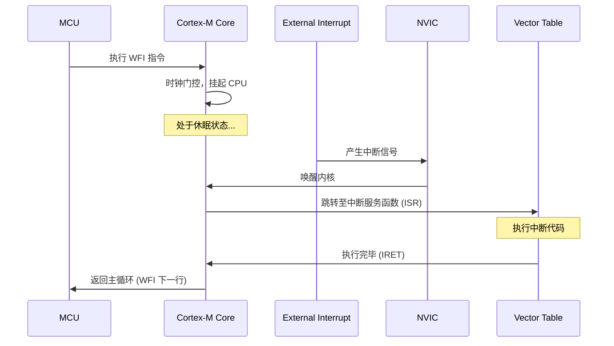

# 低功耗唤醒源配置与休眠唤醒实战

在完成了低功耗模式的选择（第一章）以及对 GPIO 漏电流的治理（第二章）之后，设计低功耗系统的核心任务就变成了**“如何高效地唤醒系统”**。

本章将详解 WFI 与 WFE 的指令差异、各类低功耗唤醒源（EXTI、RTC、LPTIM）的配置，并提供一套生产级的完整休眠/唤醒代码框架。

---

## 1. WFI 与 WFE 的底层机制

在 Cortex-M 架构中，使 CPU 挂起的核心指令有两个：`WFI` 和 `WFE`。它们在休眠唤醒逻辑上有着本质区别。

### 1.1 WFI (Wait For Interrupt)

`WFI` 指令会让 CPU 暂停执行，进入等待中断状态。其唤醒流程为：
1. **执行 WFI**：CPU 暂停指令流水线，关闭内核时钟，进入休眠。
2. **发生中断**：外部中断或外设中断（在 NVIC 中已使能，且未被内核 `PRIMASK` 屏蔽）产生。
3. **唤醒与跳转**：内核被唤醒，首先**跳转到对应的中断服务程序（ISR）**中执行中断处理，然后返回到主程序中 `WFI` 指令的下一行继续执行。



### 1.2 WFE (Wait For Event)

`WFE` 指令会让 CPU 进入等待事件状态。其唤醒流程为：
1. **事件寄存器状态检查**：当执行 `WFE` 时，如果内核内部的“事件寄存器（Event Register）”为 1，则该寄存器被自动清零，CPU **不会**进入休眠，而是继续向下执行；如果事件寄存器为 0，CPU 进入休眠。
2. **产生事件**：可以是通过 NVIC 映射的挂起中断（即使在 NVIC 中未使能该中断，也能产生事件），或是其他 CPU 核心发出的 `SEV` 指令。
3. **快速唤醒**：内核一旦检测到事件，直接唤醒并**继续执行 `WFE` 的下一行代码**，不会跳转去执行 ISR。这省去了中断现场保护和恢复的开销（通常约 $12 \sim 20$ 个时钟周期），极大地加快了响应速度。

---

## 2. 外部中断唤醒与低功耗防抖设计 (EXTI)

使用外部按键或传感器中断引脚（EXTI）唤醒系统是低功耗设备的常见设计。然而，低功耗下的中断配置需要特别注意：

### 2.1 软件防抖 vs 硬件防抖
在运行模式下，我们常使用定时器或延时函数进行按键软件防抖。但是在 Stop 模式下，**CPU 处于停机状态，无法运行软件防抖算法**。
* **错误做法**：按键一抖动，MCU 就被频繁唤醒，在中断里延时防抖后再休眠。这会导致休眠期间功耗剧烈波动，大大缩短电池寿命。
* **正确做法**：设计**外部硬件 RC 滤波电路**进行防抖，如下图所示。通过电容消除高频接触抖动，确保按键按下时，GPIO 上仅产生一次干净的下降沿/上升沿，避免 MCU 被多次误唤醒。

```
       3.3V (VDD)
        │
       [10kΩ] (上拉电阻)
        │
        ├─── EXTI GPIO Pin (MCU)
        ├─── [100nF] (滤波电容)
        │     │
       [ ]    ▼ GND
      [ O ] (按键开关)
        │
       GND
```

---

## 3. 低功耗定时唤醒源：RTC 与 LPTIM

当系统需要周期性（如每 10 秒、每小时）醒来采集数据并上传时，必须依靠能够在 Stop 模式下工作的低功耗定时器。

### 3.1 实时时钟 (RTC) 周期性唤醒 (Wakeup Timer)
STM32 内置的 RTC 可以由外部 $32.768\,\text{kHz}$ 的低速晶振（LSE）驱动。即使在 Stop 2 和 Standby 模式下，LSE 依然可以起振，RTC 依然能保持高精度运行。
* **原理**：通过配置 RTC 的唤醒定时器（Wakeup Timer, WUT），计数值向下递减到 0 时产生 EXTI 线 20 的唤醒中断，从而将 MCU 从 Stop 2 模式中拉出。

### 3.2 低功耗定时器 (LPTIM)
传统的定时器（TIMx）在 Stop 模式下因为时钟源关闭而无法工作。而 LPTIM（Low Power Timer）可以配置为使用 LSE 或 LSI 作为时钟源。
* **优势**：配置相比 RTC 更加简单。LPTIM 还可以用于在 Stop 模式下输出超低频的 PWM 波形，或者在不唤醒内核的情况下对外部脉冲进行计数（内核休眠，外设计数）。

---

## 4. 低功耗下的看门狗 (IWDG) 管理

在开启了独立看门狗（IWDG）的量产系统中，如果系统需要进入长达数分钟的休眠，会导致看门狗由于未及时“喂狗”而发生复位。解决该冲突有以下两种方案：

1. **硬件冻结机制（推荐）**：
   大部分 STM32 在选项字节（Option Bytes）或系统调试控制寄存器中支持 `IWDG_STOP` 冻结位。
   * 配置 `FLASH_OPTR` 中的 `IWDG_STOP = 1`。
   * **效果**：当 MCU 进入 Stop 模式时，看门狗的时钟（LSI）会自动暂停，看门狗计数器冻结；一旦 MCU 被唤醒，看门狗自动恢复计数。整个过程无需软件介入，安全可靠。
2. **周期性唤醒喂狗**：
   如果芯片不支持硬件冻结，则必须将 RTC 唤醒周期设置为小于 IWDG 复位周期（例如看门狗超时为 4 秒，则 RTC 唤醒设为 3 秒）。MCU 醒来后仅执行喂狗操作，随之立即重新进入休眠。

---

## 5. 完整低功耗休眠唤醒框架代码

以下为基于 STM32 LL 库编写的、包含“GPIO 隔离 $\rightarrow$ RTC 定时器配置 $\rightarrow$ 进入 Stop 2 $\rightarrow$ 唤醒后系统时钟重建”的完整框架。

```c
#include "stm32l4xx_ll_rcc.h"
#include "stm32l4xx_ll_pwr.h"
#include "stm32l4xx_ll_rtc.h"
#include "stm32l4xx_ll_gpio.h"
#include "stm32l4xx_ll_exti.h"
#include "stm32l4xx_ll_bus.h"

/* 声明 Ch2 编写的 GPIO 准备与恢复函数 */
extern void GPIO_Prepare_For_LowPower(void);
extern void GPIO_Restore_After_Wakeup(void);

/**
  * @brief  系统时钟重新配置 (唤醒后将时钟从 MSI 恢复为 PLL 80MHz)
  * @retval None
  */
void SystemClock_Reconfig_After_Wakeup(void)
{
    /* 1. 使能外部高速晶振 (HSE) 或内部高速振荡器 (HSI) */
    LL_RCC_HSE_Enable();
    while(LL_RCC_HSE_IsReady() != 1)
    {
        /* 等待 HSE 稳定 */
    }

    /* 2. 使能 PLL */
    LL_RCC_PLL_Enable();
    while(LL_RCC_PLL_IsReady() != 1)
    {
        /* 等待 PLL 锁定 */
    }

    /* 3. 将系统时钟源切换回 PLL */
    LL_RCC_SetSysClkSource(LL_RCC_SYS_CLKSOURCE_PLL);
    while(LL_RCC_GetSysClkSource() != LL_RCC_SYS_CLKSOURCE_STATUS_PLL)
    {
        /* 等待系统时钟切换成功 */
    }
}

/**
  * @brief  配置 RTC 定时唤醒 (例如唤醒周期为 5 秒)
  * @param  seconds 唤醒间隔秒数
  * @retval None
  */
void RTC_Wakeup_Init(uint32_t seconds)
{
    /* 允许访问 RTC 备份寄存器 */
    LL_PWR_EnableBkUpAccess();
    
    /* 关闭 RTC 写保护 */
    LL_RTC_DisableWriteProtection(RTC);
    
    /* 关闭 RTC 唤醒定时器以进行配置 */
    LL_RTC_WUT_Disable(RTC);
    while(LL_RTC_IsActiveFlag_WUTW(RTC) != 1)
    {
        /* 等待写允许标志位置 1 */
    }
    
    /* 设置时钟源为 RTC 时钟 (RTCCLK = LSE = 32.768kHz) 的 16 分频 */
    /* 此时 RTC 唤醒频率为：32768 / 16 = 2048 Hz */
    LL_RTC_WUT_SetClockSource(RTC, LL_RTC_WUT_TIMEBASE_16XTAL_DIV);
    
    /* 设定重装载值，计算公式：seconds * 2048 - 1 */
    LL_RTC_WUT_SetAutoReload(RTC, (seconds * 2048) - 1);
    
    /* 开启 RTC 唤醒中断与使能唤醒定时器 */
    LL_RTC_EnableIT_WUT(RTC);
    LL_RTC_WUT_Enable(RTC);
    
    /* 使能 RTC 写保护 */
    LL_RTC_EnableWriteProtection(RTC);

    /* 配置 EXTI 第 20 线（对应 RTC 唤醒）以触发中断 */
    LL_EXTI_EnableIT_0_31(LL_EXTI_LINE_20);
    LL_EXTI_EnableRisingTrig_0_31(LL_EXTI_LINE_20);
    
    /* 配置 NVIC 优先级并使能中断 */
    NVIC_SetPriority(RTC_WKUP_IRQn, 0);
    NVIC_EnableIRQ(RTC_WKUP_IRQn);
}

/**
  * @brief  RTC 唤醒中断处理入口
  */
void RTC_WKUP_IRQHandler(void)
{
    if (LL_RTC_IsActiveFlag_WUT(RTC) != 0)
    {
        /* 清除 RTC 唤醒标志 */
        LL_RTC_ClearFlag_WUT(RTC);
        
        /* 清除 EXTI Line 20 挂起标志 */
        LL_EXTI_ClearFlag_0_31(LL_EXTI_LINE_20);
    }
}

/**
  * @brief  主程序低功耗测试循环
  */
void LowPower_Main_Loop(void)
{
    /* 初始化 RTC 定时唤醒，配置为 5 秒 */
    RTC_Wakeup_Init(5);

    while(1)
    {
        /* ------------------ 阶段 1：工作状态 ------------------ */
        // 执行业务逻辑，例如采集传感器数据，发送无线报文
        LL_mDelay(100); // 模拟工作时间 100ms

        /* ------------------ 阶段 2：准备休眠 ------------------ */
        /* 1. 关闭不用的外设时钟，防止休眠时漏电 */
        LL_AHB1_GRP1_DisableClock(LL_AHB1_GRP1_PERIPH_DMA1);
        
        /* 2. 隔离 GPIO，所有无用引脚设为模拟输入，切断外部倒灌 */
        GPIO_Prepare_For_LowPower();

        /* ------------------ 阶段 3：进入休眠 ------------------ */
        /* 3. 配置 PWR 进入 Stop 2 模式 */
        LL_PWR_ClearFlag_WU();
        LL_PWR_SetPowerMode(LL_PWR_MODE_STOP2);
        
        /* 4. 使能内核深睡眠，并执行 WFI */
        SCB->SCR |= SCB_SCR_SLEEPDEEP_Msk;
        
        __DSB();
        __ISB();
        __WFI(); // 此时 MCU 挂起，底电流降至约 1.1uA，等待 5 秒后 RTC 唤醒

        /* ------------------ 阶段 4：系统唤醒 ------------------ */
        /* 5. 时钟重建：从 Stop 唤醒后，时钟源默认为 MSI。必须立即恢复为 PLL 主频 */
        SystemClock_Reconfig_After_Wakeup();
        
        /* 6. 恢复 GPIO 状态，重建外设控制 */
        GPIO_Restore_After_Wakeup();
        
        /* 7. 重新开启外设时钟，重新初始化外设驱动 */
        LL_AHB1_GRP1_EnableClock(LL_AHB1_GRP1_PERIPH_DMA1);
        
        /* 继续进入下一个工作周期 */
    }
}
```

---

## 6. 调试低功耗模式时的技巧与陷阱

在开发低功耗系统时，调试阶段往往充满挑战：

### 6.1 调试器断连问题 (SWD/JTAG Lost Connection)
* **原因**：当 MCU 进入 Stop 或 Standby 模式时，Cortex-M 内核的调试时钟（FCLK/HCLK）被关闭，SWD 仿真器与芯片失去通信，Keil/IAR 会报错 "Loss of DND connection" 并退出调试。
* **解决办法**：
  在代码初始化时配置 `DBGMCU_CR` 寄存器。使能 `DBG_STOP` 或 `DBG_STANDBY` 位。
  ```c
  /* 使能低功耗下的调试支持（仅在开发阶段使用） */
  LL_DBGMCU_EnableDBGStopMode(); 
  ```
  **注意**：使能该配置会**保持调试器接口时钟与内核调试电路带电**，会导致 Stop 模式下的实测电流偏大几百微安。**产品量产发布时，必须关闭此调试支持。**

### 6.2 增加开机延时保护
* **原因**：如果代码中没有开机延迟，一上电就直接关断所有引脚并进入 Shutdown 模式，调试器将根本没有机会在 CPU 挂起前连上芯片。芯片会被“锁死”在低功耗状态，导致无法再次烧写程序。
* **解决办法**：
  在 `main` 函数的最开始，配置一个固定的 **$2\text{s} \sim 3\text{s}$ 的启动延时**（例如 `HAL_Delay(2000)`）。在这段延时期间，保持所有的 GPIO 为默认状态且不进入休眠。这样即使程序写坏了，只需在上电复位后的两秒窗口期内点击烧录，即可成功擦除芯片。
