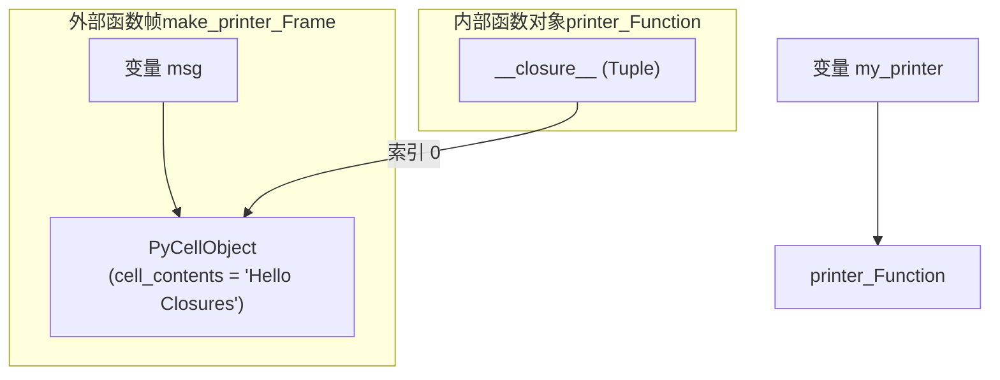
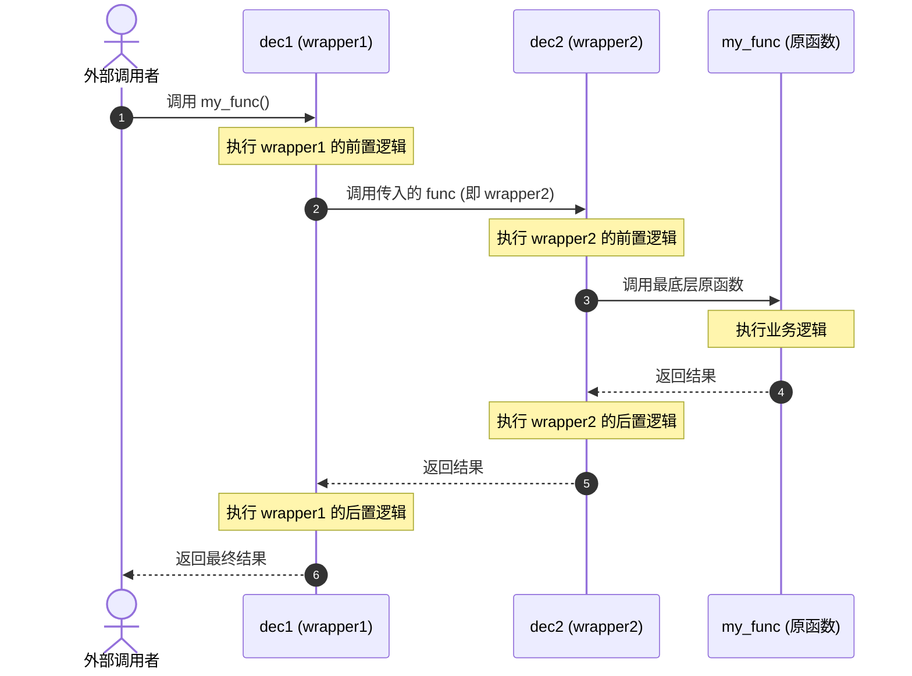

# 第一章：闭包机制与函数装饰器底层原理

要深入理解 Python 装饰器，必须先彻底剖析其基石——**闭包（Closure）**。装饰器本质上就是一个高阶函数，它接收一个函数作为参数，并返回一个新的函数。而这个返回的新函数之所以能记住并访问原函数的执行上下文，完全依赖于 CPython 的闭包机制。

---

## 1. LEGB 规则与执行帧（Frame Objects）

Python 中的名字解析（Name Resolution）遵循 **LEGB 规则**：
1. **L (Local)**：函数内部定义的局部变量。
2. **E (Enclosing)**：嵌套函数中外层（外部）函数的局部作用域（非全局也非局部）。
3. **G (Global)**：模块级别的全局变量。
4. **B (Built-in)**：Python 内置的名称空间（如 `len`、`str`）。

当 Python 执行一个函数时，会在虚拟机的调用栈上压入一个**帧对象（Frame Object，即 CPython 中的 `PyFrameObject`）**。每个帧对象维护着当前函数执行的状态，包括局部变量表（`fast locals`）、求值栈等。

通常情况下，当一个函数执行完毕并返回时，其对应的帧对象就会出栈并被销毁，其中的局部变量也随之被垃圾回收。然而，**闭包打破了这一常规生命周期**。

---

## 2. 闭包的本质：Cell 对象与自由变量

**自由变量（Free Variable）**是指在函数中被使用、但既不是该函数的参数也不是该函数局部变量的变量。在嵌套函数中，内部函数所引用外部函数的局部变量就是自由变量。

### 2.1 自由变量的存活期延长
为了让内部函数在外部函数退出后仍能访问这些自由变量，CPython 引入了 **Cell 对象（`PyCellObject`）**。
- 当外部函数定义了被内部函数引用的局部变量时，CPython 编译器在编译期就会识别出该变量，并为其创建一个 Cell 对象。
- 外部函数的局部变量不再直接存储在帧对象的局部变量表中，而是存储在 Cell 对象中。
- 内部函数持有一个指向该 Cell 对象的引用，这个引用保存在函数的 `__closure__` 属性中。

### 2.2 深度探测 `__closure__`
我们通过以下代码来实地观察自由变量和 `cell` 的存在：

```python
def make_printer(msg):
    # msg 是外部函数的局部变量，但被内部函数 printer 引用
    def printer():
        print(msg)
    return printer

my_printer = make_printer("Hello Closures")
# 此时 make_printer 的执行帧已经销毁，但我们仍能调用 my_printer()
my_printer()  # 输出: Hello Closures

# 探测 my_printer 的闭包属性
print(f"__closure__ 类型: {type(my_printer.__closure__)}")
print(f"__closure__ 长度: {len(my_printer.__closure__)}")
cell = my_printer.__closure__[0]
print(f"Cell 对象: {cell}")
print(f"Cell 存储的内容: {cell.cell_contents}")
```

运行这段代码，你会看到类似如下输出：
```text
Hello Closures
__closure__ 类型: <class 'tuple'>
__closure__ 长度: 1
Cell 对象: <cell at 0x000001D4E0BF2A30: str object at 0x000001D4E0C0BB30>
Cell 存储的内容: Hello Closures
```

### 2.3 字节码分析：`LOAD_DEREF` 与 `co_freevars`
为了彻底弄清闭包在虚拟机中的运行过程，我们可以使用 `dis` 模块来反汇编 `make_printer` 及其内部的 `printer`：

```python
import dis

print("=== make_printer 字节码 ===")
dis.dis(make_printer)

# 获取内部函数的代码对象
printer_code = make_printer.__code__.co_consts[1]
print("\n=== 编译期的代码元数据 ===")
print(f"外部函数自由/单元变量 (co_cellvars): {make_printer.__code__.co_cellvars}")
print(f"内部函数自由变量 (co_freevars): {printer_code.co_freevars}")
```

#### 关键字节码指令：
1. **`LOAD_CLOSURE`**：将对应的 Cell 对象压入求值栈。在创建 `printer` 函数对象（通过 `MAKE_FUNCTION`）时，Python 会将这些 Cell 组合成一个元组，赋值给函数对象的 `__closure__` 属性。
2. **`LOAD_DEREF`**：在内部函数中，当需要访问自由变量时，不再使用普通的 `LOAD_FAST`（从局部变量表加载），而是使用 `LOAD_DEREF`。它会根据索引找到 `__closure__` 元组中对应的 Cell，再取出 Cell 内部的 `cell_contents`。

以下是闭包引用的内存逻辑关系示意图：



---

## 3. `nonlocal` 关键字的深层机制

在 Python 3 中，引入了 `nonlocal` 关键字。我们来看一个经典问题：

```python
def counter():
    count = 0
    def incr():
        # 如果不加 nonlocal count
        # count += 1  # 会抛出 UnboundLocalError
        nonlocal count
        count += 1
        return count
    return incr
```

### 3.1 为什么不加 `nonlocal` 会报错？
当 Python 编译器在 `incr` 内部看到 `count += 1`（等价于 `count = count + 1`）时，发现它包含了对 `count` 的赋值操作。
按照 Python 的规则，**如果在函数内部对一个变量进行了赋值，除非显式声明为全局（`global`）或外层（`nonlocal`），否则该变量就会被编译器视为该函数的局部变量**。
因此，编译器会将 `incr` 内部的 `count` 编译为 `STORE_FAST`。当函数运行时，在执行 `count + 1` 时需要先读取 `count`，由于它是局部变量且尚未被初始化（未赋值），因此抛出 `UnboundLocalError: local variable 'count' referenced before assignment`。

### 3.2 `nonlocal` 做了什么？
一旦加上 `nonlocal count`，编译器就会知道：“不要将 `count` 视作 `incr` 的局部变量，它是外层的自由变量”。
此时：
- 对 `count` 的读取会被编译为 `LOAD_DEREF`。
- 对 `count` 的写入/赋值会被编译为 `STORE_DEREF`。

我们来看反汇编对比：

```python
import dis

def without_nonlocal():
    x = 0
    def inner():
        # 这里只读不写，没有 nonlocal 也能正常运行
        return x
    return inner

def with_nonlocal():
    x = 0
    def inner():
        nonlocal x
        x = 10
        return x
    return inner

print("=== without_nonlocal.inner 字节码 ===")
dis.dis(without_nonlocal().__code__.co_consts[1])

print("\n=== with_nonlocal.inner 字节码 ===")
dis.dis(with_nonlocal().__code__.co_consts[2])  # 索引可能视 Python 版本微调
```

在带 `nonlocal` 的版本中，修改变量的指令变成了 `STORE_DEREF`，它会直接更新 `cell_contents`，从而使所有引用该 Cell 的闭包和外层函数都能共享这一修改。

---

## 4. 装饰器的语法糖解密与嵌套执行顺序

### 4.1 语法糖的本质
Python 的 `@decorator` 语法纯粹是编译期的语法糖。例如：

```python
@dec
def func():
    pass
```

在词法分析和解析阶段，它会被转换为：
```python
func = dec(func)
```

如果有参数：
```python
@dec(arg1, arg2)
def func():
    pass
```

则被转换为：
```python
func = dec(arg1, arg2)(func)
```
这里，`dec(arg1, arg2)` 首先被求值，返回一个接收函数的“真正”的装饰器，然后把 `func` 传递给它。

### 4.2 多层装饰器的嵌套执行顺序
当一个函数被多个装饰器修饰时，例如：

```python
@dec1
@dec2
@dec3
def func():
    pass
```

编译阶段的等价表达式为：
```python
func = dec1(dec2(dec3(func)))
```

#### 执行顺序的两个阶段：
1. **装饰器函数自身的执行阶段（即包装器创建阶段）**：
   这个阶段是在**模块加载/函数定义时**自底向上（从内到外）执行的。
   - 首先执行 `dec3(func)`，返回一个包裹函数（假设为 `wrapper3`）。
   - 然后执行 `dec2(wrapper3)`，返回 `wrapper2`。
   - 最后执行 `dec1(wrapper2)`，返回 `wrapper1`。
   - 最终把名字 `func` 绑定到 `wrapper1`。

2. **被装饰函数的调用阶段**：
   当用户在代码中调用 `func()` 时，实际执行的是最外层的 `wrapper1`。其执行顺序是自顶向下（从外到内）的：
   - 进入 `dec1` 内部的 `wrapper1`；
   - `wrapper1` 内部调用了 `wrapper2`（进入 `dec2`）；
   - `wrapper2` 内部调用了 `wrapper3`（进入 `dec3`）；
   - `wrapper3` 最终调用原函数 `func`；
   - 返回值再逆向层层向上传播。

我们可以通过一段打印代码来印证这个顺序：

```python
def dec1(func):
    print("Evaluating dec1")
    def wrapper1(*args, **kwargs):
        print("Entering dec1 wrapper")
        res = func(*args, **kwargs)
        print("Exiting dec1 wrapper")
        return res
    return wrapper1

def dec2(func):
    print("Evaluating dec2")
    def wrapper2(*args, **kwargs):
        print("Entering dec2 wrapper")
        res = func(*args, **kwargs)
        print("Exiting dec2 wrapper")
        return res
    return wrapper2

@dec1
@dec2
def my_func():
    print("Executing original my_func")

print("--- Start Call ---")
my_func()
```

#### 输出结果：
```text
Evaluating dec2
Evaluating dec1
--- Start Call ---
Entering dec1 wrapper
Entering dec2 wrapper
Executing original my_func
Exiting dec2 wrapper
Exiting dec1 wrapper
```

#### 嵌套执行流程图



理解了闭包的底层 Cell 机制与装饰器的嵌套求值流，我们便可以更进一步，去探讨如何利用 Python 的面向对象特性——类，来实现更加结构化、可复用且有状态的装饰器。
