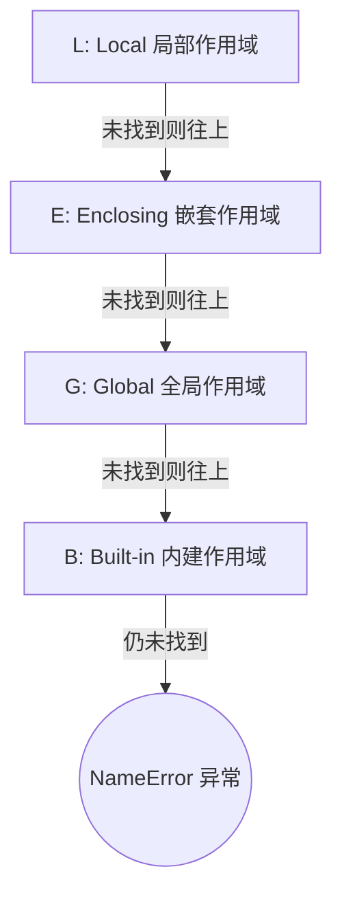

# 闭包与作用域原理

在深入探讨 Python 装饰器之前，我们必须首先理解其底层的基石——**闭包 (Closures)** 以及 Python 的**变量作用域 (Variable Scope)** 规则。装饰器的本质，就是闭包的一种高级工程应用。

---

## 1. 词法作用域与 LEGB 查找规则

Python 采用**词法作用域 (Lexical Scoping)**（又称静态作用域），这意味着变量的作用域是由它在源代码中编写的位置决定的，而不是由运行时的调用栈决定的。

为了确定一个变量名所引用的对象，Python 虚拟机会遵循 **LEGB 规则** 进行顺序查找。当在某个局部上下文（例如一个函数内部）引用一个变量时，解释器会按以下顺序依次查找：

1. **L (Local) - 局部作用域**：当前函数或 lambda 表达式内部定义的变量。
2. **E (Enclosing) - 嵌套作用域 / 闭包外层作用域**：当前函数的外部嵌套函数（但非全局）中定义的变量。
3. **G (Global) - 全局作用域**：当前模块（即 `.py` 文件）的顶层定义的变量。
4. **B (Built-in) - 内建作用域**：Python 语言自带的内置函数和内置异常（如 `len`、`print`、`ValueError` 等）。

如果在上述四个作用域中均未找到该变量，解释器将抛出 `NameError`。



---

## 2. 第一类对象 (First-Class Citizens)

在 Python 中，“一切皆对象”。函数与普通的数值、字符串、列表等没有任何本质区别。Python 函数是**第一类对象 (First-Class Objects)**，这意味着它们支持以下操作：

1. **赋值给变量**
2. **作为参数传递给其他函数**
3. **作为其他函数的返回值**
4. **在运行时被动态创建**

这是闭包得以实现的前提。以下是一个简单的示例，展示函数如何在运行时作为返回值被传递：

```python
def get_greeter(greeting_word: str):
    # 动态定义一个内部函数
    def greet(name: str) -> str:
        return f"{greeting_word}, {name}!"
    # 将内部函数对象本身作为返回值返回
    return greet

# 获取一个定制的问候函数
say_hello = get_greeter("Hello")
# 打印 say_hello 变量的类型：它是一个函数对象
print(type(say_hello))  # 输出: <class 'function'>
# 调用该函数
print(say_hello("Alice"))  # 输出: Hello, Alice!
```

---

## 3. 闭包的本质

### 3.1 什么是闭包？

当一个内部函数引用了其外部函数（嵌套作用域）中的变量，并且该内部函数在外部函数的外部被调用时，就形成了一个**闭包 (Closure)**。

一个完整的闭包通常由两部分组成：
1. **内部函数本身**（可执行的代码块）。
2. **自由变量的引用绑定**：所谓“自由变量”（Free Variable），是指在内部函数中使用、但既不是内部函数的局部变量，也不是全局变量的变量（即源自 `Enclosing` 嵌套作用域的变量）。

> [!IMPORTANT]
> 闭包的关键特质在于：即使它的外部函数已经执行完毕并退出了调用栈，内部函数依然能够记住并访问它被定义时所处的作用域中的自由变量。这些自由变量的生命周期被延长了。

### 3.2 闭包的内存机制与 `__closure__`

在常规的函数调用中，当一个函数执行完毕并返回时，它的局部栈帧（Stack Frame）会被销毁，其内部定义的局部变量也随之被垃圾回收。

那么，为什么闭包可以使外部函数的局部变量在外部函数执行结束后继续存活呢？我们来看 Python 内部的实现机制。

当 Python 编译器解析到一个嵌套函数引用了外部嵌套作用域的变量时，它会将被引用的局部变量标记为**细胞变量 (Cell Variable)**。在运行时，外部函数为该变量创建的不再是普通的局部值，而是一个 `cell` 对象。

内部函数对象（也就是闭包）创建时，其底层对应的 `PyFunctionObject` 结构体中会包含一个名为 `__closure__` 的属性。这个属性是一个元组，里面存放着一个或多个 `cell` 对象的引用，每个 `cell` 对象包装了引用的自由变量。

让我们通过代码和图形来解析这一内存布局：

```python
def counter_creator(start: int):
    # start 是外部函数的局部变量
    count = start

    def increment():
        nonlocal count  # 声明 count 属于外层作用域，以便修改它
        count += 1
        return count

    return increment

# 创建计数器实例
my_counter = counter_creator(10)

# 打印闭包持有的 cell 信息
print("my_counter 的闭包元组:", my_counter.__closure__)
# 输出: my_counter 的闭包元组: (<cell at 0x...: int object at 0x...>,)

# 打印 cell 中的具体内容
print("cell 内的值:", my_counter.__closure__[0].cell_contents)
# 输出: cell 内的值: 10

# 调用计数器，改变自由变量的值
print(my_counter())  # 输出: 11
print("修改后的 cell 内的值:", my_counter.__closure__[0].cell_contents)
# 输出: 修改后的 cell 内的值: 11
```

#### 内存引用图示：

```mermaid
graph LR
    subgraph 运行时堆内存 (Heap)
        direction LR
        subgraph my_counter 闭包对象
            func_obj["PyFunctionObject<br/>__closure__ = (cell_1,)"]
        end

        subgraph Cell 包装器
            cell_1["PyCellObject<br/>cell_contents"]
        end

        subgraph 自由变量
            int_obj["PyLongObject (值 = 11)"]
        end
        
        func_obj --> cell_1
        cell_1 --> int_obj
    end
```

如上图所示，虽然 `counter_creator` 执行完毕后其栈帧已销毁，但由于 `my_counter`（闭包函数对象）的 `__closure__` 保持了对 `cell_1` 的强引用，而 `cell_1` 又持有着 `int_obj`，因此这个引用链使得 `count` 变量对应的内存块免遭垃圾回收机制（Garbage Collection）的清除。

---

## 4. `global` 与 `nonlocal` 关键字的原理与区别

当我们在闭包内部尝试修改外部变量时，必须深刻理解 Python 对变量赋值的默认策略。

在 Python 中，如果我们在函数内部对一个变量进行赋值操作（例如 `count = count + 1`），Python 在编译期会将该变量默认为当前函数的**局部变量**。

### 4.1 UnboundLocalError 陷阱
如果没有显式声明，下面的代码会报错：
```python
def outer():
    x = 10
    def inner():
        # 这里尝试修改 x
        # 解释器在编译 inner 时，发现有对 x 的赋值操作，于是将 x 视作 inner 的局部变量
        # 但在执行 x += 1 时，需要先读取局部变量 x 的值，此时局部变量 x 尚未被赋值，从而引发错误
        x += 1 
        return x
    return inner

# 调用会抛出异常：UnboundLocalError: local variable 'x' referenced before assignment
```

### 4.2 `global` 与 `nonlocal` 的作用对比

为了解决变量的写操作权限问题，Python 提供了 `global` 和 `nonlocal` 两个关键字：

| 关键字 | 目标查找作用域 | 使用限制 | 经典用途 |
| :--- | :--- | :--- | :--- |
| **`global`** | 模块级别的全局作用域（G） | 无法声明嵌套作用域（E）的变量 | 修改模块级的全局配置或状态 |
| **`nonlocal`** | 最近的嵌套外层作用域（E），不包括全局作用域 | 声明的变量必须在外层函数中已存在，否则报错 | 在闭包中保持并修改局部状态（如计数器、累加器） |

### 4.3 演示代码：`nonlocal` 状态持久化

```python
def make_accumulator():
    total = 0.0  # 嵌套作用域的局部变量

    def add(value: float) -> float:
        nonlocal total  # 指明 total 绑定到外层的 total 变量
        total += value  # 成功修改嵌套作用域中的自由变量
        return total

    return add

acc = make_accumulator()
print(acc(1.5))   # 输出: 1.5
print(acc(3.5))   # 输出: 5.0
print(acc(-2.0))  # 输出: 3.0
```

通过这一章的学习，我们明确了闭包能够在外部函数退出后，通过 `cell` 对象让嵌套作用域中的变量继续在内存中存活。下一章，我们将在此基础之上，学习如何使用闭包来构建 Python 装饰器，并探究 `@` 语法糖的深层行为。
