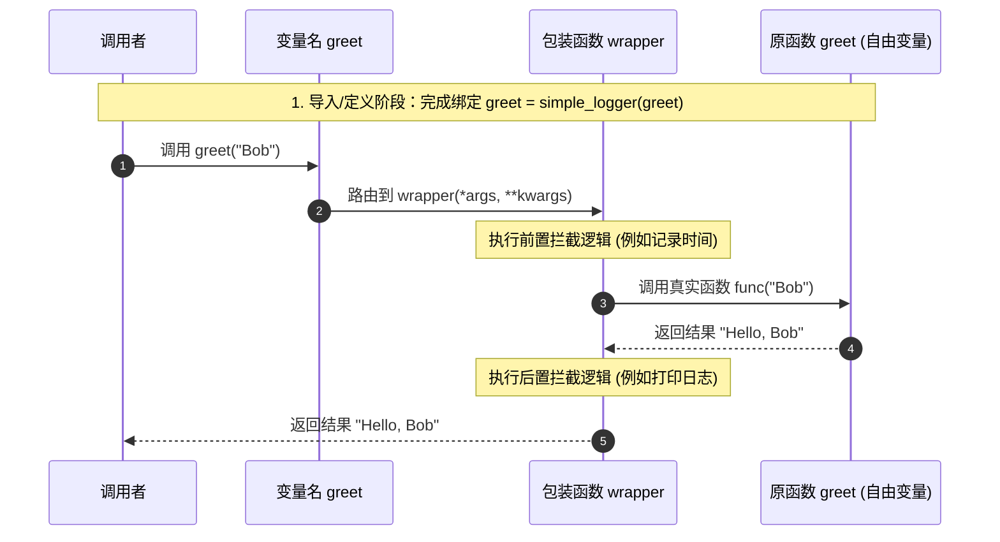

# 基础装饰器语法与 @ 符号

装饰器是 Python 中最常用的设计模式之一。本质上，**装饰器是一个接收函数作为输入，并返回一个新函数作为输出的闭包**。它允许我们在被包装函数执行的前后插入自定义的逻辑，从而无侵入地扩展其行为。

---

## 1. 装饰器的核心结构与手动实现

为了揭示装饰器背后的秘密，我们先不使用 Python 的 `@` 语法糖，而是用最基础的闭包结构手动实现一个装饰器。

假定我们有一个需要执行的简单函数 `greet`，我们想在其执行前后打印日志。

```python
import time
from typing import Callable, Any

def simple_logger(func: Callable[..., Any]) -> Callable[..., Any]:
    """一个手动的日志装饰器"""
    def wrapper(*args: Any, **kwargs: Any) -> Any:
        print(f"[日志] 准备执行函数: {func.__name__}")
        start_time = time.perf_counter()
        
        # 执行原函数，并获取返回值
        result = func(*args, **kwargs)
        
        end_time = time.perf_counter()
        print(f"[日志] 函数 {func.__name__} 执行完毕，耗时: {end_time - start_time:.6f} 秒")
        return result
        
    return wrapper

# 原函数
def greet(name: str) -> str:
    return f"Hello, {name}"

# 手动包装函数
# 这里的 greet 被重新赋值为 wrapper 函数对象，而原有的 greet 函数对象则作为 wrapper 闭包中的自由变量被保存
greet = simple_logger(greet)

# 调用 greet，实际上调用的是 wrapper
print(greet("Bob"))
```

### 输出结果
```text
[日志] 准备执行函数: greet
[日志] 函数 greet 执行完毕，耗时: 0.000003 秒
Hello, Bob
```

---

## 2. 装饰器语法糖 `@` 的编译与运行机制

手动书写 `greet = simple_logger(greet)` 略显繁琐。为了提高代码的可读性与书写效率，Python 在 PEP 318 中引入了 `@` 语法糖。

```python
@simple_logger
def greet(name: str) -> str:
    return f"Hello, {name}"
```

对于 Python 解释器而言，上述 `@simple_logger` 的声明在语法上完全等价于：
`greet = simple_logger(greet)`

### ⏳ 编译期与运行期的执行时机

我们需要分清**装饰器的定义阶段**与**函数的调用阶段**：

1. **装饰发生时（导入或模块加载时）**：
   当 Python 虚拟机（PyVM）加载并解析该模块时，一旦遇到 `@` 语法，就会**立刻**调用装饰器函数（即 `simple_logger`），将被装饰的函数对象作为实参传入，并将返回值（即内部定义的 `wrapper`）重新赋值给被装饰的变量名（即 `greet`）。这一过程是静态且一次性的。
2. **函数调用时（执行时）**：
   每当我们调用 `greet("Bob")` 时，由于 `greet` 已经指向了 `wrapper`，所以实际上是在执行包装函数。

#### 装饰器调用链时序图：



---

## 3. 通用参数传递：`*args` 与 `**kwargs`

装饰器通常需要对各种签名完全不同的函数进行拦截。如何保证包装函数能够兼容被装饰函数的所有参数形式？

答案是利用 Python 的 **位置参数收集/解包 (`*args`)** 与 **关键字参数收集/解包 (`**kwargs`)** 机制。

- `*args` 会将所有传入的定位参数收集为一个元组（tuple）。
- `**kwargs` 会将所有传入的关键字参数收集为一个字典（dict）。
- 在调用原函数 `func(*args, **kwargs)` 时，这两个符号又充当了解包的角色，将元组和字典展开为对应的参数序列，完美还原了调用方的入参。

```python
def universal_decorator(func):
    def wrapper(*args, **kwargs):
        # args 包含了所有的位置参数，kwargs 包含了所有的关键字参数
        print(f"收到位置参数: {args}, 关键字参数: {kwargs}")
        
        # 将参数原封不动地解包传递给被装饰函数
        return func(*args, **kwargs)
    return wrapper

@universal_decorator
def complex_function(a, b, c=None, *args, **kwargs):
    pass
```

---

## 4. 丢失的元数据与 `functools.wraps` 的救赎

### 4.1 元数据丢失问题

当我们对一个函数使用装饰器后，它实际上已经变成了包装函数 `wrapper`。虽然这在调用时看起来天衣无缝，但它带来了一个隐藏的问题：**元数据（Metadata）的丢失**。

每一个 Python 函数对象都拥有描述自身信息的元属性，如：
- `__name__`：函数名
- `__doc__`：函数文档字符串（Docstring）
- `__annotations__`：类型标注
- `__module__`：函数所在的模块名

如果我们不进行任何处理，直接用包装函数覆盖原函数，那么这些属性都将变成包装函数的属性。

```python
def my_decorator(func):
    def wrapper(*args, **kwargs):
        """我是包装函数的文档"""
        return func(*args, **kwargs)
    return wrapper

@my_decorator
def core_logic(data: int) -> bool:
    """我是核心逻辑的文档，负责校验数据。"""
    return data > 0

print("函数名:", core_logic.__name__)
print("文档内容:", core_logic.__doc__)
print("类型标注:", core_logic.__annotations__)
```

#### 输出结果：
```text
函数名: wrapper
文档内容: 我是包装函数的文档
类型标注: {}
```

这会导致以下问题：
1. 调试时（例如读取异常堆栈），显示的函数名均为 `wrapper`，难以定位具体出错的函数。
2. 自动化文档生成工具（如 Sphinx）无法正确提取出被装饰函数的文档和签名。
3. 某些反射机制或强依赖函数名的框架（如某些路由库）会发生故障。

---

## 4.2 `functools.wraps` 的原理与应用

为了解决这一痛点，标准库提供了 `functools.wraps` 装饰器。它是一个**专门装饰装饰器的装饰器**。它的作用是在运行期间，自动将原函数的元数据拷贝并覆写到包装函数中。

```python
import functools
from typing import Callable, Any

def improved_decorator(func: Callable[..., Any]) -> Callable[..., Any]:
    # 使用 wraps 装饰内部的包装函数，并将原函数作为参数传递给 wraps
    @functools.wraps(func)
    def wrapper(*args: Any, **kwargs: Any) -> Any:
        """我是包装函数的文档"""
        return func(*args, **kwargs)
    return wrapper

@improved_decorator
def core_logic(data: int) -> bool:
    """我是核心逻辑的文档，负责校验数据。"""
    return data > 0

print("还原后的函数名:", core_logic.__name__)
print("还原后的文档内容:", core_logic.__doc__.strip())
print("还原后的类型标注:", core_logic.__annotations__)
```

#### 输出结果：
```text
还原后的函数名: core_logic
还原后的文档内容: 我是核心逻辑的文档，负责校验数据。
还原后的类型标注: {'data': <class 'int'>, 'return': <class 'bool'>}
```

> [!TIP]
> **深入源码底层**：`functools.wraps` 本质上是调用了 `functools.update_wrapper` 函数。该函数会将原函数的 `__module__`、`__name__`、`__qualname__`、`__doc__`、`__annotations__` 属性依次复制给包装函数，同时还会将被装饰函数的 `__dict__`（属性字典）更新到包装函数中。这确保了包装函数在外观上与原函数完全一致。

在编写任何生产级别的装饰器时，**始终不要忘记加上 `@functools.wraps(func)`**。

在下一章中，我们将结合本章的语法核心，亲手实现几个在实际生产中极具应用价值的装饰器案例。
