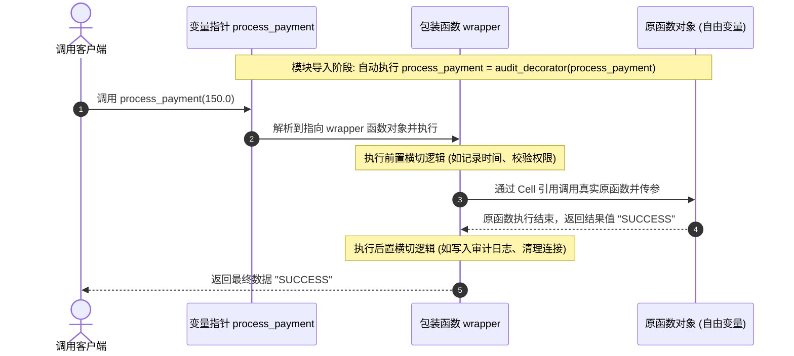

# 第二章：装饰器语法糖与通用参数传递

装饰器 (Decorator) 是 Python 语言中最为精妙的语法特性之一。它的本质是一个**高阶闭包**：它接收一个函数对象作为输入参数，在闭包内部定义一个包装函数（对其进行功能扩展），然后将该包装函数对象返回，从而在不修改原函数定义的前提下，动态注入新功能。

---

## 1. 装饰器的核心结构与手动实现

为了彻底搞清装饰器的工作方式，我们应当剥离 `@` 语法糖的表层伪装，使用纯粹的闭包模式进行手动推导。

假定我们要在执行某个核心逻辑函数前进行权限校验，并在执行后记录操作结果：

```python
from typing import Callable, Any

def audit_decorator(func: Callable[..., Any]) -> Callable[..., Any]:
    """
    审计装饰器（手动版）
    """
    def wrapper(*args: Any, **kwargs: Any) -> Any:
        # 1. 执行前置的横切逻辑
        print(f"[审计前置] 准备调用函数: {func.__name__}")
        
        # 2. 执行真正的原函数，并将原函数的返回值暂存
        result = func(*args, **kwargs)
        
        # 3. 执行后置的横切逻辑
        print(f"[审计后置] 函数 {func.__name__} 调用完成，返回值: {result}")
        
        # 4. 返回原函数结果，保证调用链行为不受影响
        return result
        
    return wrapper

# 核心业务逻辑函数
def process_payment(amount: float) -> str:
    print(f"  --> 正在处理支付，金额: ¥{amount}")
    return "SUCCESS"

# --- 手动装饰过程 ---
# 1. 将 process_payment 函数对象作为实参，传递给 audit_decorator
# 2. 获取返回的 wrapper 函数对象，并重新赋值给名为 process_payment 的变量
# 3. 此时，原本的 process_payment 函数成为了返回的 wrapper 闭包中的自由变量 (Free Variable)
process_payment = audit_decorator(process_payment)

# --- 调用过程 ---
# 此时调用 process_payment 实际上是在调用 wrapper
status = process_payment(150.0)
```

### 控制台输出分析：
```text
[审计前置] 准备调用函数: process_payment
  --> 正在处理支付，金额: ¥150.0
[审计后置] 函数 process_payment 调用完成，返回值: SUCCESS
```

通过这一手动绑定过程，我们能够清晰地发现：**装饰器本质上就是一个函数重定位的替换过程**。

---

## 2. 装饰器语法糖 `@` 的编译与运行机制

在日常开发中，我们不需要手动编写 `func = decorator(func)`。Python 在 PEP 318 中提供了 `@` 语法糖来简化这一绑定流程。

```python
@audit_decorator
def process_payment(amount: float) -> str:
    print(f"  --> 正在处理支付，金额: ¥{amount}")
    return "SUCCESS"
```

这在底层由 Python 解释器直接转换为：
`process_payment = audit_decorator(process_payment)`

### ⏳ 编译期与运行期的执行时机（核心痛点）
装饰器的引入常常会带来关于“代码何时执行”的困惑。我们需要严格区分**装饰时机（Compilation/Import Time）**与**执行时机（Execution Time）**：

1. **导入与模块加载时（静态装饰）**：
   当 Python 解释器加载该模块时，一旦解析到被 `@audit_decorator` 标记的函数定义，它就会**立即且仅执行一次**装饰器函数（即调用 `audit_decorator`），并生成包装函数对象完成替换。此时，即使被包装的函数从未被调用，装饰器外层函数的代码也已经执行完毕。
2. **运行时调用（动态包装）**：
   只有当客户端代码显式调用 `process_payment(150.0)` 时，被返回的包装函数 `wrapper` 才会开始运行。

#### 装饰器调用链时序图：

```text
客户端调用                   变量名 process_payment               包装函数 wrapper             被包装的原函数
    │                             │                                 │                            │
    │─── 1. process_payment(150) ─►                                 │                            │
    │                             │─── 2. 路由执行包装函数 ─────────►│                            │
    │                             │                                 │─── 3. [前置拦截逻辑]       │
    │                             │                                 │                            │
    │                             │                                 │─── 4. 调用原函数(150) ────►│
    │                             │                                 │                            │ 核心处理中...
    │                             │                                 │◄── 5. 返回结果 "SUCCESS" ──│
    │                             │                                 │                            │
    │                             │                                 │─── 6. [后置拦截逻辑]       │
    │                             │                                 │                            │
    │◄────────────────────────────┴─────────────────────────────────│─── 7. 转发结果 "SUCCESS"   │
```



---

## 3. 通用参数传递：`*args` 与 `**kwargs`

装饰器往往是通用的切面组件。同一份装饰器可能会作用于函数签名截然不同的函数上，例如：

- `func_a(x)` —— 单个定位参数。
- `func_b(a, b, c=10)` —— 混合定位与关键字默认参数。
- `func_c(*args, **kwargs)` —— 可变长参数。

为了保证包装函数 `wrapper` 具有普适性，我们必须利用 Python 的参数收集与解包机制：`*args` 与 `**kwargs`。

### 3.1 收集与解包流程
- **参数收集（定义包装函数时）**：
  `def wrapper(*args, **kwargs):` 这里的 `*args` 会将调用方传入的所有定位参数（Positional Arguments）收集为一个元组 (tuple)；`**kwargs` 则会将所有传入的关键字参数（Keyword Arguments）收集为一个字典 (dict)。
- **参数解包（调用原函数时）**：
  `func(*args, **kwargs)` 此时的 `*` 和 `**` 起到解包作用。它们将收集到的元组和字典拆散，还原成独立的入参列表传递给原函数。

```python
def debug_logger(func: Callable[..., Any]) -> Callable[..., Any]:
    def wrapper(*args: Any, **kwargs: Any) -> Any:
        # args 的类型为 tuple
        # kwargs 的类型为 dict
        print(f"[DEBUG] args: {args} | kwargs: {kwargs}")
        
        # 将收集的参数原样展开传递给被装饰函数
        return func(*args, **kwargs)
    return wrapper

@debug_logger
def show_profile(username: str, role: str = "guest", *hobbies: str, **metadata: Any) -> None:
    pass

# 测试各种参数组合的完美转发
show_profile("Alice", "admin", "reading", "hiking", verified=True, rating=5)
# 输出: [DEBUG] args: ('Alice', 'admin', 'reading', 'hiking') | kwargs: {'verified': True, 'rating': 5}
```

---

## 4. 丢失的元数据与 `functools.wraps` 的救赎

### 4.1 元数据丢失的危机
当一个函数被装饰器重新绑定后，它的变量名虽然没有变，但它所指向的底层函数对象已经彻底变为了 `wrapper`。这会导致该函数的**元数据（Metadata）**丢失：

- `__name__`（函数名）变成了 `"wrapper"`。
- `__doc__`（文档字符串）变成了 `wrapper` 的文档或变为 `None`。
- `__annotations__`（类型签名标注）丢失。
- 动态属性（如 `__dict__`）丢失。

```python
def dummy_decorator(func: Callable[..., Any]) -> Callable[..., Any]:
    def wrapper(*args: Any, **kwargs: Any) -> Any:
        """我是包装函数的文档"""
        return func(*args, **kwargs)
    return wrapper

@dummy_decorator
def core_business(user_id: int) -> bool:
    """我是核心业务逻辑文档，负责处理核心流程。"""
    return True

print(core_business.__name__)  # 输出: wrapper (而非 core_business)
print(core_business.__doc__)   # 输出: 我是包装函数的文档 (原文档丢失)
```

这在生产环境中会带来严重的负面效应：
1. **调试灾难**：在查看运行时异常的 Traceback 堆栈信息时，所有出错的包装函数都会显示为 `wrapper`，使排查变得极其困难。
2. **文档生成器失效**：诸如 Sphinx 等自动化文档工具将无法抓取正确的函数说明文档。
3. **元编程与路由失败**：依赖函数名反射（例如某些 API 框架的路由注册）的机制会彻底崩塌。

### 4.2 `functools.wraps` 的底层原理与 `__wrapped__`
为解决这一问题，Python 在标准库 `functools` 中提供了 `@functools.wraps(func)`。它是一个专门为“写装饰器”而设计的装饰器。

#### 生产级范式：
```python
import functools
from typing import Callable, Any

def standard_decorator(func: Callable[..., Any]) -> Callable[..., Any]:
    # 在内部包装函数上使用 @functools.wraps
    @functools.wraps(func)
    def wrapper(*args: Any, **kwargs: Any) -> Any:
        """我是包装函数内部的文档"""
        return func(*args, **kwargs)
    return wrapper

@standard_decorator
def core_business(user_id: int) -> bool:
    """我是核心业务逻辑文档，负责处理核心流程。"""
    return True

print("函数名:", core_business.__name__)         # 输出: core_business
print("文档内容:", core_business.__doc__.strip())  # 输出: 我是核心业务逻辑文档，负责处理核心流程。
```

#### 底层工作逻辑：
`functools.wraps(func)` 的底层实现非常直接。它本质上是在包装函数 `wrapper` 上调用了 `functools.update_wrapper`。
该函数会将原函数的关键属性直接覆写到包装函数上，默认拷贝的属性包括：
- `__module__`
- `__name__`
- `__qualname__`
- `__doc__`
- `__annotations__`

同时，它还会将被包装函数的属性字典 `__dict__` 也合并过去。

#### 🔓 访问未包装的原函数 `__wrapped__`
`functools.update_wrapper` 还会为包装函数动态添加一个特殊的属性 `__wrapped__`。该属性指向被包装的**原始函数对象**。
这在单元测试或某些需要绕过装饰器拦截的场景中极其有用：

```python
# 绕过装饰器，直接调用原始的 core_business
raw_func = core_business.__wrapped__
print(raw_func(999)) # 此时不会触发任何装饰器内的拦截逻辑
```

在实际开发中，编写装饰器时**绝对不要遗漏** `@functools.wraps(func)`，这是衡量装饰器代码是否符合工业级规范的重要标准。

在下一章中，我们将进入实战环节，利用目前掌握的作用域与通用转发语法，构建高可用的性能监控、审计日志和线程安全的拦截器。
