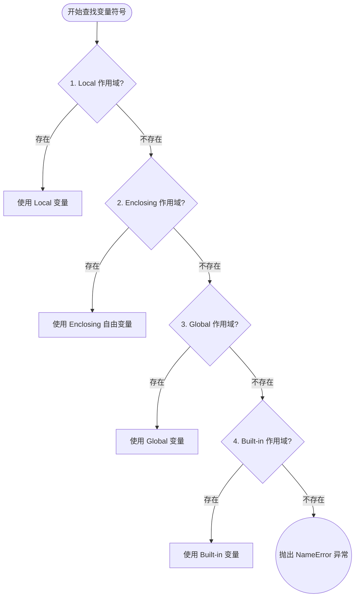
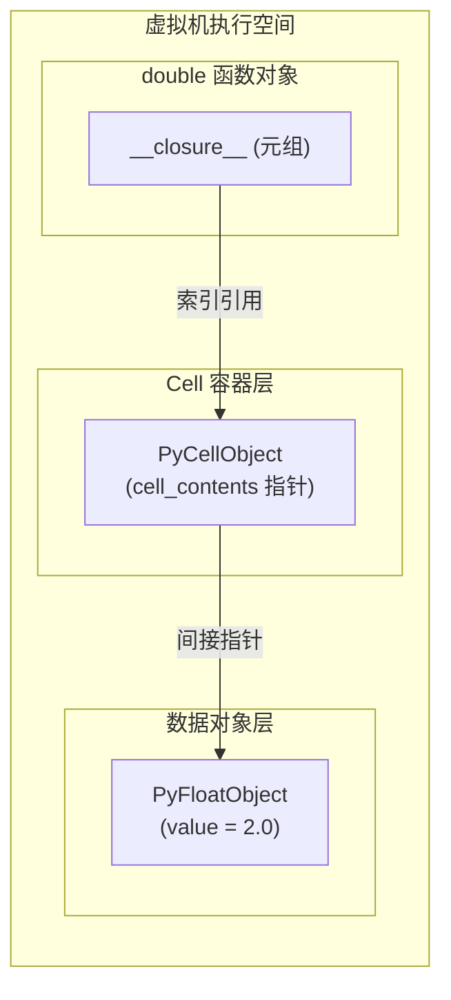

# 第一章：LEGB 查找规则与闭包语法基础

在 Python 编程语言中，装饰器是最高频使用的元编程特性之一。要透彻理解装饰器的行为与设计模式，我们必须首先拨开变量生命周期的迷雾，深入研究 Python 的**词法作用域 (Lexical Scoping)**、**LEGB 变量查找规则**，以及**闭包 (Closures)** 在 CPython 解释器底层的内存分配模型与字节码实现。

---

## 1. 词法作用域与 LEGB 查找规则

### 1.1 静态词法作用域的本质
Python 采用的是**静态词法作用域 (Static Lexical Scoping)**。这意味着一个变量的物理作用域在**编译期**（即代码被解析为字节码时）就已经由它在源代码中所处的文本位置决定了，而与运行时的调用栈（Dynamic Call Stack）无关。

```python
x = 100

def outer_func():
    print(x) # 静态词法作用域决定了这里的 x 引用的是外部全局作用域的 x

def inner_func():
    x = 200
    outer_func() # 即使在 x=200 的局部环境中调用，outer_func 打印的依然是 100
```

### 1.2 LEGB 规则层级结构
当 Python 在某个执行上下文中解析一个变量名（即解析符号引用）时，它会按照严格的层级顺序自内向外进行检索，这被称为 **LEGB 规则**。

1. **L (Local) - 局部作用域**：当前函数或 lambda 表达式体内定义的变量（通过赋值、参数列表定义）。
2. **E (Enclosing) - 嵌套作用域 / 闭包外层作用域**：当前函数的外层嵌套函数内部所定义但非全局的变量（即自由变量）。
3. **G (Global) - 全局作用域**：当前模块（单个 `.py` 文件）的顶层作用域。
4. **B (Built-in) - 内建作用域**：Python 语言底层的内置命名空间，包含 `print`、`len`、`ValueError` 等预定义符号，由 `builtins` 模块提供。

#### LEGB 检索层级关系图：

```text
  +--------------------------------------------------------+
  | B: Built-in 作用域 (len, print, ValueError)             |
  |  +--------------------------------------------------+  |
  |  | G: Global 作用域 (模块顶层定义, 全局变量)          |  |
  |  |  +--------------------------------------------+  |  |
  |  |  | E: Enclosing 作用域 (外层嵌套函数, 闭包环境) |  |  |
  |  |  |  +--------------------------------------+  |  |  |
  |  |  |  | L: Local 作用域 (当前函数内部, 局部)   |  |  |  |
  |  |  |  |   [ 符号检索起点 ]                     |  |  |  |
  |  |  |  +--------------------------------------+  |  |  |
  |  |  +--------------------------------------------+  |  |
  |  +--------------------------------------------------+  |
  +--------------------------------------------------------+
```



在 CPython 虚拟机中，当编译器遇到一个符号时，如果发现在当前作用域（L）中未找到，会逐步向外层作用域（E、G）生成不同的读取指令（如 `LOAD_FAST`、`LOAD_DEREF`、`LOAD_GLOBAL`），这保证了变量查找的高效性。

---

## 2. 第一类对象 (First-Class Citizens)

在 Python 中，“一切皆对象”。函数并不是游离于类型系统之外的特殊代码块，而是 **第一类对象 (First-Class Objects / First-Class Citizens)**。这意味着函数拥有与普通变量（如整数、列表、字典）完全对等的权利：

1. **可以被赋值给变量**。
2. **可以作为实参传递给另一个函数**。
3. **可以作为另一个函数的返回值**。
4. **可以在运行时被动态创建和销毁**。

这一特性构成了闭包与装饰器的语法基础。下面我们编写一个高阶函数，通过返回内部函数来实现一个动态的“乘法器工厂”：

```python
from typing import Callable

def multiplier_factory(factor: float) -> Callable[[float], float]:
    """
    高阶函数：接收一个乘数因子，动态创建并返回一个定制的乘法函数。
    """
    # 动态定义一个内部函数
    def multiply(x: float) -> float:
        # multiply 访问了其外部函数的变量 factor
        return x * factor
        
    # 返回函数对象本身，而不是调用它 (不带括号)
    return multiply

# 创建两个不同的乘法实例
double = multiplier_factory(2.0)
triple = multiplier_factory(3.0)

# 验证函数对象的类型
print(f"double 变量的类型: {type(double)}")  # 输出: <class 'function'>
print(f"double(5.0) 的结果: {double(5.0)}")    # 输出: 10.0
print(f"triple(5.0) 的结果: {triple(5.0)}")    # 输出: 15.0
```

当 `multiplier_factory(2.0)` 执行完毕退出后，局部变量 `factor` 按理应该随着栈帧被销毁。但当我们后续调用 `double(5.0)` 时，它依然记得 `factor = 2.0`。这种超越了常规函数调用栈生命周期的机制，就是闭包。

---

## 3. 闭包的内存模型与 CPython 虚拟机实现

### 3.1 什么是闭包？
**闭包 (Closure)** 是指一个包含**自由变量**的函数以及该变量所绑定的**环境**的整体。
具体来说，当一个内部嵌套函数引用了其外部非全局作用域中的变量，且该内部函数被当做对象返回或传递到别处执行时，就形成了一个闭包。

- **自由变量 (Free Variable)**：在嵌套函数内部使用，但既不是该嵌套函数的形参/局部变量，也不是全局变量的变量。
- **细胞变量 (Cell Variable)**：被内部嵌套函数引用的外部函数局部变量。

### 3.2 深入 CPython 底层：Cell 对象与 `__closure__`
在经典的栈式虚拟机中，当一个函数返回时，其对应的栈帧（Stack Frame）会被出栈并销毁。为了让嵌套的内部函数能继续访问外部函数的局部变量，CPython 引入了 **Cell 对象 (`PyCellObject`)**。

#### CPython 编译与运行期步骤：
1. **编译期分析**：CPython 编译器在编译 `multiplier_factory` 时，发现内部函数 `multiply` 引用了外部函数的 `factor` 变量。编译器会将 `factor` 标记为 `cell` 变量，而在内部函数中将其标记为 `free` 变量。
2. **栈帧创建与绑定**：在运行期执行 `multiplier_factory` 时，解释器不在栈帧中直接存放 `factor` 的值，而是创建一个 `PyCellObject` 容器，该容器内部有一个指针指向真正的浮点数对象 `2.0`。
3. **闭包打包**：当执行到 `return multiply` 时，CPython 虚拟机会将当前的 `PyCellObject` 打包进一个元组中，并赋值给新创建的 `multiply` 函数对象的 `__closure__` 属性。

#### 内存引用关系拓扑图：

```text
[ 运行期堆内存 (Heap) ]

  multiplier_factory 栈帧 (已消亡)
         │
         ╳ (销毁)
         
  double 函数对象 (PyFunctionObject)
   ├── __name__ : "multiply"
   └── __closure__ ─────────────────┐  (强引用)
                                    ▼
                             PyTupleObject (元组)
                              └── [0] ───────► PyCellObject (Cell 包装器)
                                                └── cell_contents ─────► PyFloatObject
                                                                          └── value = 2.0
```



由于 `double` 函数对象在全局作用域内被强引用，因此它的 `__closure__` 元组、元组内的 `PyCellObject` 以及 `PyCellObject` 包装的浮点数对象均不会被垃圾回收器（Garbage Collector）回收。

### 3.3 字节码层面分析
我们可以使用 Python 标准库中的 `dis` 模块来解析闭包的字节码指令，揭开它的面纱：

```python
import dis

def outer():
    msg = "Hello Closures"
    def inner():
        return msg
    return inner

print("--- outer 的字节码 ---")
dis.dis(outer)
```

在 outer 函数的字节码中，你会看到关键指令：
- `LOAD_CLOSURE`：加载外部函数的局部变量作为 Cell。
- `MAKE_FUNCTION`：创建函数对象，并将 Cell 组成的元组传给它以构成闭包（在 Python 3.11+ 中，`MAKE_FUNCTION` 指令可能直接从栈中消费闭包变量）。

而在 `inner` 的字节码中，会使用：
- `LOAD_DEREF`：该指令专门用于从引用的 `__closure__` 中通过 Cell 间接读取自由变量的值。它与读取局部变量的 `LOAD_FAST` 截然不同。

---

## 4. `global` 与 `nonlocal` 关键字的原理与区别

### 4.1 UnboundLocalError 陷阱
很多初学者在闭包中修改外部变量时会遇到严重的运行时错误：

```python
def bad_counter():
    count = 0
    def increment():
        # 尝试自增
        count += 1 
        return count
    return increment

my_inc = bad_counter()
# 调用 my_inc() 会抛出: UnboundLocalError: local variable 'count' referenced before assignment
```

**根本原因**：
当 Python 编译器在编译 `increment` 函数体时，发现了 `count = count + 1` 这一赋值操作。Python 默认认为**在函数体内部被赋值的变量均为该函数的局部变量**。
因此，编译器将 `count` 编译为 `increment` 的局部变量（使用 `STORE_FAST` 指令）。在执行 `count + 1` 时，需要先读取 `count` 的值，但由于它被视作局部变量且尚未被初始化赋值，虚拟机找不到对应的值，从而抛出 `UnboundLocalError`。

### 4.2 `global` 与 `nonlocal` 的底层区别
为了解决这一困境，Python 引入了作用域修饰关键字：

- **`global`**：声明某个变量为当前模块全局作用域（G）的变量。如果在全局作用域中不存在该变量，写操作会在全局作用域中动态创建它。
- **`nonlocal`**：声明某个变量属于其最近的**外层嵌套作用域（E）**（即外层函数的局部变量），**不包括全局作用域**。`nonlocal` 声明的变量必须在外部嵌套函数中已经显式存在，否则会在**编译期**直接报错。

| 维度对比 | `global` 关键字 | `nonlocal` 关键字 |
| :--- | :--- | :--- |
| **绑定的目标作用域** | 模块级别的全局命名空间 (Global) | 外部嵌套函数的局部命名空间 (Enclosing) |
| **若变量不存在** | 在运行时在全局空间新建该变量 | 在**编译期**抛出 `SyntaxError` |
| **主要应用场景** | 修改配置参数、模块级单例 | 在闭包内维持状态、自增器、计数器 |

### 4.3 实战：使用 `nonlocal` 维持闭包内部状态
让我们实现一个可以在运行时动态重置的累加器闭包：

```python
from typing import Tuple, Callable

def make_accumulator(initial_value: float = 0.0) -> Tuple[Callable[[float], float], Callable[[], None]]:
    """
    累加器闭包。
    返回一个元组：(add_func, reset_func)
    """
    current_val = initial_value

    def add(value: float) -> float:
        nonlocal current_val # 声明为 Enclosing 变量
        current_val += value
        return current_val

    def reset() -> None:
        nonlocal current_val # 声明为 Enclosing 变量
        current_val = initial_value # 重置为初始值

    return add, reset

# 测试累加器
adder, resetter = make_accumulator(10.0)

print(adder(5.5))  # 输出: 15.5
print(adder(2.0))  # 输出: 17.5
resetter()         # 重置状态
print(adder(1.0))  # 输出: 11.0 (在 10.0 的基础上累加 1.0)
```

在上面的代码中，`add` 和 `reset` 两个内部嵌套函数共享同一个 `current_val` 变量所对应的 `PyCellObject`。这种多个闭包共享同一 Cell 状态的机制，正是很多高级装饰器能够协同工作的秘诀所在。

通过对闭包和作用域机制的底层学习，我们已经夯实了理论根基。下一章，我们将正式涉足装饰器的标准语法，拆解 `@` 语法糖在编译时与运行时的真实形态。
