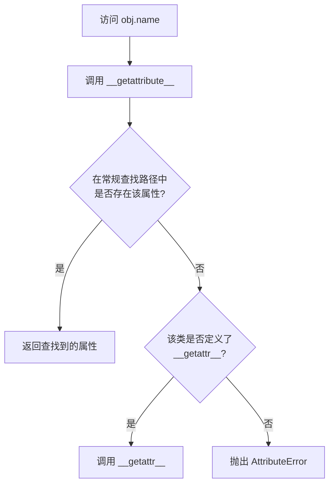

# 属性访问控制与上下文管理器

在构建大型系统和框架（如 Django、SQLAlchemy）时，拦截对象的属性读取、动态代理、管理系统资源的分配与回收是核心诉求。Python 提供了极具威力的属性拦截魔术方法与上下文管理器协议来满足这些高阶需求。

---

## 1. 属性访问控制：`__getattr__` 与 `__getattribute__` 的边界

当读取一个对象的属性（例如 `obj.name`）时，Python 会运行一系列复杂的拦截逻辑。理解 `__getattr__` 与 `__getattribute__` 的差异是避免致命错误的关键。

### 核心定义与对比

* **`__getattribute__(self, name)`**：
  * **调用契机**：**无条件**拦截。只要访问对象的任何属性，解释器都会最先调用该方法，不论该属性在实例的 `__dict__` 中是否存在。
  * **致命陷阱**：极易引发**无限递归（Stack Overflow）**。在方法内部如果直接调用 `self.name` 或 `self.__dict__`，会再次触发 `__getattribute__`，从而导致崩溃。
  * **避坑法则**：在其中获取属性时，必须通过基类方法 `super().__getattribute__(name)` 或者 `object.__getattribute__(self, name)` 来获取。
* **`__getattr__(self, name)`**：
  * **调用契机**：**后备（Fallback）**拦截。只有当 Python 无法在普通的属性查找路径中找到该属性时（即遍历完实例 `__dict__`、类字典以及 MRO 继承链都失败后），才会调用该方法。它不会引发递归问题，常用于实现动态代理。

### 属性查找流程图



### 属性修改与删除：`__setattr__` 与 `__delattr__`

* **`__setattr__(self, name, value)`**：拦截一切属性赋值操作。在其中赋值时，如果写 `self.name = value` 也会导致无限递归，必须通过 `self.__dict__[name] = value` 或 `super().__setattr__(name, value)` 写入。
* **`__delattr__(self, name)`**：拦截属性删除 `del obj.name`。

### 生产级实践：动态 API 客户端代理与自动补全 `__dir__`

利用 `__getattr__`，我们可以方便地设计出链式调用的 SDK 客户端。同时，通过重载 `__dir__` 方法，可以让 IDE 自动识别并补全动态生成的属性。

```python
from typing import Any, Dict, List

class DynamicAPIClient:
    """
    通过属性访问拦截动态构建 HTTP 请求路径的 SDK 客户端。
    例如: client.users.list -> 访问路径为 "/users/list"
    """
    def __init__(self, path: str = ""):
        self._path = path

    def __getattr__(self, name: str) -> "DynamicAPIClient":
        # 拦截不存在的属性，构建新的路径段并返回新实例
        new_path = f"{self._path}/{name}"
        return DynamicAPIClient(new_path)

    def __call__(self, **params: Any) -> str:
        # 实例作为函数被调用时，模拟执行请求
        query_str = "&".join(f"{k}={v}" for k, v in params.items())
        return f"发送请求到: {self._path}?{query_str}"

    def __dir__(self) -> List[str]:
        # 重写 __dir__，为 IDE 自动补全和终端提供动态提示
        return ["users", "orders", "payments", "get_status"]

# 测试 API 客户端
client = DynamicAPIClient()
# 链式属性访问，底层全部通过 __getattr__ 拦截
api_call = client.users.active.details
result = api_call(limit=10, fields="id,name")
print(result) 
# Output: 发送请求到: /users/active/details?limit=10&fields=id,name

# 测试自动补全属性列表
print("支持的补全列表:", dir(client))
```

---

## 2. 描述符协议：属性控制的终极形态

当我们需要在多个类之间共享同一套复杂的属性验证或拦截逻辑时，仅重写 `__setattr__` 会导致大量代码重复。**描述符（Descriptors）**是解决这一问题的终极工具。

### 描述符协议定义

一个对象如果实现了以下三个方法中的任意一个，它就是一个描述符：
* `__get__(self, instance, owner)`：获取属性值时触发。
* `__set__(self, instance, value)`：设置属性值时触发。
* `__delete__(self, instance)`：删除属性时触发。

### 数据描述符与非数据描述符
* **数据描述符（Data Descriptor）**：实现了 `__set__` 或 `__delete__`。它的查找优先级高于实例字典 `__dict__`。
* **非数据描述符（Non-data Descriptor）**：仅实现了 `__get__`。它的查找优先级低于实例字典 `__dict__`（常用于实现方法绑定）。

```python
class IntegerField:
    """
    数据描述符：用于对类属性进行严格的类型与范围验证。
    """
    def __init__(self, min_value: int = 0):
        self.min_value = min_value
        # 为了防冲突，在描述符初始化时不知道属性名，需要依赖宿主类的配合
        # Python 3.6 引入了 __set_name__ 解决此问题
        self.private_name = ""

    def __set_name__(self, owner: Any, name: str):
        # 自动获取该描述符在宿主类中的变量名
        self.private_name = f"_{name}"

    def __get__(self, instance: Any, owner: Any) -> Any:
        if instance is None:
            return self
        return getattr(instance, self.private_name, None)

    def __set__(self, instance: Any, value: Any):
        if not isinstance(value, int):
            raise TypeError(f"属性 {self.private_name[1:]} 必须是整数 (int)")
        if value < self.min_value:
            raise ValueError(f"属性 {self.private_name[1:]} 不能小于 {self.min_value}")
        # 将实际的值保存在宿主类实例中，避免内存泄漏
        setattr(instance, self.private_name, value)

class Product:
    # 声明描述符属性
    price = IntegerField(min_value=1)
    stock = IntegerField(min_value=0)

    def __init__(self, name: str, price: int, stock: int):
        self.name = name
        self.price = price  # 触发描述符的 __set__
        self.stock = stock

# 验证描述符控制
p = Product("Laptop", 5999, 10)
try:
    p.price = -100  # 触发 ValueError
except ValueError as e:
    print("验证失败：", e) # Output: 验证失败： 属性 price 不能小于 1
```

---

## 3. 上下文管理器与安全资源保障

在生产环境中，外部资源（如数据库连接、文件描述符、互斥锁）的申请与回收，必须有严格的安全围栏。`with` 语句对应的**上下文管理器协议**是防范资源泄露的最佳实践。

### 协议契机
* **`__enter__(self)`**：进入 `with` 块时调用，返回值绑定到 `as` 后的变量上。
* **`__exit__(self, exc_type, exc_val, exc_tb)`**：退出 `with` 块时无条件调用。
  * `exc_type`：捕获到的异常类型。
  * `exc_val`：捕获到的异常实例。
  * `exc_tb`：捕获到的异常 Traceback 对象。
  * **异常传播机制**：若 `__exit__` 返回 **`True`**，则 `with` 块中抛出的任何异常都会被静默**吞掉（压制）**；若返回 `False`（或 `None`），异常将会继续向外抛出。

### 生产级实践：支持自动回滚与提交的数据库事务管理器

```python
class MockDBConnection:
    def commit(self):
        print("-> 数据库事务提交")
    def rollback(self):
        print("-> 数据库事务回滚")
    def close(self):
        print("-> 关闭数据库连接")

class TransactionManager:
    """
    数据库事务上下文管理器。
    - 进入时自动开启事务
    - 无异常退出时自动 commit
    - 发生异常退出时自动 rollback 并传播异常
    """
    def __init__(self, db_conn: MockDBConnection):
        self.db = db_conn

    def __enter__(self) -> MockDBConnection:
        print("-> 开启数据库事务")
        return self.db

    def __exit__(self, exc_type: Any, exc_val: Any, exc_tb: Any) -> bool:
        if exc_type is not None:
            # 发生异常，回滚事务
            print(f"-> 监测到异常: {exc_val}，执行回滚操作")
            self.db.rollback()
            # 返回 False 让异常向外层调用栈抛出，便于业务层感知
            return False
        else:
            # 正常运行结束，提交事务
            self.db.commit()
            return True

# 测试场景 1：无异常正常提交
db = MockDBConnection()
print("=== 场景 1 开始 ===")
with TransactionManager(db) as conn:
    print("   [业务] 插入用户记录...")
print("=== 场景 1 结束 ===\n")

# 测试场景 2：异常触发自动回滚
print("=== 场景 2 开始 ===")
try:
    with TransactionManager(db) as conn:
        print("   [业务] 插入订单数据...")
        raise RuntimeError("数据库主键冲突！")
except RuntimeError as e:
    print(f"   [捕获] 捕获到外抛的异常: {e}")
print("=== 场景 2 结束 ===")
```

### 类式上下文管理器 vs `@contextmanager`

Python 的 `contextlib` 模块提供了一个 `@contextmanager` 装饰器，允许使用生成器快速实现上下文管理器，而无需定义整个类。

```python
from contextlib import contextmanager

@contextmanager
def file_logger(filename: str):
    print("-> 初始化日志资源")
    file_handle = open(filename, "w", encoding="utf-8")
    try:
        # yield 返回值即对应 with ... as var 的变量
        yield file_handle
    except Exception as e:
        print(f"-> 处理过程中捕获异常: {e}")
        # 可选择重新抛出或做回滚
        raise
    finally:
        # 对应 __exit__ 逻辑，确保资源一定关闭
        print("-> 确保日志文件关闭")
        file_handle.close()
```

#### 工作原理解析
`@contextmanager` 将一个生成器函数包装为一个实现了 `__enter__` 和 `__exit__` 的类。其运行机理如下：
1. 当进入 `with` 时，调用 `__enter__`，此时生成器执行到第一个 `yield` 表达式处**暂停（Suspend）**，并将 `yield` 的值返回给调用者。
2. 当离开 `with` 时，触发 `__exit__`：
   * 若 `with` 块内部发生异常，`__exit__` 将通过生成器的 `generator.throw(exc_type, exc_val, exc_tb)` 方法在 `yield` 暂停的位置抛出该异常，使生成器内的 `try-except-finally` 块得以捕获并处理。
   * 若无异常，生成器从暂停处继续执行，直到退出或耗尽，最后触发垃圾回收和清理逻辑。

类式实现由于定义了显式的结构，更适合保存复杂的状态、支持继承扩展；而生成器形式更适合简单的、临时性的状态切换或轻量级资源保障。
