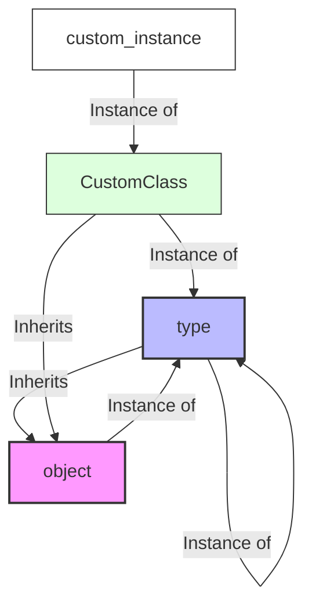
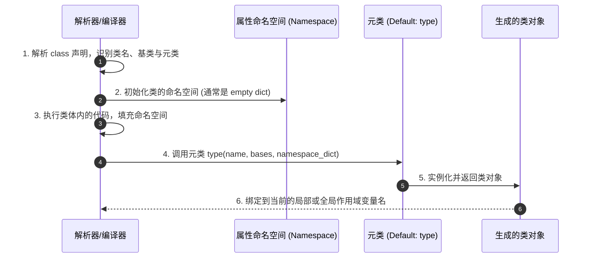

# 一、深入理解 type 与动态类创建

在 Python 中，“万物皆对象”（Everything is an object）是一条核心公理。不仅整数、字符串、列表和字典是对象，函数是对象，模块是对象，甚至**类本身也是对象**。既然类是对象，那么它就必须是由某个“创造者”创建出来的实体。这个“创造者”就是**元类（Metaclass）**。

本章将详细探究 Python 中类与元类的二元拓扑关系，深入理解 `type` 的双重角色，并通过手写动态类声明，还原 `class` 关键字背后的真实编译与构建逻辑。

---

## 1.1 Python 对象模型的基石

为了理清 Python 复杂的类型关系，我们需要明确两个维度的关联：
1. **实例化关系（is-instance-of）**：描述一个对象是由哪个类（类型）创建出来的。在 Python 中通过 `__class__` 属性或内置函数 `type()` 查看，通过 `isinstance(obj, Class)` 校验。
2. **继承关系（is-subclass-of）**：描述类与父类之间的派生关系。在 Python 中通过 `__bases__` 查看，通过 `issubclass(SubClass, SuperClass)` 校验。

### 1.1.1 `type` 的双重身份

内置对象 `type` 在 Python 中扮演着极其特殊且关键的角色，它具有双重身份：

* **身份一：类型查询函数**
  当只传入一个参数时，`type(obj)` 会返回该对象的类型对象。
  ```python
  print(type(42))        # <class 'int'>
  print(type("hello"))   # <class 'str'>
  ```

* **身份二：元类（Metaclass）**
  当传入三个参数时，`type(name, bases, dict)` 会动态创建一个新的**类对象**。此时，`type` 作为所有默认类（包括自定义类）的元类。

### 1.1.2 奇妙的自循环：`type` 与 `object`

Python 的类型系统在最顶层设计了一个“自循环”结构来避免鸡生蛋、蛋生鸡的无限退化问题：

1. `object` 是 Python 中所有类的基类（除了它自己没有父类外）。因此，`issubclass(any_class, object)` 永远为 `True`。
2. `type` 也是一个类，它继承自 `object`。即：`issubclass(type, object) -> True`。
3. `type` 是它自身的实例，即 `type(type) -> type`。
4. `object` 也是 `type` 的实例，即 `type(object) -> type`。

我们可以用下面的 Mermaid 图清晰地展示这一经典关系：



以下代码在 Python 解释器中验证了这一拓扑关系：

```python
# 验证继承关系
print(issubclass(type, object))     # True (type 继承自 object)
print(object.__bases__)             # () (object 位于继承树最顶端)

# 验证实例化关系
print(type.__class__)               # <class 'type'> (type 是它自身的实例)
print(object.__class__)             # <class 'type'> (object 是 type 的实例)
print(int.__class__)                # <class 'type'> (内置类型 int 也是 type 的实例)
```

---

## 1.2 使用 `type` 动态创建类

通常我们使用 `class` 关键字声明一个类。例如：

```python
class User:
    role = "member"
    
    def __init__(self, name):
        self.name = name
        
    def greet(self):
        return f"Hello, I am {self.name}, role: {self.role}"
```

但在运行时，Python 解释器遇到此声明后，会将其转换为调用 `type()` 构造函数来动态创建这个类对象。我们完全可以手动调用 `type()` 来达到同样的效果。

### 1.2.1 `type(name, bases, attr_dict)` 构造函数参数解析

* **`name` (str)**：新创建的类名称（绑定到类的 `__name__` 属性）。
* **`bases` (tuple)**：一个元组，包含新创建类的所有基类（绑定到 `__bases__`）。
* **`attr_dict` (dict)**：一个字典，包含类的属性名与对应值的映射，包括普通变量和函数（绑定到 `__dict__`）。

### 1.2.2 纯动态创建示例

下面我们用纯动态的方式，重写上面的 `User` 类：

```python
# 1. 定义类的初始化函数和方法
def user_init(self, name):
    self.name = name

def user_greet(self):
    return f"Hello, I am {self.name}, role: {self.role}"

# 2. 准备类的属性字典 (namespace)
class_attributes = {
    "role": "member",
    "__init__": user_init,
    "greet": user_greet
}

# 3. 使用 type 动态构建类
# 相当于: class User(object): ...
DynamicUser = type("User", (object,), class_attributes)

# 4. 测试动态创建的类
if __name__ == "__main__":
    # 实例化
    u = DynamicUser("Alice")
    print(u.greet())  # 输出: Hello, I am Alice, role: member
    
    # 验证元类和继承关系
    print(type(u))               # <class '__main__.User'>
    print(type(DynamicUser))      # <class 'type'>
    print(isinstance(u, DynamicUser))  # True
```

---

## 1.3 `class` 关键字背后的编译与构建机制

当我们写下 `class MyClass(Base): ...` 时，Python 解释器在背后到底做了什么？其标准工作流程可以拆分为以下 4 个阶段：



### 详细步骤说明：

1. **确定元类**：
   解释器首先会检查是否有明确指定的元类（如 `class MyClass(metaclass=MyMeta):`）。如果没有，它会检查基类是否有元类。如果都未显式指定，则默认使用 `type`。
   
2. **执行类主体（Class Body）**：
   Python 将类的主体代码块（包括成员变量、方法定义）放在一个临时的局部命名空间（Namespace）中执行。由于这个执行过程类似于普通的脚本执行，因此类体内的顶层代码会在**类定义期（Import Time / Load Time）**被直接执行：
   ```python
   class Test:
       print("类体内的代码正在执行...")  # 导入此模块时就会打印
       x = 10
   ```

3. **组装属性字典**：
   类体内定义的所有局部变量和函数（如上面的 `x` 以及方法）都会被收集到这个临时的命名空间字典中。

4. **调用元类进行实例化**：
   最后，Python 解释器调用确定的元类，将类名、基类元组以及刚刚生成的属性字典传入：
   ```python
   ClassObj = metaclass(name, bases, attribute_dict)
   ```
   这个类对象一旦返回，就会被绑定到模块或函数对应的命名空间中，成为我们可以直接调用的类名。

下一章我们将深入这一黑盒，通过自定义元类来干预并定制这个 `metaclass(name, bases, attribute_dict)` 的双阶段构建机制。
