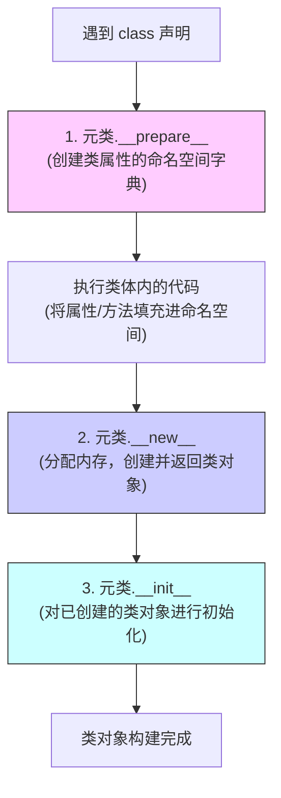

# 二、自定义元类的底层机制与双阶段构建

编写自定义元类是操纵 Python 类创建过程的核心手段。元类本身也是一个类，但它继承自 `type`。通过在自定义元类中实现特定的魔术方法，我们可以在类被导入或加载时，拦截、校验、修改甚至是完全重构这个类的定义。

本章将详细剖析元类的生命周期（`__prepare__`、`__new__`、`__init__` 阶段），分析它们在内存和调用栈上的执行顺序，并提供应对高级多继承场景下元类冲突的解决方案。

---

## 2.1 元类生命周期的三驾马车

当 Python 解释器在编译期或运行时遇到 `class MyClass(metaclass=MyMeta):` 时，它会按照严格的顺序依次调用元类的三个方法：
1. `__prepare__(name, bases, **kwargs)`
2. `__new__(mcs, name, bases, attrs, **kwargs)`
3. `__init__(cls, name, bases, attrs, **kwargs)`

我们可以用一张图表来概括它们的调用关系和职责：



### 2.1.1 奠定基石：`__prepare__`

`__prepare__` 是 Python 3 引入的类构建钩子，它在类体（Class Body）被执行**之前**被调用。其核心作用是返回一个**映射对象（Mapping Object）**，该对象将作为类体执行时的局部命名空间（即属性字典）。

* **方法签名**：
  ```python
  @classmethod
  def __prepare__(mcs, name, bases, **kwargs):
      return dict()  # 必须返回一个 dict 或其子类（实现了 __setitem__ 的映射对象）
  ```
* **典型用途**：
  * 在 Python 3.6 之前，通过返回 `collections.OrderedDict` 来保持类属性定义的先后顺序（Python 3.6+ 的默认 `dict` 已经默认保持插入顺序）。
  * 实现自定义的只读字典或记录多次写入的“多值字典”（用于支持同名方法的多重分派）。

### 2.1.2 物理构建：`__new__`

`__new__` 是真正的**创建者**。它负责在内存中分配空间，创建并返回类对象本身。

* **方法签名**：
  ```python
  def __new__(mcs, name, bases, attrs, **kwargs):
      # mcs: 当前元类本身 (MyMeta)
      # name: 类名称 (MyClass)
      # bases: 基类元组
      # attrs: 经过 __prepare__ 收集并填充后的属性字典
      # kwargs: class 声明中传递的其他关键字参数 (例如 class MyClass(metaclass=MyMeta, schema="public"))
      return super().__new__(mcs, name, bases, attrs)
  ```
* **核心职责**：
  * 拦截并修改即将创建的类的名称、父类或属性字典（例如：强制将所有属性名改为大写，剔除敏感字段等）。
  * **必须**显式返回一个类对象实例（通常通过调用 `super().__new__` 产生）。

### 2.1.3 逻辑初始化：`__init__`

`__init__` 是**初始化者**。当 `__new__` 返回类对象后，`__init__` 被调用，用于对该类对象执行一些后置的处理与配置。

* **方法签名**：
  ```python
  def __init__(cls, name, bases, attrs, **kwargs):
      # cls: 已经被 __new__ 创建出来的类对象
      super().__init__(name, bases, attrs)
  ```
* **核心职责**：
  * 此时类对象已经构建完毕，可以对其进行属性绑定、向外部注册表注册当前类等不需要改变类基本内存布局的操作。

---

## 2.2 双阶段构建代码演示

下面我们实现一个具体的自定义元类 `LoggingMeta`，打印出类创建的完整过程，并在 `__prepare__` 中使用自定义字典来记录类成员的定义轨迹。

```python
import collections

# 自定义一个字典类，用于跟踪类属性的设置过程
class TraceableDict(dict):
    def __init__(self, class_name):
        super().__init__()
        self._class_name = class_name
        self._set_history = []

    def __setitem__(self, key, value):
        # 记录属性写入的顺序和值
        if not key.startswith("__"):
            self._set_history.append(key)
            print(f"[TraceableDict] 类 {self._class_name} 正在定义属性: {key} = {value}")
        super().__setitem__(key, value)


# 自定义元类
class LoggingMeta(type):
    @classmethod
    def __prepare__(mcs, name, bases, **kwargs):
        print(f"\n--- 1. 进入 LoggingMeta.__prepare__ (类名: {name}) ---")
        print(f"额外参数 kwargs: {kwargs}")
        # 返回自定义命名空间字典
        return TraceableDict(name)

    def __new__(mcs, name, bases, attrs, **kwargs):
        print(f"\n--- 2. 进入 LoggingMeta.__new__ (元类: {mcs.__name__}) ---")
        print(f"基类元组 bases: {bases}")
        print(f"命名空间历史痕迹: {getattr(attrs, '_set_history', [])}")
        
        # 拦截操作：在类字典中注入一个元数据属性
        attrs["_meta_processed"] = True
        
        # 调用父类 type.__new__ 来创建类对象
        new_class = super().__new__(mcs, name, bases, dict(attrs))
        print(f"类对象 {new_class} 已分配内存并创建。")
        return new_class

    def __init__(cls, name, bases, attrs, **kwargs):
        print(f"\n--- 3. 进入 LoggingMeta.__init__ (类对象: {cls}) ---")
        # 此时类已经创建，我们可以给类增加或校验属性
        cls.initialized_by_meta = True
        super().__init__(name, bases, attrs)


# 使用自定义元类声明一个类
class Service(metaclass=LoggingMeta, version="1.0.0"):
    port = 8080
    host = "localhost"
    
    def run(self):
        pass


if __name__ == "__main__":
    print("\n--- 4. 主程序运行，开始验证 Service 类 ---")
    print(f"Service._meta_processed: {Service._meta_processed}")
    print(f"Service.initialized_by_meta: {Service.initialized_by_meta}")
```

### 控制台输出结果：

```text
--- 1. 进入 LoggingMeta.__prepare__ (类名: Service) ---
额外参数 kwargs: {'version': '1.0.0'}
[TraceableDict] 类 Service 正在定义属性: port = 8080
[TraceableDict] 类 Service 正在定义属性: host = localhost
[TraceableDict] 类 Service 正在定义属性: run = <function Service.run at 0x...>

--- 2. 进入 LoggingMeta.__new__ (元类: LoggingMeta) ---
基类元组 bases: ()
命名空间历史痕迹: ['port', 'host', 'run']
类对象 <class '__main__.Service'> 已分配内存并创建。

--- 3. 进入 LoggingMeta.__init__ (类对象: <class '__main__.Service'>) ---

--- 4. 主程序运行，开始验证 Service 类 ---
Service._meta_processed: True
Service.initialized_by_meta: True
```

---

## 2.3 元类冲突（Metaclass Conflict）及其破局方案

### 2.3.1 什么是元类冲突？

当一个类尝试继承自多个基类，且这些基类分别关联了不同的自定义元类时，Python 解释器在类加载期会抛出如下错误：
`TypeError: metaclass conflict: the metaclass of a derived class must be a (non-strict) subclass of the metaclasses of all its bases`

这是因为，Python 必须决定使用哪个元类来实例化这个多继承子类。如果基类 A 的元类是 `MetaA`，基类 B 的元类是 `MetaB`，而 `MetaA` 与 `MetaB` 互不继承，Python 就无法选择合法的元类。

### 2.3.2 冲突场景再现

```python
class MetaA(type): pass
class MetaB(type): pass

class BaseA(metaclass=MetaA): pass
class BaseB(metaclass=MetaB): pass

# 试图继承两个不同元类的基类
try:
    class SubClass(BaseA, BaseB):
        pass
except TypeError as e:
    print(f"触发元类冲突错误:\n{e}")
```

### 2.3.3 破局方案：动态合并元类

要解决元类冲突，我们需要为子类动态构建或声明一个新的元类，该新元类**必须同时继承**冲突的所有元类。

```python
# 1. 动态生成一个同时继承自 MetaA 和 MetaB 的混合元类
class ResolvedMeta(MetaA, MetaB):
    pass

# 2. 将混合元类指定给多继承子类
class SubClass(BaseA, BaseB, metaclass=ResolvedMeta):
    pass

print(f"SubClass 的元类成功解析为: {type(SubClass)}")
print(f"SubClass 是否是 BaseA 的子类: {issubclass(SubClass, BaseA)}")
print(f"SubClass 是否是 BaseB 的子类: {issubclass(SubClass, BaseB)}")
```

利用这一机制，我们可以在编写复杂的第三方 SDK 或框架插件时，避免因为用户基类中存在不同元类而导致的框架崩溃。
