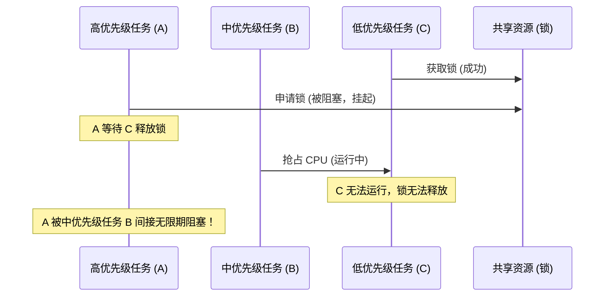

# 实时操作系统 RTOS 任务调度与优先级翻转

实时操作系统（RTOS）的核心在于其确定性的任务调度机制。本文将实战剖析底层的上下文切换过程，并展示如何使用互斥量解决优先级翻转难题。

## 任务调度与上下文切换

在单核 MCU 上，RTOS 通过快速切换任务实现“多任务并发”。上下文切换（Context Switch）的本质是保存当前任务的 CPU 寄存器状态到它的栈区，并从下一个任务的栈中恢复寄存器。

在 ARM Cortex-M 架构中，这通常在 `PendSV` 中断中用汇编实现：

```assembly
; 简化的 PendSV 中断服务例程
PendSV_Handler
    CPSID   I                          ; 关中断
    MRS     R0, PSP                    ; 获取当前进程栈指针
    
    ; 保存寄存器到当前任务栈中
    STMDB   R0!, {R4-R11}
    LDR     R1, =pxCurrentTCB          ; pxCurrentTCB 指向当前 TCB
    LDR     R1, [R1]
    STR     R0, [R1]                   ; 保存 PSP 到 TCB 顶部
    
    ; 寻找下一个最高优先级的任务
    BL      vTaskSwitchContext
    
    LDR     R1, =pxCurrentTCB
    LDR     R1, [R1]
    LDR     R0, [R1]                   ; 获取新任务的栈指针
    
    ; 从新任务栈中恢复寄存器
    LDMIA   R0!, {R4-R11}
    MSR     PSP, R0                    ; 更新栈指针
    CPSIE   I                          ; 开中断
    BX      LR                         ; 异常返回
```

## 优先级翻转问题 (Priority Inversion)

优先级翻转是指高优先级任务被低优先级任务阻塞，而中等优先级任务抢占了低优先级任务，导致高优先级任务无法按时运行的现象。



### 解决方案

1. **优先级继承 (Priority Inheritance)**：当高优先级任务 A 被低优先级任务 C 拥有的锁阻塞时，临时将 C 的优先级提升至与 A 相同。当 C 释放锁后恢复原优先级。
2. **优先级天花板 (Priority Ceiling)**：为锁设定一个固定的优先级天花板，任何获取该锁的任务，其优先级都会自动提升至天花板值。

在 FreeRTOS 中，互斥量（Mutex）默认实现了优先级继承机制，而普通的二值信号量则没有该机制。因此在进行共享资源同步时，推荐使用 `xSemaphoreCreateMutex()`。
