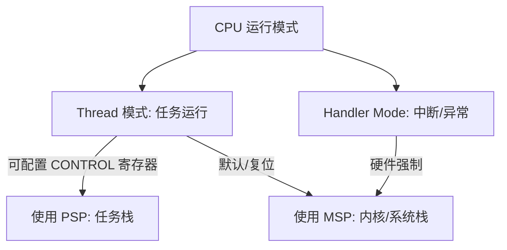

# TCB 结构与堆栈内存布局

在深入研究任务调度算法和汇编级的切换流程之前，我们必须首先理解操作系统的核心数据结构——**任务控制块（Task Control Block, TCB）**，以及 ARM Cortex-M 处理器独特的**堆栈内存布局**。这二者共同构成了 CPU 寄存器状态与操作系统任务状态之间的桥梁。

---

## 1. 任务控制块（TCB）结构剖析

在 FreeRTOS 中，每个任务都对应一个单独的 TCB。TCB 的本质是一个 C 语言结构体 `tskTCB`（定义在 `Source/tasks.c` 中）。虽然该结构体根据用户在 `FreeRTOSConfig.h` 中的配置项（如任务通知、运行时间统计、MPU 保护等）而有所差异，但其最核心的成员始终保持一致。

以下是简化版的 `tskTCB` 核心结构：

```c
typedef struct tskTaskControlBlock
{
    // 指向当前任务栈顶的指针，必须作为 TCB 结构体的第一个成员！
    volatile StackType_t *pxTopOfStack; 

    #if ( portUSING_MPU_WRAPPERS == 1 )
        // MPU 设置，用于内存保护单元（如果启用）
        xMPU_SETTINGS xMpuSettings; 
    #endif

    // 状态列表项，用于将任务挂入 Ready、Blocked、Suspended 等链表
    ListItem_t xStateListItem; 
    
    // 事件列表项，用于将任务挂入等待信号量、队列、事件组等事件链表
    ListItem_t xEventListItem; 
    
    // 任务的当前优先级（0 为最低，数值越大优先级越高）
    UBaseType_t uxPriority; 
    
    // 任务栈的起始地址（栈底）
    StackType_t *pxStack; 
    
    // 任务名称指针，主要用于调试
    char pcTaskName[ configMAX_TASK_NAME_LEN ]; 

    #if ( portCRITICAL_NESTING_IN_TCB == 1 )
        // 临界区嵌套计数器（某些架构下存在于 TCB 中）
        UBaseType_t uxCriticalNesting; 
    #endif

    // ... 其他可选配置成员（如运行时统计、任务通知、任务局部分配内存等）
} tskTCB;
typedef tskTCB TCB_t;
```

### 关键成员设计逻辑：

1.  **`pxTopOfStack` 必须是第一个成员**：  
    这是 FreeRTOS 设计中非常精妙的一点。在汇编代码（如 PendSV 异常服务函数）中，当获取到指向 TCB 的指针时，该指针的值与指向 `pxTopOfStack` 的指针完全一致（偏移量为 0）。这使得汇编语言可以极快地通过解引用 TCB 指针直接读写栈顶指针，从而提高了上下文切换的效率。
2.  **`pxStack` 与栈的生长方向**：  
    `pxStack` 指向分配给该任务的栈内存起始地址（在 Cortex-M 中，栈是**向下生长**的，即从高地址向低地址生长）。因此，任务刚创建时，栈顶指针 `pxTopOfStack` 会被初始化为接近 `pxStack + 栈大小` 的高地址端，而实际运行中随着函数的嵌套与局部变量的定义，栈顶不断向低地址（`pxStack` 侧）推进。
3.  **`xStateListItem` 与 `xEventListItem`**：  
    这两个链表节点用于将任务挂载到内核的各种管理链表中。例如，当任务处于就绪态时，`xStateListItem` 会被挂载到就绪任务链表 `pxReadyTasksLists[uxPriority]` 中；当任务因为调用 `vTaskDelay` 而进入阻塞态时，它会被挂载到延时链表 `pxDelayTaskList` 中。

---

## 2. Cortex-M 双堆栈指针机制

ARM Cortex-M 处理器具备两个物理上独立的堆栈指针（Stack Pointer, SP），但在任意时刻，CPU 只能使用其中之一：

1.  **MSP（Main Stack Pointer，主堆栈指针）**：  
    在系统复位后，默认使用 MSP。所有的**中断服务程序（ISR）**以及**异常处理器**都运行在 **Handler 模式**下，必须强制使用 MSP。此外，在 RTOS 启动之前，内核的初始化和 main 函数也运行在使用 MSP 的 **Thread 模式**下。
2.  **PSP（Process Stack Pointer，进程堆栈指针）**：  
    专门用于**用户任务（Task）**的执行。当任务在 **Thread 模式**下运行时，通常配置为使用 PSP。



### 控制寄存器（CONTROL）与 SP 选择

处理器通过特殊的 `CONTROL` 寄存器的第 1 位（`SPSEL`）来选择当前使用的堆栈指针：
*   `CONTROL[1] = 0`：在 Thread 模式下使用 MSP。
*   `CONTROL[1] = 1`：在 Thread 模式下使用 PSP。

在 FreeRTOS 中，这种双堆栈的设计带来了巨大的安全与性能优势：
*   **栈空间隔离**：任务的栈溢出不会破坏中断系统或内核自身的栈（MSP）。
*   **简化中断处理**：中断发生时，硬件自动将任务现场压入任务自己的栈（PSP）中，而中断服务程序自身运行所需的局部变量和嵌套调用则消耗 MSP 的空间。这使得任务切换与中断处理逻辑在栈空间上完全解耦。

---

## 3. 上下文切换时的堆栈帧布局

当发生任务切换或中断时，当前运行任务的寄存器状态（即“上下文”）必须被完整保存到该任务的栈（PSP）中。在 Cortex-M 中，这一保存过程由**硬件自动压栈**和**软件手动压栈**共同完成。

### 3.1 硬件自动压栈（Auto-Stacking）

当 CPU 响应中断（如 SysTick 或 PendSV）时，硬件在跳转到 ISR 的首条指令之前，会**自动**将以下 8 个寄存器顺序压入当前的堆栈（此时为 PSP）：

1.  **xPSR**（程序状态寄存器）
2.  **PC**（Program Counter，程序计数器，即返回地址）
3.  **LR**（Link Register，链接寄存器）
4.  **R12**（内部调用暂存寄存器）
5.  **R3**
6.  **R2**
7.  **R1**
8.  **R0**

> [!NOTE]
> 硬件自动压栈的顺序是固定的（高地址到低地址）。这是为了兼容 C 语言的调用约定（AAPCS），使得中断处理函数可以直接作为普通的 C 函数编写，无需担心 R0-R3、R12 等调用者保存寄存器被覆盖。

### 3.2 软件手动压栈（Manual-Stacking）

硬件自动压栈只保存了前述的 8 个寄存器。为了保证任务恢复时的一致性，其余的**被调用者保存寄存器（Callee-saved Registers）**必须由软件（通常是 PendSV 汇编代码）手动压栈：

*   **R4 - R11**（共 8 个通用寄存器）

如果 CPU 带有浮点运算单元（FPU，如 Cortex-M4F/M7）且当前任务使用了浮点运算，那么硬件和软件还需要额外保存浮点寄存器：
*   **硬件自动保存**：`S0 - S15` 以及 `FPSCR`（浮点状态与控制寄存器）。
*   **软件手动保存**：`S16 - S31`。

### 3.3 堆栈内存完整映射图

以下是任务栈（PSP）在发生上下文切换保存完毕后的内存结构（以不带 FPU 的通用 Cortex-M 架构为例，向下生长）：

```
   内存高地址 (栈底)
   +-------------------+ <--- 任务创建时的初始栈顶位置
   |      xPSR         |  (硬件自动压入)
   +-------------------+
   |  PC (任务入口地址)  |  (硬件自动压入)
   +-------------------+
   |  LR (R14)         |  (硬件自动压入)
   +-------------------+
   |      R12          |  (硬件自动压入)
   +-------------------+
   |      R3           |  (硬件自动压入)
   +-------------------+
   |      R2           |  (硬件自动压入)
   +-------------------+
   |      R1           |  (硬件自动压入)
   +-------------------+
   |      R0           |  (硬件自动压入)  <--- 硬件压栈后的 SP 位置 (假设未使用 FPU)
   +-------------------+
   |      R11          |  (软件手动压入 - PendSV)
   +-------------------+
   |      R10          |  (软件手动压入 - PendSV)
   +-------------------+
   |      R9           |  (软件手动压入 - PendSV)
   +-------------------+
   |      R8           |  (软件手动压入 - PendSV)
   +-------------------+
   |      R7           |  (软件手动压入 - PendSV)
   +-------------------+
   |      R6           |  (软件手动压入 - PendSV)
   +-------------------+
   |      R5           |  (软件手动压入 - PendSV)
   +-------------------+
   |      R4           |  (软件手动压入 - PendSV)
   +-------------------+ <--- 最终的 pxTopOfStack 指向这里！
   内存低地址 (栈顶)
```

---

## 4. 任务初始栈的构建：`pxPortInitialiseStack`

当一个新任务被创建时（通过 `xTaskCreate`），它还没有开始运行，因此无法经历正常的“中断压栈”流程。为了让调度器能够以统一的逻辑（在 PendSV 中恢复现场）来运行这个新创建的任务，内核必须为该任务**伪造一个初始堆栈帧**。

这个伪造初始栈的过程在 `port.c` 中的 `pxPortInitialiseStack` 函数中实现。

以下是 ARM Cortex-M4F（带 FPU 支持）的典型实现源码分析：

```c
StackType_t *pxPortInitialiseStack( StackType_t *pxTopOfStack,
                                    TaskFunction_t pxCode,
                                    void *pvParameters )
{
    /* 1. 预留 xPSR 的空间，并初始化为默认状态 (Thumb 模式置 1) */
    pxTopOfStack--;
    *pxTopOfStack = portINITIAL_XPSR; /* 0x01000000 */

    /* 2. 预留 PC (Program Counter)，指向任务的主体函数地址 */
    pxTopOfStack--;
    *pxTopOfStack = ( StackType_t ) pxCode;

    /* 3. 预留 LR (Link Register)，指向任务退出清理函数 */
    pxTopOfStack--;
    *pxTopOfStack = ( StackType_t ) portTASK_RETURN_ADDRESS;

    /* 4. 预留 R12, R3, R2, R1 的空间，初始化为 0 */
    pxTopOfStack -= 5; /* 预留 5 个字的空间，包括 R12, R3, R2, R1 和 R0 */
    
    /* 5. 按照 AAPCS 调用约定，任务的参数通过 R0 传递 */
    *pxTopOfStack = ( StackType_t ) pvParameters; /* R0 的位置存入入参指针 */

    #if ( configUSE_FPU == 1 )
    {
        /* 如果启用了 FPU，还需要预留浮点寄存器 S0-S15 及 FPSCR 的伪造空间 */
        pxTopOfStack--;
        *pxTopOfStack = portINITIAL_FPSCR; /* 0 */
        pxTopOfStack -= 16; /* 预留 S0 - S15 的空间 */
    }
    #endif

    /* 6. 伪造软件手动压栈部分：R11, R10, R9, R8, R7, R6, R5, R4 */
    pxTopOfStack -= 8;
    
    /* 为了便于调试和排查栈错误，可以用已知填充字填充这些寄存器 */
    pxTopOfStack[ 7 ] = 0x11111111UL; /* R11 */
    pxTopOfStack[ 6 ] = 0x10101010UL; /* R10 */
    pxTopOfStack[ 5 ] = 0x09090909UL; /* R9 */
    pxTopOfStack[ 4 ] = 0x08080808UL; /* R8 */
    pxTopOfStack[ 3 ] = 0x07070707UL; /* R7 */
    pxTopOfStack[ 2 ] = 0x06060606UL; /* R6 */
    pxTopOfStack[ 1 ] = 0x05050505UL; /* R5 */
    pxTopOfStack[ 0 ] = 0x04040404UL; /* R4 */

    #if ( configUSE_FPU == 1 )
    {
        /* 预留软件保存的浮点寄存器 S16 - S31 的空间 */
        pxTopOfStack -= 16;
    }
    #endif

    /* 返回最终计算出的栈顶指针，该指针会被写入到 TCB 的第一个成员 pxTopOfStack 中 */
    return pxTopOfStack;
}
```

### 设计深度解析：

1.  **`portINITIAL_XPSR = 0x01000000`**：  
    在 Cortex-M 中，`xPSR` 的第 24 位是 **T 位（Thumb 状态位）**。由于 Cortex-M 处理器只支持 Thumb 指令集而不支持 ARM 32 位指令集，如果跳转执行时 T 位为 0，CPU 将会直接触发 **UsageFault**。因此，伪造的 `xPSR` 必须保证该位为 1。
2.  **`portTASK_RETURN_ADDRESS`**：  
    当任务由于某种原因退出了其无限循环（通常任务不应退出），它会执行到 `ret` 指令，从而跳转到 `LR` 指向的地址。这里将 `LR` 初始化为 `prvTaskExitError`。在此函数中，通常会关闭中断并进入无限循环，或直接通过断言报错，防止 CPU 跑飞。
3.  **`R0` 的特殊地位**：  
    根据 ARM 架构的 C 语言函数调用标准（AAPCS），函数的第一个参数是通过寄存器 `R0` 传递的。任务的主体函数定义为 `void vTaskCode( void * pvParameters )`，在任务首次启动执行时，为了能让 `pvParameters` 准确地作为入参被任务函数接收，必须将该参数指针写入伪造栈帧中对应 `R0` 的位置。
4.  **已知模式填充（Debug Patterns）**：  
    使用类似 `0x04040404` 这样的填充字可以极大方便开发人员在使用仿真器（如 J-Link）调试时，直接在内存窗口中辨识出哪些寄存器处于初始未使用的状态，快速界定现场。

掌握了 TCB 结构、双堆栈机制和堆栈帧布局后，我们便做好了剖析 `PendSV` 汇编实现的准备，接下来我们将进入调度器的核心现场。
