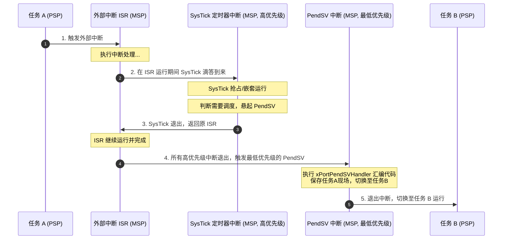

# PendSV 中断服务函数深度剖析

在 FreeRTOS 中，真正的任务上下文切换是在 **PendSV（可悬起系统调用）** 中断服务函数中完成的。这一章我们将深入探讨为什么需要 PendSV、它是如何被触发的，并以 ARM Cortex-M4F（带 FPU）架构为例，逐行剖析汇编级上下文切换函数 `xPortPendSVHandler` 的实现。

---

## 1. 为什么选择 PendSV？

在许多简单的协作式或抢占式内核中，任务切换可能直接在定时器中断（如 SysTick）或者系统调用中断（如 SVC）中当场执行。然而在 ARM Cortex-M 架构下，这种设计会导致重大的系统隐患。

### 1.1 直接在 SysTick 中切换任务的弊端
假设 SysTick 中断的优先级较高，或者系统中存在其他高优先级的中断服务程序（ISR）。如果在 SysTick 响应时直接强行实施上下文切换，可能会中断一个正在执行的 ISR。
这就意味着：
*   **中断嵌套复杂化**：任务切换代码将在中断嵌套的上下文里执行，导致内核必须去处理复杂的中断栈（MSP）与任务栈（PSP）之间的交叉混合。
*   **中断延迟增加**：高优先级的硬实时中断会被任务切换的系统开销（包括选出下一个最高优先级任务的算法耗时）所延迟，破坏系统的硬实时特性。

### 1.2 PendSV 的引入及“尾链”机制
为了解决上述问题，ARM 设计了 **PendSV（可悬起系统调用，Exception 14）**。它具有以下核心特性：
1.  **优先级可配置**：内核通常将 PendSV 的优先级配置为**最低**（在 Cortex-M 中为 `0xFF`）。
2.  **可悬起性**：它像一个软件中断，可以通过向硬件寄存器写值来“悬起”它，但它不会立即执行，而是等待所有比它优先级高的中断全部执行完毕。



通过将 PendSV 设置为最低优先级，所有的上下文切换动作都将被**延迟**到所有其他 ISR 退出之后执行。这样，任务调度器永远不会抢占中断服务程序，从而保证了中断处理的快速响应，且上下文切换完全在无中断嵌套的环境中安全地进行。

---

## 2. 悬起 PendSV 的机制

当 FreeRTOS 需要进行任务切换时（例如，任务调用了 `vTaskDelay` 进入阻塞，或在 SysTick 中断中发现当前任务的时间片已用完），内核不会直接跳转，而是调用 `portYIELD()` 宏。

在 Cortex-M 中，`portYIELD()` 的底层实现是向 **ICSR（Interrupt Control and State Register，中断控制及状态寄存器）** 的 `PENDSVSET` 位（第 28 位）写入 1：

```c
#define portYIELD()                                                             \
{                                                                               \
    /* 向 ICSR 寄存器写入 PENDSVSET 位 */                                         \
    portNVIC_INT_CTRL_REG = portNVIC_PENDSVSET_BIT;                             \
    __dsb( portSY_WRITE );                                                      \
    __isb();                                                                    \
}
```
*   `portNVIC_INT_CTRL_REG` 的地址为 `0xE000ED04`（ICSR）。
*   `portNVIC_PENDSVSET_BIT` 的值为 `0x10000000`（即第 28 位）。
*   `__dsb()`（数据同步屏障）和 `__isb()`（指令同步屏障）用于确保写入操作立即对 CPU 生效，阻止指令流水线乱序执行。

---

## 3. Cortex-M4F 汇编级 `xPortPendSVHandler` 逐行精讲

下面是 FreeRTOS 针对带 FPU（浮点运算单元）的 Cortex-M4F/M7 架构的 `xPortPendSVHandler` 完整汇编代码。我们将它划分为不同的执行阶段进行深度剖析。

```assembly
.align 4
.global xPortPendSVHandler
.thumb
.thumb_func
.type xPortPendSVHandler, %function
xPortPendSVHandler:
    /* ================== 阶段 1: 读取当前 PSP 并检查 FPU 状态 ================== */
    mrs r0, psp                         /* R0 = PSP (当前任务的栈顶指针) */
    isb                                 /* 指令同步屏障，确保 MRS 指令读取到最新值 */

    ldr r3, =pxCurrentTCB               /* R3 = &pxCurrentTCB (指向 TCB 指针的指针) */
    ldr r2, [r3]                        /* R2 = pxCurrentTCB (当前任务的 TCB 指针) */

    /* EXC_RETURN (LR) 的第 4 位指示了中断发生时是否自动压入了浮点寄存器 */
    tst lr, #0x10                       /* 测试 LR 的 Bit 4 是否为 0 */
    it eq                               /* 如果为 0 (Equal)，说明使用了 FPU 并自动压栈了 S0-S15 */
    vstmdbeq r0!, {s16-s31}             /* (EQ 则执行) 手动将剩余的浮点寄存器 S16-S31 压入 PSP 栈中 */

    /* ================== 阶段 2: 保存通用寄存器 ================== */
    stmdb r0!, {r4-r11, r14}            /* 手动将通用寄存器 R4-R11 以及当时的 LR (R14) 压入 PSP 栈中 */
                                        /* 此时 R0 已经递减更新，指向了新的栈顶位置 */

    /* ================== 阶段 3: 保存 PSP 到 TCB ================== */
    str r0, [r2]                        /* 将更新后的栈顶指针 R0 存入当前任务 TCB 的第一个成员 pxTopOfStack */

    /* ================== 阶段 4: 调用调度器选择新任务 ================== */
    stmdb sp!, {r3, r14}                /* 将 R3 (&pxCurrentTCB) 和 R14 (LR) 压入当前的主堆栈 MSP 中 */
                                        /* 保护这两个值，因为接下来调用的 C 函数可能会破坏它们 */

    mov r0, #configMAX_SYSCALL_INTERRUPT_PRIORITY /* R0 = 临界区中断优先级遮罩值 */
    msr basepri, r0                     /* 屏蔽所有优先级低于或等于 configMAX_SYSCALL_INTERRUPT_PRIORITY 的中断 */
    dsb                                 /* 数据同步屏障 */
    isb                                 /* 指令同步屏障 */
    
    bl vTaskSwitchContext               /* 跳转调用 C 函数 vTaskSwitchContext，更新 pxCurrentTCB 指向新任务 */
    
    mov r0, #0                          /* 清零 R0 */
    msr basepri, r0                     /* 恢复 BASEPRI 为 0，重新使能所有中断 */
    
    ldmia sp!, {r3, r14}                /* 从 MSP 栈中恢复之前保存的 R3 (&pxCurrentTCB) 和 R14 (LR) */

    /* ================== 阶段 5: 加载新任务的 TCB 与栈顶指针 ================== */
    ldr r1, [r3]                        /* R1 = pxCurrentTCB (此时已指向新任务的 TCB) */
    ldr r0, [r1]                        /* R0 = pxCurrentTCB->pxTopOfStack (新任务的栈顶指针) */

    /* ================== 阶段 6: 恢复新任务的上下文 ================== */
    ldmia r0!, {r4-r11, r14}            /* 从新任务的栈恢复通用寄存器 R4-R11，并将保存的 EXC_RETURN 恢复到 LR */

    tst r14, #0x10                      /* 再次测试恢复出来的 LR (EXC_RETURN) 的 Bit 4 */
    it eq                               /* 如果为 0，说明该新任务上次挂起时使用了 FPU */
    vldmiaeq r0!, {s16-s31}             /* (EQ 则执行) 从新任务栈中恢复浮点寄存器 S16-S31 */

    /* ================== 阶段 7: 更新 PSP 并异常退出 ================== */
    msr psp, r0                         /* 将最后的栈指针 R0 写入进程堆栈指针 PSP */
    isb                                 /* 指令同步屏障 */
    
    bx r14                              /* 异常返回指令。CPU 硬件会自动从 PSP 中弹出 */
                                        /* R0-R3, R12, LR, PC, xPSR (以及可能存在的 S0-S15) */
                                        /* 并跳转到新任务的 PC 位置继续执行 */
```

---

## 4. 核心步骤与指令深度剖析

### 4.1 EXC_RETURN 与 FPU 懒惰压栈（Lazy Stacking）
在带有 FPU 的 Cortex-M 处理器中，如果任务使用了浮点运算，一旦发生中断，CPU 需要保存大量的浮点寄存器（`S0-S15` 及 `FPSCR`）。为了避免中断响应被庞大的浮点数据压栈拖慢，ARM 引入了**懒惰压栈（Lazy Stacking）**机制：
*   当进入异常时，空间会在栈上预留出来，但实际上并不会立即把数据写入内存。
*   只有当异常处理程序（ISR）本身尝试去执行浮点指令时，硬件才真正把浮点寄存器的值写入那片预留的栈空间。
*   **`EXC_RETURN`（即中断发生时写入 `LR` 寄存器的特殊值，通常为 `0xFFFFFFFD` 等）的第 4 位（Bit 4）** 用来标识该任务是否使用了 FPU 帧：
    *   `Bit 4 == 0`：表示使用了浮点单元，栈帧中包含浮点寄存器，软件必须手动保存/恢复 `S16-S31`。
    *   `Bit 4 == 1`：表示未使用浮点单元，栈帧仅包含标准通用寄存器。

在汇编中：
`tst lr, #0x10` 会将 `LR` 的值与 `0x10`（二进制 `00010000`）进行按位与。如果第 4 位是 0，结果为 0，零标志位（ZF）被置 1，随后的 `it eq` 条件指令就会执行 `vstmdbeq` / `vldmiaeq` 指令。

### 4.2 为什么在调用 `vTaskSwitchContext` 前后要操作 BASEPRI？
在阶段 4 中：
```assembly
mov r0, #configMAX_SYSCALL_INTERRUPT_PRIORITY
msr basepri, r0
```
这是为了在执行调度算法时**屏蔽中断**。
`vTaskSwitchContext` 是一个复杂的 C 函数，它会遍历各个就绪任务链表，从中找出优先级最高的新任务来更新 `pxCurrentTCB`。在此期间，如果允许高优先级中断进来，而该中断又尝试通过队列或信号量唤醒某个任务并修改就绪链表，将会导致**内核数据结构破坏（Data Corruption）**。
因此，必须在调用前将系统的中断屏蔽阈值设置为 `configMAX_SYSCALL_INTERRUPT_PRIORITY`，调用完成后再将其恢复为 0（允许所有中断）。

### 4.3 为什么使用 `stmdb sp!, {r3, r14}` 保护寄存器？
由于 `vTaskSwitchContext` 是 C 函数，根据 ARM 调用规范（AAPCS），C 函数内部可以自由使用和破坏寄存器 `R0-R3`、`R12` 和 `LR`。
然而，我们的汇编代码在 `vTaskSwitchContext` 返回后，依然需要使用：
*   `R3`（保存了指向 `pxCurrentTCB` 的指针地址）来加载新的任务指针。
*   `R14`（即 `EXC_RETURN`）来进行后续的条件恢复以及最终的异常返回 `bx r14`。

因此，在跳转（`bl`）之前，必须将这两个关键值压入当前使用的堆栈（此时处于 Handler 模式，当前堆栈为 **MSP**），在函数返回后再从 MSP 弹出恢复。

---

## 5. 寄存器状态演变图

以下展示了在 `xPortPendSVHandler` 执行的不同时间点，相关关键寄存器及 PSP 堆栈指针的变化：

```
   初始状态 (刚进入 PendSV)                     手动压栈完成 (阶段 3 结束)
   
     CPU 寄存器                                   PSP 栈内存
   +------------+                               +------------+ 栈底 (高地址)
   | PSP = R0   |-----------------------------> |  Auto R0   |
   +------------+                               |    ...     |
   | LR = EXC   |                               |  Auto xPSR |
   +------------+                               +------------+
                                                |  S16-S31   | (仅 EQ 条件下存在)
                                                +------------+
                                                |  Manual R14| (EXC_RETURN)
                                                +------------+
                                                |  Manual R11|
                                                |    ...     |
                                                |  Manual R4 |
                                                +------------+ <--- pxCurrentTCB->pxTopOfStack
                                                                     (此时 R0 指向这里，
                                                                      并写入 TCB 中)
```

通过这一套精密的软硬件配合，FreeRTOS 完美地实现了任务执行环境的完全隔离与无缝迁移。在下一章中，我们将离开汇编底层，回到系统架构层面，探讨在多任务环境中如何利用内核机制防止严重的“优先级翻转”故障。
