# 优先级翻转与互斥锁的解决之道

在多任务实时操作系统中，任务之间除了相互独立运行外，还必须通过某种机制共享临界资源（如硬件接口、全局变量等）。然而，当引入资源共享与互斥机制后，系统的实时性会受到严重的挑战，其中最经典的危害便是**优先级翻转（Priority Inversion）**。

这一章我们将详细剖析优先级翻转的产生机理、通过历史经典案例分析其危害，并深入 FreeRTOS 源码，探索其如何利用**优先级继承协议（Priority Inheritance Protocol）**来攻克这一难题。

---

## 1. 什么是优先级翻转？

优先级翻转是指：**一个高优先级的任务在等待一个低优先级任务释放临界资源时，被一个中等优先级的任务抢占，导致高优先级任务被迫延迟执行的现象。** 这一现象本质上违背了实时操作系统“高优先级任务必须优先执行”的基本原则。

### 1.1 经典的三任务模型与翻转机制
假设系统中有三个任务，优先级顺序为：**任务 H (High) > 任务 M (Medium) > 任务 L (Low)**。此外，任务 H 和任务 L 共享一个互斥资源（如通过信号量锁定的串口）。

整个翻转过程可以通过以下步骤进行说明：

1.  **时刻 $T_1$**：低优先级任务 L 启动，并成功获取了共享资源的锁（Semaphore）。
2.  **时刻 $T_2$**：高优先级任务 H 就绪，由于其优先级高，抢占了任务 L 开始运行。
3.  **时刻 $T_3$**：任务 H 运行过程中，尝试去获取该共享资源的锁。由于该锁正被任务 L 持有，任务 H 进入阻塞（Blocked）状态，等待 L 释放锁。此时，CPU 控制权重新回到任务 L 手中。
4.  **时刻 $T_4$**：在中途，中等优先级任务 M 突然就绪。由于任务 M 的优先级高于当前正在运行的任务 L，任务 M 抢占了任务 L 并开始执行。
5.  **时刻 $T_5$**：由于任务 M 不需要共享资源，它可以一直运行直到结束。而在任务 M 运行期间，任务 L 被挂起，根本无法运行，也就无法释放锁。这就导致**最高优先级的任务 H 被迫挂起，间接地在等待中等优先级的任务 M 执行完毕**。

```mermaid
gantt
    title 优先级翻转时间线
    dateFormat  X
    axisFormat %s

    section 任务 H (高)
    就绪并抢占          :active, h1, 2, 3
    尝试获取锁并阻塞    :crit, h2, 3, 7
    获取锁并执行        :active, h3, 7, 9
    
    section 任务 M (中)
    就绪并抢占任务 L    :active, m1, 4, 6

    section 任务 L (低)
    执行并获取锁        :active, l1, 0, 2
    被 H 抢占           :l2, 2, 3
    继续执行            :active, l3, 3, 4
    被 M 抢占并挂起     :l4, 4, 6
    继续执行并释放锁    :active, l5, 6, 7
    被 H 抢占并挂起     :l6, 7, 9
```



### 1.2 历史灾难：火星探路者（Mars Pathfinder）事件
1997 年，美国的“火星探路者”号探测器在火星表面着陆。在工作几天后，探测器开始出现频繁的无故复位，导致科学数据丢失。
经过 NASA 工程师的远程联合调试，最终发现罪魁祸首就是**优先级翻转**：
*   **高优先级任务**：信息总线线程（Information Bus Thread），负责调度和传输关键数据。
*   **低优先级任务**：气象物理测量线程（ASI/MET），负责收集火星大气数据，它在写入数据时会获取共享的总线互斥锁。
*   **中优先级任务**：长任务通信线程，占用大量 CPU 时间。
*   **故障过程**：气象线程获取锁后，被长任务通信线程抢占；而信息总线线程因为拿不到总线锁而阻塞。由于看门狗（Watchdog）发现最重要的数据总线线程长时间没有响应，判定系统崩溃，直接触发了系统复位。
*   **解决方案**：通过修改配置，使能总线锁的**优先级继承**属性，从而彻底解决了该问题。

---

## 2. 解决方案：优先级继承 vs 优先级天花板

为了解决优先级翻转问题，学术界和工业界主要提出了两种协议：

### 2.1 优先级继承协议（Priority Inheritance Protocol, PIP）
*   **工作机制**：当高优先级任务 H 因为尝试获取某个锁而进入阻塞状态时，系统检测到持有该锁的任务是低优先级任务 L。此时，系统**临时**将任务 L 的优先级提升到与任务 H 相同的水平。
*   **效果**：提升后，中等优先级的任务 M 就无法抢占任务 L。任务 L 得以继续运行并快速释放锁。
*   **恢复**：一旦任务 L 释放了锁，其优先级立即回落到原先的低优先级水平，任务 H 随即抢占执行。

### 2.2 优先级天花板协议（Priority Ceiling Protocol, PCP）
*   **工作机制**：给每个共享资源（锁）静态分配一个“优先级天花板”。这个天花板的值被设置为**所有可能获取该锁的任务中的最高优先级**。当任何任务（哪怕是低优先级任务 L）一旦获取了该锁，系统立即将其优先级提升至该锁的优先级天花板。
*   **对比**：
    *   **优先级继承**是**动态**的：只有在真正发生高优先级任务阻塞冲突（Contention）时，才会提升低优先级任务的优先级。
    *   **优先级天花板**是**静态/主动**的：只要拿锁就立刻提升，不管有没有高优先级任务在等。这在一定程度上避免了死锁，但频繁的优先级调整会带来额外的性能开销。
    *   **FreeRTOS 选择支持优先级继承协议**。

---

## 3. FreeRTOS 源码剖析

在 FreeRTOS 中，**二值信号量（Binary Semaphore）是不带优先级继承的**，而**互斥锁（Mutex）则实现了优先级继承**。这正是二者在 RTOS 中最本质的区别。

当我们在 FreeRTOS 中调用 `xSemaphoreCreateMutex()` 创建互斥锁时，其底层的队列结构体中会将类型标记为 `queueQUEUE_TYPE_MUTEX`。

### 3.1 优先级继承的触发：`xTaskPriorityInherit`
当高优先级任务调用 `xQueueSemaphoreTake` 尝试获取互斥锁失败并即将进入阻塞时，内核会调用 `xTaskPriorityInherit()`。

以下是 `Source/tasks.c` 中 `xTaskPriorityInherit` 的源码分析：

```c
#if ( configUSE_MUTEXES == 1 )

BaseType_t xTaskPriorityInherit( TaskHandle_t const pxMutexHolder )
{
    TCB_t * const pxTCB = pxMutexHolder;
    BaseType_t xReturn = pdFALSE;

    if( pxMutexHolder != NULL )
    {
        /* 1. 检查当前准备等锁的任务（pxCurrentTCB）的优先级是否大于锁持有者的优先级 */
        if( pxTCB->uxPriority < pxCurrentTCB->uxPriority )
        {
            /* 2. 检查锁持有者的状态列表项是否挂载在就绪列表中 */
            /* 如果它在就绪列表中，它的优先级改变后，它必须被移到新的优先级的就绪列表 */
            if( listIS_CONTAINED_WITHIN( &( pxReadyTasksLists[ pxTCB->uxPriority ] ), 
                                         &( pxTCB->xStateListItem ) ) != pdFALSE )
            {
                /* 临时从旧优先级的就绪列表中移除 */
                if( uxListRemove( &( pxTCB->xStateListItem ) ) == ( UBaseType_t ) 0 )
                {
                    portRESET_READY_PRIORITY( pxTCB->uxPriority, uxTopReadyPriority );
                }

                /* 提升锁持有者的优先级为当前等锁任务的优先级 */
                pxTCB->uxPriority = pxCurrentTCB->uxPriority;

                /* 插入到新优先级对应的就绪列表中 */
                prvAddTaskToReadyList( pxTCB );
            }
            else
            {
                /* 如果它不在就绪列表中（可能因为其他原因阻塞了），直接修改其优先级即可 */
                pxTCB->uxPriority = pxCurrentTCB->uxPriority;
            }

            /* 返回 pdTRUE，表示发生了优先级继承 */
            xReturn = pdTRUE;
        }
        else
        {
            /* 如果锁持有者的优先级本就高于或等于当前任务，则不需要继承 */
            if( pxTCB->uxBasePriority < pxCurrentTCB->uxPriority )
            {
                /* 虽然不需要提升 uxPriority，但需要更新 uxBasePriority 的记录 */
                xReturn = pdTRUE;
            }
        }
    }

    return xReturn;
}

#endif /* configUSE_MUTEXES */
```

### 3.2 优先级恢复（解除继承）：`xTaskPriorityDisinherit`
当低优先级任务释放互斥锁（调用 `xQueueGenericSend` 或 `xSemaphoreGive`）时，内核会调用 `xTaskPriorityDisinherit()` 来恢复其原始优先级。

以下是 `xTaskPriorityDisinherit` 的核心实现逻辑：

```c
#if ( configUSE_MUTEXES == 1 )

BaseType_t xTaskPriorityDisinherit( TaskHandle_t const pxMutexHolder )
{
    TCB_t * const pxTCB = pxMutexHolder;
    BaseType_t xReturn = pdFALSE;

    if( pxMutexHolder != NULL )
    {
        /* 检查当前任务是否真的发生过优先级继承（当前优先级不等于其原始基优先级） */
        if( pxTCB->uxPriority != pxTCB->uxBasePriority )
        {
            /* 核心考量：该任务可能同时持有了多个不同的互斥锁！ */
            /* 只有当释放了这个任务持有的【最后一个】互斥锁，或者释放的锁是导致其优先级提升的锁时，才能降级 */
            if( pxTCB->uxMutexesHeld == ( UBaseType_t ) 0 )
            {
                /* 如果当前任务已经不持有任何互斥锁了 */
                /* 从当前的就绪列表中移除（因为它要降级了） */
                if( listIS_CONTAINED_WITHIN( &( pxReadyTasksLists[ pxTCB->uxPriority ] ), 
                                             &( pxTCB->xStateListItem ) ) != pdFALSE )
                {
                    if( uxListRemove( &( pxTCB->xStateListItem ) ) == ( UBaseType_t ) 0 )
                    {
                        portRESET_READY_PRIORITY( pxTCB->uxPriority, uxTopReadyPriority );
                    }

                    /* 恢复任务的优先级为原始的基优先级 */
                    pxTCB->uxPriority = pxTCB->uxBasePriority;

                    /* 重新插入到基优先级对应的就绪列表中 */
                    prvAddTaskToReadyList( pxTCB );
                }
                else
                {
                    /* 如果任务不处于就绪态，直接修改优先级即可 */
                    pxTCB->uxPriority = pxTCB->uxBasePriority;
                }

                xReturn = pdTRUE;
            }
        }
    }

    return xReturn;
}

#endif /* configUSE_MUTEXES */
```

### 3.3 为什么 `uxBasePriority` 必不可少？
在 `tskTCB` 中，`uxPriority` 用于调度器决定“当前谁该运行”，而 `uxBasePriority` 则是任务创建时被赋予的“真实优先级”。
如果不存在 `uxBasePriority`，一旦低优先级任务的优先级因为继承被提升至高优先级，在释放锁时，内核将无法得知该任务原本应该处于哪个优先级水平，从而导致其“永久性”地享受了高优先级的特权，破坏了系统的调度公平性。

---

## 4. 规避优先级翻转的最佳工程实践

虽然 FreeRTOS 的互斥锁通过优先级继承提供了一定程度的自愈能力，但优先级继承并非万灵药。它本身也会带来额外的系统开销（如链表重排、优先级调整计算等），且在多锁嵌套的复杂场景下依然可能导致死锁（Deadlock）。

在实际的生产级嵌入式系统设计中，推荐采用以下最佳实践来规避或减轻优先级翻转：

1.  **尽量减少跨优先级共享资源**：  
    如果可能，尽量将临界资源独占式地分配给某一个任务。其他任务如果需要使用该资源，可以通过**消息队列（Queue）**向该任务发送请求，由独占任务统一处理。
2.  **极简临界区原则**：  
    任何持有互斥锁或处于临界区的代码，都应该以最快的速度执行完毕。在持有锁的过程中，**绝对禁止调用可能会引起任务阻塞或延时的 API**（如 `vTaskDelay` 或阻塞式网络接收）。
3.  **合理配置 `FreeRTOSConfig.h`**：  
    对于不需要进行优先级继承的单纯的信号同步（例如中断唤醒任务），必须使用**二值信号量（Binary Semaphore）**或更轻量级的**任务通知（Task Notifications）**。只有在需要严格互斥访问共享资源时，才使用**互斥锁（Mutex）**，并确保开启了 `configUSE_MUTEXES`。
4.  **避免锁嵌套（Nested Locks）**：  
    在设计软件架构时，尽量保证一个任务在任意时刻只持有一个互斥锁。如果必须同时持有多个锁，必须保证所有任务都以**完全相同的顺序**获取锁，以防发生死锁。
