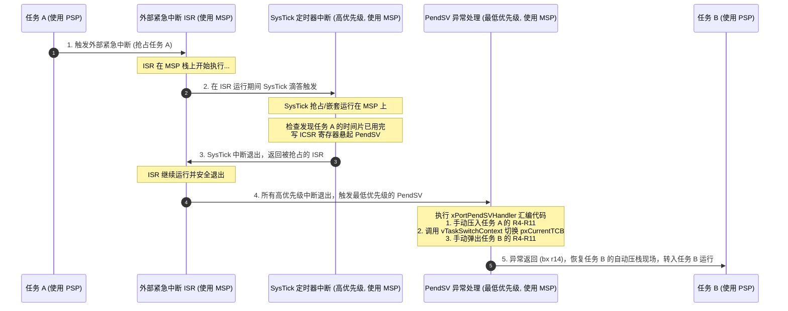

# 第二章：PendSV 异常与上下文切换汇编实现

在 FreeRTOS 中，决定“何时”切换任务是由 C 语言编写的调度器算法决定的；但执行“如何”切换任务的物理现场保存与恢复，则必须通过微处理器紧密关联的汇编语言来实现。在 ARM Cortex-M 架构下，**PendSV（可悬起系统调用）** 异常是承载这一核心功能的物理机制。

本章将深度剖析 PendSV 的设计思想，并以带硬件浮点运算单元（FPU）的 **ARM Cortex-M4F/M7** 架构为例，逐行拆解 FreeRTOS 移植层的底层汇编函数 `xPortPendSVHandler` 的运行轨迹。

---

## 1. 为什么上下文切换必须由最低优先级的 PendSV 承载？

在裸机或简单的抢占式内核中，任务切换往往在时钟中断（如 SysTick）或系统调用异常（如 SVC）中直接执行。但在 ARM Cortex-M 这类支持高级中断嵌套的现代处理器中，这种设计会引发重大隐患。

### 1.1 直接在 SysTick 中切换任务的弊端

假设 SysTick 定时器中断被赋予了中等或高优先级，或者系统中存在其他紧急的外部中断（如 UART 接收、电机控制中断等）。如果 SysTick 响应时，系统直接在 SysTick 内部执行上下文切换，就可能发生如下嵌套灾难：

```
    [ 外部中断 ISR 正在运行 ] (使用主堆栈 MSP)
           |
           v
    [ SysTick 中断触发，优先级更高，抢占 ISR ]
           |
           +---> [ 直接执行上下文切换 ]
                       |
                       v
                 [ 将 CPU 的 SP 从 PSP 改为下一个任务的栈 ]
                       |
                       v
                 [ 中断返回 (bx lr) ] ---> 导致 CPU 混乱！
```

*   **中断嵌套被打破**：上下文切换强行修改了 `SP`（从当前任务的 PSP 换成了新任务的 PSP），但由于原本处于中断嵌套状态（被抢占的外部中断 ISR 尚未退出，其返回状态还在 MSP 中），CPU 的状态机将无法理清中断的嵌套深度，从而直接触发 **HardFault（硬件中断故障）**。
*   **硬实时中断延迟**：上下文切换中，调度器（如 `vTaskSwitchContext`）需要执行寻找最高优先级就绪任务的遍历算法，这段耗时将直接叠加到中断执行时间中，导致后续的硬实时中断被推迟响应。

### 1.2 PendSV 的延迟执行与“尾链”机制

为解决这一冲突，ARM 架构引入了 **PendSV（可悬起系统调用，Exception 14）** 异常。它具备两大核心特征：
1.  **优先级可配置为最低**：在 FreeRTOS 初始化时，内核通过写控制寄存器将 PendSV 的优先级配置为最低（`0xFF`）。
2.  **悬起（Pending）特性**：可以通过向中断控制寄存器写值来“悬起”它，但它不会像强占式中断那样立刻打断高优先级执行流，而是类似于一个“推迟执行的软件中断”，等待当前所有高优先级中断服务程序全部安全退出。



---

## 2. 悬起 PendSV 的底层代码

当 FreeRTOS 需要让出当前 CPU（例如任务执行 `vTaskDelay` 主动阻塞，或者在 SysTick 中发现有更高优先级的任务就绪）时，内核会调用 `portYIELD()` 或 `portYIELD_FROM_ISR()` 宏。

这两个宏的底层都是向 **ICSR（Interrupt Control and State Register，中断控制及状态寄存器）** 的 `PENDSVSET` 位（第 28 位）写入 1：

```c
#define portYIELD()                                                             \
{                                                                               \
    /* 向 ICSR 寄存器 (0xE000ED04) 写入 PENDSVSET (0x10000000) */                   \
    portNVIC_INT_CTRL_REG = portNVIC_PENDSVSET_BIT;                             \
                                                                                \
    /* 数据同步屏障，确保写入动作在接下来的指令执行前完成 */                            \
    __dsb( portSY_WRITE );                                                      \
    /* 指令同步屏障，清空流水线，保证 CPU 获取到最新的悬起状态 */                      \
    __isb();                                                                    \
}
```

---

## 3. Cortex-M4F 汇编级 `xPortPendSVHandler` 逐行精讲

接下来我们将进入最核心的现场。针对带 FPU 硬件浮点运算单元的 ARM Cortex-M4F/M7 架构，FreeRTOS 的 `xPortPendSVHandler` 汇编源码如下。

为了便于彻底理解，我们将这部分汇编代码分为 7 个物理阶段进行拆解。

### 3.1 汇编完整源码与逐行注释

```assembly
.align 4
.global xPortPendSVHandler
.thumb
.thumb_func
.type xPortPendSVHandler, %function
xPortPendSVHandler:
    /* ================= 阶段 1: 获取当前任务的 PSP 并准备保存现场 ================= */
    mrs r0, psp                         /* R0 = PSP (当前任务的堆栈指针) */
    isb                                 /* 指令同步屏障，保证后续 LDR 能读取到被 MRS 写入的最新 R0 值 */

    ldr r3, =pxCurrentTCB               /* R3 = &pxCurrentTCB (指向当前任务 TCB 指针的地址) */
    ldr r2, [r3]                        /* R2 = pxCurrentTCB (当前任务的 TCB 指针) */

    /* EXC_RETURN (即 LR 寄存器) 的第 4 位指示了中断发生时是否自动压入了浮点寄存器 */
    tst lr, #0x10                       /* 测试 LR 的 Bit 4。若为 0 代表使用了 FPU 并自动压入了 S0-S15 */
    it eq                               /* 条件执行：若结果为 0 (Equal) */
    vstmdbeq r0!, {s16-s31}             /* 只有当使用了 FPU 时，才将剩余的浮点寄存器 S16-S31 手动压入任务栈 R0 */

    /* ================= 阶段 2: 软件手动压栈通用寄存器 ================= */
    /* 
     * 将通用寄存器 R4-R11 以及当时的 LR (包含 EXC_RETURN 信息) 压入当前任务栈。
     * stmdb 指令带 ! 号，表示压栈后，R0 递减的值会实时更新回 R0。
     */
    stmdb r0!, {r4-r11, r14}

    /* ================= 阶段 3: 将更新后的栈顶指针写入 TCB ================= */
    str r0, [r2]                        /* pxCurrentTCB 的首成员就是栈顶指针，因此直接把 R0 存入 R2 指向的内存 */

    /* ================= 阶段 4: 调用 C 调度器以更新 pxCurrentTCB ================= */
    /* 
     * 因为即将调用的 C 函数 vTaskSwitchContext 可能会破坏 R3 (&pxCurrentTCB) 和 LR (R14)，
     * 并且此时我们正运行在 Handler 模式，因此必须将它们临时压入主堆栈 (MSP) 中进行保护。
     */
    stmdb sp!, {r3, r14}

    /* 
     * 进入临界区：屏蔽所有优先级低于或等于 configMAX_SYSCALL_INTERRUPT_PRIORITY 的中断。
     * 防止在调度器选择就绪任务的过程中被高优先级中断唤醒的其他任务修改就绪列表。
     */
    mov r0, #configMAX_SYSCALL_INTERRUPT_PRIORITY
    msr basepri, r0
    dsb                                 /* 数据同步屏障 */
    isb                                 /* 指令同步屏障 */
    
    /* 调用 C 调度函数。该函数执行结束后，pxCurrentTCB 将指向新任务的 TCB */
    bl vTaskSwitchContext
    
    /* 退出临界区：恢复 BASEPRI 寄存器为 0，重新使能所有被屏蔽的中断 */
    mov r0, #0
    msr basepri, r0
    
    /* 从 MSP 中弹出恢复之前保存的 R3 (&pxCurrentTCB) 和 LR (EXC_RETURN) */
    ldmia sp!, {r3, r14}

    /* ================= 阶段 5: 获取新任务的栈顶指针 ================= */
    ldr r1, [r3]                        /* R1 = pxCurrentTCB (此时 pxCurrentTCB 已经变为了新任务的 TCB 地址) */
    ldr r0, [r1]                        /* R0 = pxCurrentTCB->pxTopOfStack (新任务保存的旧栈顶指针) */

    /* ================= 阶段 6: 恢复新任务的上下文 ================= */
    /* 
     * 从新任务栈中依次弹出通用寄存器 R4-R11 以及保存的 EXC_RETURN 代码 (恢复到 LR)。
     * ldmia 指令带 ! 号，表示出栈后 R0 会随着出栈动作递增更新。
     */
    ldmia r0!, {r4-r11, r14}

    /* 检查恢复出来的 LR (EXC_RETURN) 的 Bit 4，判断新任务上次挂起时是否激活了 FPU */
    tst r14, #0x10                      /* 测试新 LR 的 Bit 4 */
    it eq                               /* 条件执行：若结果为 0 (使用过 FPU) */
    vldmiaeq r0!, {s16-s31}             /* 弹出恢复浮点寄存器 S16-S31 */

    /* ================= 阶段 7: 更新 PSP 指针并退出异常 ================= */
    msr psp, r0                         /* 将最终的栈顶指针 R0 写入 PSP */
    isb                                 /* 指令同步屏障，确保后续 bx 指令跳转前 PSP 生效 */
    
    bx r14                              /* 异常返回指令。CPU 硬件会自动从当前 PSP 指向的内存中 */
                                        /* 弹出 R0-R3, R12, LR, PC, xPSR (及 S0-S15) 并恢复，接着跳转至新 PC */
```

---

## 4. 上下文切换期间的堆栈指针演变详解

为了更加直观地观察 CPU 寄存器和任务栈在执行汇编指令时的物理变化，我们可以将切换流程中堆栈的动态演变用图表进行还原。

### 4.1 手动压栈过程中的 PSP 指针变化

当刚进入 PendSV 中断时，硬件已经自动完成了压栈。此时 PSP 指向基本异常帧的底部（`R0` 的存储位置）：

```
    【刚进入 PendSV】             【阶段 1 压入 S16-S31 后】        【阶段 2 压入 R4-R11、LR 后】
     
      PSP (进入前)                   PSP (FPU 压栈后)                 pxTopOfStack (最终栈顶)
          |                              |                                |
          v                              v                                v
    +------------+                 +------------+                   +------------+
    |  Auto R0   |                 |  Auto R0   |                   |  Auto R0   |
    +------------+                 +------------+                   +------------+
    |  Auto R1   |                 |  Auto R1   |                   |  Auto R1   |
    +------------+                 +------------+                   +------------+
    |    ...     |                 |    ...     |                   |    ...     |
    +------------+                 +------------+                   +------------+
    |  Auto xPSR |                 |  Auto xPSR |                   |  Auto xPSR |
    +------------+                 +------------+                   +------------+
                                   |  S16-S31   |                   |  S16-S31   |
                                   +------------+                   +------------+
                                                                    |  EXC_RET   |  <--- 压入的 LR (R14)
                                                                    +------------+
                                                                    |   R11      |
                                                                    +------------+
                                                                    |   ...      |
                                                                    +------------+
                                                                    |   R4       |
                                                                    +------------+  <--- R0 最终指向这里
```

在阶段 3 中，汇编代码执行 `str r0, [r2]`，实质上是将 R0 当前所指向的物理地址（即上图最右侧的 R4 位置）写入到当前任务的 TCB 中的 `pxTopOfStack` 变量中，完成旧任务上下文的封存。

### 4.2 中断内调用 C 调度器时 MSP 指针的变化

在阶段 4 中，因为要从汇编跳转至 C 函数 `vTaskSwitchContext`，汇编代码执行了 `stmdb sp!, {r3, r14}`。
注意：**此时处于 Handler 模式，当前 CPU 使用的堆栈指针是 MSP**。

```
                    【MSP 堆栈内存变化】
    
        进入 PendSV 前的 MSP                 写入防护寄存器后
             |                                     |
             v                                     v
       +------------+                        +------------+
       |   内核数据 |                        |   内核数据 |
       +------------+                        +------------+
                                             | R3 (&TCB)  |  <--- 压入保护
                                             +------------+
                                             | LR (EXC)   |  <--- 压入保护
                                             +------------+  <--- 当前 SP 指向这里
```

这个步骤非常关键。如果不通过 MSP 堆栈保存 R3 和 R14，当 C 函数执行完毕并返回时，R3 和 LR 的原始值将被 C 函数内部的编译代码彻底覆盖，汇编代码将失去“知道新任务 TCB 在哪”和“如何退出中断”的关键信息。

---

## 5. 核心底层机制深度解析

### 5.1 FPU 懒惰压栈（Lazy Stacking）及其对 LR (EXC_RETURN) 的影响

在带有 FPU 的 Cortex-M 处理器中，如果每个任务切换时都要无条件保存 32 个浮点寄存器（S0-S31）和 FPSCR，将会带来极其严重的性能开销（多消耗 33 个时钟周期）。为了解决这一实时性杀手，ARM 架构引入了**懒惰压栈（Lazy Stacking）**：
*   当异常发生时，硬件会在堆栈（PSP）上为浮点寄存器 `S0-S15` 预留空间，**但并不会物理写入数据**。
*   只有当异常处理程序（如 PendSV）中的指令尝试访问硬件 FPU（或者执行了浮点指令）时，硬件才会真正启动总线写周期将数据灌入内存。
*   如果整个 PendSV 执行期间没有发生任何浮点运算，这部分写入开销就会被彻底省去。

为了配合此特性，硬件在异常响应时，会将特殊的**异常返回代码（EXC_RETURN）**存入 `LR`（R14）寄存器。
其中 **Bit 4** 是判断是否自动压入浮点帧的物理标志位：
*   `LR[4] == 0`：当前任务激活了 FPU，堆栈中包含浮点帧，必须手动压栈/出栈 `S16-S31`。
*   `LR[4] == 1`：当前任务未激活 FPU，堆栈中仅包含标准整型帧，无需处理 `S16-S31`。

在汇编中，我们使用条件执行指令组合 `tst lr, #0x10` 和 `it eq`（If-Then-Equal）来实现这一动态检测：
```assembly
tst lr, #0x10           /* 检查 LR (EXC_RETURN) 的第 4 位是否为 0 */
it eq                   /* 若为 0 (Equal)，说明上次任务使用了 FPU */
vstmdbeq r0!, {s16-s31} /* 条件执行：压入 S16-S31 */
```

### 5.2 为什么要用 BASEPRI 寄存器屏蔽中断？

在调用调度器 `vTaskSwitchContext` 前，汇编代码将 `BASEPRI` 设置为 `configMAX_SYSCALL_INTERRUPT_PRIORITY`：
```assembly
mov r0, #configMAX_SYSCALL_INTERRUPT_PRIORITY
msr basepri, r0
```
这是因为 `vTaskSwitchContext` 会修改全局的就绪任务链表。在此期间，若有高优先级的中断响应（如串口接收），该中断对应的 ISR 可能会调用 FreeRTOS API（如 `xSemaphoreGiveFromISR`）向就绪链表插入被唤醒的任务。

如果在调度器遍历链表的一瞬间发生这种链表插入操作，就会触发**链表指针的交叉覆盖（Data Corruption）**，导致操作系统数据结构损坏，诱发整个系统崩溃（通常表现为进入 HardFault 或者死锁）。因此，必须在执行切换决策的一瞬间，将所有可能调用 FreeRTOS API 的中断全部屏蔽。

---

## 6. 本章总结

通过本章的逐行汇编精讲，我们详细推导了 PendSV 异常是如何在不干扰高优先级中断的“无嵌套环境”下，安全、快速地转移 CPU 通用寄存器和浮点寄存器的现场。双堆栈机制在此处起到了核心作用——通过 PSP 实现任务栈隔离，通过 MSP 保护中断中的调用现场。

在理清了上下文切换的底层汇编细节后，我们将视线重新拉回到高层的多任务同步设计中。下一章，我们将剖析由于任务共享锁资源所导致的最经典的时间失效问题——**优先级翻转**。
