# 第三章：优先级反转成因与互斥锁优先级继承机制

在硬实时系统（Hard Real-Time Systems）中，任务的执行时间及响应延迟必须具备高确定性（Bounded Latency）。然而，一旦引入多任务并发访问共享临界资源（如传感器、共享串口、内存缓冲区），即使调度算法再完美，也可能遭遇灾难性的时序隐患——**优先级翻转（Priority Inversion）**。

本章将从底层调度机理出发，解析优先级翻转的物理过程、推导其数学模型，并通过 FreeRTOS 内核源码深入探讨**优先级继承协议（Priority Inheritance Protocol）**的完整算法实现与局限性。

---

## 1. 优先级翻转的底层成因与危害

### 1.1 经典三任务模型与时序分析

优先级翻转是指：**高优先级任务（Task H）在等待一个被低优先级任务（Task L）持有的临界资源时，被一个无需该资源的中等优先级任务（Task M）抢占，导致高优先级任务被无限期延迟执行的现象。**

我们通过三个任务来模拟这一经典场景：
*   **Task H (High)**：高优先级任务，对响应时间要求极高。
*   **Task M (Medium)**：中等优先级任务，属于常规业务计算。
*   **Task L (Low)**：低优先级任务，负责基础数据采集。
*   **Mutex / Semaphore**：用于保护共享串口资源。

#### 优先级翻转时序时间线

以下是无防护系统中的优先级翻转时序：

```
 时间轴 ------------------------------------------------------------------------------------>
 [T0] Task L 启动并成功获取了互斥信号量锁锁定了共享资源 R。
       |
 [T1] Task H 就绪并抢占了 Task L，开始执行核心业务。
       |
 [T2] Task H 尝试获取资源 R 的锁。由于 R 被 Task L 锁定，Task H 被迫挂起并进入 Blocked 状态。
      CPU 控制权被动归还给持有锁的 Task L。
       |
 [T3] 中等优先级任务 Task M 突然就绪。由于 Task M 的优先级高于 Task L，Task M 抢占 Task L。
       |
 [T4] Task M 在运行期间不需要资源 R，它可以一直独占 CPU 直至运行完毕。
      在此期间，Task L 被完全挂起，无法释放资源 R。
      进而导致【最高优先级】的 Task H 也只能处于阻塞态干等，这彻底违背了优先级调度的初衷！
       |
 [T5] Task M 运行完毕让出 CPU，Task L 重新获得 CPU 并执行完毕释放资源 R。
       |
 [T6] Task H 终于拿到资源 R 的锁，开始执行，但此时其响应时间已经严重超时（产生抖动/死机）。
```

#### 优先级翻转时序 Gantt 图

```mermaid
gantt
    title 优先级翻转物理时序图
    dateFormat  X
    axisFormat %s

    section Task H (高)
    任务未就绪          :   0, 1
    就绪运行            :active, h1, 1, 2
    尝试拿锁->阻塞挂起   :crit, h2, 2, 6
    获取锁并恢复运行     :active, h3, 6, 8
    
    section Task M (中)
    任务未就绪          :   0, 3
    就绪抢占->持续执行   :active, m1, 3, 5
    任务结束让出        :   5, 8

    section Task L (低)
    就绪运行并拿锁      :active, l1, 0, 1
    被 Task H 抢占      :l2, 1, 2
    重新恢复->执行中     :active, l3, 2, 3
    被 Task M 抢占挂起  :l4, 3, 5
    恢复运行->释放锁    :active, l5, 5, 6
    任务结束让出        :   6, 8
```



### 1.2 历史经典案例：美国火星探路者（Mars Pathfinder）事件

1997 年 7 月，美国的“火星探路者”号无人探测器在火星表面着陆。然而在工作数天后，系统开始频繁地发生无故复位，导致宝贵的科研数据中断丢失。

NASA 实验室经过地面对照机测试和远程调试，最终诊断出该故障就是由**优先级翻转**引起的：
*   **高优先级任务**：`Information Bus Thread`（信息总线线程），负责发布和传输关键控制指令，关系到整机存活。
*   **低优先级任务**：`ASI/MET Thread`（气象数据采集线程），用于搜集火星温度、气压等，它需要写数据到共享的总线缓冲区，并在写入时申请一个互斥锁。
*   **中等优先级任务**：`Communications/Data Handler Thread`（长任务通信线程），负责普通的无线电遥测数据打包与发送，执行时间较长。
*   **诱发机制**：气象线程拿到了总线锁，随后高优先级的总线线程抢占运行并请求总线锁，随之进入阻塞。此时，不需要锁的中等优先级通信线程抢占了气象线程。导致气象线程无法释放锁，总线线程无限期等待。
*   **安全防御崩溃**：系统内嵌了看门狗（Watchdog）任务。看门狗发现最核心的“信息总线线程”已经长时间没有喂狗（判定系统死锁或崩溃），于是直接触发了微控制器硬复位。
*   **修复方案**：NASA 工程师通过修改 VxWorks 系统的配置参数，将总线信号量设置为“开启优先级继承”，通过无线电将补丁打回火星，彻底解决了复位问题。

---

## 2. 机制对比：优先级继承协议 (PIP) vs 优先级天花板协议 (PCP)

针对优先级翻转，实时操作系统内核通常提供以下两种解决方案：

### 2.1 优先级继承协议（Priority Inheritance Protocol, PIP）

*   **核心逻辑**：当高优先级任务 H 因请求某个临界锁而阻塞时，系统自动检测持有该锁的任务 L。如果 L 的优先级低于 H，则**临时将 L 的优先级提升到与 H 相同的水平**。
*   **效果**：提升后，中等优先级的任务 M 将无法抢占任务 L。任务 L 得以快速执行，一旦释放锁，其优先级立即回落至原始值，任务 H 随即拿到锁并抢占执行。
*   **特点**：**动态触发**。只有当高优先级任务和低优先级任务在运行中发生了真正的锁竞争（Contention）时，才会发生优先级拉升。

### 2.2 优先级天花板协议（Priority Ceiling Protocol, PCP）

*   **核心逻辑**：静态地为每个锁资源分配一个“天花板优先级”（Ceiling Priority），该值被设置为**所有可能访问该资源的任务中的最高优先级**。无论哪个任务（哪怕是最低优先级的 L）一旦获取了该锁，系统立即将其优先级拉升至该锁的天花板优先级。
*   **特点**：**主动拉升**。无论当前有没有高优先级的任务在等锁，只要拿锁就提升优先级。
*   **对比分析**：
    *   **死锁防范**：PCP 在多锁嵌套场景下能有效预防死锁；而 PIP 无法预防死锁，仅能解决优先级翻转。
    *   **切换开销**：PCP 只要拿锁就频繁触发优先级重排；PIP 仅在冲突发生时才重排，运行开销小。
    *   **FreeRTOS 选择支持优先级继承协议（PIP）**。

---

## 3. FreeRTOS 优先级继承源码深度分析

在 FreeRTOS 中，**二值信号量是不带优先级继承的**，而**互斥锁（Mutex）则通过封装实现了优先级继承**。二值信号量多用于“中断到任务”的单向同步，而互斥锁专用于“任务与任务”之间的共享资源互斥保护。

### 3.1 优先级继承的触发：`xTaskPriorityInherit`

当高优先级任务执行 `xSemaphoreTake` 失败并即将进入阻塞时，内核会调用 `xTaskPriorityInherit` 临时提升锁持有者的优先级。

以下是 `Source/tasks.c` 中的完整源码及中文逐行注释：

```c
#if ( configUSE_MUTEXES == 1 )

BaseType_t xTaskPriorityInherit( TaskHandle_t const pxMutexHolder )
{
    TCB_t * const pxTCB = pxMutexHolder;
    BaseType_t xReturn = pdFALSE;

    if( pxMutexHolder != NULL )
    {
        /* 
         * 1. 判断当前请求锁的任务（即当前运行的最高优先级任务 pxCurrentTCB）
         * 是否比当前持有该锁的任务（pxTCB）具有更高的优先级。
         */
        if( pxTCB->uxPriority < pxCurrentTCB->uxPriority )
        {
            /* 
             * 2. 检查锁持有者的 xStateListItem 是否包含在当前优先级的就绪链表中。
             * 如果该任务正处于就绪态，由于我们要提升它的优先级，
             * 它必须被移出旧优先级的就绪链表，并移入到新优先级对应的链表中。
             */
            if( listIS_CONTAINED_WITHIN( &( pxReadyTasksLists[ pxTCB->uxPriority ] ), 
                                         &( pxTCB->xStateListItem ) ) != pdFALSE )
            {
                /* 将锁持有者从其当前的就绪列表中移除 */
                if( uxListRemove( &( pxTCB->xStateListItem ) ) == ( UBaseType_t ) 0 )
                {
                    /* 若该就绪链表移除后空了，重置该优先级的就绪标志位 */
                    portRESET_READY_PRIORITY( pxTCB->uxPriority, uxTopReadyPriority );
                }

                /* 临时拉升当前锁持有者的优先级，至当前等锁任务的优先级 */
                pxTCB->uxPriority = pxCurrentTCB->uxPriority;

                /* 将其插入到被提升后新优先级所对应的就绪链表中 */
                prvAddTaskToReadyList( pxTCB );
            }
            else
            {
                /* 
                 * 如果锁持有者此时不处于就绪态（可能因为它被其他事件阻塞了），
                 * 则直接修改其优先级成员变量即可。当它被唤醒时，会自动按这个新优先级插入就绪链表。
                 */
                pxTCB->uxPriority = pxCurrentTCB->uxPriority;
            }

            /* 返回 pdTRUE，表示成功触发优先级继承 */
            xReturn = pdTRUE;
        }
        else
        {
            /* 
             * 如果锁持有者的实际运行优先级已经足够高，
             * 但它的“基优先级（uxBasePriority）”低于当前任务，依然要更新基优先级的记录，
             * 以防止在未来的解除继承中发生优先级信息丢失。
             */
            if( pxTCB->uxBasePriority < pxCurrentTCB->uxPriority )
            {
                xReturn = pdTRUE;
            }
        }
    }

    return xReturn;
}

#endif /* configUSE_MUTEXES */
```

### 3.2 优先级恢复（解除继承）：`xTaskPriorityDisinherit`

当低优先级任务运行结束，调用 `xSemaphoreGive` 释放互斥锁时，内核必须恢复其被临时提升的优先级，这一过程由 `xTaskPriorityDisinherit` 完成。

```c
#if ( configUSE_MUTEXES == 1 )

BaseType_t xTaskPriorityDisinherit( TaskHandle_t const pxMutexHolder )
{
    TCB_t * const pxTCB = pxMutexHolder;
    BaseType_t xReturn = pdFALSE;

    if( pxMutexHolder != NULL )
    {
        /* 
         * 1. 检查该任务是否发生过优先级继承。
         * 如果当前优先级（uxPriority）不等于其原始基优先级（uxBasePriority），说明确实被临时拉升过。
         */
        if( pxTCB->uxPriority != pxTCB->uxBasePriority )
        {
            /* 
             * 2. 核心边界考量：该任务可能同时持有了多个不同的互斥锁！
             * 只有当它释放了所有持有的互斥锁（计数器 uxMutexesHeld 递减为 0）时，
             * 才能安全地降级回原始基优先级。
             */
            if( pxTCB->uxMutexesHeld == ( UBaseType_t ) 0 )
            {
                /* 检查该任务当前是否在就绪列表中 */
                if( listIS_CONTAINED_WITHIN( &( pxReadyTasksLists[ pxTCB->uxPriority ] ), 
                                             &( pxTCB->xStateListItem ) ) != pdFALSE )
                {
                    /* 从当前高优先级的就绪链表中移出 */
                    if( uxListRemove( &( pxTCB->xStateListItem ) ) == ( UBaseType_t ) 0 )
                    {
                        portRESET_READY_PRIORITY( pxTCB->uxPriority, uxTopReadyPriority );
                    }

                    /* 将其优先级回落至最原始的基优先级 */
                    pxTCB->uxPriority = pxTCB->uxBasePriority;

                    /* 插入回基优先级对应的就绪链表中 */
                    prvAddTaskToReadyList( pxTCB );
                }
                else
                {
                    /* 若不在就绪态，直接修改变量值 */
                    pxTCB->uxPriority = pxTCB->uxBasePriority;
                }

                xReturn = pdTRUE;
            }
        }
    }

    return xReturn;
}

#endif /* configUSE_MUTEXES */
```

### 3.3 为什么必须保留基优先级（`uxBasePriority`）？

在 `tskTCB` 中，`uxPriority` 用于告诉调度器“当前应该选择谁来执行”，而 `uxBasePriority` 则是任务被创建时赋予的“本真优先级”。
*   如果不存在 `uxBasePriority`，一旦低优先级任务被拉升，在其释放锁时，内核根本无从得知该任务原有的优先级是多少。
*   导致该任务“永久性”地霸占了高优先级特权，这就破坏了系统的调度公平性。

---

## 4. FreeRTOS 优先级继承的局限性：多锁嵌套时的优先级降级失效

虽然 FreeRTOS 实现了优先级继承，但它的实现机制非常轻量简化。这种设计也带来了一个**隐性缺陷**：

> [!WARNING]
> **多锁嵌套下的优先级“早退/延迟降级”问题**：
> FreeRTOS 内部仅使用了一个计数器 `uxMutexesHeld` 来记录任务持有了多少个互斥锁，而**并没有建立链表来追踪“哪个锁与哪个提升优先级相关联”**。

#### 局限性场景推导：

1.  Task L（优先级 1）启动，先后拿到了 `Mutex A` 和 `Mutex B`。
2.  高优先级 Task H（优先级 10）就绪，尝试获取 `Mutex A` 失败，发生阻塞。
3.  `xTaskPriorityInherit` 触发，Task L 的优先级被拉升至 10。
4.  另一个中等优先级 Task M（优先级 5）尝试获取 `Mutex B` 失败，发生阻塞。由于 Task L 当前优先级已经是 10（比 5 高），所以无需提升。
5.  现在，Task L 释放了 `Mutex A`（此时 `uxMutexesHeld` 递减为 1，不为 0）。
6.  **问题发生**：由于 `uxMutexesHeld` 不为 0，FreeRTOS 的 `xTaskPriorityDisinherit` **完全不会降低 Task L 的优先级**。Task L 依旧以优先级 10 运行。
7.  这意味着，尽管 Task L 已经把 Task H 急需的 `Mutex A` 释放了，它却因为依然握有 `Mutex B`，继续不合理地霸占着优先级 10 运行，直到它释放 `Mutex B`。这在某些硬实时场景下可能导致中等优先级的任务遭受不必要的调度延迟。

---

## 5. 规避优先级翻转与死锁的最佳工程实践

鉴于优先级继承的局限性及锁切换带来的系统开销，在进行生产级嵌入式系统架构设计时，应遵循以下防御性原则：

### 5.1 极简临界区原则 (Keep It Short)
任何持有互斥锁或处于临界区的代码，都应当以极快的速度执行完毕。
*   **绝对禁止**在持有锁或临界区内调用任何可能会导致任务主动阻塞或大延时的 API（如 `vTaskDelay` 或阻塞式的 Socket 接收）。

### 5.2 避免跨优先级共享锁
如果可能，尽量将传感器或外设等共享资源**独占式地指派给某一个专用服务任务**（如负责串口输出的 Daemon 任务）。
*   其他业务任务若需要使用该资源，只能通过**消息队列（Message Queue）**以异步消息的形式向该服务任务发送数据请求。由专用任务统一排队处理，从而在根本上规避了锁竞争和优先级翻转。

### 5.3 统一的加锁顺序 (Strict Locking Order)
如果一个任务必须同时持有多个锁（嵌套加锁），必须在整个工程中强制约定**完全一致的获取顺序**（例如：必须先获取 Mutex A，再获取 Mutex B），以物理防范死锁的发生。

### 5.4 合理划分信号量与互斥锁的使用场景
*   **二值信号量**：适用于中断中唤醒任务的单向同步，或者单纯的任务间同步，运行开销极小。
*   **互斥锁**：仅在多任务互斥访问、且可能存在优先级冲突的共享资源保护时使用。

---

## 6. 本章总结

本章我们深入推导了优先级翻转的产生条件及其危害，并详细解构了 FreeRTOS 互斥锁内部用于自愈的优先级继承与恢复算法。同时，我们也探讨了其在多锁嵌套环境下的技术局限。

在软件架构设计中，算法保障与架构防范并重，才能构建起高响应性、高确定性的实时系统底座。
