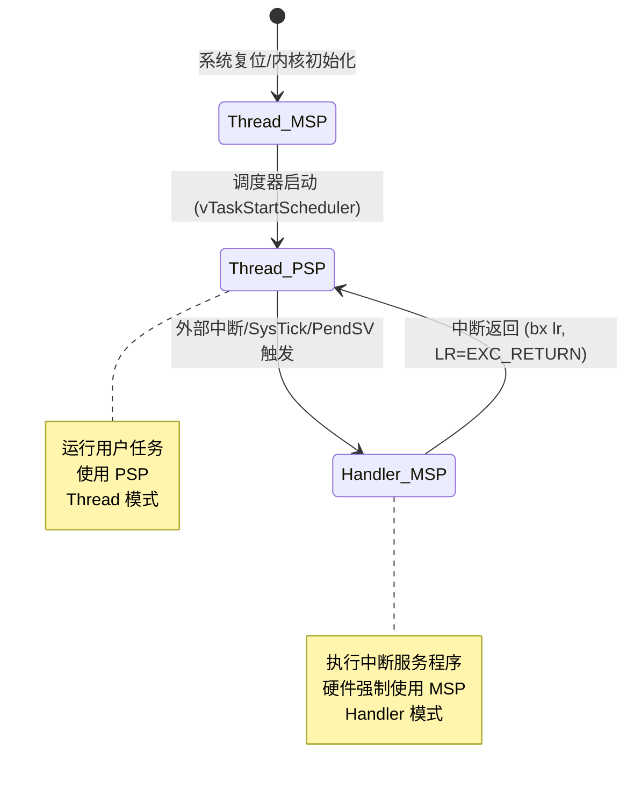

# 第一章：TCB 结构体与任务堆栈初始化

实时操作系统的基石在于任务现场的隔离与精准调度。在本章中，我们将深入探究 FreeRTOS 中用于描述任务的物理载体——**任务控制块（Task Control Block, TCB）**，并拆解 ARM Cortex-M 系列微控制器的双堆栈（MSP & PSP）硬件机制。最后，我们将详细推演在多任务启动或切换前，系统如何通过“伪造”一个包含特定寄存器序列的初始堆栈帧，使得硬件和调度器以完全一致的逻辑执行任务初始化。

---

## 1. 任务控制块（TCB）结构与内存映射

在 FreeRTOS 的内核设计中，每个任务都有且仅有一个对应的 TCB 结构体。该结构体的定义为 `tskTCB`（位于内核源码 `Source/tasks.c` 中）。虽然该结构体会根据 `FreeRTOSConfig.h` 中的宏配置（如是否启用任务通知、是否启用 MPU 内存保护、是否统计运行时性能指标等）而产生条件编译差异，但其最核心的成员关系到 CPU 寄存器指针的转换，是固定不移的。

### 1.1 `tskTCB` 核心结构体源码

以下展示了在通用 Cortex-M 处理器上应用时，`tskTCB` 结构体的关键成员声明：

```c
typedef struct tskTaskControlBlock
{
    /* 
     * 1. 任务栈顶指针 (Top of Stack)
     * 必须是结构体的第一个成员！
     * 指向当前任务在被挂起（或者未运行）时，其堆栈保存现场的最后边界。
     */
    volatile StackType_t *pxTopOfStack; 

    #if ( portUSING_MPU_WRAPPERS == 1 )
        /* MPU 内存保护单元设置，仅在开启 MPU 包装器时生效 */
        xMPU_SETTINGS xMpuSettings; 
    #endif

    /* 
     * 2. 任务状态列表项 (State List Item)
     * 用于将当前任务插入到就绪列表 (pxReadyTasksLists)、阻塞列表 (pxDelayedTaskList) 
     * 或者挂起列表 (xSuspendedTaskList) 中。
     */
    ListItem_t xStateListItem; 
    
    /* 
     * 3. 任务事件列表项 (Event List Item)
     * 当任务等待信号量、队列、事件组等内核对象时，
     * 会通过该列表项插入到对应内核对象的等待列表中。
     */
    ListItem_t xEventListItem; 
    
    /* 
     * 4. 任务优先级
     * uxPriority 记录当前任务的执行优先级（值越大，优先级越高）。
     * 调度器在选择下一次运行的任务时，总是选择就绪链表中该值最大的任务。
     */
    UBaseType_t uxPriority; 
    
    /* 
     * 5. 任务栈的起始地址
     * 指向分配给该任务的堆栈的物理起始内存（通常是分配的数组的首地址，即栈的最底端）。
     */
    StackType_t *pxStack; 
    
    /* 
     * 6. 任务名称
     * 仅在调试时使用，字符长度由 configMAX_TASK_NAME_LEN 宏决定。
     */
    char pcTaskName[ configMAX_TASK_NAME_LEN ]; 

    #if ( ( configUSE_MUTEXES == 1 ) || ( configUSE_RECURSIVE_MUTEXES == 1 ) )
        /* 
         * 7. 任务原始基优先级与持有的互斥锁计数
         * 用于支持优先级继承机制。
         */
        UBaseType_t uxBasePriority; /* 任务本来的优先级 */
        UBaseType_t uxMutexesHeld;  /* 当前任务所持有的互斥锁数量 */
    #endif

    /* ... 其他可选或辅助调度成员 */
} tskTCB;
typedef tskTCB TCB_t;
```

### 1.2 为什么 `pxTopOfStack` 必须位于偏移量 0 处？

在 `tskTCB` 的定义中，`pxTopOfStack` 被严格限定在结构体的最开始位置。这并非仅是为了排版整洁，而是因为在底层汇编代码中，调度器需要极其频繁地读写该成员：

*   **从 C 语言指针到汇编寻址**：在 C 语言中，一个指向 `tskTCB` 的指针（例如全局变量 `pxCurrentTCB`）在数值上等同于结构体首成员的内存地址。
*   **零偏移（Zero Offset）**：当汇编代码调用 `ldr r2, [r3]` 获取当前任务 TCB 指针并保存在 `R2` 中后，不需要进行任何额外的地址偏移计算，直接通过解引用 `R2`：`ldr r0, [r2]` 即可瞬间获取 `pxTopOfStack`（当前的栈顶位置）。这种“零偏移”设计能够省去 Cortex-M 汇编中的加法指令，在频繁的任务上下文切换中极大地节约了指令周期。

### 1.3 TCB 与任务栈的内存关系

在 Cortex-M 系列处理器中，**堆栈是向下生长（Full Descending Stack）的**。这意味着，栈底处于内存的最高地址，栈顶随着数据的压入不断向低地址推移。

```
                    +-----------------------------------------+
                    |        tskTCB (Task Control Block)      |
         +--------->+-----------------------------------------+
         |          | pxTopOfStack (指向当前任务栈顶)         |  <--- 偏移为 0 的首成员
         |          +-----------------------------------------+
         |          | xStateListItem (状态列表项)             |
         |          +-----------------------------------------+
         |          | uxPriority (当前优先级)                 |
         |          +-----------------------------------------+
         |          | pxStack (指向栈底，即栈的最低物理地址)   |
         |          +-----------------------------------------+
         |          | uxBasePriority (原始基优先级)           |
         |          +-----------------------------------------+
         |          | uxMutexesHeld (持有互斥锁数)            |
         |          +-----------------------------------------+
         |
         |
    物理内存布局:
    【低地址】                                                              【高地址】
    +-------------------+---------------------------------------------+---------+
    | 任务控制块 (TCB)  |              任务栈 (Stack)                 |  未定义 |
    |                   | <=== [压栈方向]                             |         |
    | (pxCurrentTCB)    | pxStack (低物理边界) ...... pxTopOfStack     |  栈底   |
    +-------------------+---------------------------------------------+---------+
```

---

## 2. Cortex-M 双堆栈指针机制

在常规裸机开发中，系统只使用一个堆栈指针 `SP`（对应物理上的主堆栈 MSP）。而对于现代多任务实时操作系统，若所有任务与中断 ISR 共享单堆栈，一旦某个任务发生过度递归导致栈溢出，就会彻底摧毁中断服务程序和操作系统内核。为此，ARM Cortex-M 架构在硬件层面引入了**双堆栈指针（Dual Stack Pointer）**机制。

### 2.1 MSP 与 PSP 的物理定义

虽然在指令集里我们都使用 `SP`（寄存器 `R13`）来读写堆栈，但在物理芯片内部，实际上存在着两个相互独立的堆栈指针寄存器：

1.  **MSP（Main Stack Pointer，主堆栈指针）**：
    *   **职责范围**：负责处理系统复位、所有的中断服务程序（ISR）、异常处理器以及操作系统调度器内核代码的执行。
    *   **安全屏障**：防止用户任务栈异常波及内核和中断系统。
2.  **PSP（Process Stack Pointer，进程堆栈指针）**：
    *   **职责范围**：专用于常规用户任务的栈。每个任务在运行时，其 `SP` 实际上指向它自己在 RAM 中分配的私有栈，此时该任务的局部变量、函数参数等皆保存在对应的 PSP 内存区中。

### 2.2 CONTROL 寄存器与 SP 硬件切换机制

CPU 决定当前运行的指令到底使用 MSP 还是 PSP，是由内核的特殊控制寄存器——**`CONTROL` 寄存器**来决定的。

```
     CONTROL 寄存器 (8-bit)
    +---+---+---+---+---+---+---------+---------+
    | - | - | - | - | - | - | SPSEL   | nPRIV   |
    |   |   |   |   |   |   | (Bit 1) | (Bit 0) |
    +---+---+---+---+---+---+---------+---------+
```

*   **`nPRIV`（第 0 位）**：定义线程模式下的特权等级。`0` 代表特权级（Privileged），`1` 代表非特权级（Unprivileged）。
*   **`SPSEL`（第 1 位）**：定义线程模式下使用的堆栈指针。
    *   `SPSEL = 0`：在 Thread 模式下使用 **MSP**。
    *   `SPSEL = 1`：在 Thread 模式下使用 **PSP**。
    *   *注意*：在 Handler 模式（即中断服务程序中），不管 `SPSEL` 的值是什么，硬件强制使用 **MSP**。

### 2.3 任务与中断的堆栈状态演变

在 FreeRTOS 正常运行时，微控制器的状态转移如下：



这种设计使得任务与中断执行环境完全解耦，中断发生时无需向任务栈中塞入硬实时中断运行所需的内部数据，从而降低了为每个任务预设栈深时的估算复杂度。

---

## 3. 上下文切换时的硬件与软件堆栈帧布局

当 CPU 响应一个挂起的中断（如 SysTick 或最低优先级的 PendSV 中断）时，为了在执行完中断代码后能够返回原来的任务处继续执行，它必须将当前的 CPU 寄存器现场保护起来。Cortex-M 设计了极其高效的**硬件与软件协同压栈**机制。

### 3.1 硬件自动压栈 (Auto-Stacking)

当响应异常时，在 CPU 跳转至中断向量入口执行第一条汇编指令之前，硬件会自动将以下 8 个寄存器（即 **基本异常帧 (Basic Exception Frame)**）顺次压入当前使用的堆栈（在执行任务时，当前堆栈为 **PSP**）：

1.  **xPSR**（程序状态寄存器）
2.  **PC**（Program Counter，指向中断返回后的下一条指令地址）
3.  **LR**（Link Register，在中断发生时会被改写为特殊的 `EXC_RETURN` 编码）
4.  **R12**（通用暂存寄存器）
5.  **R3**、**R2**、**R1**、**R0**（AAPCS 标准调用中用于传递参数和返回值的寄存器）

> [!IMPORTANT]
> 硬件自动压栈的行为是固定的，由微控制器内部微码自动控制。这是为了允许中断处理程序使用标准的 C 语言编写——由于 R0-R3, R12, LR, PC, xPSR 在进入 C 函数前已经被硬件自动保存，C 函数中随意修改这些寄存器都不会破坏原任务的状态。

### 3.2 软件手动压栈 (Manual-Stacking)

为了完全恢复一个任务的运行环境，仅保存硬件压栈的 8 个寄存器是不够的。CPU 还有其余 8 个通用寄存器 **`R4 - R11`** （称为被调用者保存寄存器，Callee-saved Registers）。这部分寄存器必须在 PendSV 汇编中，由程序员手动编写汇编代码压入 PSP。

### 3.3 带 FPU (浮点单元) 的额外压栈

如果使用的是 Cortex-M4F 或 Cortex-M7 且开启了硬件浮点运算单元，当发生中断时，如果检测到当前任务运行过浮点指令，硬件和软件还必须保存浮点寄存器：
*   **硬件自动保存**：`S0 - S15` 以及 `FPSCR` 寄存器。
*   **软件手动保存**：`S16 - S31` 寄存器。

### 3.4 完整上下文保存堆栈帧布局

以下是发生上下文切换、手动与自动压栈完全结束后的任务栈（PSP）内存映射：

```
                    【任务栈 (PSP) 内存分布】
     内存低地址 (栈顶)
    +-------------------+ <--- 最终的 pxTopOfStack 指向这里
    |      R4           | \
    +-------------------+  |
    |      R5           |  |
    +-------------------+  |
    |      R6           |  |
    +-------------------+  |
    |      R7           |  |--- 软件手动压栈 (Manual-Stacking)
    +-------------------+  |    由汇编代码进行 push 保存
    |      R8           |  |
    +-------------------+  |
    |      R9           |  |
    +-------------------+  |
    |      R10          |  |
    +-------------------+  |
    |      R11          | /
    +-------------------+
    |      R0           | \
    +-------------------+  |
    |      R1           |  |
    +-------------------+  |
    |      R2           |  |
    +-------------------+  |
    |      R3           |  |--- 硬件自动压栈 (Auto-Stacking)
    +-------------------+  |    由 CPU 核心在响应中断时自动压入
    |      R12          |  |
    +-------------------+  |
    |    LR (R14)       |  |
    +-------------------+  |
    |  PC (返回地址)    |  |
    +-------------------+  |
    |     xPSR          | /
    +-------------------+ <--- 任务创建时的初始栈顶位置
     内存高地址 (栈底)
```

---

## 4. 任务初始栈的构建机制与源码深度解析

当一个新任务通过 `xTaskCreate` 被创建时，它从未被执行过，也从未经历过“中断响应”的过程。为了能让调度器用统一的逻辑（在 PendSV 中执行出栈恢复）来启动这个任务，FreeRTOS 内核会在任务创建时，为该任务分配的堆栈空间里**伪造一个完全符合上述布局的初始栈帧**。

这一伪造过程在移植层文件 `portable/GCC/ARM_CM4F/port.c` 的 `pxPortInitialiseStack` 函数中实现。

### 4.1 `pxPortInitialiseStack` 源码剖析

```c
StackType_t *pxPortInitialiseStack( StackType_t *pxTopOfStack,
                                    TaskFunction_t pxCode,
                                    void *pvParameters )
{
    /* 
     * 1. 确保堆栈是 8 字节对齐的。
     * 根据 ARM AAPCS 标准，双字（64位）类型的数据（如 double、long long）
     * 必须存放在 8 字节对齐的内存上。在中断发生和进入 C 中断服务程序时，
     * SP 必须严格满足 8 字节对齐。
     */
    
    /* 2. 伪造硬件自动压栈部分 */
    
    /* 预留并设置 xPSR。T 位（Bit 24）必须置 1，以启用 Thumb 状态 */
    pxTopOfStack--;
    *pxTopOfStack = portINITIAL_XPSR; /* 0x01000000 */

    /* 预留并设置 PC。指向任务主体函数的入口地址 */
    pxTopOfStack--;
    *pxTopOfStack = ( StackType_t ) pxCode;

    /* 预留并设置 LR。指向任务退出清理函数 */
    pxTopOfStack--;
    *pxTopOfStack = ( StackType_t ) portTASK_RETURN_ADDRESS;

    /* 预留 R12, R3, R2, R1。由于是新任务，这些寄存器直接初始化为 0 */
    pxTopOfStack -= 5; /* 连续预留 5 个字的空间（R12, R3, R2, R1 和 R0） */
    
    /* 
     * 按照 AAPCS 调用约定，C 函数的第一个参数通过 R0 传递。
     * 任务函数的原型是 void vTaskCode( void * pvParameters )，
     * 为了在启动时将外部参数传入任务，我们必须将 pvParameters 写入伪造栈帧中 R0 所在的位置。
     */
    *pxTopOfStack = ( StackType_t ) pvParameters; /* 填充伪造的 R0 */

    #if ( configUSE_FPU == 1 )
    {
        /* 
         * 如果开启了硬件 FPU，硬件压栈还会包含 FPSCR 和 S0 - S15。
         * 我们必须将初始浮点状态寄存器 FPSCR 设为 0。
         */
        pxTopOfStack--;
        *pxTopOfStack = portINITIAL_FPSCR; /* 0 */
        
        /* 预留 S0 - S15 寄存器的空间（共 16 个 32位字） */
        pxTopOfStack -= 16;
    }
    #endif

    /* 3. 伪造软件手动压栈部分 (R4 - R11 以及特殊的 LR 压栈) */
    
    /* 
     * 在 Cortex-M4F 移植层中，为了让 PendSV 能够正确处理 FPU，
     * 软件压栈还会额外把 LR 的 EXC_RETURN 状态压栈。所以这里预留 8+1 个字。
     */
    pxTopOfStack -= 9;
    
    /* 
     * 为了方便仿真器（如 J-Link、ST-Link）在调试时清晰展示寄存器状态，
     * 我们用特定的 debug patterns（调试特征码）来初始化这部分寄存器。
     */
    pxTopOfStack[ 8 ] = portINITIAL_EXC_RETURN; /* 初始异常返回代码，不使用 FPU 时通常为 0xFFFFFFFD */
    pxTopOfStack[ 7 ] = 0x11111111UL;           /* 伪造的 R11 */
    pxTopOfStack[ 6 ] = 0x10101010UL;           /* 伪造的 R10 */
    pxTopOfStack[ 5 ] = 0x09090909UL;           /* 伪造的 R9  */
    pxTopOfStack[ 4 ] = 0x08080808UL;           /* 伪造的 R8  */
    pxTopOfStack[ 3 ] = 0x07070707UL;           /* 伪造的 R7  */
    pxTopOfStack[ 2 ] = 0x06060606UL;           /* 伪造的 R6  */
    pxTopOfStack[ 1 ] = 0x05050505UL;           /* 伪造的 R5  */
    pxTopOfStack[ 0 ] = 0x04040404UL;           /* 伪造的 R4  */

    #if ( configUSE_FPU == 1 )
    {
        /* 预留软件保存的浮点寄存器 S16 - S31 的空间（共 16 个字） */
        pxTopOfStack -= 16;
    }
    #endif

    /* 返回最终计算出的栈顶指针，存入 TCB 的 pxTopOfStack 中 */
    return pxTopOfStack;
}
```

### 4.2 核心初始化参数深度剖析

#### A. `portINITIAL_XPSR = 0x01000000`
Cortex-M 架构的 CPU 只能在 **Thumb 状态**下工作。在程序状态寄存器（`xPSR`）中，第 24 位是 **T 位（Thumb 状态位）**。
*   **硬件硬性约束**：若跳转执行某条指令时该位为 0（代表 ARM 32 位状态），CPU 将由于无法解析指令而当场触发 **UsageFault**。
*   **自愈设计**：伪造的 `xPSR` 初始值必须设为 `0x01000000`，强制将 T 位置 1，以确保任务首次运行时 CPU 处于正常的 Thumb 解译状态。

#### B. `portTASK_RETURN_ADDRESS` (任务退出地址)
新任务被剥离出无限循环后，如果强行退出，会由于弹出的 PC 寄存器无有效目标而跑飞。
*   在 FreeRTOS 中，`portTASK_RETURN_ADDRESS` 通常被定义为 `prvTaskExitError`。
*   如果在编写任务时，任务函数意外退出了它的死循环，就会执行到汇编的 `BX LR`，从而跳转到 `prvTaskExitError`。在该函数内部，内核会通过 `configASSERT( pdFALSE )` 阻断运行并关闭中断，从而起到安全刹车的作用。

#### C. `portINITIAL_EXC_RETURN = 0xFFFFFFFD`
`EXC_RETURN` 是 Cortex-M 处理器进入异常模式时，LR 被硬件强行改写的特殊值：
*   **`0xFFFFFFFD` 含义**：返回 Thread 模式，返回后使用进程堆栈指针（PSP），且返回帧不包含 FPU 数据。
*   当调度器首次调度该任务时，出栈汇编会读取这个伪造的值，并利用 `bx r14` 汇编指令退出中断，促使 CPU 硬件在退出异常时把堆栈指针从 MSP 切换到任务的 PSP，实现任务的平稳启动。

---

## 5. 本章总结

通过本章的深入探讨，我们理清了 FreeRTOS 任务的最核心数据结构 TCB 以及硬件层面的双堆栈运行机制。任务在未启动前，内核在其对应的栈中伪造了硬件压栈和软件压栈的连续数据块，并使 R0 正确指向了参数指针。

当下一次时钟滴答触发系统调度时，PendSV 异常处理器将会被唤醒，进而执行统一的现场恢复逻辑。下一章我们将正式跨入汇编层，一窥 `PendSV` 异常处理器的具体工作细节。
