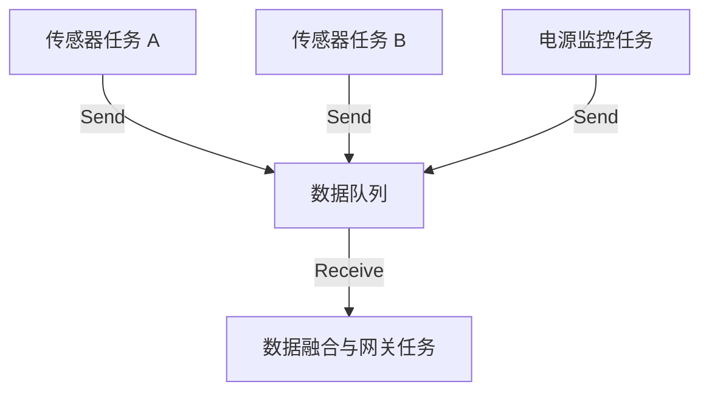

# 03 线程安全与典型通信场景最佳实践

在多任务并发的实时系统设计中，如何确保在多任务竞争、高频中断嵌套的极端环境下，数据依然能够保证完整性与实时响应？本章将围绕“多生产者-单消费者（MPSC）”架构与“中断到任务（ISR-to-Task）”通信这两个工业界最核心的场景，深度剖析其背后的线程安全设计与内核级调度机理。

---

## 1. 多生产者-单消费者（MPSC）架构设计

在复杂的嵌入式设备中，往往有多个不同的物理传感器采集任务（生产者），它们需要将采集到的数据统一发送给一个数据处理、保存或联网发送的任务（单消费者）。这种一对多、多对一的通信格局被称为 **MPSC（Multi-Producer Single-Consumer）**。



### 1.1 队列在 MPSC 下的线程安全保证
FreeRTOS 队列原生支持多任务写入。其内部所有的入队 API（如 `xQueueSend`）在修改队列状态前，都会通过**进入临界区**或**锁定队列**的方式，保证当前的写入动作是**排他的（Mutual Exclusive）**。

当多个任务同时尝试向同一个已满的队列发送数据时，内核会如何处理？
1.  **挂起阻塞**：这些发送任务会被放入队列控制块的 `xTasksWaitingToSend` 链表中。
2.  **优先级排队**：阻塞链表本身是**按优先级排序**的。优先级最高的发送任务排在链表最前面。
3.  **超时撤销**：当用户指定的阻塞超时（`xTicksToWait`）到达时，如果队列依然没有空位，定时器中断会将该任务从阻塞链表移回就绪链表，并使 `xQueueSend` 返回 `errQUEUE_FULL`。

---

## 2. 任务阻塞/唤醒机制的内核底物理过程

理解任务是如何进入阻塞，以及如何被重新唤醒的，对于优化系统的响应时间至关重要。

### 2.1 任务因读空队列进入阻塞的四步曲
当任务 A 调用 `xQueueReceive` 读取空队列且超时时间为 `10 Ticks` 时：
1.  **关闭中断/进入临界区**：锁定队列。
2.  **检查数据**：确认 `uxMessagesWaiting == 0`，且当前没有处于非阻塞状态的数据。
3.  **事件列表转移**：
    *   将任务 A 的事件列表项（`xEventListItem`）插入到队列的 `xTasksWaitingToReceive` 链表中（按优先级排序）。
    *   将任务 A 的状态列表项（`xStateListItem`）从当前就绪列表（`pxReadyTasksLists`）中移除。
4.  **定时器超时链表挂载**：
    *   计算唤醒时间点：$T_{\text{wake}} = T_{\text{current}} + 10$。
    *   将任务 A 的状态列表项插入到系统的延时任务列表（`xDelayedTaskList`）中。
    *   **触发调度（Yield）**：启动 PendSV 中断，切换至下一个就绪的最高优先级任务。

### 2.2 数据到达时的唤醒流程
当另一个任务 B 向队列写入数据，触发唤醒：
1.  **查找等待任务**：任务 B 入队成功后，检查队列的 `xTasksWaitingToReceive` 链表。发现任务 A 正在等待。
2.  **移出阻塞链表**：
    *   将任务 A 从队列的 `xTasksWaitingToReceive` 事件列表中移出。
    *   将任务 A 从系统的 `xDelayedTaskList` 超时链表中移出。
3.  **移入就绪列表**：将任务 A 插入到对应优先级的就绪列表（`pxReadyTasksLists[Priority_A]`）中。
4.  **抢占评估**：如果任务 A 的优先级高于任务 B，任务 B 将立即触发上下文切换，让任务 A 抢占执行。

---

## 3. 中断安全通信与 FromISR 机制深度解析

在中断服务程序（ISR）中，绝对**不能**调用任何会导致阻塞的任务级 API（例如普通的 `xQueueSend` 和 `xQueueReceive`）。因为 ISR 不是一个“任务”，它没有任务控制块（TCB），一旦被强行阻塞，将导致整个 MCU 挂死（Scheduler Crash）。

为此，FreeRTOS 专门设计了带 `FromISR` 后缀的中断安全 API。

### 3.1 为什么必须使用 FromISR API？
*   **不带阻塞超时机制**：`FromISR` API 没有 `xTicksToWait` 参数，一旦队列满或空，立即返回 `errQUEUE_FULL` 或 `pdFAIL`，绝不进入等待。
*   **专用的中断嵌套临界区保护**：任务级 API 使用 `taskENTER_CRITICAL()` 锁调度器或关全局中断；而 `FromISR` 使用 `portSET_INTERRUPT_MASK_FROM_ISR()`，仅屏蔽特定受 FreeRTOS 管理的优先级中断（即优先级低于 `configMAX_SYSCALL_INTERRUPT_PRIORITY` 的中断），不影响更高级的硬实时中断。
*   **延迟的任务唤醒通知机制**：ISR 中不能直接操作调度器。通过输出参数 `pxHigherPriorityTaskWoken` 来标记是否唤醒了更高优先级的任务。

### 3.2 pxHigherPriorityTaskWoken 指针与 PendSV 协同控制机制

当 ISR 往队列发送数据，恰好唤醒了一个优先级比当前被中断的任务更高的任务时，内核不会在 `xQueueSendFromISR` 内部立刻执行任务切换（因为此时处于中断上下文），而是将 `*pxHigherPriorityTaskWoken` 设为 `pdTRUE`。

在 ISR 退出之前，程序员必须显式调用上下文切换宏（例如 `portYIELD_FROM_ISR()` 或 `portEND_SWITCHING_ISR()`），向 Cortex-M 的 **PendSV** 寄存器写 1，挂起一个最低优先级的软中断。

当所有硬件中断执行完毕返回时，PendSV 异常被触发，在其服务程序中执行实际的寄存器压栈与出栈，实现任务切换。

```c
void USART1_IRQHandler( void )
{
    BaseType_t xHigherPriorityTaskWoken = pdFALSE; // 初始化为 pdFALSE
    uint8_t ucChar = USART1->DR;

    /* 发送数据到接收队列 */
    xQueueSendToBackFromISR( xRxQueue, &ucChar, &xHigherPriorityTaskWoken );

    /* 
     * 如果 xHigherPriorityTaskWoken 在入队后变为了 pdTRUE，
     * 说明有更高优先级的任务正在阻塞等待此队列，
     * 调用该宏将触发 PendSV 异常，中断退出时立刻进行任务切换。
     */
    portYIELD_FROM_ISR( xHigherPriorityTaskWoken );
}
```

---

## 4. 典型场景生产级代码实现

### 4.1 场景 A：MPSC 多元化传感器数据融合网关

在下例中，我们设计了一个网关，它从温度、气压和电池三个生产者任务中采集数据。每个传感器的数据类型和结构体大小各不相同，因此我们使用**标记联合体（Tagged Union）**，配合“值拷贝”，实现多生产者并发写入的安全通信。

```c
#include "FreeRTOS.h"
#include "task.h"
#include "queue.h"
#include <stdio.h>

/* 定义传感器数据类型枚举 */
typedef enum
{
    MSG_TYPE_TEMP,
    MSG_TYPE_PRES,
    MSG_TYPE_BATT
} MsgType_t;

/* 定义各传感器的特有结构体 */
typedef struct { float fTempCelsius; } TempPayload_t;
typedef struct { float fPressureHpa; } PresPayload_t;
typedef struct { uint8_t ucPercent; float fVoltage; } BattPayload_t;

/* 统一的网关报文包（带标签的联合体） */
typedef struct
{
    MsgType_t xType;
    TickType_t xTimeStamp;
    union
    {
        TempPayload_t xTemp;
        PresPayload_t xPres;
        BattPayload_t xBatt;
    } u;
} GatewayMsg_t;

/* 网关队列句柄 */
static QueueHandle_t xGatewayQueue = NULL;

/* 生产者 1：温度采样任务（高优先级，周期性） */
void vTempSensorTask( void * pvParameters )
{
    GatewayMsg_t xMsg;
    xMsg.xType = MSG_TYPE_TEMP;
    
    for( ;; )
    {
        xMsg.xTimeStamp = xTaskGetTickCount();
        xMsg.u.xTemp.fTempCelsius = 25.4f; // 模拟读取
        
        /* 写入网关队列，最长等待 10ms */
        if( xQueueSend( xGatewayQueue, &xMsg, pdMS_TO_TICKS( 10 ) ) != pdPASS )
        {
            // 写入失败，可能队列已满，记录错误计数
        }
        
        vTaskDelay( pdMS_TO_TICKS( 100 ) ); // 100ms 采样周期
    }
}

/* 生产者 2：电池电量监控任务（低优先级，低频） */
void vBattMonitorTask( void * pvParameters )
{
    GatewayMsg_t xMsg;
    xMsg.xType = MSG_TYPE_BATT;
    
    for( ;; )
    {
        xMsg.xTimeStamp = xTaskGetTickCount();
        xMsg.u.xBatt.ucPercent = 98;
        xMsg.u.xBatt.fVoltage = 4.15f;
        
        /* 写入网关队列，最长等待 50ms */
        if( xQueueSend( xGatewayQueue, &xMsg, pdMS_TO_TICKS( 50 ) ) != pdPASS )
        {
            // 失败处理
        }
        
        vTaskDelay( pdMS_TO_TICKS( 2000 ) ); // 2s 采样周期
    }
}

/* 单消费者：网关处理中心 */
void vGatewayProcessorTask( void * pvParameters )
{
    GatewayMsg_t xReceivedMsg;
    
    for( ;; )
    {
        /* 永久阻塞等待，直至任何一个传感器有数据送达 */
        if( xQueueReceive( xGatewayQueue, &xReceivedMsg, portMAX_DELAY ) == pdPASS )
        {
            switch( xReceivedMsg.xType )
            {
                case MSG_TYPE_TEMP:
                    printf( "[%u] Temp Event: %.2f C\n", 
                            (unsigned int)xReceivedMsg.xTimeStamp, 
                            xReceivedMsg.u.xTemp.fTempCelsius );
                    break;
                    
                case MSG_TYPE_PRES:
                    printf( "[%u] Pressure Event: %.2f hPa\n", 
                            (unsigned int)xReceivedMsg.xTimeStamp, 
                            xReceivedMsg.u.xPres.fPressureHpa );
                    break;
                    
                case MSG_TYPE_BATT:
                    printf( "[%u] Battery Level: %u%% (%.2fV)\n", 
                            (unsigned int)xReceivedMsg.xTimeStamp, 
                            xReceivedMsg.u.xBatt.ucPercent,
                            xReceivedMsg.u.xBatt.fVoltage );
                    break;
                    
                default:
                    configASSERT( pdFALSE ); // 异常防错
                    break;
            }
        }
    }
}

void vStartMPSC_Demo( void )
{
    /* 创建公共网关队列，深度为 10，存储 GatewayMsg_t 结构体数据 */
    xGatewayQueue = xQueueCreate( 10, sizeof( GatewayMsg_t ) );
    
    if( xGatewayQueue != NULL )
    {
        /* 创建生产者（传感器任务） */
        xTaskCreate( vTempSensorTask, "TempSens", 1024, NULL, 3, NULL );
        xTaskCreate( vBattMonitorTask, "BattMon", 1024, NULL, 1, NULL );
        
        /* 创建消费者（网关任务，优先级适中） */
        xTaskCreate( vGatewayProcessorTask, "Gateway", 2048, NULL, 2, NULL );
    }
}
```

### 4.2 场景 B：ISR-to-Task 串口驱动接收缓冲区

在下例中，模拟硬件 UART 的中断接收过程。当一个字符到达时，串口 ISR 被触发。ISR 通过安全 API 将接收到的数据压入接收队列，并在必要时挂起 PendSV 进行任务切换，从而让高优先级的命令行解析任务（CLI Task）立即响应。

```c
#include "FreeRTOS.h"
#include "task.h"
#include "queue.h"

/* 模拟串口寄存器定义 */
#define UART_STATUS_REG_RXNE_MASK   ( 1 << 5 )
typedef struct
{
    volatile uint32_t SR; /* 状态寄存器 */
    volatile uint32_t DR; /* 数据寄存器 */
} UART_TypeDef;

/* 假定的物理串口寄存器映射 */
#define USART1_BASE_ADDR   ((UART_TypeDef *) 0x40011000)

static QueueHandle_t xUartRxQueue = NULL;

/* 模拟 USART1 的硬件中断服务程序（ISR） */
void USART1_IRQHandler( void )
{
    BaseType_t xHigherPriorityTaskWoken = pdFALSE;
    UART_TypeDef * const pxUart = USART1_BASE_ADDR;

    /* 检查是否是读缓冲区非空中断（RXNE） */
    if( ( pxUart->SR & UART_STATUS_REG_RXNE_MASK ) != 0 )
    {
        /* 读取硬件数据寄存器，清除中断标志 */
        uint8_t ucByte = ( uint8_t ) ( pxUart->DR & 0xFF );

        /* 
         * 使用 FromISR 安全版本入队。
         * 注意：不能在 ISR 中阻塞，故无 Timeout 参数。
         */
        if( xQueueSendToBackFromISR( xUartRxQueue, &ucByte, &xHigherPriorityTaskWoken ) != pdPASS )
        {
            /* 队列已满，数据溢出处理（可自增全局丢包计数器） */
        }
    }

    /* 
     * 执行上下文切换决策：
     * 如果 xHigherPriorityTaskWoken 为 pdTRUE，说明等待接收字节的任务（如 vUartParserTask）
     * 其优先级高于当前被中断的任务，此宏将把 PendSV 悬起，确保退出中断后立即切入该任务。
     */
    portYIELD_FROM_ISR( xHigherPriorityTaskWoken );
}

/* 消费者：串口协议/数据流解析任务 */
void vUartParserTask( void * pvParameters )
{
    uint8_t ucRxByte;
    uint32_t ulBytesProcessed = 0;
    
    for( ;; )
    {
        /* 
         * 阻塞式读取：当没有数据时，完全不占用 CPU，进入 Blocked 状态。
         * 一旦中断送入字节，立刻被唤醒并继续执行。
         */
        if( xQueueReceive( xUartRxQueue, &ucRxByte, portMAX_DELAY ) == pdPASS )
        {
            /* 进行数据流解析或协议帧拼接 */
            ulBytesProcessed++;
            
            /* 假定接收到换行符，进行解析处理 */
            if( ucRxByte == '\n' )
            {
                // 处理一行完整的指令
                ulBytesProcessed = 0;
            }
        }
    }
}

void vStartUartDemo( void )
{
    /* 创建队列：大小为 64 字节，用于缓存高频串口输入 */
    xUartRxQueue = xQueueCreate( 64, sizeof( uint8_t ) );
    
    if( xUartRxQueue != NULL )
    {
        /* 创建高优先级解析任务，确保数据不丢失 */
        xTaskCreate( vUartParserTask, "UartParser", 1024, NULL, 5, NULL );
        
        /* 硬件层面的串口中断使能（模拟代码） */
        // UART_EnableInterrupt(USART1_BASE_ADDR, RXNE_INT);
    }
}
```
