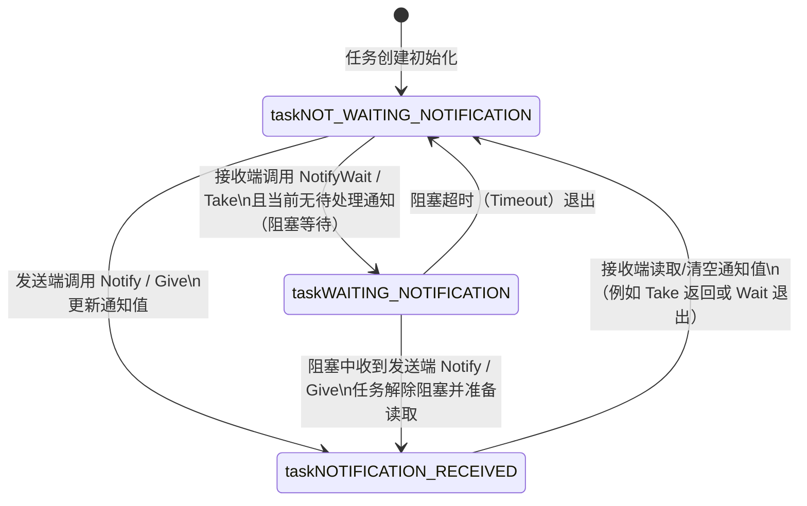
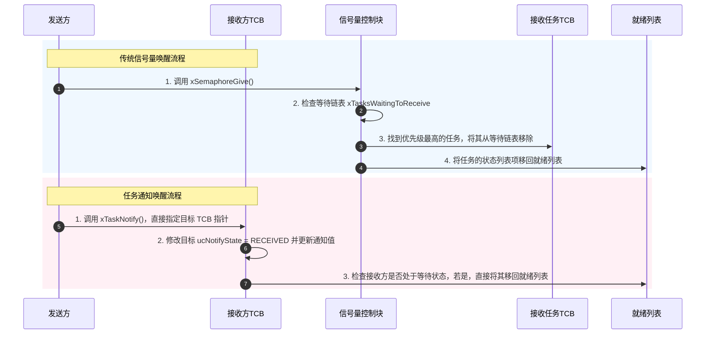

# 第一章：任务通知底层原理与内存模型

在深入学习 FreeRTOS 任务通知（Task Notifications）的 API 和应用场景之前，理解其底层的内存布局与内核运行机制至关重要。任务通知之所以能实现远超传统信号量和事件组的性能，关键在于其**“直达任务”**的设计哲学。

本章将从 FreeRTOS 内核源码的角度，深度剖析任务控制块（TCB）中任务通知的数据结构、状态机转移，以及内核在任务阻塞与唤醒时的链表操作。

---

## 1. 传统 IPC 与任务通知的内存对决

传统的 FreeRTOS 通信机制（如队列、信号量、事件组）均基于“中间对象”。在多任务或中断与任务之间进行同步时，必须先创建一个第三方的控制块。

### 1.1 信号量的内存与 CPU 开销
以二值信号量（Binary Semaphore）为例，创建信号量实际上是创建了一个队列结构体（`Queue_t`）。其内存和操作开销包括：
1. **动态内存分配**：需要从 FreeRTOS Heap 中分配 `sizeof(Queue_t)` 字节的 RAM（在 32 位系统上通常约为 80~120 字节，视内核配置而定）。
2. **事件链表管理**：`Queue_t` 中包含两个链表：`xTasksWaitingToSend`（等待发送任务列表）和 `xTasksWaitingToReceive`（等待接收任务列表）。当任务因为信号量不可用而阻塞时，内核需要将该任务的 `xEventListItem` 插入到信号量的等待列表中。
3. **互斥与临界区控制**：由于多个任务可以同时竞争同一个信号量，为了保证线程安全，信号量的获取和释放操作必须频繁使用进入/退出临界区或暂停/恢复调度器，这带来了显著的 CPU 耗时。

### 1.2 任务通知的“零内存”设计
任务通知摒弃了中间对象。它的核心思想是：**既然通知的目的地总是某个特定的任务，为什么不直接把状态和数据存在该任务的 TCB（Task Control Block）里呢？**

由于通知值直接嵌入在目标任务的 TCB 内，因此：
- **无动态内存开销**：在创建任务时，通知所需的变量与 TCB 一起被分配，无需在运行时动态创建信号量对象。
- **免除事件链表操作**：通知是单向且针对特定任务的。因为只有一个唯一的接收任务，所以**不需要维护“等待接收”的任务链表**。当接收任务因为没有通知而阻塞时，它只需要将自己挂入系统的延时链表（Delayed Task List），而不需要挂入任何 IPC 对象的事件链表。
- **极低的同步开销**：发送方直接修改接收方的 TCB 字段，并在必要时将接收方任务移回就绪列表。整个过程非常直接，避免了复杂的队列锁和多任务竞争判断。

---

## 2. TCB 结构体中的任务通知字段

在 FreeRTOS 中，若在 `FreeRTOSConfig.h` 中将 `configUSE_TASK_NOTIFICATIONS` 设为 `1`，任务控制块 `tskTCB`（定义在 `tasks.c` 中）内就会嵌入用于任务通知的成员变量。

自 FreeRTOS V10.4.0 版本起，任务通知升级为**支持多通道通知数组**。我们可以通过 `configTASK_NOTIFICATION_ARRAY_ENTRIES` 来配置一个任务拥有的独立通知通道数量（默认值为 1）。

以下是 `tasks.c` 中任务控制块 `TCB_t` 内与任务通知相关的核心定义（以支持数组的形式展示）：

```c
typedef struct tskTaskControlBlock
{
    /* ... 任务堆栈指针、状态列表项、事件列表项等其他 TCB 成员 ... */

    #if ( configUSE_TASK_NOTIFICATIONS == 1 )
        /* 任务的通知值数组。
         * 每个元素都可以单独作为二值信号量、计数信号量、事件组或邮箱使用。
         */
        volatile uint32_t ulNotifiedValue[ configTASK_NOTIFICATION_ARRAY_ENTRIES ];

        /* 任务的通知状态数组。
         * 用于记录每个通知通道的当前状态（无通知、等待通知、收到通知未处理）。
         */
        volatile uint8_t ucNotifyState[ configTASK_NOTIFICATION_ARRAY_ENTRIES ];
    #endif

    /* ... 其他 TCB 成员 ... */
} tskTCB;
```

### 2.1 内存占用量化
如果在 32 位 MCU（如 Cortex-M4）上运行 FreeRTOS，且 `configTASK_NOTIFICATION_ARRAY_ENTRIES` 配置为 `1`：
* `ulNotifiedValue[0]` 占用 4 字节。
* `ucNotifyState[0]` 占用 1 字节（通常由于结构体对齐，实际上会占用 4 字节，除非后面有其他字节类型的变量进行紧凑对齐）。
* 总体而言，TCB 的内存增量仅为 **4 到 8 字节**。

相比之下，一个最简单的二值信号量也需要约 80 字节的内核对象开销。这就是为什么任务通知被称为“轻量级”通信机制的核心原因。

---

## 3. 任务通知状态机机制

每个通知通道的状态 `ucNotifyState` 可以在以下三种状态之间进行流转。理解这三种状态是编写无 Bug 任务通知代码的根基：

1. **`taskNOT_WAITING_NOTIFICATION` (0)**：
   默认状态。表示当前任务没有阻塞在该通知通道上，也没有未读的通知。
2. **`taskWAITING_NOTIFICATION` (1)**：
   表示任务已经调用了接收 API（如 `xTaskNotifyWait` 或 `ulTaskNotifyTake`），但目前还没有收到通知。任务当前已处于阻塞态（Blocked），正等待其他任务或中断向它发送通知。
3. **`taskNOTIFICATION_RECEIVED` (2)**：
   表示有其他任务或中断向该任务发送了通知，但该任务尚未调用接收 API 来读取或清除该通知。即使接收任务此时没有处于等待状态，通知值也已被成功更新并保留。

### 3.1 状态转移图
以下是这三种状态在发送端与接收端操作下的状态转移过程：



> [!NOTE]
> 如果任务在调用接收 API 时，状态已经是 `taskNOTIFICATION_RECEIVED`，那么任务将不会进入阻塞状态，而是直接读取通知值，并将状态恢复为 `taskNOT_WAITING_NOTIFICATION`，然后立即继续执行。这确保了事件不会丢失。

---

## 4. 任务阻塞与唤醒的内核原理

为了讲透任务通知的优越性能，我们必须对比**信号量阻塞**与**任务通知阻塞**在内核链表操作上的差异。

### 4.1 传统信号量阻塞机制
当任务 $A$ 调用 `xSemaphoreTake(xSem, xTicksToWait)` 失败时，内核会执行以下操作：
1. 进入临界区，锁定队列。
2. 将任务 $A$ 的 `xEventListItem`（事件列表项）插入到信号量自身的等待链表 `xTasksWaitingToReceive` 中（按任务优先级排序）。
3. 将任务 $A$ 的 `xStateListItem`（状态列表项）从就绪列表（Ready List）移动到延时列表（Delayed Task List，即阻塞链表）。
4. 发生上下文切换。

由于涉及两个不同链表（信号量事件链表、系统延时链表）的插入与移除，且需要进行优先级排序，这属于 **$O(N)$** 时间复杂度的操作。

### 4.2 任务通知阻塞机制
当任务 $A$ 调用 `xTaskNotifyWait(..., xTicksToWait)` 且当前无通知时，内核执行的操作极其精简：
1. 进入临界区。
2. 将任务 $A$ 的 `ucNotifyState` 修改为 `taskWAITING_NOTIFICATION`。
3. **仅**将任务 $A$ 的 `xStateListItem` 从就绪列表（Ready List）移动到延时列表（Delayed Task List）。
4. 发生上下文切换。

**注意：这里完全没有把任务插入到任何 IPC 对象的事件列表中！** 因为根本没有这种外部对象。这使得阻塞过程少了至少一次复杂的双向链表插入操作，时间复杂度为 **$O(1)$**。

### 4.3 唤醒过程的对比
当发送方释放信号量或发送任务通知时，内核的处理逻辑如下：



从上述流程图可以看出，任务通知的唤醒直接越过了“查找等待链表”的步骤。因为发送方在调用 API 时，已经通过参数传入了目标任务的句柄（即指向目标 TCB 的指针），内核能够直接定位目标任务并修改其状态。这一特性极大地缩短了路径，在中断服务函数（ISR）中释放通知时尤为高效。

---

## 5. 多通道通知数组（v10.4.0+ 新特性）

在 FreeRTOS V10.4.0 之前，每个任务只能拥有一个通知值和状态。这意味着如果一个任务需要等待多个独立的事件源（例如：既要接收串口 DMA 完成通知，又要接收 ADC 采样完成通知），单通道通知就会遇到冲突，通常必须退而求其次使用事件组或信号量。

### 5.1 数组索引机制
引入多通道通知数组后，设计者可以为不同的事件源分配不同的数组索引（Index）：

```c
/* 举例：定义不同的通知通道索引 */
#define TASK_NOTIFY_INDEX_USART  0  // 串口事件通道
#define TASK_NOTIFY_INDEX_ADC    1  // ADC 事件通道
#define TASK_NOTIFY_INDEX_SYSTEM 2  // 系统管理通道
```

发送端和接收端在调用 API 时，只需传入对应的 `uxToIndex` 参数，即可在各自独立的通道上进行无干扰的同步：

* 串口 ISR 向通道 `0` 发送通知。
* ADC ISR 向通道 `1` 发送通知。
* 任务可以独立阻塞在通道 `0` 上，或者独立阻塞在通道 `1` 上。

这极大拓宽了任务通知的应用范围，甚至在很多场景下可以直接取代复杂的事件组（Event Groups）。在下一章中，我们将具体探讨如何使用这套 API 进行精细化的并发控制。
