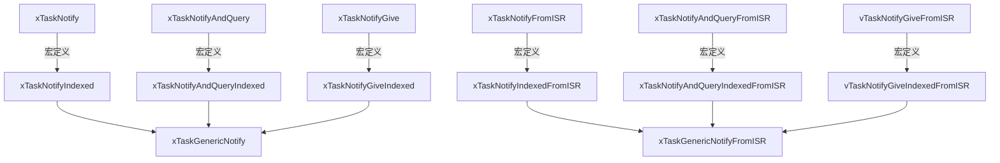

# 第二章：任务通知 API 操作与内核流转机制

FreeRTOS 提供了高度灵活且丰富细致的任务通知 API 接口。在日常开发中，选择合适的 API 及其对应的动作模式（`eNotifyAction`），能够帮助我们实现最契合业务场景的同步逻辑。

本章将对 FreeRTOS 任务通知的 API 体系进行全方位的深度剖析，深入内核源码分析其执行路径，并给出符合工业标准的生产级 C 语言示例。

---

## 1. 任务通知 API 家族概览

任务通知 API 大致可以分为三类：**通用发送 API**、**通用接收 API**，以及**针对信号量高度优化的简化版 API**。同时，所有支持多通道通知的 API 均带有 `Indexed` 后缀。

### 1.1 发送端 API 关系图
发送端的所有宏最终都会调用内核中的核心函数 `xTaskGenericNotify()`（在 `tasks.c` 中实现）：



---

## 2. 发送端核心 API 与 `eNotifyAction` 详解

通用发送函数的核心原型如下：

```c
BaseType_t xTaskNotifyIndexed( 
    TaskHandle_t xTaskToNotify,      /* 接收端任务的句柄 */
    UBaseType_t uxToIndex,           /* 通知通道的数组索引，0 ~ (configTASK_NOTIFICATION_ARRAY_ENTRIES - 1) */
    uint32_t ulValue,                /* 发送的通知值 */
    eNotifyAction eAction            /* 核心：通知动作模式 */
);
```

### 2.1 `eNotifyAction` 动作模式解析
这是决定任务通知如何修改接收端 TCB 中 `ulNotifiedValue` 的关键参数。它是一个枚举类型，包含以下选项：

| 枚举值 | 对应的行为描述 | 目标应用场景 | 返回值特性 |
| :--- | :--- | :--- | :--- |
| `eNoAction` | 仅将接收端的通知状态设为 `taskNOTIFICATION_RECEIVED`，不修改其通知值。`ulValue` 参数被忽略。 | **二值信号量**：只关注“事件是否发生”，不传递数据。 | 始终返回 `pdPASS`。 |
| `eIncrement` | 将接收端的通知值自增 1（即 `ulNotifiedValue++`）。`ulValue` 参数被忽略。 | **计数信号量**：记录事件发生的次数（如队列积压、包数统计）。 | 始终返回 `pdPASS`。 |
| `eSetBits` | 将接收端的通知值与 `ulValue` 进行按位或（`OR`）操作。即 `ulNotifiedValue \|= ulValue`。 | **事件组**：用不同位表示不同事件的发生，可实现多事件同步。 | 始终返回 `pdPASS`。 |
| `eSetValueWithOverwrite` | 强制将接收端的通知值改写为 `ulValue`。不管之前是否有未读通知。 | **邮箱（有覆写）**：传递最新数据（如传感器最新采样值），允许丢弃旧值。 | 始终返回 `pdPASS`。 |
| `eSetValueWithoutOverwrite` | 如果接收端当前没有未处理的通知，则将其通知值设为 `ulValue`；如果当前已有未处理通知（状态为 `taskNOTIFICATION_RECEIVED`），则不更新通知值，发送失败。 | **邮箱（无覆写）**：传递数据，但必须保证接收方处理完前一个数据后才能写入新数据。 | 成功返回 `pdPASS`；若因未处理而拒绝写入则返回 `pdFAIL`。 |

---

## 3. 接收端核心 API 详解

接收端最核心的通用阻塞函数是 `xTaskNotifyWaitIndexed()`：

```c
BaseType_t xTaskNotifyWaitIndexed(
    UBaseType_t uxToIndex,              /* 监听的通知通道索引 */
    uint32_t ulBitsToClearOnEntry,      /* 进入函数时，需要清除的通知值位（按位取反后进行 AND） */
    uint32_t ulBitsToClearOnExit,       /* 退出函数时，在保存输出后，需要清除的通知值位 */
    uint32_t *pulNotificationValue,     /* 指向 uint32_t 的指针，用于输出接收到的通知值 */
    TickType_t xTicksToWait             /* 最大阻塞等待时间 */
);
```

### 3.1 清零掩码（Clear On Entry / Exit）的设计精妙处
* **`ulBitsToClearOnEntry`**：在任务开始等待通知之前，将通知值中与该掩码对应的位置为 `0`。例如，设为 `0x01`，则进入时强行清除第 0 位。若设为 `0xFFFFFFFF`（或 `~0UL`），则会清空整个通知值。这有助于排除历史遗留事件干扰。
* **`ulBitsToClearOnExit`**：在任务收到通知、将通知值写入 `pulNotificationValue` 之后，但在函数返回之前，将通知值中与该掩码对应的位置为 `0`。
  * 若要将其用作**二值信号量**，通常将此参数设为 `0xFFFFFFFF`，即退出时彻底清空，确保下一次必须等待新通知。
  * 若要将其用作**事件组**，且只想消费掉某些已经处理的事件位，则传入对应的事件位掩码；若想保留其他未处理的位，可按需配置。

### 3.2 极简版 API：`ulTaskNotifyTakeIndexed`
在将任务通知用作信号量时，`xTaskNotifyWaitIndexed` 参数过于复杂。FreeRTOS 提供了专为信号量优化的极简 API：

```c
uint32_t ulTaskNotifyTakeIndexed(
    UBaseType_t uxToIndex, 
    BaseType_t xClearCountOnExit, 
    TickType_t xTicksToWait 
);
```

* **`xClearCountOnExit`**：
  * 若设为 `pdTRUE`（对应**二值信号量**）：如果收到通知，函数退出时会将目标通道的通知值**直接清零**。
  * 若设为 `pdFALSE`（对应**计数信号量**）：如果收到通知且通知值大于 0，函数退出时会将通知值**减 1**。
* **返回值**：返回**消费前**的通知值。如果超时退出且未收到通知，返回 0。

---

## 4. `xTaskGenericNotify` 内核源码剖析

为了彻底搞懂任务通知是如何被高效率执行的，我们来看一看 FreeRTOS 内核源码中 `xTaskGenericNotify()` 的核心逻辑骨架（精简了部分断言和多核对称多处理 SMP 的相关代码）：

```c
BaseType_t xTaskGenericNotify( TaskHandle_t xTaskToNotify,
                               UBaseType_t uxToIndex,
                               uint32_t ulValue,
                               eNotifyAction eAction,
                               uint32_t *pulPreviousNotificationValue )
{
    TCB_t * pxTCB;
    BaseType_t xReturn = pdPASS;
    uint8_t ucOriginalNotifyState;

    configASSERT( xTaskToNotify );
    configASSERT( uxToIndex < configTASK_NOTIFICATION_ARRAY_ENTRIES );

    /* 通过任务句柄，获取目标任务的 TCB 指针 */
    pxTCB = xTaskToNotify;

    taskENTER_CRITICAL();
    {
        /* 如果需要，保存更新前的通知值 */
        if( pulPreviousNotificationValue != NULL )
        {
            *pulPreviousNotificationValue = pxTCB->ulNotifiedValue[ uxToIndex ];
        }

        /* 获取当前的通知状态 */
        ucOriginalNotifyState = pxTCB->ucNotifyState[ uxToIndex ];

        /* 状态标记：现在该任务肯定收到了通知 */
        pxTCB->ucNotifyState[ uxToIndex ] = taskNOTIFICATION_RECEIVED;

        /* 根据指定的 eAction 执行不同的数值操作 */
        switch( eAction )
        {
            case eSetBits:
                pxTCB->ulNotifiedValue[ uxToIndex ] |= ulValue;
                break;

            case eIncrement:
                ( pxTCB->ulNotifiedValue[ uxToIndex ] )++;
                break;

            case eSetValueWithOverwrite:
                pxTCB->ulNotifiedValue[ uxToIndex ] = ulValue;
                break;

            case eSetValueWithoutOverwrite:
                if( ucOriginalNotifyState != taskNOTIFICATION_RECEIVED )
                {
                    pxTCB->ulNotifiedValue[ uxToIndex ] = ulValue;
                }
                else
                {
                    /* 已经有挂起的通知，且不允许覆写，返回失败 */
                    xReturn = pdFAIL;
                }
                break;

            case eNoAction:
                /* 仅改变状态为 taskNOTIFICATION_RECEIVED，不改变值 */
                break;

            default:
                /* 不合法的 Action */
                break;
        }

        /* 核心逻辑：如果目标任务之前阻塞在等待该通知通道上，则必须将其唤醒 */
        if( ucOriginalNotifyState == taskWAITING_NOTIFICATION )
        {
            /* 将其从事件列表中移除（如果由于其他原因挂入事件列表），
             * 并将任务的状态列表项移回就绪列表。
             */
            if( uxListRemove( &( pxTCB->xStateListItem ) ) == ( UBaseType_t ) 0 )
            {
                /* 如果移除后，该延时链表为空，则更新下一次解锁时间 */
                prvResetNextTaskUnblockTime();
            }

            /* 将目标任务插入到就绪列表中 */
            prvAddTaskToReadyList( pxTCB );

            /* 如果被唤醒的任务优先级高于当前正在运行的任务 */
            if( pxTCB->uxPriority > pxCurrentTCB->uxPriority )
            {
                /* 触发挂起 PendSV 中断，准备进行上下文切换 */
                taskYIELD_IF_USING_PREEMPTION();
            }
        }
    }
    taskEXIT_CRITICAL();

    return xReturn;
}
```

### 4.1 内核路径深度解析
1. **零链表检索**：在进入临界区后，内核完全不需要遍历任何等待链表。因为发送方已经给出了 `xTaskToNotify`（目标 TCB 指针），内核可以直接定位到 `pxTCB->ucNotifyState[ uxToIndex ]`。
2. **快速判断唤醒**：仅仅通过判断目标任务的旧状态是否为 `taskWAITING_NOTIFICATION`，即可决定是否需要唤醒它。
3. **就绪转移**：如果需要唤醒，直接将其 `xStateListItem` 从延时链表（或挂起链表）移除，并调用 `prvAddTaskToReadyList()` 插入对应的就绪链表。这一过程极其连贯，相比信号量的多层封装，执行路径短了近 60%。

---

## 5. 生产级开发示例：中断安全（FromISR）设计与上下文切换

在嵌入式开发中，最普遍的场景就是**在中断服务函数（ISR）中向某个接收任务发送通知**（如 DMA 传输完成、GPIO 边沿触发等）。

这里需要特别注意 `pxHigherPriorityTaskWoken` 的使用，这是确保 RTOS 实时性的关键。

### 5.1 典型场景：串口 DMA 接收任务
以下是一个完整的、可用于实际生产环境的代码结构，演示了如何在串口中断中利用任务通知唤醒数据解析任务：

```c
#include "FreeRTOS.h"
#include "task.h"

/* 声明任务句柄 */
static TaskHandle_t xDataProcessTaskHandle = NULL;

/* 串口 DMA 完成中断服务函数 */
void USART1_DMA_RX_IRQHandler( void )
{
    BaseType_t xHigherPriorityTaskWoken = pdFALSE;

    /* 清除中断标志位（硬件相关操作） */
    __HAL_DMA_CLEAR_FLAG( DMA1, DMA_FLAG_TC5 );

    if( xDataProcessTaskHandle != NULL )
    {
        /* 向数据解析任务发送通知（使用通道 0）
         * Action 使用 eNoAction，类似于二值信号量
         */
        xTaskNotifyIndexedFromISR( 
            xDataProcessTaskHandle,        /* 目标任务句柄 */
            0,                             /* 通道索引 0 */
            0,                             /* 值（eNoAction 下忽略） */
            eNoAction,                     /* 动作模式 */
            &xHigherPriorityTaskWoken      /* 用于检测是否需要上下文切换 */
        );

        /* 核心：如果被唤醒的任务优先级高于当前被中断的任务，
         * 则在退出中断时进行任务切换，避免实时性延误。
         */
        portYIELD_FROM_ISR( xHigherPriorityTaskWoken );
    }
}

/* 数据解析处理任务 */
void vDataProcessTask( void *pvParameters )
{
    ( void ) pvParameters;
    uint32_t ulNotificationValue;
    BaseType_t xResult;

    /* 记录当前任务的句柄，供中断服务函数使用 */
    xDataProcessTaskHandle = xTaskGetCurrentTaskHandle();

    for( ;; )
    {
        /* 阻塞等待通道 0 上的通知。
         * 进入时不清除任何位（0），退出时清空所有位（0xFFFFFFFF）以模拟二值信号量。
         * 阻塞时间：无限期等待（portMAX_DELAY）。
         */
        xResult = xTaskNotifyWaitIndexed(
            0,                          /* 通道索引 0 */
            0x00,                       /* Entry时清除的位 */
            0xFFFFFFFF,                 /* Exit时清除的位，即彻底清零 */
            &ulNotificationValue,       /* 接收通知值的变量指针 */
            portMAX_DELAY               /* 阻塞超时时间 */
        );

        if( xResult == pdTRUE )
        {
            /* 成功收到通知，执行数据解析业务逻辑 */
            ProcessReceivedData();
        }
        else
        {
            /* 超时处理（若未设置 portMAX_DELAY） */
        }
    }
}
```

> [!TIP]
> **关于 `portYIELD_FROM_ISR` 的核心考量**：
> 在 ISR 中，如果被通知任务的优先级高于当前正在执行的任务，`xTaskNotifyIndexedFromISR` 会将 `xHigherPriorityTaskWoken` 设为 `pdTRUE`。通过在中断退出前调用 `portYIELD_FROM_ISR()`，CPU 会在中断退出时直接切换到该高优先级任务执行，而不需要等待下一个 SysTick 时钟中断，这使得中断响应的抖动（Jitter）降到了最低。
