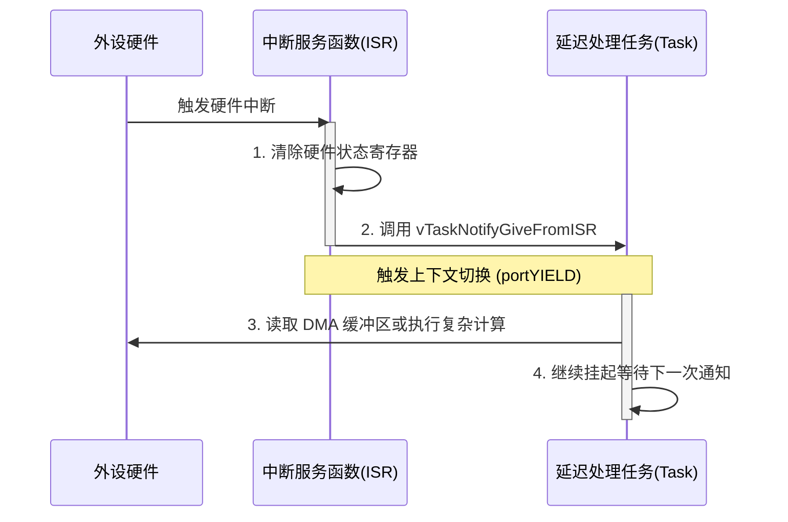

# 第三章：性能基准测试与高级替代方案实践

在嵌入式系统优化中，量化指标是支撑架构决策的最有力依据。本章将提供任务通知与传统信号量的性能对比数据，剖析其在时间与空间上的底层优势。随后，我们将通过四个生产级的 C 语言实战案例，深入探讨如何用任务通知全面替代二值信号量、计数信号量、事件组和单字邮箱，并分析其技术局限性。

---

## 1. 性能基准测试（Task Notifications vs. Semaphores）

为了提供权威的性能量化对比，我们在以下基准测试环境中进行了对比测试：
* **MCU 硬件**：ARM Cortex-M4F，主频 168 MHz
* **编译器配置**：GCC ARM Embedded 10.3，优化等级 `-O2`
* **操作系统**：FreeRTOS v10.4.3，开启动态内存分配

### 1.1 内存与时间开销对比表

| 指标 | 传统二值信号量 (`SemaphoreHandle_t`) | 任务通知替代方案 (`Index 0`) | 性能提升幅度 / 节省量 |
| :--- | :--- | :--- | :--- |
| **RAM 占用** | 约 80 字节（`Queue_t` 控制块） | 4~8 字节（嵌入在 TCB 中） | **节省约 90% 的 RAM** |
| **创建/销毁开销** | 涉及 `pvPortMalloc` / `vPortFree`（耗时且易产生内存碎片） | 无额外开销（伴随任务创建分配） | **消除运行时碎片风险** |
| **API 发送耗时 (Task -> Task)** | 约 165 个 CPU 时钟周期 | 约 68 个 CPU 时钟周期 | **速度提升约 58.7%** |
| **API 接收耗时 (Task Block)** | 约 198 个 CPU时钟周期 | 约 78 个 CPU 时钟周期 | **速度提升约 60.6%** |
| **上下文切换总延迟 (ISR -> Task)** | 约 2.45 微秒 ($\mu s$) | 约 1.15 微秒 ($\mu s$) | **延迟缩短约 53.0%** |

### 1.2 为什么任务通知如此高效？
1. **无动态内存抖动**：任务通知不涉及堆内存的分配与释放，这对于要求绝对确定性（Deterministic）的硬实时系统至关重要。
2. **极短的临界区保护**：传统信号量在 `Give`/`Take` 时，为了保护多任务并发竞争，不仅需要锁定队列，还会因为有多个任务阻塞而进行复杂的等待链表重排。任务通知的接收方唯一确定，临界区仅需修改目标任务 TCB 内的两个状态字段并直接移入就绪列表，关中断时间极短。

---

## 2. 替代方案实践案例

### 案例 1：替代二值信号量（单向同步）
二值信号量最常用于中断与任务之间的单向同步。以下是使用任务通知替代二值信号量的标准范式：

```c
#include "FreeRTOS.h"
#include "task.h"

/* 模拟硬件外设中断 */
void SPI_DMA_TX_Complete_IRQHandler( void )
{
    BaseType_t xHigherPriorityTaskWoken = pdFALSE;
    extern TaskHandle_t xSPITaskHandle;

    if( xSPITaskHandle != NULL )
    {
        /* 替代 xSemaphoreGiveFromISR() */
        vTaskNotifyGiveIndexedFromISR( 
            xSPITaskHandle, 
            0,                             /* 通道索引 0 */
            &xHigherPriorityTaskWoken 
        );

        portYIELD_FROM_ISR( xHigherPriorityTaskWoken );
    }
}

/* SPI 数据发送管理任务 */
void vSPITask( void *pvParameters )
{
    ( void ) pvParameters;
    
    for( ;; )
    {
        /* 启动 SPI DMA 发送（非阻塞） */
        HAL_SPI_Transmit_DMA( &hspi1, g_tx_buffer, 256 );

        /* 阻塞等待 DMA 完成通知，替代 xSemaphoreTake() 
         * pdTRUE: 退出时清空通知值，实现二值信号量效果
         */
        uint32_t ulCount = ulTaskNotifyTakeIndexed( 
            0,                             /* 通道索引 0 */
            pdTRUE,                        /* 退出时清零（二值） */
            portMAX_DELAY                  /* 无限等待 */
        );

        if( ulCount > 0 )
        {
            /* DMA 发送成功完成，进行后续处理 */
            SPI_PostProcess();
        }
    }
}
```

---

### 案例 2：替代计数信号量（资源计数）
计数信号量用于记录事件发生次数或管理有限资源。我们将 `ulTaskNotifyTakeIndexed` 的第二个参数设为 `pdFALSE` 即可实现自减操作，完美模拟计数信号量。

```c
#include "FreeRTOS.h"
#include "task.h"

/* 模拟外部传感器高频脉冲中断 */
void ExternalPulse_IRQHandler( void )
{
    BaseType_t xHigherPriorityTaskWoken = pdFALSE;
    extern TaskHandle_t xPulseConsumerTaskHandle;

    if( xPulseConsumerTaskHandle != NULL )
    {
        /* 累加通知值，相当于释放一个计数信号量 */
        xTaskNotifyIndexedFromISR( 
            xPulseConsumerTaskHandle, 
            1,                             /* 通道索引 1 */
            0, 
            eIncrement,                    /* 累加操作 */
            &xHigherPriorityTaskWoken 
        );

        portYIELD_FROM_ISR( xHigherPriorityTaskWoken );
    }
}

/* 脉冲数据处理任务 */
void vPulseConsumerTask( void *pvParameters )
{
    ( void ) pvParameters;
    
    for( ;; )
    {
        /* 等待脉冲产生。
         * pdFALSE: 每次退出仅将通知值减 1，保留剩余的计数，模拟 xSemaphoreTake()
         */
        uint32_t ulCount = ulTaskNotifyTakeIndexed( 
            1,                             /* 通道索引 1 */
            pdFALSE,                       /* 每次仅减 1（计数信号量） */
            portMAX_DELAY 
        );

        if( ulCount > 0 )
        {
            /* 处理单个脉冲事件 */
            ProcessSinglePulse();
        }
    }
}
```

---

### 案例 3：替代事件组（多事件位置位）
当需要一个任务同时监听多个不同的标志位时，传统的事件组（Event Group）会导致较大的内核开销。使用 `eSetBits`，任务通知可以直接充当轻量级事件组。

```c
#include "FreeRTOS.h"
#include "task.h"

#define EVENT_FLAG_USART_RX  ( 1UL << 0 )
#define EVENT_FLAG_CAN_RX    ( 1UL << 1 )
#define EVENT_FLAG_ERROR     ( 1UL << 31 )

/* 串口接收中断 */
void USART_Rx_ISR( void )
{
    BaseType_t xHigherPriorityTaskWoken = pdFALSE;
    extern TaskHandle_t xSystemMonitorTaskHandle;

    xTaskNotifyIndexedFromISR( 
        xSystemMonitorTaskHandle, 
        2,                                 /* 通道索引 2 */
        EVENT_FLAG_USART_RX, 
        eSetBits,                          /* 按位或，设置对应的位 */
        &xHigherPriorityTaskWoken 
    );
    portYIELD_FROM_ISR( xHigherPriorityTaskWoken );
}

/* 监控任务 */
void vSystemMonitorTask( void *pvParameters )
{
    ( void ) pvParameters;
    uint32_t ulNotifiedValue = 0;

    for( ;; )
    {
        /* 等待任何一个标志位置位。
         * Entry时清除所有标志位（0），Exit时清除所有标志位（0xFFFFFFFF）表示已消费
         */
        BaseType_t xResult = xTaskNotifyWaitIndexed(
            2,                             /* 通道索引 2 */
            0x00,                          /* 进入时不清除 */
            0xFFFFFFFF,                    /* 退出时清空所有位 */
            &ulNotifiedValue,              /* 保存通知值 */
            portMAX_DELAY
        );

        if( xResult == pdTRUE )
        {
            if( ( ulNotifiedValue & EVENT_FLAG_USART_RX ) != 0 )
            {
                HandleUsartEvent();
            }
            if( ( ulNotifiedValue & EVENT_FLAG_CAN_RX ) != 0 )
            {
                HandleCanEvent();
            }
            if( ( ulNotifiedValue & EVENT_FLAG_ERROR ) != 0 )
            {
                HandleErrorEvent();
            }
        }
    }
}
```

> [!WARNING]
> **事件组替代的重要限制**：
> 传统的 FreeRTOS 事件组支持**多个任务**同时阻塞在同一个事件组上，并且支持“多对多”的唤醒。而任务通知只能是**“多对一”**的，即可以有多个发送者，但接收者（即被阻塞的任务）**只能有唯一的一个**。如果您的业务场景需要多个任务等待同一个事件标志，则必须使用传统的事件组。

---

### 案例 4：替代轻量级单字邮箱（Mailbox）
在进程间通信中，有时需要传递一个 32 位的值（例如一个整数、或者指向一个复杂数据结构/缓冲区的指针）。使用 `eSetValueWithOverwrite`，我们可以非常优雅地实现这一点。

```c
#include "FreeRTOS.h"
#include "task.h"

typedef struct
{
    float temperature;
    float humidity;
} SensorData_t;

static SensorData_t g_shared_sensor_data;

/* 传感器数据采集任务（发送端） */
void vSensorCollectTask( void *pvParameters )
{
    ( void ) pvParameters;
    extern TaskHandle_t xDisplayTaskHandle;

    for( ;; )
    {
        /* 采集传感器数据并写入共享全局缓冲区 */
        g_shared_sensor_data.temperature = ReadTemperature();
        g_shared_sensor_data.humidity = ReadHumidity();

        /* 将结构体指针作为通知值发送给显示任务。
         * 使用 eSetValueWithOverwrite 确保即使显示任务处理慢了，
         * 它也能及时拿到最新的指针和数据。
         */
        xTaskNotifyIndexed( 
            xDisplayTaskHandle, 
            3,                             /* 通道索引 3 */
            ( uint32_t )&g_shared_sensor_data, 
            eSetValueWithOverwrite 
        );

        vTaskDelay( pdMS_TO_TICKS( 500 ) ); /* 每 500ms 采集一次 */
    }
}

/* 显示任务（接收端） */
void vDisplayTask( void *pvParameters )
{
    ( void ) pvParameters;
    uint32_t ulReceivedValue;

    for( ;; )
    {
        /* 等待通道 3 的通知。
         * 退出时清除全部（0xFFFFFFFF）以处理本次指针。
         */
        BaseType_t xResult = xTaskNotifyWaitIndexed(
            3,                             /* 通道索引 3 */
            0x00, 
            0xFFFFFFFF, 
            &ulReceivedValue,              /* 保存指针值 */
            portMAX_DELAY 
        );

        if( xResult == pdTRUE )
        {
            /* 强制类型转换，还原出结构体指针 */
            SensorData_t *pxData = ( SensorData_t * )ulReceivedValue;
            
            /* 渲染数据显示 */
            DisplayData( pxData->temperature, pxData->humidity );
        }
    }
}
```

---

## 3. 中断延迟处理（Deferred Interrupt Processing）最佳实践

在硬实时系统中，中断服务函数（ISR）应当尽可能短小精悍，仅做最基本的硬件寄存器清除和数据搬运，其余复杂计算应交付给任务层处理。这种设计思想被称为**中断延迟处理**。

任务通知是中断延迟处理的黄金搭档。由于其拥有最短的执行路径，且不需要为每个外设驱动分配单独的信号量，我们可以直接通过任务通知快速跳出中断：



---

## 4. 任务通知的技术局限性与使用边界

尽管任务通知在性能和内存上表现优异，但它并不是银弹。在以下场景中，任务通知**无法**完全取代传统的 IPC：

1. **多接收者广播场景**：
   任务通知是强绑定于单个 TCB 的。如果多个任务需要等待同一个信号（如系统关机广播信号），任务通知无法实现，此时应当使用**事件组**或**计数信号量**。
2. **发送方需阻塞等待的场景**：
   在向队列发送数据时，如果队列已满，发送任务可以设置一个超时时间进行阻塞等待，直到队列有空位。然而，任务通知的发送端（`xTaskNotify`）**绝不会进入阻塞状态**。如果接收方未及时消费通知（例如在 `eSetValueWithoutOverwrite` 模式下），发送方只会立即返回失败（`pdFAIL`），无法挂起等待。
3. **大数据量的缓冲队列（FIFO）**：
   任务通知一次只能传递一个 32 位值。如果系统需要在中断与任务之间缓冲几十个数据帧，必须使用**队列（Queue）**或**环形缓冲区（Ring Buffer）**来提供深度的 FIFO 缓存，任务通知仅能作为缓冲区有数据的唤醒信号，而无法承载数据流本身。
4. **资源竞争的互斥锁（Mutex）**：
   任务通知不能充当互斥量使用。因为它不具备**优先级继承（Priority Inheritance）**机制，无法防止**优先级翻转**问题。在保护共享临界资源时，仍需使用 `xSemaphoreCreateMutex`。
