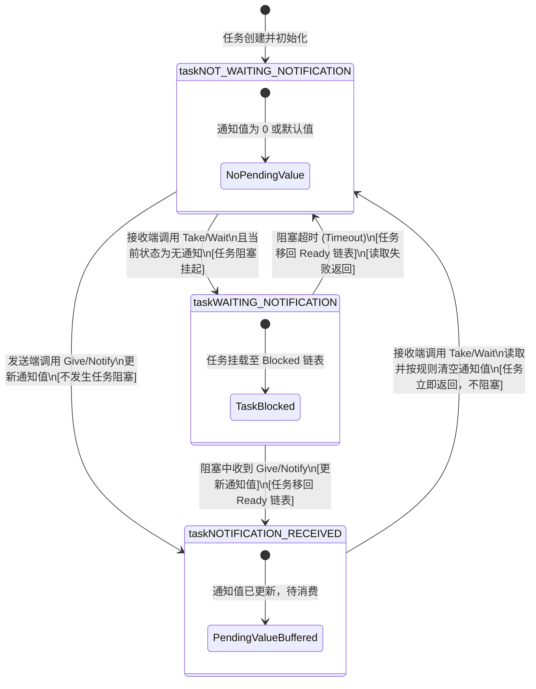

# 第一章：TCB 内部结构与任务通知内存模型

在深入学习 FreeRTOS 任务通知（Task Notifications）的 API 和应用场景之前，理解其底层的内存布局与内核运行机制至关重要。任务通知之所以能实现远超传统信号量和事件组的性能，关键在于其**“直达任务”**的设计哲学。

本章将从 FreeRTOS 内核源码的角度，深度剖析任务控制块（TCB）中任务通知的数据结构、多通道数组的内存模型，以及任务在收到直接通知时的状态转换流转机制。

---

## 1. 传统 IPC 内存模型与 TCB 嵌入的对比

在传统的 FreeRTOS 通信机制（如队列、信号量、事件组）中，任务间的同步依赖于一个独立的“中间内核对象”。而在任务通知中，同步所需的所有数据结构都被直接“内嵌”到任务自身的 TCB（Task Control Block）中。

以下是两种模型的内存架构对比：

### 1.1 传统 IPC 模型（以二值信号量为例）

当两个任务通过信号量进行同步时，必须先创建一个信号量对象。
- 信号量本质上是一个结构体 `Queue_t`。
- `Queue_t` 内部包含两个完整的双向循环链表：`xTasksWaitingToSend`（等待发送任务列表）和 `xTasksWaitingToReceive`（等待接收任务列表）。
- 每次任务调用 `xSemaphoreTake` 且信号量无效时，该任务的 `xEventListItem`（事件列表项）必须被插入到该信号量的 `xTasksWaitingToReceive` 链表中，并将任务自身的状态列表项 `xStateListItem` 移入系统延时链表（Blocked 链表）。

这种机制的开销在于：
1. **多重链表开销**：每个任务必须同时在系统延时链表和信号量事件链表中双重挂载。
2. **锁与临界区**：由于任何任务都可以尝试获取或释放同一个信号量，因此必须依赖队列锁（Queue Locks）和中断屏障来防止多任务并发竞争引起的竞态条件（Race Conditions）。

### 1.2 任务通知模型（TCB 嵌入式）

任务通知消除了中间件。当任务 A 想向任务 B 发送通知时，任务 A 直接通过任务 B 的句柄（即指向任务 B 的 TCB 指针），直接改写任务 B TCB 内预留的数个字节。
- **无等待接收链表**：因为接收方是唯一确定的（就是 TCB 所代表的那个任务），所以根本不需要在接收端维护一个“等待接收”的任务链表。
- **单向直接投递**：发送端不需要在任何“等待发送”的链表上挂起。任务通知的发送是不阻塞的（Non-blocking）。如果接收方未准备好，发送端只会更新数据或直接返回失败，而绝不会进入阻塞态。

---

## 2. TCB 中的任务通知字段与内存排布

在 FreeRTOS 中，若在 `FreeRTOSConfig.h` 中将 `configUSE_TASK_NOTIFICATIONS` 设为 `1`，任务控制块 `tskTCB`（定义在 `tasks.c` 中）内就会嵌入用于任务通知的成员变量。自 FreeRTOS V10.4.0 版本起，任务通知升级为支持**多通道通知数组**。

### 2.1 任务控制块 `TCB_t` 内部字段

```c
typedef struct tskTaskControlBlock
{
    /* ... 任务堆栈指针、状态列表项、事件列表项等其他 TCB 成员 ... */

    #if ( configUSE_TASK_NOTIFICATIONS == 1 )
        /* 任务的通知值数组。
         * 每个元素都可以单独作为二值信号量、计数信号量、事件组或邮箱使用。
         * 数组大小由编译宏 configTASK_NOTIFICATION_ARRAY_ENTRIES 决定。
         */
        volatile uint32_t ulNotifiedValue[ configTASK_NOTIFICATION_ARRAY_ENTRIES ];

        /* 任务的通知状态数组。
         * 用于记录每个通知通道的当前状态（无通知、等待通知、收到通知未处理）。
         */
        volatile uint8_t ucNotifyState[ configTASK_NOTIFICATION_ARRAY_ENTRIES ];
    #endif

    /* ... 其他 TCB 成员 ... */
} tskTCB;
```

### 2.2 TCB 数组内存布局图 (ASCII Art)

如果我们在 32 位 MCU（如 Cortex-M4）上运行 FreeRTOS，且配置 `configTASK_NOTIFICATION_ARRAY_ENTRIES = 2`（多通道通知数组），其 TCB 中的任务通知字段在内存中的紧凑排布方式如下：

```text
+-----------------------------------------------------------------------+
|                            TCB_t 结构体主体                           |
|  - pxTopOfStack (4 Bytes)                                             |
|  - xStateListItem (20 Bytes)                                          |
|  - xEventListItem (20 Bytes)                                          |
|  - uxPriority (4 Bytes)                                               |
|  - pxStack (4 Bytes)                                                  |
|  - pcTaskName (12 Bytes)                                              |
|  ... (其他前置字段)                                                   |
+-----------------------------------------------------------------------+
|  #if ( configUSE_TASK_NOTIFICATIONS == 1 )                            |
|                                                                       |
|  ulNotifiedValue 数组 (对齐至 4 字节边界):                            |
|  +-----------------------------------+-----------------------------+  |
|  |      ulNotifiedValue[0]           |      ulNotifiedValue[1]     |  |
|  |         (32-bit Value)            |         (32-bit Value)      |  |
|  |            4 Bytes                |            4 Bytes          |  |
|  +-----------------------------------+-----------------------------+  |
|                                                                       |
|  ucNotifyState 数组 (8-bit 元素):                                     |
|  +-----------------+-----------------+                             |  |
|  | ucNotifyState[0]| ucNotifyState[1]|                             |  |
|  |   (8-bit State) |   (8-bit State) |                             |  |
|  |     1 Byte      |     1 Byte      |                             |  |
|  +-----------------+-----------------+                             |  |
|                                                                       |
|  编译期内存对齐填充 (Padding Area):                                   |
|  +-----------------------------------+                             |  |
|  |        Padding Bytes (通常 2 字节) |                             |  |
|  +-----------------------------------+                             |  |
|  #endif                                                               |
+-----------------------------------------------------------------------+
|                            TCB_t 结构体尾部                           |
|  ...                                                                  |
+-----------------------------------------------------------------------+
```

> [!NOTE]
> 在 32 位处理器上，变量通常需要 4 字节对齐。虽然 `ucNotifyState` 数组中每个元素仅占用 1 字节（总共 2 字节），但编译器通常会在结构体尾部或下一个 32 位变量前自动插入 2 字节的 Padding 空间，以保证后续成员的 4 字节自然对齐。
>
> 总体来看，配置为 2 个通道的通知机制，其占用的额外 TCB RAM 空间仅为 `(4 * 2) + 2 + 2 (Padding) = 12` 字节。相比于创建两个独立的二值信号量（约 $80 \times 2 = 160$ 字节），内存节省达 92.5%。

---

## 3. 任务通知状态机变迁详解

每个通知通道拥有独立的状态机，状态记录在 `ucNotifyState[ uxToIndex ]` 中。内核定义了以下三种互斥状态（在 `tasks.c` 中定义）：

1. **`taskNOT_WAITING_NOTIFICATION` (0)**：
   默认初始状态。任务当前既没有被挂起等待该通道的通知，也没有未读的通知。
2. **`taskWAITING_NOTIFICATION` (1)**：
   等待状态。任务已调用了接收等待 API（如 `xTaskNotifyWait` 或 `ulTaskNotifyTake`），但由于目前还没有收到通知，任务已被放入系统的 Blocked（阻塞）链表，正处于阻塞等待中。
3. **`taskNOTIFICATION_RECEIVED` (2)**：
   有通知挂起状态。有其他任务或中断向该任务的这一通道发送了通知，但该任务此时正处于 Ready（就绪）或 Running（运行）态，尚未调用接收 API 来读取或清空此通知。即使任务稍后调用接收 API，它也不会进入阻塞，而是直接获取当前缓存的值并返回。

### 3.1 任务通知状态转移 flowchart

以下是三种核心通知状态在“发送端发送（Give/Notify）”与“接收端读取（Take/Wait）”动作下的具体转移关系图：



---

## 4. 任务状态与通知状态的双重流转过程

必须澄清的一个误区是：**任务通知状态（ucNotifyState）并不等同于任务本身的运行状态（Ready, Blocked, Running）。**
它们是相辅相成的双重状态机。以下详细梳理了当任务接收通知被挂起，再被发送端唤醒时，双重状态是如何同步演变的：

### 4.1 详细流转步骤 (Step-by-Step)

```text
+-------------------+      (1) 接收任务 A 调用 Wait API      +-------------------+
|   任务运行状态:    |     --------------------------->      |   任务运行状态:    |
|     RUNNING       |                                        |     BLOCKED       |
|   通知通道状态:    |      (内核将任务的 StateListItem       |   通知通道状态:    |
|   NOT_WAITING     |       移入延时链表，并修改通知状态)       |     WAITING       |
+-------------------+                                        +-------------------+
                                                                       |
                                                                       | (2) 任务 B/中断
                                                                       |     调用 Notify
                                                                       v
+-------------------+      (3) 调度器执行上下文切换          +-------------------+
|   任务运行状态:    |     <---------------------------      |   任务运行状态:    |
|      READY        |                                        |      READY        |
|   通知通道状态:    |      (内核将接收任务 A 移回就绪链表      |   通知通道状态:    |
|   NOT_WAITING     |       并在 Wait 退出前清空状态)        |    RECEIVED       |
+-------------------+                                        +-------------------+
```

1. **进入等待阶段**：
   任务 A（当前处于 `RUNNING` 状态，通知状态为 `taskNOT_WAITING_NOTIFICATION`）调用 `xTaskNotifyWaitIndexed(0, ...)`。
   - 内核发现当前 `ucNotifyState[0]` 是 `taskNOT_WAITING_NOTIFICATION`（无未读通知）。
   - 内核将任务 A 的 `ucNotifyState[0]` 修改为 `taskWAITING_NOTIFICATION`。
   - 内核将任务 A 的 `xStateListItem` 从就绪链表（Ready List）移除，并挂入系统的延时链表（Delayed Task List）。此时，任务 A 的运行状态转为 `BLOCKED`。
   - 触发一次 PendSV 上下文切换，CPU 转去执行其他就绪任务。

2. **触发唤醒阶段**：
   任务 B（或某个中断服务函数）执行，调用了 `xTaskNotifyIndexed(xTaskA, 0, ulVal, eSetBits)`。
   - 内核直接通过 `xTaskA` 句柄定位到任务 A 的 TCB，将 `ulNotifiedValue[0]` 按位或上 `ulVal`。
   - 内核读取到任务 A 的旧通知状态为 `taskWAITING_NOTIFICATION`，将其更新为 `taskNOTIFICATION_RECEIVED`。
   - 内核立即将任务 A 的 `xStateListItem` 从系统的延时链表移除，并插入到对应优先级的就绪链表（Ready List）中。此时，任务 A 的运行状态转为 `READY`。
   - 内核检查任务 A 的优先级是否高于当前运行的任务。如果是，则触发一次 PendSV 中断，准备进行抢占式上下文切换。

3. **消费返回阶段**：
   任务 A 重新获得 CPU 所有权，从 `RUNNING` 状态继续执行 `xTaskNotifyWaitIndexed` 的后半段逻辑。
   - 内核将 `ulNotifiedValue[0]` 拷贝至任务 A 传入的输出指针参数中。
   - 根据任务 A 设置的 `ulBitsToClearOnExit` 掩码，将 `ulNotifiedValue[0]` 的对应位清零。
   - 内核将 `ucNotifyState[0]` 从 `taskNOTIFICATION_RECEIVED` 恢复为 `taskNOT_WAITING_NOTIFICATION`。
   - 接收 API 函数返回 `pdTRUE`，任务 A 继续执行其用户业务逻辑。

在下一章中，我们将深入 FreeRTOS 源码，逐行剖析上述步骤在内核中的具体代码实现。
