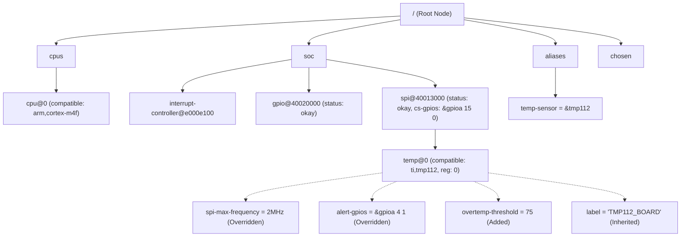

# 第一章：DTS 设备树语法与树状继承深度解构

设备树（Devicetree）是一种数据结构，其设计初衷是将板级硬件的物理细节从 C 语言内核及驱动代码中剥离出来。在 Zephyr 中，设备树的源文件采用类 C 语言的声明式语法，主要包含 `.dtsi`（包含文件，多用于芯片级/系列级描述）和 `.dts`（主文件，多用于评估板/主板级描述）两种文件格式。

---

## 1. 节点与属性的解剖

设备树是一个树状结构，由一个**根节点（Root Node, `/`）**开始，向下衍生出多个子节点（Subnodes）。每个节点都可以包含若干**属性（Properties）**，属性以“键-值”对（Key-Value）形式存在。

下面是一个标准的设备树节点声明示意图：

```dts
// 根节点
/ {
    #address-cells = <1>;
    #size-cells = <1>;

    // 子节点定义
    soc {
        #address-cells = <1>;
        #size-cells = <1>;
        compatible = "simple-bus";
        ranges;

        // 具有标签(Label)和单元地址(Unit Address)的外设节点
        usart1: serial@40013800 {
            compatible = "st,stm32-usart", "st,stm32-uart";
            reg = <0x40013800 0x400>;
            interrupts = <37 0>;
            clocks = <&rcc 0 10>;
            status = "okay";
        };
    };
};
```

### 1.1 节点命名规范
一个节点的完整标识格式为：
`[label:] node-name[@unit-address]`

* **节点标签 (Label, `usart1:`)**：可选。它会在 C 语言宏或其它 DTS 节点中充当该节点的“别名”。标签在全局必须唯一，是驱动代码引用特定节点最便捷的入口。
* **节点名称 (Node Name, `serial`)**：必须提供，用以描述该节点所代表的设备类别（如 `serial`、`gpio`、`spi`、`ethernet`）。为了标准化，通常推荐使用符合 IEEE 1275 规范的通用设备类别名称。
* **单元地址 (Unit Address, `@40013800`)**：可选，但在描述具有物理寄存器基地址的外设时是必填项。它必须与该节点 `reg` 属性中填写的第一个物理寄存器基地址完全一致。

### 1.2 关键属性详析
属性是节点的数据内容。在 Zephyr 中，以下属性具有系统级的重要意义：

* **`compatible` (兼容属性)**：
  数据类型为字符串列表（`string-list`）。它是驱动匹配的核心纽带。系统通过该属性在 Bindings 目录中搜寻对应的 YAML 配置文件，进而得知该节点有哪些合法属性。例如，`compatible = "st,stm32-usart", "st,stm32-uart";` 意味着系统会优先尝试匹配 `st,stm32-usart` 的绑定和驱动，若未找到，则向后兼容匹配 `st,stm32-uart`。
* **`reg` (寄存器描述)**：
  数据类型为以逗号/空格分隔的单元组（`cells`）。用于指定该外设的物理寄存器基地址和地址空间长度。其解析方式由其父节点的 `#address-cells` 与 `#size-cells` 共同决定。
* **`status` (节点使能状态)**：
  数据类型为字符串。常用的取值包括：
  * `"okay"`：节点被激活，Zephyr 编译工具链会为该节点生成设备实例化宏，驱动层会对它进行初始化。
  * `"disabled"`：节点未激活。虽然工具链会解析该节点，但**不会**为其生成用于驱动实例化的宏，驱动初始化代码会将其忽略。
  * `"reserved"`：表示该物理地址已被其他固件（如 Secure World 固件）占用，不可被当前 OS 使用，但节点属性仍保留。
* **`interrupts` (中断信息)**：
  描述外设触发的中断号、中断优先级及触发类型（电平/边沿触发等）。具体包含多少个 cell，由该外设关联的**中断控制器节点**中的 `#interrupt-cells` 决定。

---

## 2. 地址空间翻译与单元元数据

在设备树中，数值型属性（特别是 `reg`）是以一串 32 位无符号整型（Cell）来表示的。那么如何正确解读这串整型呢？这需要依赖父节点定义的两个元数据属性：

* **`#address-cells`**：指示子节点的 `reg` 属性中，物理基地址（Address）部分占用多少个 32 位 cell。
* **`#size-cells`**：指示子节点的 `reg` 属性中，地址空间大小/长度（Size）部分占用多少个 32 位 cell。

### 地址翻译机制示意：

```
父节点
  ├── #address-cells = <1>;  --> 子节点的 reg 中地址部分占 1 个 cell
  ├── #size-cells = <1>;     --> 子节点的 reg 中大小部分占 1 个 cell
  │
  └── 子节点 (例如 32位系统外设)
        └── reg = <0x40013800 0x400>; 
                   ^~~~~~~~~~ ^~~~~ 
                   基地址(1 cell) 长度(1 cell)

父节点 (例如 64位 SoC 或支持 PAE 寻址的父节点)
  ├── #address-cells = <2>;  --> 基地址占 2 个 cell
  ├── #size-cells = <2>;     --> 长度占 2 个 cell
  │
  └── 子节点 (例如 PCIe 设备或 64位外设)
        └── reg = <0x00000008 0x80000000 0x00000000 0x10000000>;
                   ^~~~~~~~~~~~~~~~~~~~  ^~~~~~~~~~~~~~~~~~~~~
                     64位基地址 (2 cells)     64位长度大小 (2 cells)
```

在多级总线嵌套的芯片架构中（如根节点 -> PCIe 控制器 -> PCIe 外设），子节点可能处于与系统主存储空间不同的地址空间。这时，父节点通过 **`ranges` 属性** 来执行地址翻译，将子总线地址转换为父总线的物理地址。如果 `ranges` 属性为空（如 `ranges;`），则代表子节点的地址空间与父节点完全一致，不需要进行任何平移。

---

## 3. 设备树的树状继承与 Overlay 机制

Zephyr 的设备树具备强大的**多级重载与合并能力**。这种机制允许我们针对相同的 SoC 编写不同的开发板配置文件，甚至在同一个应用项目里通过临时覆盖配置来改变硬件参数，而无需触碰系统的核心配置文件。

### 3.1 DTS 编译合并顺序
在编译一个 Zephyr 项目时，CMake 会按照自底向上的顺序，读取并合并以下设备树文件：

1. **SoC 级设备树 (`<soc>.dtsi`)**：定义芯片的基础外设（CPU 架构、FLASH/RAM 物理基地址、中断控制器、UART、SPI 等控制器的物理信息）。这部分是由芯片厂商提供的底座。
2. **Board 级设备树 (`<board>.dts`)**：引用并继承芯片的 `<soc>.dtsi`，根据电路板的实际走线，补充外设节点。例如：哪些串口接出了引脚、外部晶振频率、板载 LED 的 GPIO 编号、板载 SPI flash 的容量等。
3. **Application 级重载 (`app.overlay`)**：在应用程序项目根目录下创建。它可以在不修改 Board DTS 的情况下，临时改写板级配置。例如在特定 App 中将 UART2 的波特率从 115200 调高至 921600，或者将某个引脚配置为普通的 GPIO 从而不再充当 PWM 引脚。

### 3.2 节点合并规则（Overriding & Merging）
合并解析器在读取上述层级的文件时，如果发现相同的节点路径，会执行以下合并操作：
* **新增属性**：若重写节点中包含旧节点没有的属性，该属性将被添加到节点中。
* **覆盖属性**：若属性键名冲突，后者（如 `app.overlay` 中的值）将无条件覆盖前者（如 `<board>.dts` 中的值）。
* **追加或修改 label**：新 label 将与老 label 并存，均指向同一个物理节点。

---

## 4. 生产级 DTS 拓扑结构案例

为了全面展示这套继承合并逻辑，我们构建一个模拟的嵌入式系统硬件描述拓扑：
* **芯片级 (`acme_soc.dtsi`)**：定义 CPU 核心、系统总线、GPIO 控制器及一个 SPI 控制器核心。
* **开发板级 (`acme_devkit.dts`)**：继承芯片级定义，使能 SPI，并声明其挂载了一个外部温度传感器。
* **应用级 (`app.overlay`)**：在最终部署应用时，通过 overlay 动态修改温度传感器的工作模式并改变 GPIO 引脚属性。

### 4.1 芯片级：`acme_soc.dtsi`
```dts
/ {
    #address-cells = <1>;
    #size-cells = <1>;

    cpus {
        #address-cells = <1>;
        #size-cells = <0>;
        cpu0: cpu@0 {
            device_type = "cpu";
            compatible = "arm,cortex-m4f";
            reg = <0>;
        };
    };

    soc {
        compatible = "simple-bus";
        #address-cells = <1>;
        #size-cells = <1>;
        ranges;

        nvic: interrupt-controller@e000e100 {
            compatible = "arm,v7m-nvic";
            reg = <0xe000e100 0xc00>;
            interrupt-controller;
            #interrupt-cells = <2>;
        };

        gpioa: gpio@40020000 {
            compatible = "acme,gpio-controller";
            reg = <0x40020000 0x400>;
            interrupts = <16 1>;
            gpio-controller;
            #gpio-cells = <2>;
            status = "disabled";
        };

        spi1: spi@40013000 {
            compatible = "acme,spi-host";
            reg = <0x40013000 0x400>;
            interrupts = <35 2>;
            #address-cells = <1>;
            #size-cells = <0>;
            status = "disabled";
        };
    };
};
```

### 4.2 开发板级：`acme_devkit.dts`
```dts
#include "acme_soc.dtsi"

/ {
    model = "Acme Developer Kit V1";
    compatible = "acme,devkit-v1";

    aliases {
        temp-sensor = &tmp112;
    };

    chosen {
        zephyr,console = &uart1_fake;
    };
};

&gpioa {
    status = "okay";
};

&spi1 {
    status = "okay";
    cs-gpios = <&gpioa 15 0>; // 使用 GPIOA Pin 15 作为 SPI 片选引脚

    tmp112: temp@0 {
        compatible = "ti,tmp112";
        reg = <0>; // SPI 片选索引 0
        spi-max-frequency = <1000000>; // 1 MHz
        alert-gpios = <&gpioa 4 0>;
        label = "TMP112_BOARD";
    };
};
```

### 4.3 应用程序重载级：`app.overlay`
```dts
// 修改 SPI 传感器的工作频率以及警报 GPIO 极性
&tmp112 {
    spi-max-frequency = <2000000>; // 提速至 2 MHz
    alert-gpios = <&gpioa 4 1>;     // 将引脚高低电平极性标志改为反相
    overtemp-threshold = <75>;      // 新增一个自定义的应用属性
};
```

---

## 5. 合并后的拓扑树状模型

在解析器完成对这三个文件的合并处理后，在内存中最终生成的抽象语法树（AST）拓扑结构如下：



在下一章中，我们将深入探讨 Zephyr 究竟如何根据这棵物理拓扑树，通过 Bindings 约束文件校验其属性，并一步步输出我们在 C 语言中能调用的宏定义。
