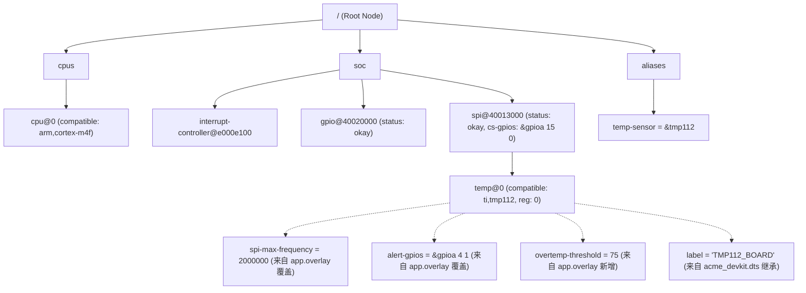

# 第一章：DTS 设备树语法与树状继承深度解构

设备树（Devicetree）是一种用于描述硬件物理特性的树状声明式数据结构。它的初衷是将板级硬件的细节配置（如寄存器基地址、中断分配、GPIO 引脚映射）从 C 语言内核及驱动中彻底剥离。在 Zephyr 中，设备树源文件主要有两种格式：`.dtsi`（多用于芯片级或系列级的基础外设定义）和 `.dts`（用于具体的开发板或主板级物理硬件拓扑描述）。

---

## 1. 节点与属性的解剖

设备树是一个以**根节点（Root Node, `/`）**为始的树状拓扑结构。树上的每一个分支或叶子被称为**子节点（Subnode）**。每个节点内都包含一系列的**属性（Properties）**，它们是以“键-值对（Key-Value）”形式存在的声明。

### 1.1 设备树物理节点结构示意图

```
                / (根节点)
                ├── aliases { ... } (全局别名节点)
                ├── chosen { ... } (系统指定外设节点)
                └── soc { (外设总线节点)
                      ├── nvic: interrupt-controller@e000e100 { ... }
                      └── usart1: serial@40013800 { (具体的串口物理外设)
                            ├── compatible = "st,stm32-usart";
                            ├── reg = <0x40013800 0x400>;
                            └── status = "okay";
                      }
                }
```

下面是一个标准的设备树节点声明的 DTS 源码示例：

```dts
/* 根节点声明 */
/ {
    #address-cells = <1>; /* 表示子节点的 reg 属性中，物理基地址占用 1 个 32-bit cell */
    #size-cells = <1>;    /* 表示子节点的 reg 属性中，地址空间大小占用 1 个 32-bit cell */

    /* 模拟系统外设总线节点 */
    soc {
        #address-cells = <1>;
        #size-cells = <1>;
        compatible = "simple-bus"; /* 表示该节点是一个简单总线，其子节点物理地址可以直接翻译到 CPU 空间 */
        ranges;                    /* 声明子节点物理地址与父节点一致，无需地址转换 */

        /* 串口外设节点定义，具有 Label (usart1) 和单元地址 (@40013800) */
        usart1: serial@40013800 {
            compatible = "st,stm32-usart", "st,stm32-uart"; /* 兼容性匹配链，从左到右匹配优先级递减 */
            reg = <0x40013800 0x400>;                      /* 基地址为 0x40013800，长度为 0x400 字节 */
            interrupts = <37 0>;                           /* 绑定中断号为 37，中断优先级为 0 */
            clocks = <&rcc 0 10>;                          /* 指向 rcc 时钟源控制节点的引用，并带有参数 */
            status = "okay";                               /* 节点使能状态，okay 表示激活该外设 */
        };
    };
};
```

### 1.2 节点命名规范

一个节点的完整声明格式如下：
```
[label:] node-name[@unit-address]
```

* **节点标签 (Label, `usart1:`)**：可选。标签在 DTS 全局中必须是唯一的。它扮演着“指针/别名”的角色。在 C 语言宏调用或者设备树其他位置引用此节点时，通过标签引用（如 `&usart1`）能避免书写繁琐的绝对路径，从而提高维护效率。
* **节点名称 (Node Name, `serial`)**：必须提供。它用以描述该硬件外设的通用类别（例如 `serial` 代表串口，`gpio` 代表通用输入输出口，`spi` 代表串行外设接口）。推荐使用符合 IEEE 1275 标准的通用缩写词。
* **单元地址 (Unit Address, `@40013800`)**：可选。在描述具有物理寄存器基地址的外设节点时，单元地址是**必填**的。在硬件规范中，单元地址必须与该节点 `reg` 属性中声明的第一个物理寄存器基地址完全一致。

### 1.3 关键核心属性详析

* **`compatible` (兼容性匹配列表)**：
  类型为字符串列表（`string-list`）。这是设备树与底层驱动代码之间最核心的匹配纽带。在编译期，Zephyr 解析器会提取节点的 `compatible` 值，在系统的 YAML 绑定文件（Bindings）库中搜寻对应的 Schema 配置。当声明了多个兼容性字符串时（如 `"st,stm32-usart", "st,stm32-uart"`），构建系统会按照自左向右的顺序进行优先级检索，第一个成功匹配的 Binding 将会被使用。
* **`reg` (物理寄存器地址与长度)**：
  类型为以空格/逗号分隔的单元组（`cells`）。用于描述该外设的物理寄存器映射基地址（Base Address）以及该寄存器块占用的空间大小（Range Length）。
* **`status` (外设使能状态控制)**：
  数据类型为字符串，决定了外设节点的最终编译行为：
  * `"okay"`：节点被激活。构建系统会为该外设生成 C 语言实例化的配置宏，驱动程序会被加载并执行其初始化函数。
  * `"disabled"`：节点未激活。虽然工具链仍会对其进行语法和属性合法性校验，但**不会**为该外设生成驱动实例化宏，驱动层也不会分配任何 RAM 或执行初始化。
  * `"reserved"`：表示该物理地址已被其他固件（如 Secure World 固件或 Trusted Firmware-M）占用，不可被当前 OS 使用，但节点属性仍保留。
* **`interrupts` (中断描述元组)**：
  描述外设触发的中断号、中断优先级及触发类型（电平/边沿触发等）。具体包含多少个 cell，由该外设关联的**中断控制器节点**中的 `#interrupt-cells` 决定。

---

## 2. 地址空间翻译与单元元数据

在设备树中，数值型属性（尤其是 `reg`）是由一系列 32 位无符号整型（Cell）组合而成的。要想正确地解析出“哪几个 Cell 组成基地址”、“哪几个 Cell 组成长度”，必须依赖其父节点中定义的两个元数据属性：

* **`#address-cells`**：指示子节点的 `reg` 属性中，物理基地址（Address）部分占用多少个 32 位 cell。
* **`#size-cells`**：指示子节点的 `reg` 属性中，地址空间大小/长度（Size）部分占用多少个 32 位 cell。

### 地址翻译机制物理拆解

```
+-------------------------------------------------------------------------------+
| 情况一：标准 32 位 MCU (基地址与长度各占 1 个 Cell)                           |
| 父节点:                                                                       |
|   #address-cells = <1>;                                                       |
|   #size-cells = <1>;                                                          |
|                                                                               |
| 子节点 (如 32位 MCU 的 USART 寄存器):                                         |
|   reg = <0x40013800 0x00000400>;                                              |
|          │          │                                                         |
|          ▼ (1 cell) ▼ (1 cell)                                                |
|       基地址      大小长度 (1024 字节)                                        |
+-------------------------------------------------------------------------------+

+-------------------------------------------------------------------------------+
| 情况二：64 位 SoC 或支持 PAE 寻址的外设 (基地址占 2 个 Cell，长度占 1 个 Cell) |
| 父节点:                                                                       |
|   #address-cells = <2>;                                                       |
|   #size-cells = <1>;                                                          |
|                                                                               |
| 子节点 (如 64位地址映射的高速总线外设):                                       |
|   reg = <0x00000008 0x80000000 0x00001000>;                                   |
|          └────┬───────────────┘ └────┬───┘                                    |
|               ▼ (2 cells)            ▼ (1 cell)                               |
|        64位物理基地址              32位长度 (4096 字节)                       |
|   (即 0x00000008_80000000)                                                    |
+-------------------------------------------------------------------------------+
```

在具有多级总线嵌套的芯片架构中（如根节点 -> PCIe 控制器总线 -> PCIe 物理设备），子节点的地址空间可能与其父节点（如系统 CPU 地址空间）是不一致的。此时，需要使用 **`ranges` 属性** 来描述这种子总线与父总线之间的地址翻译映射。
* **`ranges` 属性为空（如 `ranges;`）**：代表子节点的物理地址空间与父节点完全一致，不需要进行任何平移。
* **`ranges` 属性包含映射值**：`ranges = <子总线地址 父总线地址 长度>`。它充当了一个地址翻译表，将子总线上的寄存器基地址映射到父总线的物理空间中，方便 CPU 直接寻址。

---

## 3. 设备树的树状继承与 Overlay 机制

Zephyr 设计中极其强大的一个特性就是其**多级重载与合并能力**（Overlay 机制）。这种设计允许我们在不需要触碰芯片底层固有的外设配置的前提下，针对特定开发板甚至特定应用快速定制外设属性。

### 3.1 DTS 编译合并顺序

在 CMake 触发构建时，编译器会根据编译规则，自底向上地合并以下设备树层级：

```
      +-----------------------------+
      |  1. SoC 描述文件 (.dtsi)    |  <-- 芯片原厂提供，包含 CPU、中断、外设基地址等固定硬件
      +--------------┬--------------+
                     │ (继承与覆盖)
                     v
      +-----------------------------+
      | 2. Board 描述文件 (.dts)    |  <-- 开发板厂商提供，定义板载电路、引脚路由、外设使能状态
      +--------------┬--------------+
                     │ (项目级重载)
                     v
      +-----------------------------+
      | 3. App 覆盖文件 (.overlay)  |  <-- 应用程序开发者提供，定制本 App 特有引脚极性、频率等
      +-----------------------------+
```

### 3.2 节点物理合并与覆盖规则

在合并解析阶段，解析器会基于节点的**绝对路径**进行匹配。如果发现后一个层级的文件中声明了相同路径下的节点，将执行如下合并操作：
1. **属性新增**：若后层级中出现之前没有的属性（如新增了 `overtemp-threshold = <75>;`），该属性会被直接追加到 AST 树中该节点的属性链表里。
2. **属性值覆盖**：若属性键名存在冲突，**最底层/最后载入的文件**中的属性值将无条件覆盖旧的值（如 `app.overlay` 中的 `spi-max-frequency` 覆盖开发板配置中的默认频率）。
3. **标签合并**：为节点新声明的 Label 会与旧 Label 并存，在最终宏定义中它们都将解析指向同一个物理节点实体。
4. **状态变更**：可以通过将 `status` 属性由 `"disabled"` 覆盖为 `"okay"` 来动态开启原厂屏蔽的外设。

---

## 4. 生产级 DTS 拓扑结构案例

为了深入理解这套合并继承逻辑，我们模拟一个包含芯片级、开发板级、应用重载级三层关系的完整硬件描述链。

### 4.1 芯片级：`acme_soc.dtsi`

这是芯片厂商发布的 SoC 核心外设库。

```dts
/* 
 * acme_soc.dtsi - 芯片级底层描述文件 
 */
/ {
    #address-cells = <1>;
    #size-cells = <1>;

    cpus {
        #address-cells = <1>;
        #size-cells = <0>;
        cpu0: cpu@0 {
            device_type = "cpu";
            compatible = "arm,cortex-m4f";
            reg = <0>;
        };
    };

    soc {
        compatible = "simple-bus";
        #address-cells = <1>;
        #size-cells = <1>;
        ranges;

        /* NVIC 中断控制器节点 */
        nvic: interrupt-controller@e000e100 {
            compatible = "arm,v7m-nvic";
            reg = <0xe000e100 0xc00>;
            interrupt-controller;
            #interrupt-cells = <2>; /* 表示中断描述需 2 个 cell: 中断号与触发属性 */
        };

        /* GPIO 控制器 A */
        gpioa: gpio@40020000 {
            compatible = "acme,gpio-controller";
            reg = <0x40020000 0x400>;
            interrupts = <16 1>;
            gpio-controller;
            #gpio-cells = <2>; /* 表示 GPIO 规格包含 2 个 cell: 引脚编号与极性配置 */
            status = "disabled"; /* 默认处于关闭状态，防止未接引脚的外设空耗资源 */
        };

        /* SPI 1 主控制器 */
        spi1: spi@40013000 {
            compatible = "acme,spi-host";
            reg = <0x40013000 0x400>;
            interrupts = <35 2>;
            #address-cells = <1>;
            #size-cells = <0>;
            status = "disabled"; /* 芯片级中默认不开启 */
        };
    };
};
```

### 4.2 开发板级：`acme_devkit.dts`

继承芯片原厂的配置，根据实际电路板设计，使能外设并配置外设所挂载的器件。

```dts
/* 
 * acme_devkit.dts - 板级描述文件 
 */
#include "acme_soc.dtsi" /* 物理包含芯片级定义 */

/ {
    model = "Acme Developer Kit V1";
    compatible = "acme,devkit-v1";

    /* 全局设备别名声明 */
    aliases {
        temp-sensor = &tmp112; /* 将 temp-sensor 别名指向 tmp112 传感器节点 */
    };
};

/* 引用标签 gpioa 并将状态重载为启用 */
&gpioa {
    status = "okay";
};

/* 引用标签 spi1 并配置 SPI 物理总线参数，同时挂载物理传感器 */
&spi1 {
    status = "okay";
    cs-gpios = <&gpioa 15 0>; /* 声明使用 GPIOA Pin 15 作为物理 SPI 片选，后一位 0 代表低电平有效 */

    /* 在 SPI1 总线上挂载 ti,tmp112 物理温度传感器 */
    tmp112: temp@0 {
        compatible = "ti,tmp112";
        reg = <0>; /* 片选物理引脚索引，对应 cs-gpios 数组中的第 0 项 */
        spi-max-frequency = <1000000>; /* 外设支持的最大 SPI 时钟频率：1 MHz */
        alert-gpios = <&gpioa 4 0>;    /* 硬件警报引脚映射至 GPIOA Pin 4 */
        label = "TMP112_BOARD";
    };
};
```

### 4.3 应用程序重载级：`app.overlay`

在应用程序项目开发中，我们需要针对特定的通信速率进行提速，或者修改物理极性。

```dts
/* 
 * app.overlay - 应用程序重载文件 
 */

/* 引用标签 tmp112 对其已有属性进行重写，并添加应用自定义配置 */
&tmp112 {
    spi-max-frequency = <2000000>; /* 提速：将通信最大频率从 1 MHz 覆写为 2 MHz */
    alert-gpios = <&gpioa 4 1>;     /* 覆写：将警报引脚的电平极性标志从 0 改为 1 (反相极性) */
    overtemp-threshold = <75>;      /* 新增：应用层特有的过温警报门限值 */
};
```

---

## 5. 合并后的拓扑树状模型

在 Python 编译工具链（`edtlib`）完成对上述文件的读取、解析和重载后，在内存中最终生成的抽象语法树（AST）物理拓扑结构如下：



在下一章中，我们将进入 Bindings 属性匹配规则的研究，分析解析引擎如何通过 Schema YAML 文件确保这棵 AST 上的每个属性都是类型安全、参数合法的，并追踪其输出扁平化宏的整个机制。
