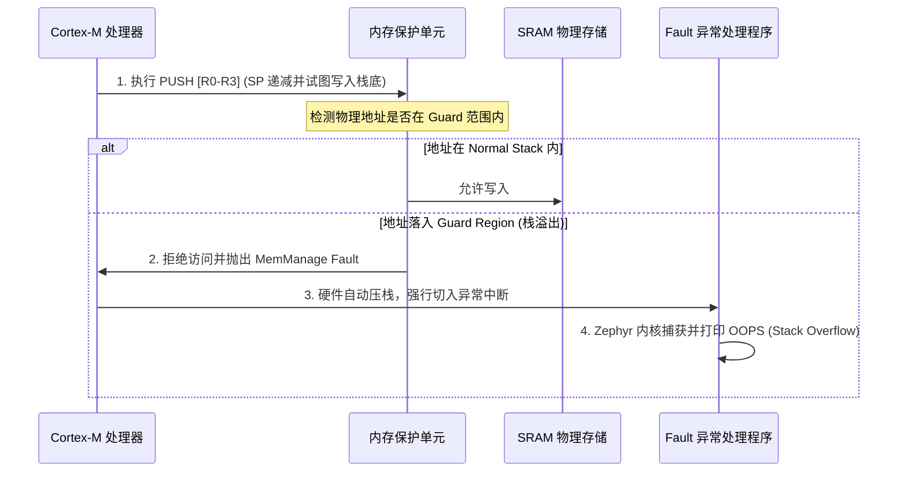

# 第 2 章：栈溢出检测机制 (Stack Overflow Detection)

在资源有限的嵌入式设备中，即便我们做好了前期的栈大小预估，运行时的突发情况（如超深的中断嵌套、递归调用、超大局部数组）仍可能导致栈越界。一旦栈溢出，它会无情地覆盖相邻线程的控制块（TCB）、全局变量或堆数据，造成极难排查的“诡异”系统崩溃。

Zephyr 提供了**硬件级别**和**软件级别**的双重栈溢出防护罩。本章将深入剖析这些防护机制的底层实现原理，并指导您在发生崩溃时，如何通过核心寄存器定位罪魁祸首。

---

## 2.1 硬件保护机制 (CONFIG_HW_STACK_PROTECTION)

硬件栈保护是最高效、最及时的防护手段。当启用 `CONFIG_HW_STACK_PROTECTION=y` 时，Zephyr 会利用微控制器的**内存保护单元 (MPU - Memory Protection Unit)** 或物理内存管理单元（MMU）来强行拦截非法的内存越界写入。

### 2.1.1 MPU 保护警戒区 (MPU Guard Region) 原理

对于不支持虚拟地址管理的 ARM Cortex-M (例如 Cortex-M4/M7) 处理器，Zephyr 采用“**警戒页 (Guard Page)**”的技术。

1.  **物理布局**：
    在为线程分配栈空间时，内核会在栈的最低地址处（递减栈的顶部）预留一块特定大小的区域作为 **MPU Guard Area**（通常为 32、64 字节，或者 MPU 对齐要求的最小值如 1KB）。

2.  **访问控制权限**：
    当调度器切入某线程时，内核会动态更新 MPU 配置，将该线程的 Guard 区域权限设置为 **No Access (无读写权限)**。而栈的其他部分则设置为 Normal Read/Write。

3.  **瞬时触发（Zero-latency Trigger）**：
    一旦线程的栈指针越界并试图向 Guard 区域写入数据（例如执行 `PUSH` 指令或初始化局部变量），MPU 会在**机器周期级**捕捉到这一非法访问，并立即硬件触发 **MemManage Fault**（内存管理异常）。这避免了恶意数据污染邻近的内存。



### 2.1.2 ARMv8-M 架构的硬件栈限制寄存器 (MSPLIM/PSPLIM)

在最新的 ARMv8-M 架构（如 Cortex-M33、Cortex-M55）中，ARM 在硬件层面引入了更优雅的解决方案：**栈指针限制寄存器（Stack Pointer Limit Registers）**：
*   `MSPLIM`：主栈指针限制寄存器（Main Stack Pointer Limit Register）
*   `PSPLIM`：进程栈指针限制寄存器（Process Stack Pointer Limit Register）

**工作机制**：
当线程运行时，系统会将当前线程栈的最低物理边界地址直接写入 `PSPLIM` 寄存器。一旦 CPU 在执行任何改变 `SP` 指针的操作时检测到 `SP < PSPLIM`，**无需经过 MPU 配置，CPU 硬件会立刻直接触发 UsageFault/MemManage Fault**。

> [!TIP]
> **ARMv8-M PSPLIM 的优势**：
> 1. **零对齐开销**：传统 MPU 要求保护区域的大小必须是对齐的（如 ARMv7-M 要求 Region 大小为 2 的幂次方且地址对齐），导致大量 RAM 碎片。而 `PSPLIM` 接受任意字节边界对齐，极大节省了 RAM。
> 2. **零开关损耗**：在上下文切换时，仅需更新一个 `PSPLIM` 寄存器，速度快于重新配置 MPU 区域。

---

## 2.2 软件保护机制 (CONFIG_STACK_SENTINEL)

如果目标硬件不带 MPU/MMU（例如极低端的微控制器），或者为了调试目的需要轻量级的软件检测，可以启用 `CONFIG_STACK_SENTINEL=y`。

### 2.2.1 Canary 哨兵值原理

软件哨兵机制（Stack Sentinel）的运行机制如下：
1.  **打上标记**：
    在线程初始化时，内核会在栈的物理最低端（即栈溢出的临界点）写入一个特殊的 32 位常数，称为 **Canary 哨兵值**（在 Zephyr 中为 `0xDEADBEEF` 或基于随机数的哈希）。
2.  **周期性检查**：
    在每次线程上下文切换（Context Switch）调用内核的 `_Swap` 调度器时，内核会自动执行一段轻量级代码，检查即将切出或切入的线程的哨兵值是否依然为 `0xDEADBEEF`。
3.  **Panic 触发**：
    如果发现该位置的值被篡改，内核断定栈发生了溢出，并立即调用 `k_panic()`，抛出 `K_ERR_STACK_SENTINEL` 错误码。

### 2.2.2 硬件与软件保护对比

| 维度 | 硬件保护 (`CONFIG_HW_STACK_PROTECTION`) | 软件保护 (`CONFIG_STACK_SENTINEL`) |
| :--- | :--- | :--- |
| **触发时机** | **瞬时响应**：越界写入的瞬间立刻触发中断，绝对防止内存污染。 | **延时响应**：只有在下一次上下文切换或手动检测时才发现，此时数据可能已被污染。 |
| **绕过风险** | **极低**：除非 `SP` 直接被错误修改跳过了整个 MPU 保护页。 | **中等**：如果局部变量数组非常大，直接跳过哨兵值写入更低地址，哨兵值本身可能未被修改。 |
| **RAM 损耗** | 需要预留对齐的 Guard Region，在 ARMv7-M 上可能造成内存浪费。 | 仅消耗 4 字节的 Canary 标记位。 |
| **CPU 损耗** | 无额外运行时检查损耗（完全由硬件电路实现）。 | 每次上下文切换都会增加几条比较指令的软件开销。 |

---

## 2.3 异常现场定位与寄存器分析 (HardFault Debugging)

当栈溢出触发 Fault 后，固件通常会死机并从串口输出寄存器 Dump。作为系统级工程师，我们需要能够看懂这些寄存器状态，以便快速定位到出错的代码行。

### 2.3.1 核心状态寄存器解读

在 ARM Cortex-M 架构中，我们需要重点关注以下寄存器（可通过 GDB 或 Zephyr Panic 串口输出获取）：

1.  **SP (Stack Pointer)**：
    发生异常时，如果是用户线程，查看 `PSP` (Process Stack Pointer)；如果是中断或内核级处理，查看 `MSP` (Main Stack Pointer)。对比 `SP` 的数值是否与当前线程栈的低边界极其接近或已跌破边界。
2.  **CFSR (Configurable Fault Status Register, 地址 `0xE000ED28`)**：
    CFSR 拆分为三个子状态寄存器：
    *   **UFSR** (Usage Fault)
    *   **BFSR** (Bus Fault)
    *   **MMFSR** (MemManage Fault, CFSR 的低 8 位)
    
    *若 MMFSR 中的 `DACCVIOL` (Data Access Violation) 位置 1，且 `MSTKERR` (MemManage Fault on Stack) 位置 1，说明是显式的栈越界访问引发了 MPU 警报。*
3.  **MMFAR (MemManage Fault Address Register, 地址 `0xE000ED34`)**：
    当 MMFSR 中的 `MMARVALID` 位置 1 时，`MMFAR` 寄存器中存储的值就是**触发非法访问的精确物理内存地址**。
    
    *诊断方法：如果该物理地址正好落在当前线程栈的 MPU Guard 区域内，则百分之百是栈溢出！*

### 2.3.2 真实异常案例分析

以下是一个由深度递归函数引发栈溢出后，Zephyr 串口打印的崩溃现场：

```text
*** ARCH OOPS CHARGER/SYSTEM FAULT ***
Faulting instruction address (FC): 0x08001a4c
Fatal fault in thread 0x20000bd0 (app_worker)
Current thread ID: 0x20000bd0, name: app_worker
Halting system

cfsr: 0x00000082 (MSTKERR, DACCVIOL)
mmfar: 0x20001a00
psp: 0x20001a04
msp: 0x20003bc0
```

**逆向定位步骤**：

1.  **解析 CFSR**: 
    CFSR 值为 `0x00000082`。低字节为 MMFSR = `0x82`。
    *   `Bit 1 (DACCVIOL) = 1`：数据访问违规。
    *   `Bit 7 (MMARVALID) = 1`：`mmfar` 寄存器中的地址有效。
2.  **确认溢出地址**:
    `mmfar = 0x20001a00`。这是 CPU 发生错误时试图写入的内存地址。
3.  **核对线程栈信息**:
    在编译生成的 `.map` 文件或通过链接器符号查找 `app_worker` 线程栈的范围。假设我们在系统初始化代码中定义如下：
    ```c
    K_THREAD_STACK_DEFINE(worker_stack, 2048);
    ```
    在 RAM 中，该栈的物理范围为 `0x20001a00` 至 `0x20002200`。
    由于硬件保护启用了 32 字节的 Guard 区域（即 `0x20001a00` 至 `0x20001a20`），当 `psp` 跌至 `0x20001a04` 并试图往栈压入新数据时，正好击中了 `0x20001a00` 这一 Guard 边界，从而瞬间触发了异常。
4.  **定位代码行**:
    异常指令地址为 `0x08001a4c`。在开发主机上运行 `addr2line` 工具或使用 GDB：
    ```bash
    $ arm-none-eabi-addr2line -e build/zephyr/zephyr.elf 0x08001a4c
    C:/project/src/main.c:45
    ```
    打开 `main.c` 第 45 行，即可发现是一处递归调用或是未对齐的巨大局部缓冲区导致的溢出。

---

## 2.4 中断栈 (ISR Stack) 溢出检测与配置

在 Zephyr 中，线程栈与中断栈是完全分离的。这是一个极其优秀的架构设计，有助于大幅缩减每个线程所需的栈大小。

### 2.4.1 线程栈与中断栈的切换逻辑

*   **工作线程**：每个线程运行在自己独立的专属栈空间，使用进程栈指针（`PSP`）。
*   **中断服务程序（ISR）**：一旦发生硬件中断，Cortex-M 会自动切入异常模式，此时系统会自动将 SP 切换为**主栈指针 (MSP)**。整个系统中的所有中断处理程序，都**共享**同一个全局中断栈（ISR Stack）。

```text
    线程 A 运行中 (SP = PSP_A)
           |
      [ 硬件中断触发 ]
           |
           v
    CPU 自动压栈至 PSP_A
    SP 切换至 MSP (指向全局 ISR Stack 空间)
    执行 ISR() ...
           v
    [ 中断返回 / 调度 ]
           |
           v
    SP 切换回 PSP_B，继续运行线程 B (SP = PSP_B)
```

### 2.4.2 中断栈相关配置

如果发生异常时 `msp` 指针异常，说明是中断栈发生了溢出。我们需要通过以下 Kconfig 调整中断栈的大小：

```ini
# 全局中断栈大小（默认通常为 2048 字节，根据中断嵌套深度调整）
CONFIG_ISR_STACK_SIZE=4096

# 同样为 ISR 栈启用硬件 MPU 保护警戒区
CONFIG_MPU_REQUIRES_POWER_OF_TWO_ALIGNMENT=y
```

> [!WARNING]
> 由于所有的中断（包括定时器、串口、DMA、网络协议栈中断）都共用这一个中断栈，因此如果某个驱动程序的中断回调函数中声明了巨大的局部数组，或者发生严重的中断嵌套，极易导致整个系统崩溃。**强烈建议在中断回调中仅做标志位清除或通过 `k_work_submit()` 将繁重任务推入工作队列，严禁在中断中进行深度计算或大数据缓存。**
