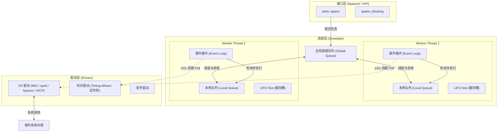

# Tokio 运行时架构深度解析

在深入探索 Tokio 的任务调度系统与无锁队列之前，我们首先需要从宏观上理解 Tokio 运行时的架构设计。作为一个生产级的异步引擎，Tokio 不仅仅是一个“线程池”，它是由**事件驱动引擎（Reactor）**与**任务调度器（Executor）**深度融合而成的复杂系统。

---

## 1. Rust 异步契约与运行时职责

在 Rust 中，标准库（`std`）对异步的支持是极其“克制”的。它仅定义了最核心的接口：

```rust
// 标准库定义的 Future 接口
pub trait Future {
    type Output;
    fn poll(self: Pin<&mut Self>, cx: &mut Context<'_>) -> Poll<Self::Output>;
}
```

标准库只提供了一个**“拉取式（Poll-based）”**的惰性状态机契约。这意味着：
* **Future 本身不会自动运行**。必须有外部实体调用它的 `poll` 方法，它才会向下执行一步。
* **没有内置的线程池或事件循环**。如果 `poll` 返回 `Poll::Pending`，Future 必须记录传入的 `Context` 中的 `Waker`。当底层事件（如网络数据到达、定时器到期）发生时，由操作系统或底层驱动触发 `Waker::wake()`，重新通知调度器对该 Future 进行下一次 `poll`。

这个负责**驱动 Future 执行、提供事件监听、并管理线程生命周期**的外部实体，就是**异步运行时（Runtime）**。而 Tokio，就是这个异步契约的集大成实现者。

---

## 2. Tokio 架构拓扑与核心组件

Tokio 运行时在内部被划分为三个核心层次：**驱动层（Drivers）**、**调度层（Scheduler）**和**接口层（Spawner / API）**。它们之间的逻辑拓扑关系如下图所示：



### 2.1 驱动层 (Drivers)
驱动层是 Tokio 与操作系统内核交互的桥梁，也是整个运行时“反应堆（Reactor）”的核心。它主要包括：
* **I/O 驱动 (`IoDriver`)**：基于 [MIO](https://github.com/tokio-rs/mio) 库实现。MIO 对操作系统的高性能多路复用 API 进行了统一封装（Linux 下的 `epoll`，macOS 下的 `kqueue`，Windows 下的 `IOCP`）。它负责监听文件描述符（FD）或套接字（Socket）的可读可写状态。
* **时间驱动 (`TimeDriver`)**：负责管理所有的异步定时任务（如 `tokio::time::sleep`）。其底层使用了**分级时间轮（Hierarchical Timing Wheel）**算法，能够在 $O(1)$ 的时间复杂度内高效地增删定时任务。
* **信号驱动 (`SignalDriver`)**：接收并处理操作系统的异步信号（如 `SIGINT`, `SIGTERM`）。

### 2.2 调度层 (Scheduler)
调度层是 Tokio 的“执行器（Executor）”。它负责从各种就绪队列中取出任务，并调用 Future 的 `poll` 方法。调度器支持两种完全不同的工作模式：
* **Current-Thread 调度器**：所有异步任务都在调用 `block_on` 的当前单线程上执行。
* **Multi-Thread (Work-Stealing) 调度器**：多线程工作窃取调度器，是 Tokio 在多核 CPU 下默认且推荐的高性能调度方案。

### 2.3 接口层 (Spawner)
向运行时派发任务的入口，例如 `tokio::spawn`。它会将用户定义的异步 Block 包装成一个包含状态控制元数据的 Task，并投递到调度器的就绪队列中。

---

## 3. MIO 与操作系统事件循环的打通

为了理清 I/O 驱动是如何将操作系统的硬件中断逐步转化为 Rust 异步 Task 的唤醒过程，我们可以梳理一条 **“从数据到达网络网卡，到 Future 被重新 poll”** 的完整调用链：

### 3.1 `ScheduledIo` 状态与 Token 注册
在 Tokio 中，每一个异步 Socket 都会在 `IoDriver` 中注册一个关联的 `ScheduledIo` 结构。
当我们在 Tokio 中创建一个异步 TCP 连接时：
1. 底层套接字会被设置为非阻塞模式（Non-blocking）。
2. 该套接字被注册到 `mio::Poll` 实例中，并分配一个唯一的 `Token`（通常是一个递增的整数索引）。
3. 这个 `Token` 在 `IoDriver` 内部直接对应着一个特定的 `ScheduledIo` 槽位，其中保存了该 I/O 资源关联的 `Waker`（包含了当前因为等待 I/O 而挂起的 Task 的控制块指针）。

### 3.2 唤醒机制的闭环
当网卡接收到数据并引发 CPU 中断后，内核会将该 Socket 标记为“可读”。
1. 某个 Worker 线程在执行事件循环时，会定期（例如每执行完 61 个任务）调用 `mio::Poll::poll`，这是一个阻塞或带有超时的系统调用（如 `epoll_wait`）。
2. 操作系统内核将就绪事件列表返回给 `mio`，其中包含之前注册的 `Token` 和事件类型（如可读 `READABLE`）。
3. Tokio 遍历这些事件，根据 `Token` 寻找到对应的 `ScheduledIo` 结构。
4. 从 `ScheduledIo` 中提取出之前暂存的 `Waker`，并调用 `waker.wake()`。
5. `wake()` 会将该 Task 重新插入到对应 Worker 线程的本地就绪队列中。
6. Worker 线程在下一轮循环中从就绪队列中取出该 Task，对其执行 `poll`。此时底层 Socket 调用 `read()` 将成功获取到数据，Future 返回 `Poll::Ready(data)`。

---

## 4. 运行时的两种调度模式与手动配置

通常开发者习惯直接在 `main` 函数上打上 `#[tokio::main]` 属性宏。实际上，这会被编译器展开为通过 `tokio::runtime::Builder` 手动构建运行时的代码。为了深刻理解这两种调度模式，我们来看一下它们的底层手动构建与配置方式。

### 4.1 深入 `current_thread` 模式
单线程模式非常适合以下场景：
* I/O 密集度不高，但对低延迟、无线程切换开销有严苛要求的场景（如嵌入式设备、Edge 边缘计算）。
* 编写测试用例或无需利用多核 CPU 的轻量级守护进程。
* 避免跨线程传递数据时引入 `Send + Sync` 约束。

```rust
use std::time::Duration;
use tokio::runtime::Builder;

fn main() -> Result<(), Box<dyn std::error::Error>> {
    // 手动构建单线程（Current Thread）运行时
    let rt = Builder::new_current_thread()
        .enable_io()       // 启用 Mio 驱动
        .enable_time()     // 启用时间轮驱动
        .thread_name("my-single-thread-worker")
        .build()?;

    // 在单线程上运行异步入口
    rt.block_on(async {
        println!("当前单线程运行时已启动。");
        tokio::time::sleep(Duration::from_millis(50)).await;
        println!("单线程定时器唤醒成功。");
    });

    Ok(())
}
```

### 4.2 深入 `multi_thread` 模式
多线程工作窃取模式是 Tokio 的核心威力所在。它会默认创建与 CPU 核心数相等的 Worker 线程，并通过负载均衡算法将任务分发到各个核心上。

```rust
use tokio::runtime::Builder;
use std::sync::atomic::{AtomicUsize, Ordering};
use std::sync::Arc;

fn main() -> Result<(), Box<dyn std::error::Error>> {
    let thread_counter = Arc::new(AtomicUsize::new(0));
    
    // 构建多线程工作窃取运行时
    let rt = Builder::new_multi_thread()
        .worker_threads(4) // 显式指定 4 个工作线程
        .enable_all()      // 同时启用 I/O、Timer 等所有驱动
        .thread_name_fn(move || {
            // 自定义线程命名逻辑
            let id = thread_counter.fetch_add(1, Ordering::SeqCst);
            format!("tokio-worker-pool-{}", id)
        })
        .thread_stack_size(3 * 1024 * 1024) // 设置工作线程的栈大小为 3MB
        .on_thread_start(|| {
            println!("工作线程已启动。");
        })
        .on_thread_stop(|| {
            println!("工作线程已退出。");
        })
        .build()?;

    rt.block_on(async {
        // 在多线程运行时中派发任务
        let handle = tokio::spawn(async {
            let current_thread = std::thread::current();
            println!("异步任务正在线程上执行: {:?}", current_thread.name());
        });
        
        handle.await.unwrap();
    });

    Ok(())
}
```

---

## 5. 剖析底层事件循环（Event Loop）流程

每一个 Worker 线程本质上都是在一个无限循环中运转，它的伪代码结构如下：

```rust
fn run_worker_loop(local_queue: &mut LocalQueue, global_queue: &mut GlobalQueue) {
    let mut tick = 0;
    loop {
        tick += 1;
        let mut task = None;

        // 1. 协作式防止饥饿：每 61 次 tick，强制先检查全局队列
        if tick % 61 == 0 {
            task = global_queue.pop();
        }

        // 2. 如果全局队列没取到，或者不是第 61 次 tick，先从 LIFO Slot (缓存槽) 中读取
        if task.is_none() {
            task = local_queue.pop_lifo_slot();
        }

        // 3. 从本地无锁队列中获取任务
        if task.is_none() {
            task = local_queue.pop_local();
        }

        // 4. 如果本地队列也空了，尝试从全局队列批量获取，或者去其他 Worker 线程“窃取”任务
        if task.is_none() {
            task = try_steal_or_global(local_queue, global_queue);
        }

        // 5. 如果调度队列全部为空，线程准备进入阻塞等待：
        //    此时线程会充当 "Driver Poller"，负责调用操作系统多路复用 API 阻塞监听 I/O 事件。
        if task.is_none() {
            // 调用 epoll_wait / kqueue / GetQueuedCompletionStatus
            poll_drivers_and_inject_events();
            continue;
        }

        // 6. 执行任务（调用 Future::poll）
        if let Some(active_task) = task {
            execute_task(active_task);
        }
    }
}
```

在这个事件循环中，**第 61 次 tick 检查全局队列**的设计至关重要。如果 Worker 线程只关注自己的本地就绪队列，那么在高并发的本地任务循环中，全局队列中新产生的任务以及其他线程分发过来的任务将会被无限期挂起（饥饿）。通过 61 这个素数频率引入对全局队列的检查，Tokio 成功在“高局部缓存命中率”与“全局公平调度”之间找到了一个极佳的平衡点。

在下一章中，我们将进一步拆解多线程模式下，本地队列的无锁内存布局、核心工作窃取算法的推演，以及 LIFO 缓存机制的极限优化。
