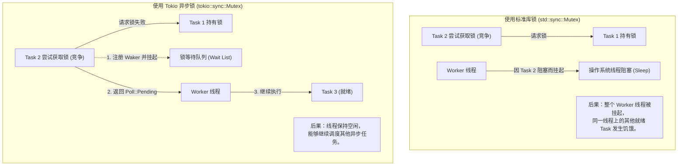

# 异步同步原语与通道设计

在异步编程世界中，**数据共享与任务通信**是构建复杂系统的核心难题。由于异步任务会在不同的工作线程间切换和转移，传统的同步并发原语（如 `std::sync::Mutex`、`std::sync::Condvar`）直接应用于异步上下文时，往往会引发严重的线程阻塞、死锁或调度吞吐量断崖式下跌。

本章将深入对比同步锁与异步锁的底层逻辑，解析 Tokio 四大通道（Channels）的设计精髓，并提供一个生产级的异步数据处理流水线实例。

---

## 1. 异步锁 vs. 同步锁的本质区别

为什么在异步代码中**绝不能**轻易使用 `std::sync::Mutex`？我们通过对比它们在面临锁竞争时的线程行为来解答这一问题。



### 1.1 核心差异对比

| 特性 | `std::sync::Mutex` (同步锁) | `tokio::sync::Mutex` (异步锁) |
| :--- | :--- | :--- |
| **等待锁时的行为** | 阻塞当前操作系统线程（OS Thread Block）。 | 挂起当前 Task，释放 CPU 所有权，让 Worker 线程去执行其他就绪 Task。 |
| **开销** | 极低（在无竞争时仅为几次原子操作；有竞争时触发系统调用）。 | 较高（涉及 `Waker` 注册、动态内存分配和 Future 状态机规整）。 |
| **是否允许跨 `.await`** | **不允许**（若在持有锁时进行 `.await`，可能导致死锁或跨线程安全红线）。 | **允许**（持锁状态可跨越 `.await` 边界）。 |

### 1.2 生产环境的选择标准
1. **短临界区（不含 `.await`）**：如果临界区非常小，仅是修改一个简单的内存结构（如往 `HashMap` 插入一条记录），应首选 `std::sync::Mutex`（或 `parking_lot::Mutex`）。虽然它会短暂阻塞线程，但其开销远小于异步锁，且锁能快速释放。
2. **跨 `.await` 临界区**：如果持有锁期间需要进行网络 I/O、磁盘读写或等待定时器（即包含 `.await`），**必须**使用 `tokio::sync::Mutex`。否则，当前工作线程被强行阻塞后，该线程上其他正在等待 I/O 的任务将全部停滞。

---

## 2. Tokio 四大通道（Channels）设计解析

通道是 Rust 倡导的“不要通过共享内存来通信，而要通过通信来共享内存”理念的基石。Tokio 提供了四种应对不同场景的高性能通道实现：

```
                ┌───────────────────────────────────┐
                │        Tokio Channels 分类         │
                └───────────────────────────────────┘
                                  │
      ┌───────────────────────────┼───────────────────────────┐
      ▼                           ▼                           ▼
  [oneshot]                    [mpsc]                    [broadcast]
 单发送 / 单接收               多发送 / 单接收             多发送 / 多接收
 (单次信使)                   (命令/任务流)               (消息广播/事件总线)
                                  │
                                  ▼
                               [watch]
                            单发送 / 多接收
                            (状态观测/配置更新)
```

### 2.1 `oneshot`
* **设计定位**：单生产者，单消费者，只能发送单个值。
* **实现精髓**：底层通过一个共享的原子状态状态机（State Machine）管理。如果发送方在接收方准备好之前就发送了数据，数据会直接存放在共享内存中，不进行任何额外的锁抢占。一旦数据被读取，通道即宣告销毁。

### 2.2 `mpsc` (Multi-Producer, Single-Consumer)
* **设计定位**：多生产者，单消费者。通常用于向一个后台控制循环（Actor）派发命令或任务。
* **实现精髓**：
  * **Bounded（有界）**：包含背压（Backpressure）机制。当通道满时，`sender.send().await` 会挂起，直到接收方消费了数据。这是生产环境推荐的默认选择，能有效防止内存溢出。
  * **Unbounded（无界）**：没有容量限制。使用无界队列可能导致内存失控，仅在确认发送速率绝不可能持续大于接收速率时使用。

### 2.3 `broadcast`
* **设计定位**：多生产者，多消费者。每个发送的数据都会广播给所有订阅者。
* **落后处理（Lagged）**：底层是一个环形缓冲区。如果某一个消费者处理数据极其缓慢，而发送方持续高速发送，慢消费者会被“甩在后面”。当慢消费者尝试读取已被环形缓冲区覆盖掉的数据时，会收到 `RecvError::Lagged` 错误，由业务侧决定是丢弃还是重连。

### 2.4 `watch`
* **设计定位**：单生产者，多消费者。专为“状态监控”与“配置分发”设计。
* **实现精髓**：
  * 通道内**仅保留最新的一帧数据**，没有历史队列。
  * 订阅者（Receiver）可以随时读取当前值。当发送者（Sender）修改值时，所有订阅者会收到“已更新”的通知。如果订阅者在读取前，发送者连续修改了多次，订阅者只会感知到最后一帧最新的数据。

---

## 3. 生产级实战：构建多源并发日志/任务处理管道

为了将上述并发原语有机结合，我们实现一个模拟的**高并发异步监控管道**：
1. **多 Worker 任务源**：使用 `mpsc` 通道将处理日志汇聚到中央处理器。
2. **并发度控制**：使用 `Semaphore` 限制后台真正执行数据上传的并发度，防止打满连接池。
3. **优雅停机与配置下发**：使用 `watch` 通道向所有后台任务分发停机信号。

```rust
use std::sync::Arc;
use std::time::Duration;
use tokio::sync::{mpsc, watch, Semaphore};
use tokio::task;

// 定义传输的任务消息
#[derive(Debug, Clone)]
struct LogMessage {
    id: usize,
    payload: String,
}

// 模拟外部高并发写入的 Worker 任务
async fn generate_logs(worker_id: usize, tx: mpsc::Sender<LogMessage>, mut shutdown_rx: watch::Receiver<bool>) {
    let mut log_counter = 0;
    loop {
        // 检查是否收到停机信号
        if *shutdown_rx.borrow() {
            println!("[Worker {}] 收到停机通知，安全退出。", worker_id);
            break;
        }

        log_counter += 1;
        let msg = LogMessage {
            id: worker_id * 1000 + log_counter,
            payload: format!("来自 Worker {} 的日志数据 #{}", worker_id, log_counter),
        };

        // 发送数据，若通道满则自动挂起等待
        if tx.send(msg).await.is_err() {
            // 接收端已关闭，退出循环
            break;
        }

        tokio::time::sleep(Duration::from_millis(80)).await;
    }
}

// 任务处理核心（Consumer），使用信号量控制真实写入并发
struct LogProcessor {
    rx: mpsc::Receiver<LogMessage>,
    semaphore: Arc<Semaphore>,
}

impl LogProcessor {
    fn new(rx: mpsc::Receiver<LogMessage>, max_concurrency: usize) -> Self {
        Self {
            rx,
            semaphore: Arc::new(Semaphore::new(max_concurrency)),
        }
    }

    async fn run(mut self) {
        println!("[Processor] 日志处理器已启动。");
        
        // 只要通道未关闭，就持续消费
        while let Some(msg) = self.rx.recv().await {
            let sem_clone = Arc::clone(&self.semaphore);
            
            // 每一个日志处理派发一个单独的 Task 异步执行
            tokio::spawn(async move {
                // 获取信号量凭证，若无凭证则异步等待，不阻塞工作线程
                let _permit = sem_clone.acquire().await.unwrap();
                
                // 模拟向外部服务写入数据的耗时 I/O 操作
                tokio::time::sleep(Duration::from_millis(150)).await;
                println!("[Processor] 日志已成功处理: {:?}", msg);
                
                // 离开作用域，_permit 自动 Drop，释放凭证
            });
        }
        
        println!("[Processor] 日志通道已关闭，处理器完成收尾工作并退出。");
    }
}

#[tokio::main]
async fn main() {
    println!("=== 启动监控管道 ===");

    // 1. 创建 mpsc 通道（有界容量 50）
    let (tx, rx) = mpsc::channel::<LogMessage>(50);

    // 2. 创建用于优雅退出的 watch 通道
    let (shutdown_tx, shutdown_rx) = watch::channel(false);

    // 3. 启动多个日志生成 Worker
    let mut worker_handles = vec![];
    for i in 1..=3 {
        let tx_clone = tx.clone();
        let shutdown_rx_clone = shutdown_rx.clone();
        let handle = tokio::spawn(generate_logs(i, tx_clone, shutdown_rx_clone));
        worker_handles.push(handle);
    }
    // 释放 main 线程持有的 tx，否则接收端 rx 将永远不会收到 None 导致无法结束
    drop(tx);

    // 4. 实例化日志处理核心（最大处理并发限制为 2）
    let processor = LogProcessor::new(rx, 2);
    let processor_handle = tokio::spawn(processor.run());

    // 5. 模拟系统运行 1.5 秒后触发优雅关闭
    tokio::time::sleep(Duration::from_millis(1500)).await;
    println!("\n=== [Main] 开始触发优雅停机程序 ===");
    
    // 发送停机信号
    let _ = shutdown_tx.send(true);

    // 等待所有生产 Worker 退出
    for handle in worker_handles {
        let _ = handle.await;
    }
    println!("[Main] 所有生产者 Worker 已安全停止。");

    // 等待消费者将通道中剩余的日志消费完毕
    let _ = processor_handle.await;
    println!("=== 监控管道已完全关闭 ===");
}
```

---

## 4. 异步同步原语的底层协作原理

无论是 `tokio::sync::Mutex` 还是 `tokio::sync::Semaphore`，它们的内部实现都紧密依赖于 Tokio 的 **Waker 队列**：

1. **状态检查**：当 Task 调用 `acquire().await` 或 `lock().await` 时，首先会通过 `AtomicUsize` 执行无锁的状态原子检查（如 CAS）。
2. **挂起与注册**：如果资源不可用，当前任务的 `Waker` 会被包装进一个等待节点（Wait Node），并插入到一个由原子操作或自旋锁保护的**双向链表**中。随后，操作返回 `Poll::Pending`，任务被挂起。
3. **精准唤醒**：当持有资源的 Task 释放锁或释放信号量凭证时，它会在链表中取出头部结点的 `Waker`，并执行 `wake()`。此时仅有被唤醒的那个 Task 会重新进入就绪队列，**绝不会发生类似于内核条件变量的“惊群效应（Thundering Herd）”**，保证了系统的超高确定性与低延迟表现。

通过理解这些底层的细节，你可以更加自信地在 Rust 异步世界中做出最正确的工程架构抉择。
