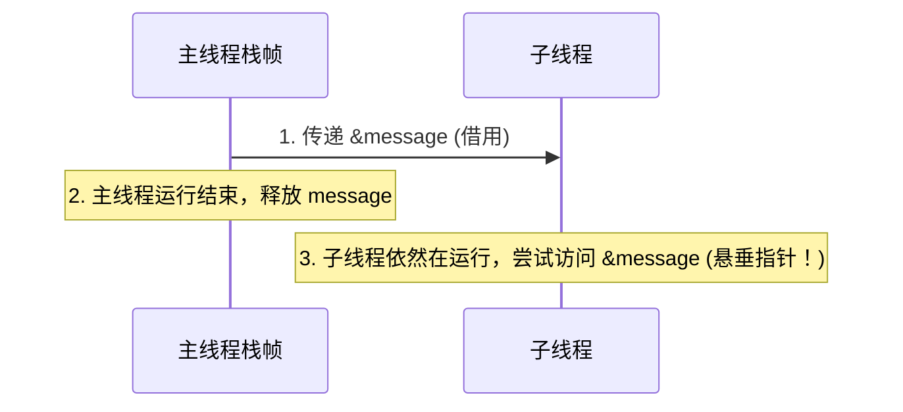
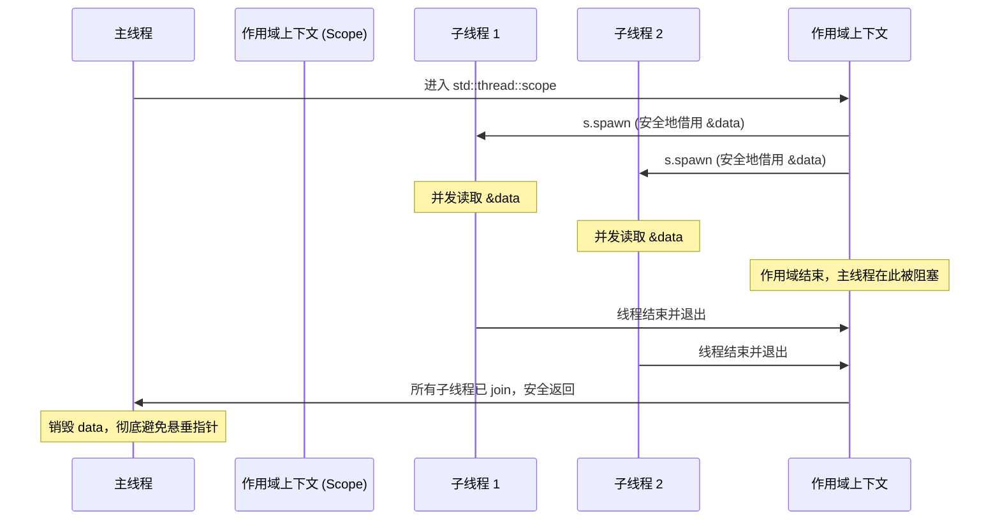

# 操作系统线程管理与生存期

在探讨 Rust 并发编程之前，理解操作系统底层的线程模型以及 Rust 是如何映射到这些模型上的至关重要。本章将详细剖析 Rust 的 1:1 线程模型、传统的 `std::thread::spawn` 机制、生存期 `'static` 约束背后的安全考量，以及现代 Rust 中非常重要的**作用域线程（Scoped Threads）**和线程定制化方法。

---

## 1. 操作系统线程与 Rust 1:1 线程模型

在现代操作系统中，**线程（Thread）**是操作系统能够进行运算调度的最小单位。它被包含在进程之中，是进程中的实际运作单位。关于多线程的实现，主要存在以下两种模型：

1. **M:N 模型（绿线程 / 协程）**：用户态实现的轻量级线程，由语言运行时（Runtime）负责调度。多个用户态线程映射到少量的内核态线程上（例如 Go 语言的 Goroutine）。其优势在于上下文切换极快、内存开销小，但代价是需要一个庞大的运行时系统，且在进行系统调用（Syscalls）时可能面临阻塞问题。
2. **1:1 模型（内核线程）**：每个编程语言级别的线程直接对应一个操作系统的内核线程（Kernel Thread）。内核负责所有线程的调度、上下文切换以及 CPU 核心的映射。

Rust 早在 1.0 版本之前曾同时支持这两种模型。但在 1.0 正式发布前，Rust 团队做出了一个历史性的决定：**完全移除绿线程运行时，采用纯粹的 1:1 线程模型**。

这一决策背后有深层次的系统设计考量：
* **零成本抽象（Zero-cost Abstractions）**：若包含绿线程运行时，即使最简单的 `Hello World` 程序也必须打包一套复杂的调度器（Scheduler），这违背了 Rust 作为系统级语言的初衷。
* **与 C/C++ 的互操作性**：1:1 模型让 Rust 能够极其自然地与 C 语言编写的动态库、操作系统底层 API 进行交互，不会因为运行时调度器的冲突而引发未定义行为。
* **分工明确**：Rust 专注于将内核态线程的安全抽象做到极致。对于需要海量高并发 I/O 的场景，Rust 后来推出了基于 `async/await` 的协作式单/多线程异步任务调度器（如 Tokio），与 1:1 物理线程模型形成互补。

在 1:1 模型下，每当调用 `std::thread::spawn` 时，Rust 会直接发起系统调用（在 Linux 上是 `clone(2)`，在 Windows 上是 `CreateThread`），在内核中注册并创建一个物理线程。

---

## 2. 使用 `std::thread::spawn` 及其 `'static` 约束

### 2.1 基础用法与 `JoinHandle`

在 Rust 中，创建线程最基础的方法是 `std::thread::spawn`。它接收一个闭包，该闭包即为在新线程中运行的代码。

```rust
use std::thread;
use std::time::Duration;

fn main() {
    // 创建一个子线程
    // spawn 返回一个 JoinHandle<T>，其中 T 是闭包返回的值
    let handle: thread::JoinHandle<i32> = thread::spawn(|| {
        println!("子线程: 开始计算...");
        thread::sleep(Duration::from_millis(500));
        println!("子线程: 计算完成！");
        42 // 闭包返回值
    });

    println!("主线程: 执行其他任务...");

    // join 会阻塞当前线程，直到对应的子线程运行结束
    // 它返回一个 Result，如果子线程 panic 了，这里会返回 Err
    match handle.join() {
        Ok(value) => println!("主线程: 收到子线程的结果: {}", value),
        Err(e) => println!("主线程: 子线程发生 panic: {:?}", e),
    }
}
```

### 2.2 为什么需要 `'static` 约束？

如果你尝试在子线程中借用主线程栈帧上的数据，编译器会直接报错：

```rust
// 错误示例：编译无法通过
fn main() {
    let message = String::from("Hello from parent");

    let handle = std::thread::spawn(|| {
        // 尝试借用 message
        println!("子线程打印: {}", message);
    });

    handle.join().unwrap();
}
```

编译器的错误信息通常类似于：
```text
error[E0373]: closure may outlive the current function, but it borrows `message`, which is owned by the current function
  --> src/main.rs:5:37
   |
5  |     let handle = std::thread::spawn(|| {
   |                                     ^^ may outlive borrowed value `message`
6  |         println!("子线程打印: {}", message);
   |                                    ------- borrow occurs due to use in closure
```

**为什么 Rust 必须强制要求传入 `spawn` 的闭包满足 `'static` 生命周期的限制？**

我们用时序图来展示生命周期的冲突：



因为操作系统中各个线程的生命周期是独立的。一旦 `spawn` 成功，子线程就被交给了操作系统的调度器。主线程随时可能退出（或者当前函数执行结束导致栈帧被销毁），而子线程可能还在后台运行。如果允许子线程借用主线程栈帧上的数据，就会导致子线程去访问已被销毁的内存，产生严重的**悬垂引用（Dangling Pointer）**。

因此，`std::thread::spawn` 的函数签名定义如下：
```rust
pub fn spawn<F, T>(f: F) -> JoinHandle<T>
where
    F: FnOnce() -> T,
    F: Send + 'static,
    T: Send + 'static,
```
这里的 `F: 'static` 要求闭包中所包含的所有数据必须拥有 `'static` 生命周期，即：
1. 数据在整个程序运行期间都有效（如字面量、静态变量）。
2. 闭包直接**拥有**该数据的所有权，而不是持有其引用。

#### 解决方案：使用 `move` 闭包
为了打破借用限制，我们可以使用 `move` 关键字，强制闭包将主线程中的变量**所有权转移（Move）**到子线程中：

```rust
fn main() {
    let message = String::from("Hello from parent");

    // 使用 move 关键字，将 message 的所有权转移至子线程
    let handle = std::thread::spawn(move || {
        println!("子线程打印: {}", message);
        // message 在此处被消耗并释放
    });

    // 主线程此后无法再访问 message，避免了生命周期冲突
    handle.join().unwrap();
}
```

---

## 3. Scoped Threads（作用域线程）

虽然转移所有权能解决很多问题，但在许多实际开发场景中，我们需要多个子线程并发读取甚至写入同一个局部变量（例如，并发处理一个大数组的多个切片）。如果每次都必须进行所有权复制或者使用繁重的引用计数（`Arc`），会带来极大的性能开销和开发心智负担。

为了解决这一痛点，Rust 1.63 引入了 **Scoped Threads（作用域线程）**，通过 `std::thread::scope` 提供了一个非常优雅的安全机制。

### 3.1 工作原理

`std::thread::scope` 接收一个闭包，该闭包提供了一个作用域句柄 `Scope`（通常命名为 `s`）。所有通过 `s.spawn(...)` 创建的子线程都被牢牢限制在该作用域内。

**最核心的保证：** 
当 `std::thread::scope` 块结束时，主线程会**自动且强制**地 `join` 所有在该作用域内启动但尚未结束的子线程。

这种机制通过生命周期保证了：**子线程的运行生命周期绝对不会超过作用域的终点**。因此，子线程借用外部局部变量是绝对安全的！



### 3.2 生产级示例：使用作用域线程并发处理切片

下面的例子展示了如何在没有 `Arc` 和锁的情况下，安全地在多个子线程中并发借用并修改主线程上的局部数组：

```rust
use std::thread;

fn main() {
    // 栈帧上的局部变量
    let mut data = vec![1, 2, 3, 4, 5, 6, 7, 8];

    println!("处理前的数据: {:?}", data);

    // 将数据切分为两部分，各自并发修改
    // split_at_mut 返回两个可变借用，其生命周期与 data 绑定
    let (left, right) = data.split_at_mut(4);

    thread::scope(|s| {
        // 派生第一个子线程处理左半部分
        // 注意：这里仅借用了 left，不需要 move 所有权
        s.spawn(move || {
            println!("子线程 1 正在处理: {:?}", left);
            for val in left.iter_mut() {
                *val *= 10;
            }
        });

        // 派生第二个子线程处理右半部分
        s.spawn(move || {
            println!("子线程 2 正在处理: {:?}", right);
            for val in right.iter_mut() {
                *val += 100;
            }
        });

        // 当闭包结束时，s 会自动调用 join 等待上述两个线程结束。
        // 这由 Rust 编译器在编译期强制保证，无需手动编写 join()。
    });

    // 到达这里时，我们可以 100% 确认子线程已经全部执行完毕
    // data 重新回到主线程的独占借用状态
    println!("处理后的数据: {:?}", data);
    assert_eq!(data, vec![10, 20, 30, 40, 105, 106, 107, 108]);
}
```

---

## 4. 定制化线程创建（Thread Builder）

默认情况下，`std::thread::spawn` 采用系统默认的线程配置（如栈大小等）。但在生产环境尤其是高并发或嵌入式/边缘计算场景下，我们通常需要：
1. 给线程起一个**清晰的命名**，方便在崩溃堆栈信息、日志系统或操作系统监控工具（如 `top`、`htop`、`perf`）中定位问题。
2. 限制子线程的**栈内存大小（Stack Size）**。默认的线程栈空间较大（例如 Linux 上通常为 8MB），若派生大量线程，会迅速榨干物理内存。通过减小栈大小可以节省内存消耗。

我们可以通过 `std::thread::Builder` 来精细配置线程：

```rust
use std::thread;

fn main() {
    // 配置一个栈大小为 512KB 且名称为 "worker-thread-0" 的子线程
    let builder = thread::Builder::new()
        .name("worker-thread-0".to_string())
        .stack_size(512 * 1024); // 512 KB

    let handle = builder.spawn(|| {
        let current = thread::current();
        println!(
            "子线程启动成功！名称: {:?}, 线程ID: {:?}",
            current.name().unwrap_or("未命名"),
            current.id()
        );
        // 执行高密度任务...
    }).expect("创建线程失败（可能是操作系统内存不足或达到线程上限）");

    handle.join().unwrap();
}
```

> [!WARNING]
> `Builder::spawn` 返回的是一个 `std::io::Result`，而 `std::thread::spawn` 在无法创建线程时会直接 panic。在高度关注稳定性的生产级应用中，建议始终使用 `Builder` 并在创建失败时进行优雅的降级处理。

---

## 5. 线程异常传播与恢复

Rust 提倡使用 `Result<T, E>` 处理可恢复的错误，使用 `panic!` 处理不可恢复的灾难性错误。那么当一个子线程在运行过程中发生 `panic!` 时，主线程会受到什么影响？

### 5.1 默认的 Panic 行为

当子线程崩溃时，它并不会直接导致主线程也跟着崩溃。子线程会展开其栈（unwind stack），释放其拥有的内存资源，并在退出时将错误信息记录在对应的 `JoinHandle` 中。

```rust
use std::thread;

fn main() {
    let handle = thread::spawn(|| {
        println!("子线程: 即将发生不可恢复错误...");
        panic!("数据库连接丢失！"); // 触发 panic
    });

    // join() 会阻塞等待子线程，并返回 Result
    match handle.join() {
        Ok(_) => println!("主线程: 子线程顺利执行完毕。"),
        Err(err) => {
            println!("主线程: 检测到子线程发生崩溃！");
            // err 的类型是 Box<dyn Any + Send>
            // 我们可以尝试将其转换为字符串来提取崩溃信息
            if let Some(msg) = err.downcast_ref::<&str>() {
                println!("子线程崩溃信息 (静态字符串): {}", msg);
            } else if let Some(msg) = err.downcast_ref::<String>() {
                println!("子线程崩溃信息 (动态字符串): {}", msg);
            } else {
                println!("未知子线程崩溃信息。");
            }
        }
    }

    println!("主线程: 尽管子线程崩溃，但主线程依然保持运行，程序正常结束。");
}
```

### 5.2 哨兵设计模式（Poisoning / Sentinel Pattern）

虽然子线程崩溃默认不会拖垮主线程，但如果子线程是在持有某个共享锁（如 `Mutex`）时崩溃的，就会发生**锁毒化（Lock Poisoning）**。
这属于 Rust 的一种自我保护机制：当一个线程在持有 `MutexGuard` 的期间崩溃，Rust 会认为该锁所保护的数据已经处于不一致或损坏的脏状态。此后，其他线程再次尝试获取此锁时，`lock()` 方法会返回 `Err(PoisonError)`，从而提示开发者共享状态可能已经被破坏。

我们将在下一章探讨 `Arc` 与 `Mutex` 的内存安全布局，深度解析如何避免和处理多线程下的数据共享与同步毒化。
