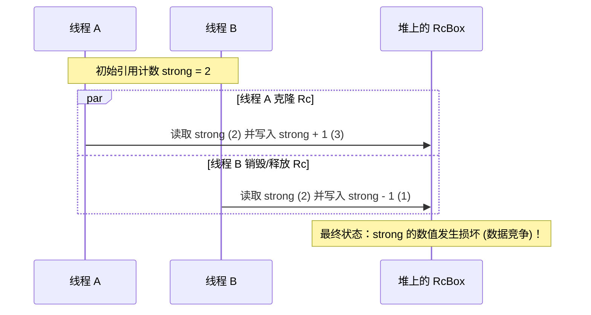
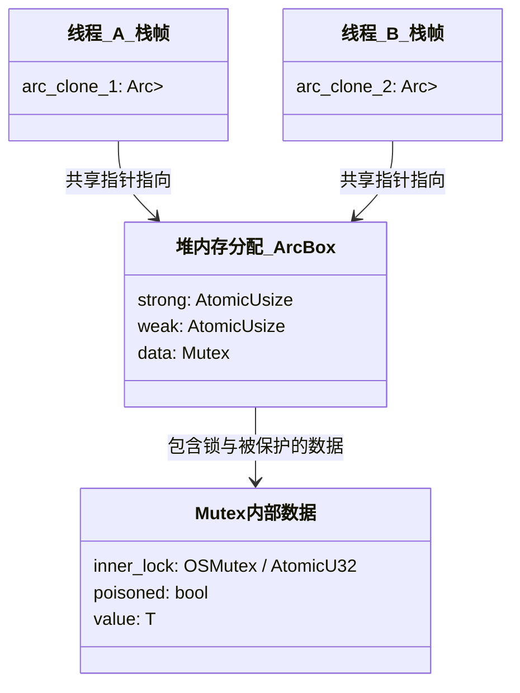

# Send 与 Sync 特质的内存安全边界

在 C 或 C++ 等传统系统级语言中，线程安全（Thread Safety）完全依赖于开发者的警惕性与编码契约。一旦疏忽，诸如数据竞争（Data Race）等极其难缠的未定义行为（Undefined Behavior, UB）就会悄然发生。

Rust 却另辟蹊径，在语言层面将“线程安全”提升为**类型系统（Type System）**的一部分。而支撑这一安全保证的，正是两个被称为 **Marker Traits（标记特质）** 的内置特质：`Send` 与 `Sync`。

---

## 1. `Send` 与 `Sync` 的定义与核心内涵

在 Rust 标准库 `std::marker` 中，`Send` 和 `Sync` 的定义不包含任何方法，它们仅仅是向编译器传达类型特征的“标签”：

```rust
// 标准库中的简化声明
pub unsafe auto trait Send {}
pub unsafe auto trait Sync {}
```

* **`Send` 特质**：如果一个类型 `T` 实现了 `Send`，说明该类型的所有权（Ownership）可以**安全地在线程之间转移**。
* **`Sync` 特质**：如果一个类型 `T` 实现了 `Sync`，说明在多个线程间**并发地共享该类型的不可变引用（`&T`）**是安全的。

### 1.1 两者的内在关联

`Send` 和 `Sync` 之间存在着一个至关重要的数学对应关系：

$$\text{T 是 Sync} \iff \text{\&T 是 Send}$$

即：如果一个类型的共享引用（`&T`）可以安全地被复制并发送到另一个线程，那么这个类型本身在多线程间共享就是安全的（因此它是 `Sync`）。

---

## 2. 自动派生规则与 `Unsafe` 语义

### 2.1 自动派生（Auto Traits）

`Send` 和 `Sync` 属于**自动特质（Auto Traits）**。这意味着编译器会根据类型的成员自动推导它们：
* 如果一个结构体（或枚举）的所有成员都是 `Send`，那么这个结构体也是 `Send`。
* 如果一个结构体（或枚举）的所有成员都是 `Sync`，那么这个结构体也是 `Sync`。

```rust
// 自动推导为 Send + Sync
struct Point {
    x: f64, // f64 是 Send + Sync
    y: f64, // f64 是 Send + Sync
}
```

### 2.2 主动取消派生（Opt-out）

有时，为了确保线程安全，我们需要向编译器明确声明该类型**不支持**在线程间传递。我们可以利用 `std::marker::PhantomData` 包裹非 `Send`/`Sync` 类型（如原生指针 `*const T`）来主动退回这种自动实现：

```rust
use std::marker::PhantomData;

// 原生指针 *mut u8 默认是非 Send 和非 Sync 的
// 此时 MyUnsafeResource 也会自动变成 !Send + !Sync
struct MyUnsafeResource {
    raw_ptr: *mut u8,
    _marker: PhantomData<*const ()>, 
}
```

### 2.3 手动实现（Opt-in）

如果你在底层实现了一个自定义的并发数据结构，使用了原生指针，但你能保证其多线程访问的安全性，你可以手动为它实现 `Send` 或 `Sync`。由于这涉及内存安全的物理保证，因此必须使用 `unsafe` 关键字：

```rust
struct MySafeWrapper {
    raw_ptr: *mut libc::c_void,
}

// 必须由开发者确保在线程间传递 raw_ptr 不会引发数据竞争或野指针访问
unsafe impl Send for MySafeWrapper {}
unsafe impl Sync for MySafeWrapper {}
```

---

## 3. 经典非 `Send` 或非 `Sync` 类型深度剖析

为了彻底厘清这两者的边界，我们深入剖析两个在单线程中大放异彩、但在多线程中被 Rust 强行禁用的经典类型：`Rc<T>` 和 `RefCell<T>`。

### 3.1 `Rc<T>`：为什么既不是 `Send` 也不是 `Sync`？

`Rc<T>` 是单线程下的引用计数指针。我们来看它的内部简化结构与 `clone` 核心逻辑：

```rust
// 伪代码：Rc 的内部堆内存结构
struct RcBox<T> {
    strong: usize, // 强引用计数
    weak: usize,   // 弱引用计数
    value: T,      // 实际数据
}

pub struct Rc<T> {
    ptr: *mut RcBox<T>,
}
```

当克隆一个 `Rc<T>` 时，它会在底层对 `strong` 计数执行非原子的加法操作：

```rust
// Rc<T> 的克隆实现
fn clone(&self) -> Self {
    unsafe {
        // 非原子操作：直接加 1
        (*self.ptr).strong += 1;
    }
    Rc { ptr: self.ptr }
}
```

#### 为什么不能是 `Send`？

假设我们将一个 `Rc<String>` 实例发送（`Send`）到另一个线程，而主线程保留了该 `Rc<String>` 的另一个克隆。时序图如下：



如果两个线程同时对 `strong` 进行操作，因为底层的 `+1` / `-1` 并不是**原子操作（Atomic Operations）**，会发生以下灾难：
1. **数据竞争**导致 `strong` 的计数损坏。例如两个线程同时减少计数，可能导致计数虽然降为 0，却因为更新丢失而没有被释放，造成**内存泄露**。
2. 更严重的是，如果计数提前归零，一端线程会释放堆上的 `RcBox`，而另一端线程还在继续访问该内存，这直接引发了**释放后使用（Use After Free, UAF）**的严重安全漏洞。

因此，为了从根本上杜绝该问题，Rust 在标准库中明确声明：
```rust
impl<T> !Send for Rc<T> {}
impl<T> !Sync for Rc<T> {}
```

---

### 3.2 `RefCell<T>`：为什么是 `Send` 但不是 `Sync`？

`RefCell<T>` 实现了**内部可变性（Interior Mutability）**，允许我们在持有不可变引用 `&RefCell<T>` 的情况下，在运行时动态借用出可变引用 `&mut T`。

其内部通过非原子的借用计数器（`Cell<BorrowFlag>`）来追踪当前的借用状态：
* `0`：未借用。
* `>0`：已被借用为不可变（正数代表借用次数）。
* `<0`（通常用特殊标记）：已被借用为独占的可变借用。

```rust
pub struct RefCell<T> {
    borrow: Cell<BorrowFlag>, // 非原子的借用计数器
    value: UnsafeCell<T>,     // 实际包裹的值
}
```

#### 为什么是 `Send`？

如果我们将整个 `RefCell<T>` 的所有权发送到另外一个线程，这完全是安全的。因为在任何时刻，`RefCell` 只属于**一个**线程。该线程在对其进行借用检查时，依然是单线程行为，不会发生并发冲突。所以 `RefCell<T>` 满足 `T: Send => RefCell<T>: Send`。

#### 为什么不是 `Sync`？

假设 `RefCell<T>` 实现了 `Sync`，那么多个线程就可以并发持有同一个 `&RefCell<T>` 的共享引用，并尝试调用 `.borrow_mut()`：

```rust
// 错误假设：如果在多线程中并发调用 borrow_mut
// 线程 1 与 线程 2 同时运行以下代码：
let mut val_mut = shared_refcell.borrow_mut();
```

由于 `borrow` 标记位的修改不是原子性的，线程 1 和 线程 2 可能会同时读取到借用状态为 `0`，并同时将其修改为“已借用为可变借用”。
这导致了：**两个线程同时获取到了包裹数据的可变引用 `&mut T`**。
这直接违背了 Rust 的核心借用规则：“**在任意时刻，要么只能有一个可变引用，要么能有多个不可变引用**”，会引发严重的数据竞争。

因此，`RefCell` 坚决不能实现 `Sync`：
```rust
impl<T> !Sync for RefCell<T> {}
```

---

## 4. 并发控制的防线：`Arc<T>` 与 `Mutex<T>`

要想在多线程间既能**共享数据**，又能**修改数据**，我们需要将具有不同特质的工具结合使用。这就是经典的 `Arc<Mutex<T>>` 组合。

### 4.1 `Arc<T>`：原子级引用计数

`Arc<T>` (Atomically Reference Counted) 相当于 `Rc<T>` 的多线程安全版。它内部的引用计数使用的是**原子类型**（如 `AtomicUsize`），通过 CPU 提供的原子指令（如 `LOCK XADD`）在多线程间安全地增减计数。

* 如果 `T: Send + Sync`，那么 `Arc<T>` 也是 `Send + Sync`。
* `Arc` 只提供了只读借用 `&T`，我们无法直接修改 `Arc` 内部的数据。

### 4.2 `Mutex<T>`：互斥锁的桥梁作用

为了修改 `Arc` 内部的数据，我们必须引入 `Mutex<T>`。`Mutex` 内部利用操作系统的互斥锁机制，确保在同一时刻只有一个线程能够访问内部包裹的数据。

标准库对 `Mutex<T>` 的 `Send`/`Sync` 派生规则非常巧妙：
```rust
unsafe impl<T: ?Sized + Send> Send for Mutex<T> {}
unsafe impl<T: ?Sized + Send> Sync for Mutex<T> {}
```
**注意：** 即使 `T` 本身不是 `Sync` 的（例如 `T` 是一个只能单线程写入的类型），只要 `T` 是 `Send`，那么包裹在 `Mutex` 之后的 `Mutex<T>` 就会自动变为 `Sync`！

这是因为，`Mutex` 的排他性锁机制确保了在同一时间只可能有一个线程去获取 `&mut T`，从而天然抹平了多线程并发访问导致的冲突。

### 4.3 `Arc<Mutex<T>>` 的内存布局

为了直观理解这一经典组合在内存中的形态，我们画出其对应的内存布局图：



从内存上看：
1. `Arc` 实际上是一个指针，指向堆上的 `ArcBox`。`ArcBox` 中存放着两个原子计数器和被包裹的数据 `Mutex<T>`。
2. 多个线程的栈帧上各自持有 `Arc` 指针的克隆，它们指向同一个堆内存地址。
3. 当线程想要访问 `T` 时，必须先调用 `Mutex::lock()`。该方法会通过 `inner_lock` 标记位进行原子竞态争抢。争抢成功的线程会获得一个守护凭证 `MutexGuard`，该凭证实现了 `DerefMut`，从而允许我们修改里面的 `T`。
4. `MutexGuard` 在离开作用域时会被自动释放（利用 `Drop` 特质），并主动释放底层的互斥锁，供其他线程继续争抢。

### 4.4 生产级示例：并发状态下的计数累加器

下面的例子展示了如何通过 `Arc<Mutex<T>>` 在 10 个线程中并发累加一个全局计数器：

```rust
use std::sync::{Arc, Mutex};
use std::thread;

fn main() {
    // 1. 初始化共享状态：将数据包裹在 Mutex 中，并用 Arc 共享
    // 计数器初始值为 0
    let counter = Arc::new(Mutex::new(0));
    let mut handles = vec![];

    for i in 0..10 {
        // 2. 每次派生线程时，克隆一次 Arc 指针
        // 克隆仅增加堆上的原子引用计数，不复制内部的 Mutex 数据
        let counter_clone = Arc::clone(&counter);

        let handle = thread::spawn(move || {
            // 3. 调用 lock() 获取互斥锁
            // lock() 可能因为其他线程持有锁而阻塞当前线程
            // 返回的 Result 在锁被毒化时为 Err，这里在生产中可以使用 match 处理
            let mut data = counter_clone.lock().expect("锁已被毒化");

            // 4. 解引用修改数据（MutexGuard 实现了 DerefMut）
            *data += 1;
            println!("线程 {} 成功累加，当前计数: {}", i, *data);

            // 5. 闭包结束，data 离开作用域，MutexGuard 自动释放
            // 底层锁被安全解开，等待下一个线程争抢
        });
        handles.push(handle);
    }

    // 等待所有线程执行完毕
    for handle in handles {
        handle.join().unwrap();
    }

    // 主线程获取锁打印最终结果
    let final_result = counter.lock().unwrap();
    println!("最终计数器累加值: {}", *final_result);
    assert_eq!(*final_result, 10);
}
```
通过这种类型系统的精密设计，Rust 从底层阻断了数据竞争的可能。在接下来的章节中，我们将讨论如何采用更加现代化、更不易死锁的通信方式——“通道（Channel）”来编写多线程程序。
