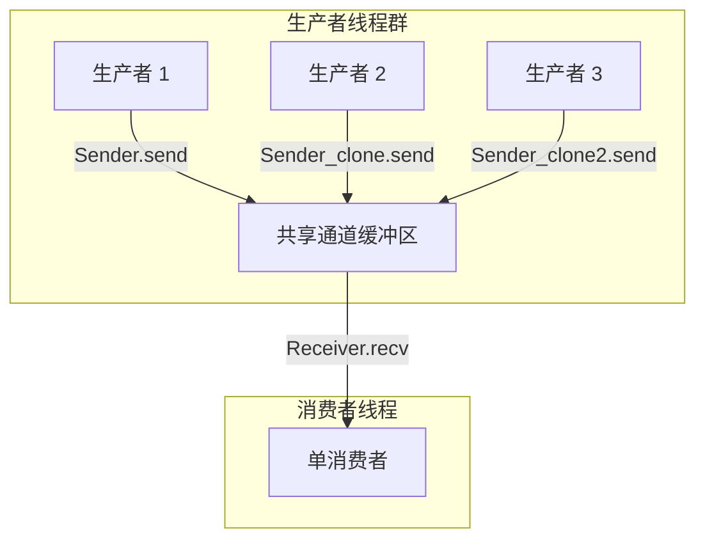

# mpsc 通道通信与消息传递

在并发编程中，处理共享状态的传统方式是“共享内存与锁”（如上一章介绍的 `Arc<Mutex<T>>`）。然而，当并发逻辑错综复杂时，手动管理锁的争抢、避免死锁（Deadlock）以及处理锁毒化会带来极大的挑战。

为了降低并发程序的复杂度，Go 语言和 Erlang 倡导了另一种并发哲学：
> **“不要通过共享内存来通信，而要通过通信来共享内存。”（Do not communicate by sharing memory; instead, share memory by communicating.）**

这一哲学对应的理论模型是 **通信顺序进程（Communicating Sequential Processes, CSP）**。在 Rust 中，标准库提供了 `std::sync::mpsc`（Multi-producer, Single-consumer，多生产者单消费者通道）来实现线程间的消息传递。

---

## 1. mpsc 通道的核心概念

`std::sync::mpsc` 通道主要由两部分组成：
1. **`Sender`（发送端）**：可以被多次克隆（`Clone`），实现多生产者（Multi-producer）并发地向通道中发送消息。
2. **`Receiver`（接收端）**：不能被克隆，保证只有一个消费者（Single-consumer）独占式地从通道中读取消息。这样可以避免多个消费者在争抢同一条数据时产生复杂的锁竞争。



---

## 2. 异步通道与同步通道的底层区别

根据缓冲区容量的设计不同，`std::sync::mpsc` 提供了两种通道：

### 2.1 异步/无界通道（Asynchronous Channel）

通过 `std::sync::mpsc::channel()` 创建。

```rust
let (tx, rx) = std::sync::mpsc::channel();
```

* **容量限制**：理论上无界（仅受限于堆内存大小）。
* **发送行为**：`tx.send(msg)` 永远是**非阻塞的（Non-blocking）**。发送端将消息挂载到通道内部的无界链表后会立即返回。
* **潜在风险**：如果生产者的速度远远大于消费者的处理速度，堆内存中的待处理消息会无限堆积，最终导致**内存溢出（Out of Memory, OOM）**。

### 2.2 同步/有界通道（Synchronous Channel）

通过 `std::sync::mpsc::sync_channel(bound)` 创建。

```rust
let (tx, rx) = std::sync::mpsc::sync_channel(10);
```

* **容量限制**：必须在创建时显式指定固定容量 `bound`。其底层通常采用高效的环形队列（Ring Buffer）实现。
* **发送行为**：
  * 当缓冲区**未满**时，`tx.send(msg)` 是非阻塞的，数据被写入缓冲区后立即返回。
  * 当缓冲区**已满**时，`tx.send(msg)` 将**阻塞当前线程**，直到消费者调用 `rx.recv()` 消费了数据、腾出空位。
* **特殊情况 (容量为 0)**：若设置容量为 0 (`sync_channel(0)`)，它会退化为**汇合通道（Rendezvous Channel）**。此时发送端发送数据后会立即阻塞，直到接收端开始接收，反之亦然。双方必须在通道处“会合”才能成功传递数据。

---

## 3. 通道的生命周期与自动终止行为

通道的发送端和接收端是和其各自的生命周期（以及析构函数 `Drop`）绑定在一起的。这一特性非常有助于实现优雅的线程关闭：

### 3.1 接收端的自动终止

当一个通道所有的 `Sender` 实例都被丢弃（`drop`）时，通道会被自动关闭。
此时，如果消费者继续调用 `rx.recv()`，它将不再阻塞，而是会立即返回一个 `Err(RecvError)`。
这为接收端的循环提供了一个天然的退出条件：

```rust
// 经典且优雅的消费者循环写法
while let Ok(msg) = rx.recv() {
    // 只要还有发送端存活且发送数据，就会在此处处理
    println!("收到消息: {}", msg);
}
// 当所有 Sender 被 drop 且通道内无残留消息时，循环自动退出
println!("通道已关闭，消费者退出。");
```

### 3.2 发送端的自动终止

如果接收端 `Receiver` 被丢弃（例如消费者线程崩溃退出），通道同样会被关闭。
此时，如果发送端尝试调用 `tx.send(msg)`，该方法会立即返回 `Err(SendError(msg))`。发送端可以通过捕获该错误来感知接收端已不复存在，从而进行降级处理或安全退出。

---

## 4. 生产级示例：有界异步日志分发器（Log Dispatcher）

在生产级后台服务中，我们通常需要一个高效、非阻塞（或受控阻塞）的日志分发器：多个 Worker 线程生产日志，单个独立的 I/O 线程将日志持久化到磁盘，以防止并发写入磁盘造成的 I/O 锁竞争。

下面是使用 `sync_channel` 构建的一个完整的日志分发系统，展示了通道在高并发下的限制、数据分发和优雅关闭流程：

```rust
use std::sync::mpsc::{sync_channel, SyncSender};
use std::thread;
use std::time::Duration;

// 定义日志级别
#[derive(Debug)]
enum LogLevel {
    Info,
    Warning,
    Error,
}

// 定义日志消息体
#[derive(Debug)]
struct LogMessage {
    level: LogLevel,
    thread_name: String,
    content: String,
}

fn main() {
    // 1. 创建一个容量为 5 的同步有界通道
    // 使用有界通道防止日志生成过快榨干服务器内存 (OOM)
    let (tx, rx) = sync_channel::<LogMessage>(5);

    // 2. 启动单独的日志消费线程（写入持久化设备）
    let consumer_handle = thread::spawn(move || {
        println!("[Log Consumer] 日志消费服务启动...");
        // 循环接收日志，直到所有 Sender 均被 drop
        while let Ok(log) = rx.recv() {
            println!(
                "[Log Writer] [{:?}] (来自 {}): {}",
                log.level, log.thread_name, log.content
            );
            // 模拟缓慢的磁盘写入 I/O 开销
            thread::sleep(Duration::from_millis(100));
        }
        println!("[Log Consumer] 所有发送端已关闭，日志消费服务安全退出。");
    });

    // 3. 启动多个业务（Worker）线程作为日志生产者
    let mut producer_handles = vec![];

    for i in 1..=3 {
        // 克隆发送端给每个子线程
        let thread_tx: SyncSender<LogMessage> = tx.clone();
        
        let handle = thread::spawn(move || {
            let thread_name = format!("Worker-Thread-{}", i);
            println!("[{}] 启动，开始处理任务...", thread_name);

            for step in 1..=3 {
                let msg = LogMessage {
                    level: LogLevel::Info,
                    thread_name: thread_name.clone(),
                    content: format!("正在执行第 {} 步操作", step),
                };

                // send 在通道满时会阻塞，以此实现天然的反向压力（Backpressure）
                if let Err(e) = thread_tx.send(msg) {
                    eprintln!("[{}] 发现日志通道已关闭，放弃发送。原因: {:?}", thread_name, e);
                    break;
                }
                
                // 模拟业务处理耗时
                thread::sleep(Duration::from_millis(50));
            }
            println!("[{}] 执行结束。", thread_name);
        });
        producer_handles.push(handle);
    }

    // 4. 【非常关键的一步】显式丢弃主线程中最初创建的 tx！
    // 因为 tx 已经被克隆了 3 份发给子线程。如果不主动 drop 主线程持有的这个 tx，
    // 即使 3 个子线程执行完毕退出、释放了它们的 tx，通道的 Sender 计数依然为 1。
    // 这会导致消费者线程 rx.recv() 永久阻塞，无法触发优雅退出。
    drop(tx);

    // 5. 等待所有生产者子线程执行完毕
    for handle in producer_handles {
        handle.join().unwrap();
    }
    println!("[Main] 所有生产者线程已退出。");

    // 6. 等待消费者线程处理完通道中遗留的数据并安全退出
    consumer_handle.join().unwrap();
    println!("[Main] 日志分发系统完美结束。");
}
```

---

## 5. 总结

在 Rust 并发体系中，`std::sync::mpsc` 提供了一个极高抽象的安全边界：
* 它使用 Rust 类型系统保证了消息在发送（`send`）后，其**所有权直接转移**给接收端，完全消除了多线程访问同一份数据的脏读/脏写隐患。
* 结合 `Arc<Mutex<T>>` 和 `mpsc`，你可以根据业务场景，在“共享状态并发”与“消息传递并发”之间自由权衡，构建出既符合现代工程规范，又具备极高执行性能的安全多线程应用。
