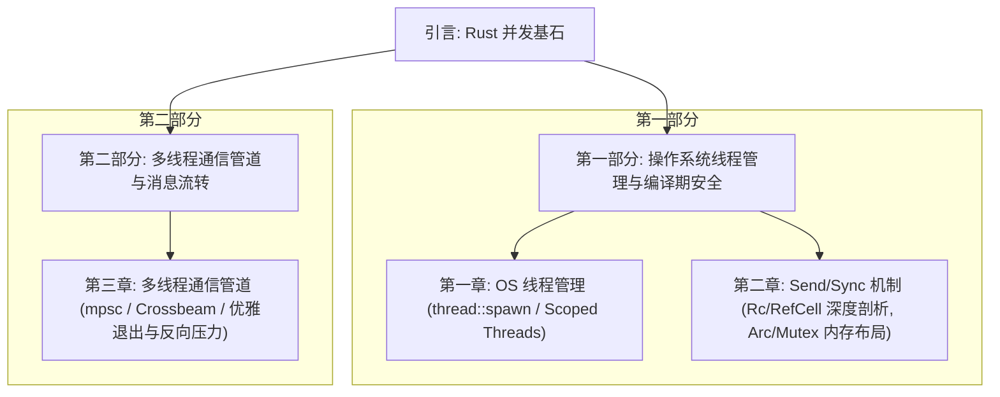

# 前言：Rust 多线程并发基石与无畏并发

在计算机体系结构演进的今天，多核处理器（Multi-core Processors）已成为硬件的标配。为了榨干硬件的多核算力，并发编程（Concurrency）和并行计算（Parallelism）成为系统级软件开发的必修课。然而，传统的系统级并发模型（通常以 C/C++ 为代表的“共享内存 + 互斥锁”模型）往往伴随着极高的开发心智负担，其底层潜伏着诸如数据竞争（Data Race）、死锁（Deadlock）、内存悬垂（Dangling Pointers / Use After Free）、甚至极其隐蔽的 CPU 缓存一致性与内存重排（Memory Reordering）问题。

Rust 语言通过其革命性的**所有权（Ownership）**、**借用规则（Borrow Rules）**、**生命周期（Lifetimes）**以及**强类型系统（Type System）**，在编译期将绝大多数并发安全隐患彻底斩于马下。这种设计哲学被称为**“无畏并发”（Fearless Concurrency）**。这意味着，Rust 允许开发者编写出既能高度贴近底层硬件物理极限、又具备绝对内存安全保证的并发程序。

---

## 1. 为什么并发编程如此困难？

在传统并发编程中，最核心的冲突在于**“共享可变状态”（Shared Mutable State）**。

* **共享（Shared）**：多个线程能够同时访问同一块物理内存地址。
* **可变（Mutable）**：至少有一个线程能够对该内存地址进行写入操作。

当这两个条件同时满足，且没有对访问顺序进行严格的同步（Synchronization）时，就会发生**数据竞争（Data Race）**。在 CPU 和编译器的底层，这会导致以下现象：
1. **编译器指令重排**：为了优化性能，编译器在编译时会调整没有直接数据依赖的指令顺序。
2. **CPU 乱序执行与缓存不一致**：现代 CPU 拥有多级缓存（L1, L2, L3）以及写缓冲区（Write Buffers）。不同核心上的物理线程对同一块内存的修改可能滞留在各自的缓存中，未及时刷回主存，导致其他核心读取到“脏数据”或陈旧状态。

在 C/C++ 中，这属于**未定义行为（Undefined Behavior, UB）**，可能会导致程序崩溃，甚至产生严重的安全漏洞。

---

## 2. Rust 的破局之道：编译期安全防线

Rust 并没有像 Java 或 Go 那样引入庞大的虚拟机、垃圾回收器（Garbage Collector）或专用的用户态协程调度器，而是通过类型系统实现了**零成本的线程安全抽象**。

```
                    +----------------------------------------+
                    |        Rust 编译器 (rustc) 静态分析     |
                    +----------------------------------------+
                                        |
                 +----------------------+----------------------+
                 |                                             |
        [所有权与借用检查]                               [类型特质约束]
  - 保证任意时刻对同一块内存:                           - 通过 Send 标记所有权跨线程转移
    * 要么只有一个可变借用 (&mut T)                      - 通过 Sync 标记共享引用跨线程并发
    * 要么有多个不可变借用 (&T)                          - 静态阻断非线程安全类型流入多线程
                 |                                             |
                 +----------------------+----------------------+
                                        |
                                        v
                    +----------------------------------------+
                    |          无数据竞争的二进制程序         |
                    +----------------------------------------+
```

Rust 的核心安全防线由以下三大支柱构成：

1. **借用检查器（Borrow Checker）**：强制执行“独占可变性”原则（Aliasing XOR Mutability）。如果一个数据正被某个线程修改，其他任何线程都无法获取其引用；如果多个线程正在读取它，任何线程都无法对其进行修改。
2. **`Send` 与 `Sync` 标记特征（Marker Traits）**：在类型层面对数据的跨线程行为进行静态建模。哪些数据可以转移到其他线程，哪些数据可以通过引用在线程间共享，全部在编译期决定。任何违反规则的代码都无法编译通过。
3. **严格的生命周期绑定**：通过生命周期机制，保证子线程所引用数据的生命周期绝对比子线程运行的生命周期更长，从根本上消除了“悬垂引用”和“释放后使用（UAF）”。

---

## 3. 本书章节架构与学习路径

为了系统、深入地剖析 Rust 并发编程的精髓，本书被精心划分为以下两个核心部分，包含三个技术深度专题：



### 第一部分：操作系统线程管理与编译期安全

* **第一章：OS 线程创建、生命周期与 Scope 线程机制**
  我们将探讨 Rust 与操作系统内核线程的 1:1 映射机制，剖析线程创建时的物理开销与资源配额。接着深入研究 `std::thread::spawn` 的生命周期约束，探讨为什么必须强制 `'static` 生命周期。最后，我们将详细解构 Rust 1.63 引入的 **Scoped Threads（作用域线程）**，研究它是如何打破 `'static` 限制、安全并发借用主线程栈上局部变量的。

* **第二章：编译期并发安全保障与 Send/Sync 特征原理**
  我们将直击 Rust “无畏并发”的最核心理论——`Send` 与 `Sync` 特征。从编译器自动派生规则（Auto Traits）出发，分析原生指针与它们的逻辑关联。随后，我们将以 `Rc<T>` 和 `RefCell<T>` 为典型反面教材，分析它们在多线程下会导致何种未定义行为（如数据竞争、内存泄露及 UAF）。最后，我们将剖析 `Arc<Mutex<T>>` 的物理内存布局，解构原子操作、互斥锁状态以及锁毒化（Lock Poisoning）的应对方案。

### 第二部分：多线程通信管道与消息流转

* **第三章：标准库 mpsc 管道与 Crossbeam 高级并发通道**
  遵循“以通信来共享内存”的并发哲学，我们将系统探讨 Rust 的管道通信模型。深入分析异步（无界）通道与同步（有界）通道在底层队列、缓冲区设计以及阻塞行为上的物理差异。同时，我们还将引入 `Crossbeam` 等社区高性能并发通道，讲解多生产者多消费者（MPMC）模式、`select` 多路复用轮询机制、通道的生命周期级联释放（Cascading Drop）以及在实际生产中应对过载的“反向压力（Backpressure）”控制。

---

## 4. 学习目标与收获

通过深入研读本书并实践书中的生产级代码示例，你将能够：
1. **理解物理硬件与 OS 的交互**：清晰把握 Rust 线程在操作系统层面的创建与调度开销，掌握栈大小及命名的定制方法。
2. **精通静态类型安全分析**：面对复杂的编译期并发报错，能够准确推导其背后的生命周期或特征缺陷，并熟练使用 `Arc`、`Mutex`、`RwLock` 甚至无锁原子类型重构代码。
3. **构建高吞吐的消息传递架构**：深刻理解管道的流量控制机制，学会运用有界通道实现自我保护，避免内存溢出（OOM）或无尽的死锁。
4. **掌握底层的无畏并发设计模式**：学会如何优雅地编写可并发的切片处理算法、有界日志分发器及多路复用网络轮询器。

让我们正式开启 Rust 多线程并发的深度探索之旅！
