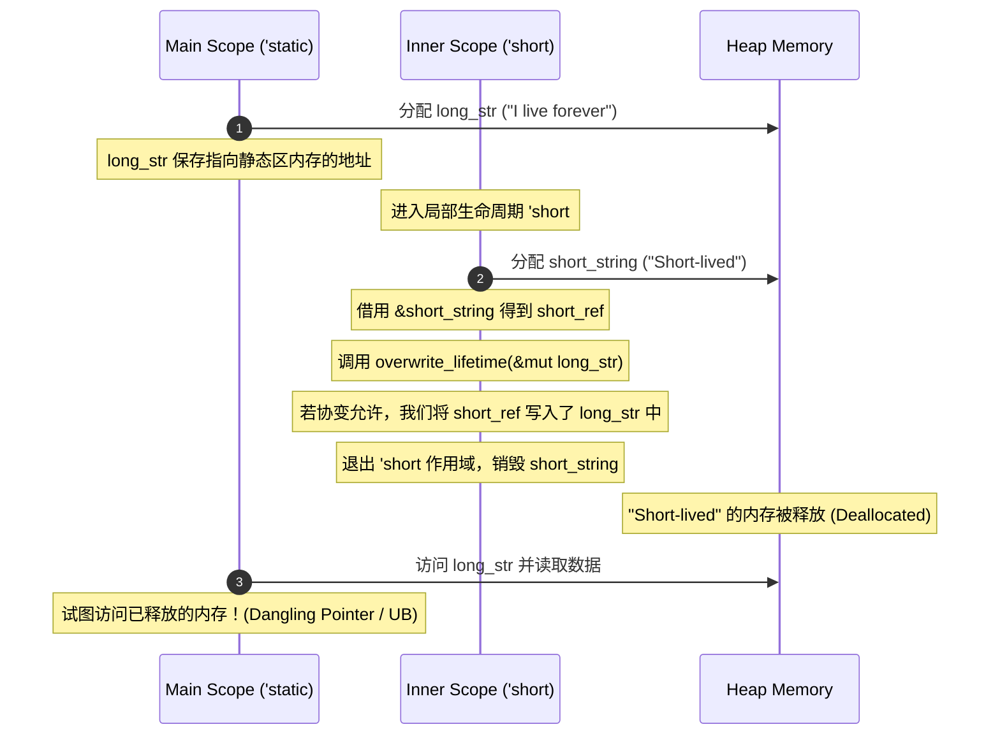

# 生命周期子类型与型变

在 Rust 中，生命周期的核心作用是确保引用在其指向的数据被销毁前保持有效。然而，在处理嵌套泛型、智能指针以及函数指针时，生命周期的关系会变得错综复杂。要写出既安全又具表现力的复杂 API，我们必须深入理解**子类型关系（Subtyping）**与**型变（Variance）**。

---

## 1. 生命周期的子类型关系 (Subtyping)

在传统面向对象语言（如 Java 或 C++）中，子类型通常通过类继承（Inheritance）实现。例如，`Cat` 是 `Animal` 的子类，这意味着在任何需要 `Animal` 的地方，都可以安全地传入 `Cat`。

Rust 没有传统的类继承，但在类型系统中保留了**子类型（Subtyping）**的概念。**在 Rust 中，子类型关系完全是围绕生命周期（Lifetimes）展开的。**

### 1.1 `'a: 'b` 的数学与逻辑本质

如果生命周期 `'a` 存活的时间比 `'b` 长（或至少一样长），在 Rust 中我们记作：

$$\text{'a} : \text{'b}$$

（读作：`'a` outlives `'b`，即 `'a` 至少与 `'b` 一样长）。

在子类型的语境下，如果 `'a : 'b`，则意味着生命周期 `'a` 是 `'b` 的**子类型**，记作：

$$\text{'a} \le \text{'b} \quad \text{或} \quad \text{'a} <: \text{'b}$$

> [!IMPORTANT]
> **生命周期子类型的核心直觉：**
> 如果一个位置需要一个存活至少与 `'b` 一样长的引用，那么提供一个存活时间更长（即 `'a`）的引用是绝对安全的。因此，更长生命周期的类型比更短生命周期的类型更“具体”（特化），它可以被当成更短生命周期的类型来使用。
> 
> 由此可得：`'static` 是所有生命周期的子类型，因为对于任意生命周期 `'a`，都有 `'static : 'a`，即 `'static <: 'a`。

### 1.2 生命周期的强制多态（Coercion）

正是因为 `'a <: 'b`，Rust 编译器才允许进行**子类型强制转换（Subtype Coercion）**。例如，你可以将一个具有 `'static` 生命周期的字符串切片传递给接收任意生命周期 `'a` 字符串切片的函数：

```rust
fn print_message<'a>(msg: &'a str) {
    println!("{}", msg);
}

fn main() {
    let s: &'static str = "Hello, Static!";
    // s 的类型是 &'static str
    // 函数 print_message 期望得到 &'a str
    // 由于 'static <: 'a，因此 &'static str 可以安全地隐式转换为 &'a str
    print_message(s);
}
```

---

## 2. 型变（Variance）理论体系

型变描述了**复合类型（如 `F<T>`）的子类型关系，如何随着其参数类型（如 `T`）的子类型关系而改变。**

设有一个泛型容器或结构体 `F<T>`。若已知 `T <: U`，根据 `F<T>` 与 `F<U>` 之间的子类型关系，可将 `F` 对 `T` 的型变分为以下三类：

### 2.1 协变 (Covariance)
如果 `T <: U`，则 `F<T> <: F<U>`。
这说明子类型的方向被**保留**了。
*   **直观理解**：如果容器里的东西变得更长寿了，整个容器也就变得更长寿了。
*   **例子**：`&'a T` 对 `'a` 和 `T` 都是协变的。若 `'a <: 'b` 且 `T <: U`，则 `&'a T <: &'b U`。

### 2.2 逆变 (Contravariance)
如果 `T <: U`，则 `F<U> <: F<T>`。
这说明子类型的方向被**反转**了。
*   **直观理解**：通常发生在函数的参数位置。一个能够处理更广泛（生命周期更短）数据的函数，可以安全地代替一个只处理狭窄（生命周期更长）数据的函数。
*   **例子**：函数指针 `fn(T)` 对 `T` 是逆变的。

### 2.3 不变 (Invariance)
如果 `T <: U`，无法推导出 `F<T>` 与 `F<U>` 之间的任何子类型关系（两者必须完全相同）。
*   **直观理解**：容器不仅能读，还能写。一旦能写，就必须防止短生命周期的数据被写入到长生命周期的位置，从而必须强制生命周期完全一致。
*   **例子**：`&mut T` 对 `T` 是不变的。

---

## 3. 深入剖析：为什么 `&mut T` 对 `T` 必须是不变的？

这是 Rust 型变设计中最重要的安全防线。我们通过一段虚构的代码来推导：**如果 `&mut T` 对 `T` 是协变的，会发生什么？**

### 3.1 内存安全隐患推导

假设 `&mut T` 对 `T` 是协变的。
若有 `'long : 'short`（即 `'long <: 'short`），按照协变规则，将会有：

$$\text{\&mut \&'long str} <: \text{\&mut \&'short str}$$

这意味着我们可以把一个指向长生命周期引用的可变引用，安全地强制转换成指向短生命周期引用的可变引用。以下是会导致悬垂指针的致命代码：

```rust
// 这是一个假设 &mut T 是协变时的错误示范。
// 在真实的 Rust 编译器中，第 15 行会直接报错，因为 &mut T 对 T 是不变的（Invariant）。
fn overwrite_lifetime<'short, 'long>(
    short_ref: &'short str, 
    long_ref_mut: &mut &'long str
) where
    'long: 'short, // 即 'long <: 'short
{
    // 假设 &mut T 协变：
    // 由于 &'long str <: &'short str
    // 那么 &mut &'long str 就可以隐式转换为 &mut &'short str
    let alias_mut: &mut &'short str = long_ref_mut; 

    // 我们向这个可变引用写入一个生命周期只有 'short 的数据
    *alias_mut = short_ref; 
    
    // 执行完这一步后，原来的 long_ref_mut 指向的内容已经变成了 short_ref！
    // 但外界依然认为 long_ref_mut 指向的是一个存活 'long 那么长的数据。
}

fn main() {
    let mut long_str: &'static str = "I live forever";
    {
        let short_string = String::from("Short-lived");
        // short_str 的生命周期为局部作用域 'short
        let short_str: &str = &short_string;
        
        // 传入可变引用 &mut long_str 
        overwrite_lifetime(short_str, &mut long_str);
        
        // short_string 在这里被 Drop 释放了！
    }
    
    // 此时 long_str 依然存活，但它现在指向了已经被释放的 short_string 的内存！
    // 发生 Use-After-Free 悬垂指针访问！
    println!("{}", long_str); 
}
```

### 3.2 内存布局演变图解

通过 Mermaid 序列图可以清晰地看到由于“协变”导致非法写入的过程：



因为 `&mut T` 对 `T` 具有**不变性**，编译器在编译 `let alias_mut: &mut &'short str = long_ref_mut;` 时会报错，强制要求 `&'long str` 与 `&'short str` 的生命周期完全一致，从而在编译期扼杀了这种悬垂指针漏洞。

---

## 4. 型变一览表 (Variance Table)

为了方便设计和阅读复杂代码，以下总结了 Rust 标准库中常见类型的型变特征：

| 类型 | 对 `'a` 的型变 | 对 `T` (或 `U`) 的型变 | 核心设计考虑 |
| :--- | :--- | :--- | :--- |
| `&'a T` | **协变 (Covariant)** | **协变 (Covariant)** | 只读引用，数据只进不出，极度安全。 |
| `&'a mut T` | **协变 (Covariant)** | **不变 (Invariant)** | 可变引用。虽然对引用的生命周期 `'a` 是协变的，但对指向的类型 `T` 必须是不变的，防止写入短生命周期的脏数据。 |
| `Box<T>` | - | **协变 (Covariant)** | 独占所有权的堆上容器。由于独占且无别名，可以随 `T` 的型变而协变。 |
| `Rc<T>` / `Arc<T>` | - | **协变 (Covariant)** | 共享只读所有权容器。因为是只读的，故协变。 |
| `fn(T) -> U` | - | `T`: **逆变 (Contravariant)**<br>`U`: **协变 (Covariant)** | 函数指针。入参是逆变（可以接收更广范围的生命周期），出参是协变（可以输出比期望更长寿的生命周期）。 |
| `Cell<T>` / `RefCell<T>` | - | **不变 (Invariant)** | 提供内部可变性（Interior Mutability），支持写入操作，因此必须是不变的。 |
| `UnsafeCell<T>` | - | **不变 (Invariant)** | 所有内部可变性容器的底层实现，为了保证写入安全，必须是不变的。 |
| `PhantomData<T>` | - | 与 `T` 一致 | 编译器辅助标记，其型变规则等同于 `T` 本身。 |

---

## 5. PhantomData 的型变控制与高级应用

在编写 FFI 绑定或自己管理裸指针（Raw Pointers）的底层数据结构时，我们常常需要控制泛型参数的型变。

### 5.1 裸指针的型变困境
裸指针 `*const T` 和 `*mut T` 具有不同的型变特征：
*   `*const T` 对 `T` 是**协变**的。
*   `*mut T` 对 `T` 是**不变**的。

如果我们自定义了一个包装裸指针的智能指针，编译器无法根据非 Rust 引用的字段自动推导出我们期望的型变特性。这时，我们就需要借助 `std::marker::PhantomData`。

### 5.2 精准控制型变的 PhantomData 模式

`PhantomData<T>` 是一个零大小的类型（Zero-Sized Type, ZST），在运行时不占任何空间，但它会在编译期向借用检查器传达该结构体“在逻辑上”持有什么样的数据和生命周期。

#### 示例 1：创建协变的只读泛型容器
若我们使用 `*mut T` 存储数据以进行内部 unsafe 操作，但希望该容器对 `T` 仍然保持**协变**（因为逻辑上我们不暴露写入接口）：

```rust
use std::marker::PhantomData;

// 我们使用 PhantomData<T> 告诉编译器，这其实是一个协变容器（类似于 Box<T>）
pub struct CovariantReader<T> {
    ptr: *mut T,
    _marker: PhantomData<T>, // T 是协变的
}

impl<T> CovariantReader<T> {
    pub fn new(val: T) -> Self {
        let boxed = Box::new(val);
        Self {
            ptr: Box::into_raw(boxed),
            _marker: PhantomData,
        }
    }

    pub fn read(&self) -> &T {
        // SAFETY: ptr 指向合法的 Heap 内存且未被释放
        unsafe { &*self.ptr }
    }
}
```

#### 示例 2：创建不变的自定义指针
若我们实现了一个底层迭代器或数据库游标，包含泛型生命周期 `'a`，但我们要在其中进行写回或依赖精确的生命周期，需要强制 `'a` 是**不变的**：

```rust
use std::marker::PhantomData;

// 我们通过 PhantomData<Cell<&'a ()>> 强行将 'a 变为不变的
pub struct InvariantCursor<'a, T> {
    ptr: *const T,
    // &'a () 本身是协变，但包裹在 Cell 内后，由于 Cell 是不变的，
    // 导致整个 InvariantCursor 对生命周期 'a 也变为了不变的（Invariant）
    _lifetime_marker: PhantomData<Cell<&'a ()>>,
}

// 这样，如果外界试图隐式缩短 'a 的生命周期，编译器将抛出类型不匹配错误，
// 从而确保在底层并发或并发迭代中生命周期绝不偏离。
```

通过合理组合 `PhantomData` 与型变规则，我们能让 Rust 的借用检查器在不引入额外运行时开销的前提下，严格坚守最底层的内存安全防线。
