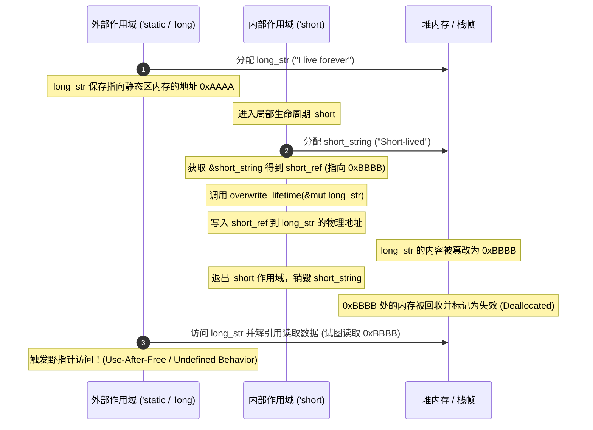

# 第一章：生命周期子类型与型变 (Variance) 机制

在 Rust 的类型系统中，**生命周期（Lifetimes）** 不仅用来标识引用的有效区域，更是决定类型兼容性的关键维度。为了能够编写高度泛型且内存安全的系统级 API，我们必须透彻理解**子类型关系（Subtyping）**与**型变特征（Variance）**。这两个概念构成了 Rust 静态借用检查器（Borrow Checker）底层最核心的数理基石。

---

## 1. 生命周期的子类型关系 (Subtyping)

在传统的面向对象语言（例如 Java 或 C++）中，子类型通常通过类的继承（Inheritance）关系来体现。例如，`Cat` 继承自 `Animal`，因此 `Cat` 是 `Animal` 的子类型，记作 `Cat <: Animal`。在任何需要 `Animal` 实例的地方，传入一个 `Cat` 实例是安全且符合编译规范的。

Rust 并没有传统的面向对象继承机制，但在类型系统中依然完整保留了**子类型（Subtyping）**的代数概念。

> [!IMPORTANT]
> **Rust 子类型的唯一实体：**
> 在 Rust 中，子类型关系完全是围绕**生命周期（Lifetimes）**展开的。具体类型的多态性是通过泛型（Generics）和 Trait 约束实现的，而生命周期的强转和兼容性则直接遵循子类型代数法则。

### 1.1 `'a: 'b` 的数学与逻辑本质

如果生命周期 `'a` 的存活时间比 `'b` 长（或者两者完全相同），在 Rust 中我们通过泛型约束记作：

$$\text{'a} : \text{'b}$$

（读作：`'a` outlives `'b`，即 `'a` 至少与 `'b` 一样长）。

在子类型的语境下，如果 `'a : 'b`，则意味着生命周期 `'a` 是 `'b` 的**子类型**。我们记作：

$$\text{'a} \le \text{'b} \quad \text{或} \quad \text{'a} <: \text{'b}$$

对于这个结论，初学者常常会产生直觉上的困惑：“既然 `'a` 的生命周期更长（存活范围更大），它为什么是 `'b` 的子类型（在集合论中子类型通常代表更小、更具体的子集）？”

我们可以通过以下逻辑进行直观推导：
1. **替换法则（Liskov Substitution Principle）**：如果类型 $S$ 是类型 $T$ 的子类型（$S <: T$），那么任何使用 $T$ 的地方都可以安全地用 $S$ 替换。
2. **引用的使用场景**：如果某个函数或变量期望获得一个存活时间至少为 `'short` 的引用，那么我们向其传入一个存活时间更长、保证绝不失效的 `'long` 引用，是绝对安全的。
3. **特化与通用**：生命周期越短，其约束越宽松，代表的范围越通用（父类型）；生命周期越长，其约束越严格，能够安全适配的场景越特化（子类型）。

由此可得：
* **`'static` 是所有生命周期的子类型**。因为对于任意生命周期 `'a`，都有 `'static : 'a`，因此：

  $$\forall \text{'a}, \quad \text{'static} <: \text{'a}$$

### 1.2 生命周期的子类型强制转换 (Subtype Coercion)

正是基于 `'a <: 'b`，Rust 编译器在编译期才允许进行**子类型强制转换（Subtype Coercion）**。编译器在分析变量的使用生命周期时，会隐式地将长生命周期的类型转换为短生命周期的类型，以满足函数的签名要求。

```rust
// 接收一个生命周期为 'a 的字符串切片引用
fn print_message<'a>(msg: &'a str) {
    println!("{}", msg);
}

fn main() {
    // s 的类型 is &'static str，其生命周期为全局静态区，即 'static
    let s: &'static str = "Hello, Static!";
    
    // 函数 print_message 期望得到 &'a str
    // 由于 'static <: 'a 始终成立，因此 &'static str 能够安全地隐式强转为 &'a str
    print_message(s);
}
```

---

## 2. 型变（Variance）理论体系

型变（Variance）描述了**复合泛型类型（如 `F<T>`）的子类型关系，如何随着其内部参数（如 `T`）的子类型关系变化而进行传导和改变。**

假设我们有一个泛型构造器 `F<T>`，已知两个类型存在子类型关系 $T <: U$。根据 `F<T>` 与 `F<U>` 之间所呈现的子类型关系，可将 `F` 对其参数 `T` 的型变特征分为以下三类：

### 2.1 协变 (Covariance)
* **定义**：如果 $T <: U$，则有 $F(T) <: F(U)$。
* **直观理解**：子类型的方向被**保留**了。如果内层参数变得更特化（更长寿），外层容器/引用也跟着变得更特化。
* **典型代表**：`&'a T` 对 `'a` 和 `T` 都是协变的。若 `'long <: 'short` 且 `Sub <: Super`，则有 `&'long Sub <: &'short Super`。

### 2.2 逆变 (Contravariance)
* **定义**：如果 $T <: U$，则有 $F(U) <: F(T)$。
* **直观理解**：子类型的方向被**反转**了。通常发生于**函数参数**的输入位置。
* **典型代表**：函数指针 `fn(T)` 对其参数 `T` 是逆变的。
  * **为什么？** 假设我们期望一个接收局部引用的函数 `fn(&'short str)`，如果传入一个只愿意接收 `'static` 引用的函数 `fn(&'static str)`，当我们在函数内传入局部数据时就会崩溃。相反，如果接收更窄（`'static`）引用的地方，我们传入一个能处理更宽（`'short`）引用的函数，则是完全安全的。因此，`fn(&'short str) <: fn(&'static str)`，方向反转。

### 2.3 不变 (Invariance)
* **定义**：如果 $T <: U$，无法推导出 $F(T)$ 与 $F(U)$ 之间的任何子类型关系。即 $F(T)$ 与 $F(U)$ 互不兼容，两者必须完全相同。
* **典型代表**：可变引用 `&mut T` 对整个类型 `T` 是不变的。

---

## 3. 型变与子类型层次关系图

为了建立清晰的几何直觉，以下展示了生命周期及泛型容器在协变、逆变和不变下的子类型映射关系：

```text
                  生命周期与类型子类型层次图 (Subtyping Hierarchy)
                  
          [子类型 Subtype] -------------------> [超类型 Supertype]
            更长寿 / 更具体                       更短寿 / 更抽象
            
         'static (例如 'static str)  =======>  'a (例如 'a str)
                  (由于 'static : 'a, 即 'static 是 'a 的子类型)
                  
  -----------------------------------------------------------------------------
                             型变特征与映射关系映射图
  -----------------------------------------------------------------------------
  
  1. 协变 (Covariance): F[T] 保持子类型方向
     T <: U  ===>  F[T] <: F[U]
     
     生命周期参数的协变传导:
     'static <: 'a  ===>  &'static str <: &'a str
     
     [ &'static str ]  ----------------------------------->  [ &'a str ]
           (Subtype)       (Covariance preserves direction)    (Supertype)
           
  2. 逆变 (Contravariance): F[T] 反转子类型方向
     T <: U  ===>  F[U] <: F[T]
     
     通常发生于函数入参位置（入参越宽，函数越通用，因而越是子类型）:
     'static <: 'a  ===>  fn(&'a str) <: fn(&'static str)
     
     [ fn(&'a str) ]   ----------------------------------->  [ fn(&'static str) ]
        (能接收更短生命周期                                    (仅能接收最长静态生命周期
         的引用，因而更通用)                                    的引用，因而较特化)
           (Subtype)      (Contravariance reverses direction)   (Supertype)
           
  3. 不变 (Invariance): F[T] 消除子类型关系
     T <: U  ===>  F[T] 与 F[U] 互不兼容 (必须完全相同)
     
     通常发生于可写容器/可变引用:
     'static <: 'a  ===>  &mut &'static str 与 &mut &'a str 无法进行任何强转
     
          [ &mut &'static str ]          < X >          [ &mut &'a str ]
                                     (No Subtyping)
```

---

## 4. 深入剖析：为什么 `&mut T` 对 `T` 必须是不变的？

这是整个 Rust 内存安全模型中最精妙的设计之一。在处理只读引用 `&T` 时，由于数据只读，我们不需要担心短生命周期的脏数据写入长生命周期位置。然而，可变引用 `&mut T` 支持数据的写回，这就是发生灾难的温床。

我们通过**反证法**来推导：**如果 `&mut T` 对 `T` 是协变的，会发生什么？**

### 4.1 内存安全隐患推导与致命代码演示

假设我们有两个生命周期 `'long` 与 `'short`，满足 `'long : 'short`（即 `'long` 是 `'short` 的子类型 `'long <: 'short`）。
如果 `&mut T` 对 `T` 是协变的，那么：

$$\text{\&mut \&'long str} <: \text{\&mut \&'short str}$$

这意味着我们可以把一个指向“长生命周期引用”的可变引用，安全地隐式转换为指向“短生命周期引用”的可变引用。以下是会导致 **Use-After-Free** 的虚构代码流程：

```rust
// 这是一个假设 &mut T 是协变时的错误示范。
// 在真实的 Rust 编译器中，第 10 行会直接报错，因为 &mut T 对 T 是不变的 (Invariant)。
fn overwrite_lifetime<'short, 'long>(
    short_ref: &'short str, 
    long_ref_mut: &mut &'long str
) where
    'long: 'short, // 即 'long 是 'short 的子类型 ('long <: 'short)
{
    // 【假设协变允许】：
    // 因为 &'long str 是 &'short str 的子类型，
    // 如果 &mut T 协变，则 &mut &'long str 可以隐式强转为 &mut &'short str
    let alias_mut: &mut &'short str = long_ref_mut; 

    // 我们向这个别名可变引用写入一个生命周期只有 'short 的短生命周期数据
    *alias_mut = short_ref; 
    
    // 执行完这一步后，由于 alias_mut 和 long_ref_mut 指向相同的内存地址，
    // 外界的 long_ref_mut 指向的内容已经被篡改为了 short_ref！
    // 但是外界的调用者依然完全认为 long_ref_mut 内部持有的依然是 'long 生命周期的安全引用！
}

fn main() {
    // 1. 定义一个生命周期为 'static 的长引用变量
    let mut long_str: &'static str = "I live forever";
    {
        // 2. 创建一个短生命周期的临时 String
        let short_string = String::from("Short-lived");
        // short_str 的生命周期为局部作用域 'short
        let short_str: &str = &short_string;
        
        // 3. 传入局部引用与长引用可变指针
        overwrite_lifetime(short_str, &mut long_str);
        
        // 4. 离开局部作用域，short_string 在此被 Drop 释放了！
    }
    
    // 5. 此时 long_str 依然存活，但它现在指向了已被释放 of short_string 的栈/堆内存！
    // 发生 Use-After-Free 悬垂指针访问！
    println!("{}", long_str); 
}
```

### 4.2 内存布局演变图解

通过时序与内存图可以清晰地看到由于“协变”导致非法写入的崩溃过程：



因为 `&mut T` 对 `T` 具有**不变性（Invariance）**，编译器在编译 `let alias_mut: &mut &'short str = long_ref_mut;` 时会报错，强制要求 `&'long str` 与 `&'short str` 的生命周期完全等值，从而在源头上杜绝了这种悬垂指针漏洞。

---

## 5. 型变一览表 (Variance Table)

为了在日常架构设计中能快速推导类型的安全特性，以下汇总了 Rust 标准库中常见核心类型的型变特征：

| 类型 | 对 `'a` 的型变 | 对 `T` (或 `U`) 的型变 | 核心设计考量与安全原因 |
| :--- | :--- | :--- | :--- |
| `&'a T` | **协变 (Covariant)** | **协变 (Covariant)** | 共享只读引用。数据“只出不进”，缩小生命周期或子类型转换绝对安全。 |
| `&'a mut T` | **协变 (Covariant)** | **不变 (Invariant)** | 可变引用。引用的生命周期 `'a` 协变，因为丢弃引用（缩短生命周期）是安全的；但指向的类型 `T` 支持写入，必须不变。 |
| `Box<T>` | - | **协变 (Covariant)** | 独占所有权容器。因为没有别名 (Aliasing)，一旦转移所有权，旧数据即失效，故可以随 `T` 协变。 |
| `Rc<T>` / `Arc<T>` | - | **协变 (Covariant)** | 共享只读容器。因为在安全代码下不提供内部可变性，故协变。 |
| `fn(T) -> U` | - | `T`: **逆变 (Contravariant)**<br>`U`: **协变 (Covariant)** | 函数指针。入参是逆变（可以接收更广范围的生命周期），出参是协变（可以输出比期望更长寿的生命周期）。 |
| `Cell<T>` / `RefCell<T>` | - | **不变 (Invariant)** | 内部可变性容器。支持通过安全接口进行写入操作，因此必须是不变的。 |
| `UnsafeCell<T>` | - | **不变 (Invariant)** | 核心内部可变性原语。由于允许获取 `*mut T` 并写回，为了安全必须强行声明为不变的。 |
| `PhantomData<T>` | - | 与 `T` 一致 | 编译期标记占位符。其型变规则等同于 `T` 本身。 |

---

## 6. PhantomData 的型变控制与高级应用

在编写 FFI（外部函数接口）绑定，或者自己管理裸指针（Raw Pointers）以实现底层数据结构时，我们常常需要控制泛型参数的型变。

### 6.1 裸指针的型变困境
裸指针 `*const T` 和 `*mut T` 具有不同的型变特征：
*   `*const T` 对 `T` 是**协变**的。
*   `*mut T` 对 `T` 是**不变**的。

当我们使用裸指针包裹自定义智能指针时，编译器由于只看到裸指针字段，可能无法准确自动推导出我们所期望的型变特性。这时，我们就需要借助零大小的标记类型 `std::marker::PhantomData`。

### 6.2 精准控制型变的 PhantomData 模式

#### 示例 1：创建协变的只读泛型容器
假设我们使用 `*mut T` 存储底层数据（因为要在内部进行 Unsafe 的就地初始化或指针偏移），但该容器仅向外界暴露只读接口，因此逻辑上我们希望它对 `T` 保持**协变**（如标准库中的 `Vec<T>`）：

```rust
use std::marker::PhantomData;

pub struct CovariantReader<T> {
    // 裸指针本身：*mut T 是不变的
    ptr: *mut T,
    // 我们通过 PhantomData<T> 告诉借用检查器：该容器逻辑上占有 T，且对 T 是协变的
    _marker: PhantomData<T>, 
}

impl<T> CovariantReader<T> {
    pub fn new(val: T) -> Self {
        let boxed = Box::new(val);
        Self {
            ptr: Box::into_raw(boxed),
            _marker: PhantomData,
        }
    }

    pub fn read(&self) -> &T {
        // SAFETY: 确保 ptr 指向合法的堆内存且尚未被释放
        unsafe { &*self.ptr }
    }
}

impl<T> Drop for CovariantReader<T> {
    fn drop(&mut self) {
        // SAFETY: 将裸指针还原为 Box 并安全释放
        unsafe {
            let _ = Box::from_raw(self.ptr);
        }
    }
}
```

#### 示例 2：创建不变的自定义生命周期游标
假设我们在设计一个流式解析器或迭代器，包含泛型生命周期参数 `'a`。我们在底层会依赖精确的生命周期匹配来更新上下文，如果允许生命周期 `'a` 发生协变（被隐式缩短），可能会导致内部的状态机出现不同步。我们需要强制生命周期 `'a` 成为**不变的**：

```rust
use std::marker::PhantomData;
use std::cell::Cell;

pub struct InvariantCursor<'a, T> {
    ptr: *const T,
    // &'a () 本身是协变的。
    // 但是 Cell<T> 对 T 是不变的。
    // 包裹之后，Cell<&'a ()> 对 'a 是不变的。
    // 因此整个 InvariantCursor 对 'a 的型变也被强制转为了不变 (Invariant)。
    _lifetime_marker: PhantomData<Cell<&'a ()>>,
}

impl<'a, T> InvariantCursor<'a, T> {
    pub fn new(slice: &'a [T]) -> Self {
        Self {
            ptr: slice.as_ptr(),
            _lifetime_marker: PhantomData,
        }
    }
}
```

通过合理配置 `PhantomData` 的包裹类型， we能让 Rust 的借用检查器以零成本的编译期安全护栏，全方位守护我们底层高性能设计的内存物理安全。
