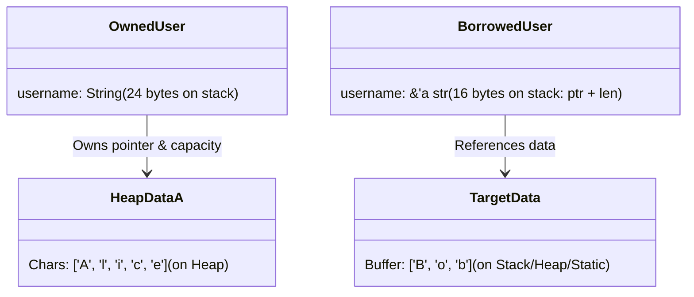

# 第二章：生命周期标注与编译器借用分析

在第一章中，我们看到借用检查器能够自动分析单函数内局部变量的生命周期。然而，一旦涉及跨函数边界的引用传递，或者在自定义数据结构中保存引用，单凭局部控制流图（CFG）就不够了。这时，我们需要使用**生命周期标注（Lifetime Annotations）**。

本章将详细讨论为什么以及如何进行生命周期标注，结构体生命周期的设计逻辑，编译器的三大生命周期消除规则，以及方法（`impl` 块）中的生命周期语法规则。

---

## 2.1 生命周期标注的本质与误区

对于初学者来说，最大的心智误区在于误以为生命周期标注是用来“延长”引用生存时间的。

> [!IMPORTANT]
> **核心原则：** 生命周期标注**绝不能**改变引用的运行时生存周期。
> 生命周期的本质是**向编译器声明多个引用之间的生命周期契约关系**。

编译器是一门极其严谨的科学。在编译一个函数时，Rust 编译器要求**必须仅根据该函数的签名（Signature）**来完成对该函数的借用检查，而不需要去窥探函数内部的实现逻辑。这种设计叫做“局部静态分析”（Local Static Analysis），它保证了编译速度以及函数内部重构时不会无意中破坏外部调用者的编译合法性。

因此，如果一个函数接收引用并返回引用，函数签名中必须以生命周期参数的形式，明确告知编译器：**返回的引用的生命周期，与输入的引用的生命周期之间存在着何种对应关系。**

---

## 2.2 函数签名中的生命周期标注

我们来看一个经典案例：实现一个返回两个字符串切片中较长者的函数。

### 未标注签名的编译器困境

如果我们这样写：

```rust
// 编译失败！
fn longest(x: &str, y: &str) -> &str {
    if x.len() > y.len() {
        x
    } else {
        y
    }
}
```

编译器会立刻报错：

```text
error[E0106]: missing lifetime specifier
 --> src/main.rs:2:33
  |
2 | fn longest(x: &str, y: &str) -> &str {
  |               ----     ----     ^^^^ expected named lifetime parameter
  |
  = help: this function's return type contains a borrowed value, but the signature does not say whether it is borrowed from `x` or `y`
```

#### 为什么编译器不能自行推导？
在 `longest` 函数被调用时，传入的参数 `x` 和 `y` 可能来自于不同的变量，具有截然不同的生存期。
- 假设 `x` 指向一个生存期很短的临时变量；
- `y` 指向一个生存期很长的全局变量。
- 如果函数体内的条件判断导致它返回了 `x`，那么调用者拿到的返回值就必须和 `x` 一样短。
- 如果返回了 `y`，返回值则可以长一些。

因为编译器只能在编译期做静态推导，且不读取函数体，所以它**无法提前预知**在运行时到底是返回 `x` 还是 `y`。为了确保绝对安全，编译器必须假设返回值可能来自两者中的任意一个。这就需要将返回值的生命周期与输入参数的生命周期进行绑定。

### 显式生命周期标注的语义

我们为函数声明一个泛型生命周期参数 `'a`：

```rust
// 编译成功
fn longest<'a>(x: &'a str, y: &'a str) -> &'a str {
    if x.len() > y.len() {
        x
    } else {
        y
    }
}
```

#### 语意解释：
- `<'a>`：在函数名后面声明一个泛型生命周期参数 `'a`。
- `x: &'a str`：声明输入参数 `x` 必须是一个至少存活 `'a` 时间的字符串引用。
- `y: &'a str`：声明输入参数 `y` 也必须是一个至少存活 `'a` 时间的字符串引用。
- `-> &'a str`：声明该函数的返回值也是一个至少存活 `'a` 时间的字符串引用。

这并不是说传入的 `x` 和 `y` 必须具有完全相同的物理生存期。实际上，**`'a` 最终会被推导为 `x` 和 `y` 两者生存期的“交集”（即较短的那一个生存期）**。

### 验证交集逻辑的编译代码

```rust
fn longest<'a>(x: &'a str, y: &'a str) -> &'a str {
    if x.len() > y.len() { x } else { y }
}

fn main() {
    let string1 = String::from("long string is long");
    let result;
    {
        let string2 = String::from("xyz");
        // string2 的生存期较短，所以此时 'a 被推导为与 string2 一致
        result = longest(&string1, &string2); 
        println!("The longest string is {}", result); // 正常使用，因为 result 的生命周期未结束
    } // string2 在此被 Drop，因此 result 的生命周期也在此结束
    
    // println!("result: {}", result); // 如果取消此行注释，编译将报错，因为 string2 已经销毁
}
```

---

## 2.3 结构体中的生命周期标注

如果一个结构体（`struct`）中包含了引用类型的字段，我们也必须在定义结构体时显式标注生命周期。

### 为什么必须标注？

结构体是数据的容器。如果它持有了外部数据的引用，那么这个结构体实例就绝对不能比它所引用的数据活得更久。否则，一旦被引用的数据被销毁，而结构体仍然存活，那么试图通过结构体访问该字段时就会发生悬空指针访问。

### 内存布局与对比

我们来对比一下“持有引用”与“持有所有权”的两种结构体设计：

```rust
// 设计A：持有所有权 (无生命周期标注)
struct OwnedUser {
    username: String, // 直接在堆上持有数据的所有权
}

// 设计B：持有引用 (必须有生命周期标注)
struct BorrowedUser<'a> {
    username: &'a str, // 持有对外部字符串的引用
}
```

在内存布局上，它们有着本质的区别：



### 经典实战：零拷贝解析器结构体

以下是一个用于解析配置文件或网络数据的解析器（Parser）的实现。它通过生命周期标注 `'a`，确保解析器实例不会超越源缓冲区（source buffer）的生命周期。

```rust
// 声明解析器持有一个对原始 &[u8] 的引用
struct ByteParser<'a> {
    data: &'a [u8],
    position: usize,
}

impl<'a> ByteParser<'a> {
    // 读取下一个字节
    fn next_byte(&mut self) -> Option<u8> {
        if self.position < self.data.len() {
            let val = self.data[self.position];
            self.position += 1;
            Some(val)
        } else {
            None
        }
    }

    // 零拷贝获取切片。返回值的生命周期绑定到结构体的生命周期 'a
    fn read_slice(&mut self, length: usize) -> Option<&'a [u8]> {
        if self.position + length <= self.data.len() {
            let start = self.position;
            self.position += length;
            // 关键：将 self.data 的切片返回，其生命周期与外部 buffer 同样为 'a
            Some(&self.data[start..self.position])
        } else {
            None
        }
    }
}

fn main() {
    let source_buffer = vec![0x10, 0x20, 0x30, 0x40, 0x50];
    let mut parser = ByteParser {
        data: &source_buffer,
        position: 0,
    };

    let slice = parser.read_slice(3).unwrap();
    assert_eq!(slice, &[0x10, 0x20, 0x30]);
    // 即使丢弃 parser，slice 依然可以访问，因为它的生命周期 'a 绑定到了 source_buffer
    drop(parser); 
    assert_eq!(slice[0], 0x10); 
}
```

### 嵌套结构体的生命周期约束

当一个带有生命周期的结构体嵌套在另一个结构体中时，外层结构体也必须将该生命周期参数传递并向上扩展。例如：

```rust
struct Inner<'a> {
    content: &'a str,
}

// 外层结构体也必须声明 'a，并将约束向下传递给 Inner
struct Outer<'a> {
    inner: Inner<'a>,
    tag: &'a str,
}
```

---

## 2.4 生命周期消除规则 (Lifetime Elision Rules)

在实际编写 Rust 代码时，你可能会发现很多接收引用的函数并不需要我们显式书写 `'a`：

```rust
fn first_word(s: &str) -> &str {
    let bytes = s.as_bytes();
    for (i, &item) in bytes.iter().enumerate() {
        if item == b' ' { return &s[0..i]; }
    }
    &s[..]
}
```

这个函数接收一个引用并返回一个引用，为什么没有编译报错？这是因为 Rust 编译器内置了一套**生命周期消除（Elision）规则**。

### 消除规则的产生背景
在 Rust 的早期版本中，每个函数签名中的引用都必须写明生命周期。然而，经过社区大规模代码分析，编译器团队发现大多数情况下，引用的生命周期推导都符合几种极其确定的编程范式。为了简化代码书写（Syntactic Sugar），编译器团队将这几条确定性推导公式写入了编译器。

### 三条黄金推导规则

在应用这些规则前，编译器会将引用区分为**输入生命周期**（Input Lifetimes，对应函数参数）和**输出生命周期**（Output Lifetimes，对应返回值）。

1. **规则一**：每一个是引用的输入参数，都会被分配一个独立的生命周期参数。
   - 例如：`fn foo(x: &i32)` 会被推导为 `fn foo<'a>(x: &'a i32)`。
   - `fn bar(x: &i32, y: &i32)` 会被推导为 `fn bar<'a, 'b>(x: &'a i32, y: &'b i32)`。

2. **规则二**：如果只有一个输入生命周期参数（即只有一个参数带有引用），那么该生命周期会被分配给**所有**输出生命周期参数。
   - 例如：`fn foo(x: &i32) -> &i32` 会被自动推导为 `fn foo<'a>(x: &'a i32) -> &'a i32`。

3. **规则三**：如果有多个输入生命周期参数，但其中一个是 `&self` 或 `&mut self`（代表这是一个对象的方法），那么 `self` 的生命周期会被分配给**所有**输出生命周期参数。
   - 这非常符合面向对象的设计直觉：从对象的方法中取出的相关引用，其有效性通常绑定在对象本身的生命周期上。

### 编译器推导步骤演示

我们通过一个签名，逐步看编译器是如何代入公式展开的：

#### 初始签名：
```rust
fn get_data(s: &str, parser: &Parser) -> &str
```

1. **应用规则一**（为每一个参数分配独立生命周期）：
   - `s` 是引用，分配 `'a`
   - `parser` 的字段/类型如果是引用，分配 `'b`
   展开后：
   ```rust
   fn get_data<'a, 'b>(s: &'a str, parser: &'b Parser) -> &str
   ```
2. **应用规则二**：
   - 输入生命周期有两个：`'a` 和 `'b`。
   - 规则二要求**有且仅有一个**输入生命周期。条件不满足，跳过规则二。
3. **应用规则三**：
   - 该函数没有接收 `self`，不满足条件，跳过规则三。
4. **结论**：
   经过三步分析，编译器的推导引擎未能推导出输出生命周期参数的绑定源，编译宣告失败。这就是为什么在 2.2 节中的 `longest` 函数必须手动标注生命周期的底层机理。

---

## 2.5 方法（`impl` 块）中的生命周期语法

在实现结构体的方法时，生命周期的书写有着其特定的规则：

```rust
struct ImportantExcerpt<'a> {
    part: &'a str,
}

// 必须在 impl 关键字后声明泛型生命周期 'a，
// 并在结构体名称后使用它，因为 'a 是结构体类型定义的一部分。
impl<'a> ImportantExcerpt<'a> {
    // 适用消除规则一和规则三，编译器自动为 &self 分配生命周期，并将其赋给返回值
    fn announce_and_return_part(&self, announcement: &str) -> &str {
        println!("Attention please: {}", announcement);
        self.part
    }
}
```

### 多生命周期参数的方法实现

如果某个方法除了需要结构体本身的生命周期 `'a`，还需要引入一个额外的、与结构体生命周期相对独立的生命周期 `'b`，我们可以同时声明它们：

```rust
impl<'a> ImportantExcerpt<'a> {
    // 声明一个新的泛型生命周期参数 'b
    fn update_and_compare<'b>(&mut self, new_part: &'b str) -> &'a str 
    where
        'b: 'a // 生命周期约束：'b 必须活得比 'a 还要久（即 Subtyping 约束）
    {
        let old_part = self.part;
        self.part = new_part; // 只有当 'b 活得比 'a 久时，我们才能把 &'b str 赋值给 &'a str
        old_part
    }
}
```

在下一章中，我们将深入探讨 `'b: 'a` 这类复杂的生命周期子类型约束（Subtyping）、变异性（Variance）以及更高级的安全设计模式。
