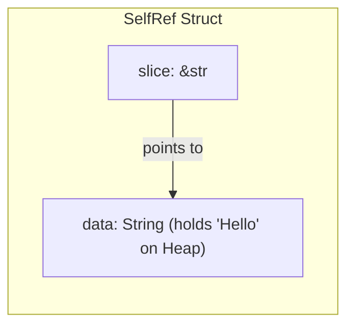

# 第三章：生命周期安全设计模式与疑难排查

在编写高质量 Rust 代码的过程中，我们不可避免地会遇到各种生命周期编译错误。理解这些错误的底层原因，并掌握高级生命周期模式（如型变、高阶 Trait 约束及自引用处理方法），是精通 Rust 系统编程的必经之路。

本章将详细剖析生命周期的常见编译报错、高级理论模型（子类型与型变）、高阶 Trait 约束（HRTB），以及如何设计实现高性能的零拷贝日志解析器。

---

## 3.1 常见生命周期编译错误与重构方案

### 错误 1：返回局部变量的引用 (Cannot return reference to local variable)

这是最典型的借用错误。当我们在函数内部创建了一个值，并试图返回它的引用：

```rust
// 错误示例
fn get_name() -> &str {
    let name = String::from("Alice");
    &name // 编译报错！
}
```

#### 解决方案：
1. **转移所有权**：最直接的方法是不返回引用，而是返回原对象，将所有权转移给调用者。
   ```rust
   fn get_name() -> String {
       String::from("Alice") // 返回所有权
   }
   ```
2. **传入生存期更长的缓冲区**：让调用者提供一个可写入的引用，这也是 C 语言中常用的模式。
   ```rust
   fn write_name(buf: &mut String) {
       buf.push_str("Alice");
   }
   ```

### 错误 2：借用值存活时间不够长 (Borrowed value does not live long enough)

当我们在一个较窄的作用域内借用了一个变量，但试图将这个引用赋给一个生命周期更长的变量：

```rust
// 错误示例
fn main() {
    let mut ref_to_data = None;
    {
        let local_data = vec![1, 2, 3];
        // error[E0597]: `local_data` does not live long enough
        ref_to_data = Some(&local_data[0]); 
    } // local_data 在此被销毁
    println!("{:?}", ref_to_data); // 此时 ref_to_data 包含悬空引用
}
```

#### 解决方案：
通过重构代码结构，提升被借用变量的声明生命周期（使其作用域大于或等于引用的生命周期）：
```rust
fn main() {
    let local_data = vec![1, 2, 3]; // 提前声明
    let mut ref_to_data = None;
    {
        ref_to_data = Some(&local_data[0]); 
    } 
    println!("{:?}", ref_to_data); // 编译成功！
}
```

### 错误 3：对同一个值进行冲突的借用 (Cannot borrow as mutable because it is also borrowed as immutable)

当同一段数据在同一时间既被读又被写：

```rust
// 错误示例
fn main() {
    let mut data = vec![1, 2, 3];
    let first = &data[0]; // 只读借用
    data.push(4);        // 可变借用！编译报错
    println!("{}", first); // 只读借用在这里仍处于活跃状态
}
```

#### 解决方案：
1. **缩短只读引用的生存期**（依赖 NLL 分析，提前结束使用）：
   ```rust
   fn main() {
       let mut data = vec![1, 2, 3];
       let first = &data[0];
       println!("{}", first); // 在此之后 first 不再被使用
       data.push(4);          // NLL 判定只读借用已失效，编译成功
   }
   ```
2. **如果确需同时保留旧数据和新写入，使用 `clone` 或重构逻辑避免原地修改**。

---

## 3.2 生命周期子类型与型变 (Subtyping & Variance)

在 Rust 中，生命周期也存在**子类型关系（Subtyping）**。
- 如果生命周期 `'a` 存活的时间比 `'b` 长，我们记作 `'a: 'b`（读作 `'a` outlives `'b`）。
- 在 Rust 的子类型模型中，**长生命周期的引用是短生命周期引用的子类型**。也就是说，如果 `'a: 'b`，那么 `'a` 是 `'b` 的子类型（记作 `'a <: 'b`）。因为任何需要短生命周期引用的地方，我们都可以安全地传入一个生存期更长的引用。

### 什么是型变（Variance）？

型变描述了：当泛型参数的类型或生命周期发生子类型化时，**整个复合类型（如容器、指针）的子类型关系会如何变化**。

主要分为以下三种类型：

| 复合类型 | 对泛型参数 `T` 的型变关系 | 物理含义 |
| :--- | :--- | :--- |
| `&'a T` | 对 `'a` **协变 (Covariant)**，对 `T` **协变** | 如果 `'a <: 'b`，那么 `&'a T <: &'b T` |
| `fn(T)` | 对 `T` **逆变 (Contravariant)** | 逆转子类型关系（例如：接收宽泛类型的函数可以替代接收具体类型的函数） |
| `&mut T` | 对 `T` **不变 (Invariant)** | 必须完全一致，不能发生子类型转换 |

### 为什么可变引用 `&mut T` 必须是不变（Invariant）的？

这是一个极为经典的内存安全设计问题。我们如果允许 `&mut T` 满足协变，就可能写出制造悬空指针的致命安全漏洞。

以下是如果 `&mut T` 发生协变时，可能导致的编译漏洞推演：

```rust
// 伪代码：假设 &mut T 对 T 是协变的
fn main() {
    let mut long_lived_str: &'static str = "Hello Static";
    
    {
        let short_lived_str = String::from("short");
        
        // 声明一个 &mut &'a str，类型为 &'inner mut &'short str
        // 如果满足协变，我们可以把 &mut &'static str 强转为 &mut &'short str
        let mut_ref: &mut &str = &mut long_lived_str; 
        
        // 在 mut_ref 指向的地方（即 long_lived_str 的物理地址），
        // 存入生存期极短的 &short_lived_str 引用
        *mut_ref = &short_lived_str; 
    } // short_lived_str 在此被 Drop
    
    // 此时，long_lived_str 依然存活，但它所包含的指针已指向已被销毁的堆内存！
    // 发生了 Use-After-Free 悬空指针访问！
    println!("{}", long_lived_str); 
}
```

为了彻底封堵上述漏洞，Rust 强制规定：**对于含有写入权的借用 `&mut T`，其泛型参数 `T` 必须是“不变的（Invariant）”**。因此，上例中 `&mut &'static str` 不能转换为 `&mut &'short str`，上述逻辑在编译期就会被直接拦截。

---

## 3.3 高阶 Trait 约束 (HRTB, Higher-Rank Trait Bounds)

当我们编写接收闭包（Closure）的泛型函数时，常常会遇到一种特殊的生命周期绑定困境。

### 问题的引入

假设我们要编写一个解析函数，它接收一段字符串和解析闭包。该闭包会借用字符串的一部分。我们可能会写出以下代码：

```rust
// 编译失败示例
fn parse_data<'a, F>(data: &'a str, parser: F)
where
    F: Fn(&'a str), // 强制要求闭包参数的生命周期与输入字符串完全一致
{
    parser(data);
}
```

这段代码初看起来很合理，但是如果闭包内部需要在调用时动态产生一个更短生命周期的借用（比如在一个内层循环中对解析出的片断再调用闭包），上述的 `'a` 绑定就会因为过于生硬而导致编译失败。

### HRTB 与 `for<'a>` 语法

高阶 Trait 约束允许我们声明：**此闭包可以接收任意生命周期的引用，而不是某个在函数入口处就被固定下来的生命周期 `'a`**。其语法写作 `for<'a> Trait`：

```rust
// 使用 HRTB 的正确写法
fn parse_data_hrtb<F>(data: &str, parser: F)
where
    F: for<'a> Fn(&'a str), // 读作：对于任意生命周期 'a，F 均实现了 Fn(&'a str)
{
    // 无论 data 的物理借用生命周期是什么，
    // parser 都可以随时随地被调用
    parser(data);
}
```

`for<'a>` 表达了一种后期绑定（Late-bound）生命周期的语义，它使得库的接口设计者在处理多级回调、异步流水线、事件驱动系统时，具有了极其强大的泛型多态表达力。

---

## 3.4 `'static` 生命周期的双重语境

`'static` 是 Rust 中唯一的保留生命周期关键字。初学者最容易将其误用在所有引用报错的地方，必须理清它的双重语义。

### 语境 1：数据存活于整个程序运行期

当用于引用修饰时，如 `&'static T`，表示被引用的数据在编译期就已经确定，或者它的物理存储空间将一直保留到程序退出。
- **只读字符串常量**：`let s: &'static str = "Const string";`（数据存放在静态数据段 `.rodata` 中）。
- **泄漏的堆内存**：通过 `Box::leak` 动态分配的内存会跳过析构函数，变成 `'static` 生命周期。

### 语境 2：泛型约束 `T: 'static`

当用作泛型 Trait Bounds 时，`T: 'static` 的实际含义是：**类型 `T` 不包含任何具有非 `'static` 生命周期的引用字段**。

```rust
// 泛型参数要求满足 'static 约束
fn spawn_thread<T: Send + 'static>(task: T) {
    // ...
}
```

这里 `T: 'static` 的语义是：`T` 可以是 `String`、`i32` 或者 `&'static str` 等拥有完整所有权或生命周期无限的数据类型。但如果传入了 `&'a str`，则会报错，因为线程（Thread）的生存期是独立于当前函数的，如果允许传入局部生命周期的引用，就会引发内存崩溃。

---

## 3.5 自引用结构体 (Self-Referential Structs) 终极解密

在高级 Rust 编程中，自引用结构体是一个出了名的痛点。

### 什么是自引用结构体？

自引用结构体是指一个结构体内部的某个字段持有了同一个结构体中另一个字段的引用。例如：

```rust
// 逻辑上的自引用，在 Rust 下直接编写无法通过编译
struct SelfRef<'a> {
    data: String,
    slice: &'a str, // 试图指向 data
}
```



### 为什么 Rust 默认禁止它？

一旦将此结构体实例移动（Move）到另一个内存地址（例如作为参数传递、放入数组或函数返回）：
1. 它的 `data` 字段在栈上的基地址会发生改变。
2. 然而，`slice` 字段中保存的内存地址依然是**移动前**的旧物理地址。
3. 此时解引用 `slice`，会访问已被置空或已被分配作他用的栈内存，造成破坏性的未定义行为。

### 常见解决方案与取舍

1. **逻辑解耦（使用下标）**：
   不保存指针，只保存相对偏移量。
   ```rust
   struct Decoupled {
       data: String,
       slice_start: usize,
       slice_end: usize,
   }
   ```
2. **利用 `Pin<P>` 与裸指针**：
   使用内置的固定（Pinning）机制防止结构体在内存中移动，并使用不安全的裸指针手动建立和更新绑定。
3. **使用工业级成熟库 `ouroboros`**：
   `ouroboros` 通过宏在编译期生成安全的自引用封装，并在内部完成必要的安全转移工作。

---

## 3.6 综合实战：高性能零拷贝日志解析器 (Log Parser)

下面我们将编写一个符合工业生产级别的、完全无内存拷贝的日志解析系统。它高效利用生命周期标注，极快地解析内存中的原始日志日志行。

```rust
use std::fmt;

// 1. 定义解析错误类型
#[derive(Debug, PartialEq, Eq)]
pub enum ParserError {
    InvalidFormat,
    MissingField(&'static str),
}

impl fmt::Display for ParserError {
    fn fmt(&self, f: &mut fmt::Formatter<'_>) -> fmt::Result {
        match self {
            ParserError::InvalidFormat => write!(f, "Invalid log line format"),
            ParserError::MissingField(field) => write!(f, "Missing required field: {}", field),
        }
    }
}

// 2. 核心数据结构：完全不分配新内存，所有字段共享源缓冲区的引用 'a
#[derive(Debug, PartialEq, Eq)]
pub struct LogEntry<'a> {
    pub timestamp: &'a str,
    pub log_level: &'a str,
    pub module: &'a str,
    pub message: &'a str,
}

// 3. 解析器结构体，保存对源缓冲区生命周期为 'a 的不可变引用
pub struct LogParser<'a> {
    source: &'a str,
}

impl<'a> LogParser<'a> {
    pub fn new(source: &'a str) -> Self {
        LogParser { source }
    }

    // 逐行解析并返回包含生命周期 'a 引用的 LogEntry 集合
    pub fn parse_all_lines(&self) -> Vec<Result<LogEntry<'a>, ParserError>> {
        self.source
            .lines()
            .map(|line| self.parse_single_line(line))
            .collect()
    }

    // 核心的零拷贝单行解析逻辑
    // 输入为一行 slice (它的生命周期 'line 必须与 'a 一致，通过 'a 约束)
    fn parse_single_line(&self, line: &'a str) -> Result<LogEntry<'a>, ParserError> {
        // 假设日志格式为: [TIMESTAMP] LEVEL [MODULE] MESSAGE
        // 示例: [2026-05-30 22:00:00] INFO [kernel] System boot completed.
        if !line.starts_with('[') {
            return Err(ParserError::InvalidFormat);
        }

        let ts_end = line.find(']').ok_or(ParserError::InvalidFormat)?;
        let timestamp = &line[1..ts_end];

        // 裁剪掉时间戳部分，继续解析
        let remainder = line[ts_end + 1..].trim_start();
        
        let level_end = remainder.find(' ').ok_or(ParserError::MissingField("level"))?;
        let log_level = &remainder[..level_end];

        let remainder = remainder[level_end + 1..].trim_start();

        if !remainder.starts_with('[') {
            return Err(ParserError::InvalidFormat);
        }

        let module_end = remainder.find(']').ok_or(ParserError::MissingField("module"))?;
        let module = &remainder[1..module_end];

        let message = remainder[module_end + 1..].trim_start();
        if message.is_empty() {
            return Err(ParserError::MissingField("message"));
        }

        Ok(LogEntry {
            timestamp,
            log_level,
            module,
            message,
        })
    }
}

// 4. 测试模块，展示其零拷贝的高效性以及严格的生命周期保障
#[cfg(test)]
mod tests {
    use super::*;

    #[test]
    fn test_zero_copy_log_parser() {
        // 日志存在堆上，生存期由当前测试函数拥有
        let log_data = String::from(
            "[2026-05-30 22:00:00] INFO [kernel] System boot completed.\n\
             [2026-05-30 22:01:05] WARN [storage] High disk write latency detected."
        );

        let parser = LogParser::new(&log_data);
        let results = parser.parse_all_lines();

        assert_eq!(results.len(), 2);

        // 验证解析出的字段均正确
        let entry1 = results[0].as_ref().unwrap();
        assert_eq!(entry1.timestamp, "2026-05-30 22:00:00");
        assert_eq!(entry1.log_level, "INFO");
        assert_eq!(entry1.module, "kernel");
        assert_eq!(entry1.message, "System boot completed.");

        // 验证引用的底层地址是否与 log_data 中的地址在同一个范围内，证明其“零拷贝”特性
        let origin_ptr = log_data.as_ptr() as usize;
        let entry_ptr = entry1.timestamp.as_ptr() as usize;
        
        // entry1.timestamp 应在 log_data 指向的内存缓冲区范围之内
        assert!(entry_ptr >= origin_ptr);
        assert!(entry_ptr < origin_ptr + log_data.len());
    }
}
