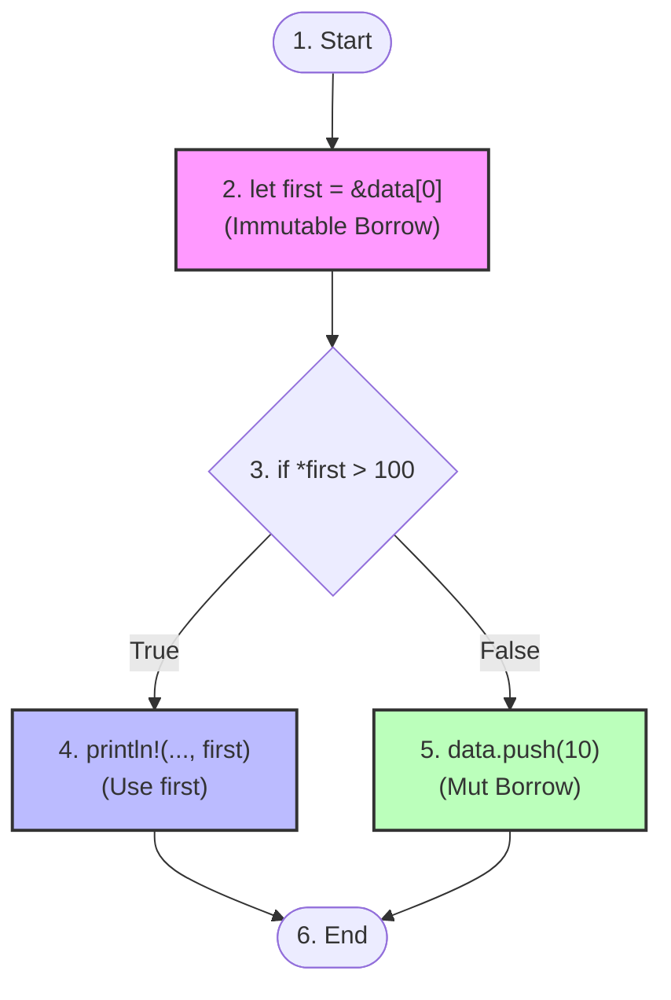

# 第一章：变量作用域与栈帧生命周期深度分析

要真正理解 Rust 的生命周期，我们不能只停留在语法表面，而必须深入到引用在内存中的物理表示、栈帧的变化以及编译器如何追踪变量的使用轨迹。本章将从底层硬件与编译器设计的视角，剖析引用的物理本质、悬空指针的成因、控制流图（CFG）驱动的非词法生命周期（NLL），以及变量的析构顺序与借用检查的核心安全定理。

---

## 1.1 引用的底层表示与内存语义

在 CPU 和操作系统的物理世界中，并没有“引用”或“所有权”的概念，只有**内存地址**、**寄存器**和**机器指令**。

### 引用的物理本质

在 Rust 中，不可变引用 `&T` 和可变引用 `&mut T` 在编译成机器码后，其底层物理表示与 C 语言中的裸指针（`*const T` 和 `*mut T`）完全一致。它们都占用一个机器字长（在 64 位系统上为 8 字节），其值就是目标数据所在内存的首地址。

我们可以通过下面的代码将引用转换为裸指针并打印其地址，以此证明其底层的物理一致性：

```rust
fn main() {
    let value: i32 = 42;
    
    // 创建一个只读引用
    let r1: &i32 = &value;
    
    // 将引用转换为 raw pointer (裸指针) 并强转为 usize 打印
    // 这表明 r1 的值就是一个普通的内存地址值
    let raw_addr = r1 as *const i32 as usize;
    
    println!("Value: {}", value);
    println!("Reference r1 points to address: 0x{:X}", raw_addr);
    
    // 验证 raw pointer 解引用后的值与引用一致
    // 必须在 unsafe 块内对裸指针进行解引用
    unsafe {
        assert_eq!(*r1, *(raw_addr as *const i32));
    }
}
```

对于胖指针（Fat Pointer），例如切片引用 `&[T]` 或特征对象引用 `&dyn Trait`，它们在物理上占用两个机器字长（16 字节）：
*   `&[T]` 包含：一个指向数据的指针（Pointer） + 一个表示元素数量的长度（Length）。
*   `&dyn Trait` 包含：一个指向具体类型实例的数据指针（Data Pointer） + 一个指向该类型虚函数表（vtable）的指针。

### 内存布局与栈帧变化

当我们在栈上声明变量并创建其引用时，内存中的数据分布及指针指向关系如下所示：

```
           Stack Memory (High Address)
     ┌─────────────────────────────────────┐
     │ ... previous stack frames ...       │
     ├─────────────────────────────────────┤
     │ main() Stack Frame                  │
     │ ┌─────────────────────────────────┐ │
     │ │ x: i32 = 100                    │ │ ◄──┐
     │ │ (Address: 0x7ffee0b1e4c0)       │ │    │
     │ ├─────────────────────────────────┤ │    │
     │ │ r: &i32 = 0x7ffee0b1e4c0        │ │ ───┘ ( r points to x )
     │ │ (Address: 0x7ffee0b1e4c8)       │ │
     │ └─────────────────────────────────┘ │
     └─────────────────────────────────────┘
           Stack Memory (Low Address)
```

在函数调用期间，每次声明新变量都会在当前栈帧（Stack Frame）上分配内存。如果将一个局部变量的引用传递给其他函数，或者在当前栈帧中创建引用，编译器必须保证：**存放引用的内存地址（如上面的 `0x7ffee0b1e4c8`）所存储的内容（指向 `x` 的地址 `0x7ffee0b1e4c0`），在其对应的被引用实体失效之前，绝对不能被非法解引用。**

---

## 1.2 栈帧生命周期与悬空指针漏洞防范

为了理解 Rust 为什么要大费周章地在编译期引入生命周期分析，我们首先看看 C/C++ 中最经典的安全漏洞——悬空指针（Dangling Pointer）是如何产生的。

### C/C++ 中的悬空指针漏洞

下面是一段典型的 C 语言代码，它试图返回一个局部变量的地址：

```c
#include <stdio.h>

int* get_local_ptr() {
    int local_var = 1024;
    return &local_var; // 致命警告：返回了局部变量的地址
}

int main() {
    int* ptr = get_local_ptr();
    // 此时 get_local_ptr 的栈帧已经被销毁（退栈）
    // ptr 指向的地址已经不再安全，随时可能被其他函数调用栈帧覆盖
    printf("Value: %d\n", *ptr); // 未定义行为 (Undefined Behavior, UB)
    
    // 触发另一个函数调用，覆盖栈帧
    printf("Overwrite stack...\n");
    printf("Value again: %d\n", *ptr); // 此时输出的内容大概率已不是 1024
    return 0;
}
```

在物理内存层面上，函数的入栈和出栈会导致如下变化：

```
 C/C++ 局部变量指针返回的栈帧行为：
 
 1. 调用 get_local_ptr() 期间：
    ┌───────────────────────────┐
    │ main() 栈帧               │
    ├───────────────────────────┤
    │ get_local_ptr() 栈帧      │ ◄── [栈指针 (SP) 处于此区域]
    │  local_var = 1024         │
    └───────────────────────────┘
 
 2. get_local_ptr() 返回后：
    ┌───────────────────────────┐
    │ main() 栈帧               │ ◄── [栈指针 (SP) 回退]
    ├───────────────────────────┤
    │ (已被回收/标记无效的栈空间)│ ◄── main 中的 ptr 依然指向这块地址！
    │  [ 残留值 1024 / 随时覆写 ]│     (Use-After-Free / 悬空指针风险)
    └───────────────────────────┘
```

当 `get_local_ptr` 返回时，其栈帧空间被回收。指针 `ptr` 仍然指向那块栈空间，但该空间已属于“未分配/可重用”状态。对其解引用属于 **Use-After-Free**。

### Rust 的静态拦截

如果在 Rust 中编写逻辑上等价的代码，借用检查器会在编译阶段直接报错并拒绝生成可执行文件：

```rust
// 尝试返回局部变量的引用
fn get_local_ref() -> &i32 {
    let local_var = 1024;
    &local_var // 编译错误！不能返回局部变量的引用
}

fn main() {
    let _ptr = get_local_ref();
}
```

编译该程序时，Rust 编译器会给出极其详细的错误提示：

```text
error[E0515]: cannot return reference to local variable `local_var`
 --> src/main.rs:4:5
  |
4 |     &local_var
  |     ^^^^^^^^^^ returns a reference to data owned by the current function
```

借用检查器通过以下步骤推导此错误：
1. `local_var` 是函数 `get_local_ref` 栈帧上的本地变量，其所有权属于该函数。当函数结束时，`local_var` 会被销毁（Drop）。
2. 返回的引用 `&local_var` 具有生命周期 `'a`，这个 `'a` 必须延伸到函数外部（调用者作用域）。
3. 借用检查器检测到 `'a` 试图超出被引用的实体 `local_var` 的生命周期，从而引发违规，编译被强行终止。

---

## 1.3 词法生命周期 (LLT) 与非词法生命周期 (NLL) 深度对比

Rust 的生命周期分析经历了一次重大的技术演进：从早期的**词法生命周期（Lexical Lifetimes, LLT）**演进到了如今的**非词法生命周期（Non-Lexical Lifetimes, NLL）**。

### 词法生命周期 (LLT) 的局限性

在 Rust 1.31 之前，编译器使用的是词法生命周期。在 LLT 规则下，**引用的生命周期严格等于它被声明时所在的花括号 `{}` 作用域（词法块）**。

这种粗粒度的分析导致了许多完全安全的代码无法通过编译。例如：

```rust
fn main() {
    let mut scores = vec![10, 20, 30];
    
    // 在旧版的 LLT 中，r 的生命周期被强行绑定到整个 main 函数的大括号结束
    let r = &scores[0]; 
    
    println!("Score: {}", r);
    
    // 即使在这一行之后我们再也没有使用过 r，
    // 借用检查器仍认为 r 的借用一直持续到 main 函数的大括号结束。
    // 因此，下面的可变操作在 LLT 下是无法通过编译的：
    scores.push(40); // 编译报错 (在 LLT 下会报引用冲突错误)
}
```

为了让上述代码通过编译，早期的 Rust 开发者必须手动使用大括号来缩小只读引用的词法作用域：

```rust
fn main() {
    let mut scores = vec![10, 20, 30];
    {
        let r = &scores[0];
        println!("Score: {}", r);
    } // r 的词法生命周期在此处显式结束，因为退出了花括号作用域
    scores.push(40); // 此时可以成功进行可变借用并修改数据
}
```

### 非词法生命周期 (NLL) 的引入

为了提高语言的易用性，Rust 在 1.31 版本引入了 **NLL（Non-Lexical Lifetimes）**。NLL 不再依据花括号划分生命周期，而是通过对函数内的代码生成**控制流图（Control Flow Graph, CFG）**，精确计算引用在哪些执行路径的哪些点（Point）上是活跃（Live）的。

如果一个引用在某个点之后不再被读取，那么借用检查器就认为它的生命周期在最后一次被读取的地方就已经结束了。

以下面这段包含分支的代码为例：

```rust
fn process_data(data: &mut Vec<i32>) {
    let first = &data[0]; // 只读借用开始
    
    if *first > 100 {
        println!("Large value: {}", first); // 在此分支中，first 的使用终点
    } else {
        // 在这个分支中，没有使用 first。
        // NLL 借用检查器分析得出：在此路径上，first 的生命周期已经结束。
        data.push(10); // 编译通过！而在 LLT 下，此处会因为 first 仍处于借用状态而报错。
    }
}
```

### 控制流图 (CFG) 级别的生命周期分析

NLL 借用检查器会将函数代码转换为包含多个节点的控制流图。每一个语句代表 CFG 中的一个点。



以下是借用检查器在控制流图（CFG）路径上的生命周期覆盖层（Borrow-Checker Scope Overlays）示意图：

```
路径 A (True 分支)：
[声明 data] ───► [创建引用 first] ───► [条件判断] ───► [打印 first (最后使用)] ───► [结束]
                 └─────────────── first 的活跃生命周期 ──────────────┘

路径 B (False 分支)：
[声明 data] ───► [创建引用 first] ───► [条件判断] ───► [data.push(10) (安全)] ───► [结束]
                 └─ first 的活跃生命周期 ─┘ (在分支点处由于无后续使用而提前结束)
```

在上面的 CFG 和覆盖层中：
*   在路径 `2 -> 3 -> 4` 上，`first` 被继续使用，因此其生命周期必须覆盖到节点 4。
*   在路径 `2 -> 3 -> 5` 上，节点 5 处 `first` 已经属于“非活跃”状态。因此，我们在节点 5 可以安全地对 `data` 进行可变借用（`data.push(10)`），这并不会与 `first` 的只读借用冲突。NLL 的这种图路径分析极大地释放了 Rust 的表达力。

---

## 1.4 局部变量析构顺序与 Drop Order 规则

生命周期的有效性与栈帧中变量的析构顺序（Destruction Order）息息相关。

在 Rust 中，局部变量的析构遵循**先进后出（FILO, First In Last Out）**的栈原则，即：**声明在后面的变量先被析构（Drop），声明在前面的变量后被析构**。

这种析构顺序的确定性是保证引用安全性的关键保障。我们可以通过以下示例来直观观察：

```rust
struct Inspector<'a> {
    name: &'static str,
    reference: &'a i32,
}

// 为 Inspector 实现 Drop trait，用于观察析构行为
impl<'a> Drop for Inspector<'a> {
    fn drop(&mut self) {
        println!("Dropping Inspector '{}', referring to {}", self.name, self.reference);
    }
}

fn main() {
    let val_first: i32 = 10;
    
    // inspector 声明在 val_first 之后
    let inspector = Inspector {
        name: "First Inspector",
        reference: &val_first,
    };
    
    // 离开 main 函数作用域时：
    // 1. inspector 先生存期结束，执行它的 drop 析构函数，此时读取 val_first 的引用是绝对安全的。
    // 2. 接着 val_first 析构，清理它的内存。
    // 这完全符合 FILO 顺序，不会发生悬空引用。
}
```

如果我们将变量声明的顺序颠倒，并且强制延长引用的使用，编译会发生什么？

```rust
fn main() {
    // 声明一个未初始化引用
    let _inspector; 
    let val_second: i32 = 20;
    
    // 如果我们尝试在此处让前面的变量引用后面的变量
    _inspector = Inspector {
        name: "Second Inspector",
        reference: &val_second,
    };
    
    // 离开 main 作用域时，由于 val_second 声明在 _inspector 之后，
    // 根据 FILO 规则，val_second 会先于 _inspector 被销毁。
    // 此时 _inspector 内部的引用将指向一个已被销毁的内存，
    // 因此 Rust 的借用检查器在此处会静态拦截，阻止编译通过。
}
```

---

## 1.5 别名规则与借用检查核心定理

Rust 的整个生命周期与借用安全，都建立在由系统编程先驱们总结的**别名定理（Aliasing Theorem）**之上：

> **Aliasing XOR Mutability（共享与可变排他性，又称“读写排他性”）**
>
> 对于内存中的任意一段数据，在同一时刻，要么只能有多个只读引用（共享，Aliasing）指向它，要么只能有一个可变引用（独占，Mutability）指向它，这两者绝不能并存。

### 为什么共享引用允许别名，而可变引用不允许？

1.  **共享引用 `&T` 是只读的**：由于没有任何人能修改这块内存的内容，无论有多少个指针同时指向它，它们读取到的数据都是一致且恒定的。这在并发环境下是天然线程安全的。
2.  **可变引用 `&mut T` 拥有修改内存的权力**：如果存在另一个指向相同内存的只读指针，那么在这个可变引用修改内存的瞬间，只读指针所指的数据就会发生非预期的改变，这被称为非局部突变（Non-local mutation），是导致难以复现的 Bug 的元凶。

### 经典案例：防止迭代器失效 (Iterator Invalidation)

在 C++ 等没有借用检查的语言中，迭代器失效是一个极其隐蔽且致命的安全问题。以下是一个会导致未定义行为的经典 Rust 预防方案演示：

```rust
fn main() {
    let mut numbers = vec![1, 2, 3, 4, 5];
    
    // 开启一个迭代器，它隐式地对 numbers 进行了不可变借用 (&Vec<i32>)
    for &num in &numbers {
        if num == 3 {
            // 试图修改 numbers。由于 push 需要 &mut Vec 引用，
            // 这会导致编译错误，因为只读借用（迭代器）正在活跃期内。
            numbers.push(100); 
        }
    }
}
```

如果我们尝试编译这段代码，借用检查器会立刻拦截并报错：

```text
error[E0502]: cannot borrow `numbers` as mutable because it is also borrowed as immutable
  --> src/main.rs:8:13
   |
5  |     for &num in &numbers {
   |                 --------
   |                 |
   |                 immutable borrow occurs here
   |                 immutable borrow later used here
...
8  |             numbers.push(100);
   |             ^^^^^^^^^^^^^^^^^ mutable borrow occurs here
```

#### 内存视角的安全隐患剖析：
`Vec` 的数据是存放在堆上的。当我们调用 `numbers.push(100)` 时，如果原本分配的堆空间不够用了，`Vec` 会执行扩容操作：
1.  申请一块更大的新内存空间；
2.  将旧空间中的所有数据拷贝到新空间；
3.  **释放旧的内存空间**；
4.  将新数据存入新空间，更新 `Vec` 的元数据（指针、容量等）。

如果在编译期允许了上述代码通过，那么此时迭代器内部持有的仍是指向**旧内存空间**的指针。一旦 `Vec` 在 `push` 过程中释放了旧空间，迭代器在下一次循环尝试读取 `num` 时，就会访问到已被操作系统回收的堆地址（Use-After-Free），导致程序崩溃、数据损坏甚至被恶意利用。

通过强制执行“读写排他性”法则，Rust 编译器在编译期计算出迭代器的生命周期覆盖了整个 `for` 循环，从而完全杜绝了这种运行时内存风险。
