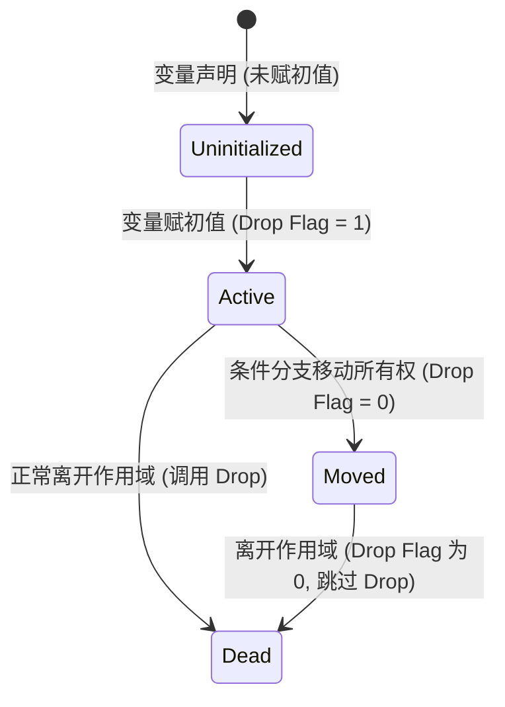

# 所有权与移动语义

Rust 的核心设计哲学之一是**在编译期提供彻底的内存安全保障，而不引入运行时垃圾回收（GC）的开销**。这一设计能够成功落地，其基石便是所有权（Ownership）机制与移动语义（Move Semantics）。本章将从内存模型、编译器底层实现以及中间表示（MIR）的角度，对所有权转移与析构机制进行深度解析。

---

## 1. 内存基础：栈、堆与资源管理

在现代操作系统中，进程的虚拟内存空间主要被划分为栈（Stack）和堆（Heap）。理解这两者的物理特性是理解 Rust 所有权的前提。

*   **栈（Stack）**：分配和释放速度极快（仅需移动栈指针寄存器 `RSP`），其数据结构呈 LIFO（后进先出）结构。栈上分配的数据必须具有已知且固定的编译期大小。
*   **堆（Heap）**：用于存储大小在编译期未知或可能动态发生变化的数据。堆分配涉及系统调用（如 Linux 的 `brk`/`mmap`）以及内存分配器（如 `jemalloc`/`mimalloc`）的搜索逻辑，开销较大，且容易产生内存碎片。

### 1.1 静态内存管理的痛点

传统的 C++ 和 C 语言中，堆内存需要手动管理：

```c
// C 语言中的典型内存漏洞风险
void process() {
    int* ptr = (int*)malloc(sizeof(int) * 100);
    // ... 如果在此处发生分支提早返回，将导致内存泄漏（Memory Leak）
    free(ptr);
    // ... 如果在此后继续使用 ptr，将导致悬空指针（Dangling Pointer）和双重释放（Double Free）
}
```

### 1.2 RAII（资源获取即初始化）

Rust 继承并强化了 C++ 的 **RAII（Resource Acquisition Is Initialization）** 思想。资源（包括堆内存、文件描述符、网络套接字等）的生命周期与管理它的局部变量（所有者）的生命周期紧密绑定。当变量离开作用域时，其绑定的资源会在编译期被自动释放。

---

## 2. 移动语义（Move Semantics）与复制语义（Copy Semantics）

在 Rust 中，赋值操作（`let y = x`）或函数传参默认采用**移动语义**，除非类型实现了 `Copy` trait。

### 2.1 移动的物理本质

从底层的物理层面来看，移动（Move）在编译后实际上是**对栈上数据结构的按字节拷贝（shallow copy / `memcpy`）**。然而，在编译器静态分析的心智模型中，移动意味着**原变量的失效（Invalidation）**。

以 `String` 为例，其栈上结构包含三个字段（共占 24 字节）：指向堆内存的指针（Pointer）、容量（Capacity）和长度（Length）。

```rust
fn main() {
    let s1 = String::from("Hello");
    let s2 = s1; // 发生所有权移动 (Move)
    // println!("{}", s1); // 编译错误！s1 已失效
}
```

#### 内存布局变换示意图

```mermaid
graph TD
    subgraph 移动前 (s1 拥有所有权)
        s1_stack["s1 (栈上 24 字节)<br/>ptr: 0x55aa0010<br/>cap: 5<br/>len: 5"]
        heap_data["堆内存 (0x55aa0010)<br/>['H', 'e', 'l', 'l', 'o']"]
        s1_stack -->|指向| heap_data
    end

    subgraph 移动后 (s2 拥有所有权)
        s1_stack_moved["s1 (已失效)<br/>[未定义/不可访问]"]
        s2_stack["s2 (栈上 24 字节)<br/>ptr: 0x55aa0010<br/>cap: 5<br/>len: 5"]
        heap_data_after["堆内存 (0x55aa0010)<br/>['H', 'e', 'l', 'l', 'o']"]
        s2_stack -->|指向| heap_data_after
    end
```

在赋值 `let s2 = s1` 发生时：
1. 编译器将 `s1` 在栈上的 24 字节直接拷贝到 `s2` 的栈空间中（等同于一次高效的 `memcpy`）。
2. 编译器在符号表中将 `s1` 标记为“已移动”状态（Moved）。此后，任何对 `s1` 的读取尝试都会触发编译期错误。
3. 关键优势：**不涉及任何堆内存分配或深度拷贝**，确保了极致的性能。

### 2.2 Copy 与 Clone 的分水岭

在 Rust 中，数据的复制行为由两个核心 trait 控制：`Copy` 和 `Clone`。

| 特性 | `Copy` | `Clone` |
| :--- | :--- | :--- |
| **复制方式** | 隐式隐秘（Implicit） | 显式调用（Explicit, `.clone()`） |
| **底层实现** | 仅限于按位复制（`memcpy`），无法自定义 | 可以执行任意自定义的代码逻辑（如深度拷贝堆资源） |
| **内存开销** | 极小，通常仅涉及栈上数据的复制 | 较大，可能涉及操作系统内存分配 |
| **适用类型** | 原始数字类型、字符、布尔值，以及仅包含 `Copy` 成员的结构体 | 任何需要自定义复制逻辑的类型（如 `Vec`, `String`） |

> [!IMPORTANT]
> 如果一个类型实现了 `Copy`，那么当它被传参或赋值时，原变量依然保持有效。实现 `Copy` 的大前提是：**该类型的按位复制不会导致多个变量管理同一块排他性堆内存或其他独占资源**。例如，包含指针的 `String` 或 `Vec` 绝不能实现 `Copy`。

### 2.3 结构体和枚举的移动

对于复合结构（如结构体），移动操作是**分字段（field-by-field）进行**的。如果一个结构体中部分字段实现了 `Copy`，部分没有，那么该结构体整体无法实现 `Copy`。但我们可以部分移动（Partial Move）结构体中的非 `Copy` 字段，前提是这不会导致对象整体处于未初始化的非法状态。

---

## 3. 析构机制与 Drop Flags 详解

当一个变量离开作用域时，它的资源必须被回收。Rust 编译器会在合适的位置插入析构函数（即 `Drop::drop(&mut self)` 产生的机器码）。

### 3.1 防止双重释放（Double Free）

如果一个局部变量被有条件地移动，编译器在编译期可能无法确定在离开作用域时该变量是否仍然持有资源。

考虑如下代码：

```rust
fn process(condition: bool, data: Vec<u8>) {
    if condition {
        consume(data); // data 在此处被移动
    } else {
        // data 在此处未被移动
    }
    // 离开作用域：data 应该被 drop 吗？
}

fn consume(_d: Vec<u8>) {}
```

在 `process` 函数末尾，如果 `condition` 为 `true`，`data` 已经被 `consume` 移动并释放，此时如果再次析构 `data`，就会发生致命的**双重释放（Double Free）**。如果 `condition` 为 `false`，`data` 尚未被移动，若不在此处释放它，则会导致**内存泄漏（Memory Leak）**。

### 3.2 动态析构追踪：Drop Flags

为了解决这个问题，Rust 编译器在函数的栈帧中引入了隐式的布尔标记，称为 **Stack Drop Flags**。

1. **静态 Drop 分析（Static Drop Analysis）**：如果编译器的控制流分析能够完全确定某个变量在特定点是否已被移动，它会在该点直接插入对析构函数的静态调用，而不需要引入运行时标记。
2. **动态 Drop 追踪（Dynamic Drop Flags）**：如果控制流存在不确定性（如上述 `if condition` 分支），编译器会在栈帧中分配一个 Drop Flag（通常为 1 字节的布尔标志）。

#### Drop Flag 状态转换逻辑



对于上述 `process` 函数，编译器会将其改写为如下等价的伪代码：

```rust
// 编译器插入的 Drop Flag 逻辑等价代码
fn process_lowered(condition: bool, data: Vec<u8>) {
    let mut data_drop_flag = 1b; // 1 表示有效，需要 drop
    
    if condition {
        let _temp = data;
        data_drop_flag = 0b; // 所有权转移，flag 设为 0
        consume(_temp);
    } else {
        // flag 保持为 1
    }
    
    // 函数退出时的析构检查
    if data_drop_flag == 1b {
        // 调用 Vec 的 drop 析构函数
        std::ops::Drop::drop(&mut data);
    }
}
```

> [!TIP]
> 现代 Rust 编译器对于局部变量使用了高度优化的栈帧 Drop Flags，仅在控制流分叉且编译器无法静态确定变量活性时才分配。这极大地减小了函数栈帧的大小，并提高了缓存局部性。

---

## 4. 编译器视角：从 AST 到 MIR 中的移动与析构

Rust 编译器的处理链路大致为：
`Source Code` -> `AST` -> `HIR` -> `MIR` -> `LLVM IR` -> `Machine Code`

其中，**MIR（Mid-level Intermediate Representation，中级中间表示）** 是借用检查与所有权分析的核心场所。MIR 移除了所有高层语法糖，将程序简化为由**基本块（Basic Blocks）**组成的**控制流图（Control Flow Graph, CFG）**。

### 4.1 示例代码的 MIR 降解分析

编写一个简单的移动与析构函数：

```rust
pub fn sample_flow(cond: bool) {
    let x = String::from("Rust");
    if cond {
        let _y = x; // 移动发生
    }
}
```

以下是该函数经编译器生成后，类似 MIR 的控制流伪代码表示：

```text
fn sample_flow(_1: bool) -> () {
    let mut _0: ();                      // 返回值
    let _2: std::string::String;         // 变量 x (在 MIR 中表示为 _2)
    let _3: std::string::String;         // 变量 _y (在 MIR 中表示为 _3)
    let mut _4: bool;                    // Drop Flag 对应状态

    bb0: {
        StorageLive(_2);
        _2 = String::from(const "Rust"); // 分配并初始化 x
        _4 = const true;                 // 初始化 x 的 Drop Flag 为 true
        switchInt(_1) -> [0: bb2, otherwise: bb1];
    }

    bb1: {
        StorageLive(_3);
        _4 = const false;                 // 发生移动，将 x 的 Drop Flag 设为 false
        _3 = move _2;                    // 执行 shallow copy 赋值给 _y
        drop(_3) -> [return: bb3, unwind terminate]; // 析构 _y
    }

    bb2: {
        // 未发生移动的分支
        goto -> bb4;
    }

    bb3: {
        StorageDead(_3);
        goto -> bb4;
    }

    bb4: {
        // 离开作用域，依据 Drop Flag 决定是否析构 x
        // 如果 _4 为 true，则调用 drop(_2)；否则不操作
        drop(_2) -> [return: bb5, unwind terminate];
    }

    bb5: {
        StorageDead(_2);
        return;
    }
}
```

### 4.2 MIR 中的关键概念解释

*   `StorageLive(_X)` / `StorageDead(_X)`：告知 LLVM 在栈帧上为变量分配/释放局部存储空间，这并不等同于执行析构函数（Drop），而是底层的物理内存分配与销毁。
*   `move _2`：这是一个 MIR 操作数类型，显式告知后端此处可以使用移动语义（如直接进行值拷贝后将旧值标记为未初始化）。
*   `drop(_X)`：这是一个**终结符（Terminator）**。如果 `_X` 在此时对应的 Drop Flag 处于活跃状态，便调用其析构逻辑。

通过这种显式的控制流与状态表达，Rust 编译器在不牺牲底层性能的前提下，完美地把控了每一个字节的生命历程。
