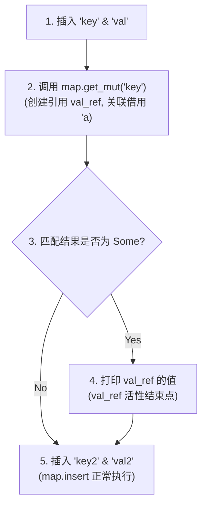
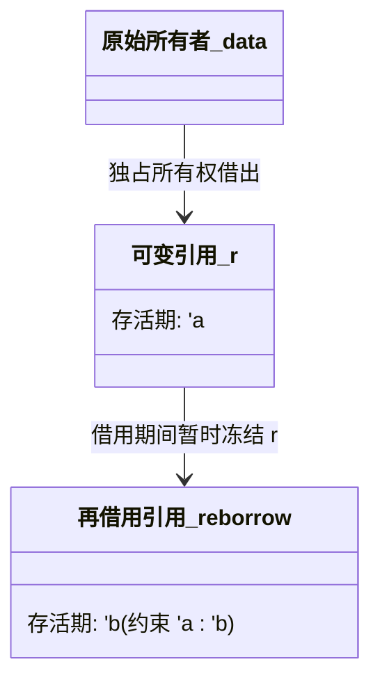

# 借用规则与生命周期分析

所有权机制保障了资源的单一归属，但在实际编程中，我们频繁需要多处读取或按需修改资源。为此，Rust 引入了**借用（Borrowing）**机制，即通过**引用（References）**来临时访问资源，而不获取其所有权。借用检查器（Borrow Checker）的任务就是在编译期证明所有借用关系始终是绝对安全的。

---

## 1. 借用检查核心规则：别名与可变性互斥

Rust 的借用检查规则可以提炼为一条核心定律：**别名与可变性互斥（Aliasing XOR Mutability）**。
具体而言，在任意给定的时间点，对于同一个资源，只能满足以下条件之一：
1.  拥有任意多个只读引用（`&T`，即共享引用）。
2.  拥有唯一一个可变引用（`&mut T`，即排他引用）。

### 1.1 为什么需要互斥？

这一规则并非空穴来风，它直接解决了命令式语言的两大顽疾：**多线程下的数据竞争（Data Races）**与**单线程下的迭代器失效（Iterator Invalidation）**。

#### 迭代器失效示例与分析

在 C++ 或 Java 中，在遍历容器的过程中修改容器是非常经典的运行时崩溃诱因。而 Rust 在编译期就能彻底拒绝此类代码：

```rust
fn main() {
    let mut vec = vec![1, 2, 3];
    
    for &item in &vec { // 获取只读共享引用：&vec (借用 A)
        if item == 2 {
            vec.push(4); // 尝试修改容器：&mut vec (借用 B)
            // ^ 编译错误！不能同时借用 vec 为可变与不可变
        }
    }
}
```

*   **物理本质**：`for` 循环在后台持有指向整个 `Vec` 底层连续堆内存的迭代器指针（只读引用）。如果允许 `vec.push(4)`，且此时 `Vec` 触发了扩容，底层内存分配器将重新开辟一块更大的堆内存，拷贝原有数据并释放旧内存。
*   **后果**：迭代器底层的只读指针此时已指向被释放的旧堆内存，后续迭代将导致**使用已释放内存（Use-After-Free）**的安全灾难。
*   **Rust 的编译期拦截**：借用检查器识别到 `&vec`（不可变借用）的生命周期跨越了整个循环，在此范围内决不允许任何 `&mut vec`（可变借用）的存在，从而杜绝了这一漏洞。

---

## 2. 生命周期的演进：词法生命周期 (LL) 与非词法生命周期 (NLL)

生命周期（Lifetimes）是借用检查器用来描述“一个借用所必须保持有效的代码区间”的抽象。它的设计经历了一次重大的技术迭代。

### 2.1 词法生命周期（Lexical Lifetimes, LL）

在 Rust 1.31 版本之前（Rust 2015 版），生命周期是基于语法树上的花括号范围（即词法作用域）来计算的。这种模型非常粗糙，经常导致符合直觉的安全代码被编译器拦截。

```rust
fn lexical_limitation() {
    let mut map = std::collections::HashMap::new();
    map.insert("key", "val");
    
    // 词法生命周期下：借用 'a 的生存期被迫与临时变量 val 的词法域对齐
    if let Some(val) = map.get_mut("key") { 
        // 借用 'a 开始并延伸至花括号结束
        println!("{}", val);
    } // 'a 在此处才结束
    
    // 在旧版编译器中，此处会报错，因为编译器认为 map 在上面被借用了，
    // 其生命周期一直延续到了花括号结尾，即使我们在 println 之后就不再使用它了。
    map.insert("key2", "val2"); 
}
```

### 2.2 非词法生命周期（Non-Lexical Lifetimes, NLL）

在 Rust 2018 版中，编译器引入了基于**控制流图（Control Flow Graph, CFG）**的非词法生命周期（NLL）分析。生命周期不再受限于词法上的花括号范围，而是退化为**控制流图中的节点集合**。

#### CFG 活性分析（Liveness Analysis）示意图

对于上述代码，NLL 借用检查器会绘制如下 CFG 并跟踪变量使用情况：



在 NLL 的框架下，`val_ref` 的生命周期只包含 `节点 2`、`节点 3` 和 `节点 4`。在 `节点 5` 处，由于 `val_ref` 在前驱分支上已经没有后续读取行为（不再存活，即 Dead），编译器能够精确判定此时借用 `'a` 已经结束，因此 `map.insert` 可以安全执行。

---

## 3. 借用检查器如何追踪 Loan (借用)

借用检查器工作的核心数据模型是由**借用三元组**组成的集合。它主要追踪三项要素：
*   **Loan (借用)**：某个特定的引用表达式（例如 `&mut x`）。
*   **Origin / Region (生命周期参数)**：抽象的符号（如 `'a`），代表一组 CFG 点的集合。
*   **Point (CFG 节点)**：程序运行的特定指令位置。

当编译器分析一个借用时，它会遵循以下核心推导链路：

1.  **路径追踪**：对于每一个借用表达式 `&x`，其生成一个 Loan 并与某个生命周期变量 `'a` 关联。
2.  **约束生成**：
    *   如果在点 $P$ 处使用了引用 `'a`，那么 $P \in \text{Region}('a)$。
    *   如果引用 `'a` 被赋值给引用 `'b`（子类型关系 `'a: 'b`），则会产生包含约束：$\text{Region}('a) \supseteq \text{Region}('b)$。
3.  **冲突检测**：对于任意一个 Loan（例如对变量 `x` 的写借用），如果其生命周期 `'a` 覆盖了某点 $P$，且在点 $P$ 处程序试图对 `x` 进行排他性操作（如读取或写入），借用检查器就会报错。

---

## 4. 生命周期的子类型与变性（Subtyping & Variance）

生命周期的子类型关系是编译器判断“长寿引用能否安全冒充短寿引用”的数学模型。

### 4.1 子类型关系

在 Rust 中，生命周期 `'a` 和 `'b` 的关系定义如下：
如果生命周期 `'a` 存活得比 `'b` 还要久（即 `'a` 包含 `'b` 的 CFG 区间），写为 `'a: 'b`。
在子类型语法中，我们称 `'a` 是 `'b` 的**子类型**，记为：
$$'a <: 'b$$
这意味着，**需要短生命周期 `'b` 的地方，可以安全地传入一个长生命周期 `'a` 的引用**（“长寿”比“短寿”更安全，因为它存活范围大）。

### 4.2 协变、逆变与不变（Variance）

变性描述了：**如果类型参数具有子类型关系，那么由该类型参数构成的复合类型是否继承这种子类型关系？**

Rust 编译器的变性推导表如下：

| 类型构造器 | 对参数 `T` 的变性 | 对生命周期 `'a` 的变性 |
| :--- | :--- | :--- |
| `&'a T` | 协变 (Covariant) | 协变 (Covariant) |
| `&'a mut T` | **不变 (Invariant)** | 协变 (Covariant) |
| `fn(T) -> U` | 逆变 (Contravariant) | N/A |
| `*mut T` | 不变 (Invariant) | N/A |

*   **协变（Covariant）**：如果 $T <: U$，则 $F\langle T\rangle <: F\langle U\rangle$。例如，`&'a T` 对 `'a` 是协变的。
*   **逆变（Contravariant）**：如果 $T <: U$，则 $F\langle U\rangle <: F\langle T\rangle$。这主要发生在函数参数上（逆变方向相反）。
*   **不变（Invariant）**：如果 $T <: U$，无法建立 $F\langle T\rangle$ 与 $F\langle U\rangle$ 之间的子类型关系。

### 4.3 为什么 `&mut T` 对 `T` 必须是不变的？

这是一个经典的安全问题。我们通过以下代码推导，如果 `&mut T` 对 `T` 是协变的话，会发生什么可怕的后果：

```rust
// 假设此代码在编译器允许 &mut T 协变的情况下运行
fn evil_mutate<'short>(r: &mut &'short str) {
    let bad_string: String = String::from("Short Lived");
    // &bad_string 的生命周期是 'short
    *r = &bad_string; 
    // bad_string 在 Evil_mutate 结束时被 drop！
}

fn main() {
    let mut static_str: &'static str = "I am static";
    
    // 假设 &mut &'static str 可以被协变为 &mut &'short str
    evil_mutate(&mut static_str);
    
    // 灾难发生：static_str 此时指向了已被释放的 String 堆内存！
    println!("{}", static_str); // Use-After-Free!
}
```

*   **推导过程**：由于 `&'static str` 的生存期长于 `&'short str`，所以有 `&'static str <: &'short str`。
*   **如果它是协变的**：那么 `&mut &'static str` 将是 `&mut &'short str` 的子类型。上面的 `evil_mutate(&mut static_str)` 就能通过编译。
*   **结果**：我们成功通过一个可变引用，把一个生命周期仅为 `'short` 的临时悬空引用写回到了生命周期为 `'static` 的变量中。
*   **解决方案**：Rust 强制将 `&mut T` 定义为对 `T` **不变（Invariant）**。因此 `&mut &'static str` 和 `&mut &'short str` 之间没有任何子类型继承关系，直接在编译期拒绝了这一赋值，从根本上杜绝了这类内存安全漏洞。

---

## 5. 再借用机制（Reborrowing）

初学 Rust 时常有一个疑问：如果可变引用 `&mut T` 不实现 `Copy` 特性，那么为什么我们可以重复将同一个可变引用传给不同的函数而不用每次手动移动？

### 5.1 隐式再借用的工作原理

答案在于编译器的**再借用（Reborrowing）**机制。

```rust
fn shrink(val: &mut Vec<u8>) {
    val.shrink_to_fit();
}

fn main() {
    let mut data = vec![1, 2, 3];
    let r = &mut data; // r 是一个可变引用
    
    shrink(r); // 此时 r 没有被移动 (Move)，而是被再借用了！
    shrink(r); // r 依然有效，可以继续使用
}
```

当编译器看到 `shrink(r)` 时，它并不会把 `r`（类型为 `&mut Vec<u8>`）的所有权移交给函数，而是隐式地执行了类似解引用后再借用的转换：

```rust
// 编译器后台实际生成的代码等价于：
shrink(&mut *r);
```

### 5.2 再借用与移动的约束



为了确保安全，再借用必须满足以下几何拓扑约束：
1.  **生命周期约束**：再借用引用的生命周期 `'b` 必须是原始引用生命周期 `'a` 的子集（即 `'a: 'b`）。
2.  **状态冻结**：在再借用 `'b` 活跃的期间，原始引用 `r` 会被**暂时冻结**。任何直接使用 `r` 的操作都会被借用检查器拦截，直到再借用引用的生命周期 `'b` 彻底结束。

这一机制确保了即使引用在多层调用中被层层传递，最外层的排他性访问保证依旧能够稳固保持。
