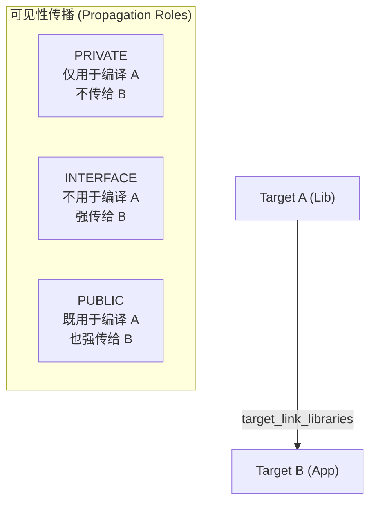

# 多目录项目构建与结构化布局

当项目从单个源文件演变为中大型工程时，合理的目录结构与清晰的依赖隔离是项目成功的基石。在本章中，我们将讨论如何设计一个工业级的多目录项目布局，深入剖析现代 CMake 核心的**面向对象（Target-based）构建哲学**，并实现一个将 C 源码编译为嵌入式 ELF、导出链接 Map 报告并自动转换为 `.bin` 和 `.hex` 固件的完整构建系统。

---

## 1. 工业级项目标准目录结构

一个结构清晰的项目应当隔离应用层代码、硬件驱动/库代码、编译脚本、测试用例以及物理链接资源。以下是一个典型的面向嵌入式/系统级开发的工程目录树：

```text
my_project/
├── CMakeLists.txt              # 顶层 CMake 配置文件
├── linker.ld                   # GCC 链接器脚本（定义内存布局）
├── cmake/                      # 存放自定义 CMake 工具链与辅助宏定义
│   └── toolchain-arm.cmake     # ARM 交叉编译工具链定义
├── src/                        # 主应用程序源文件
│   ├── CMakeLists.txt
│   └── main.c
├── include/                    # 主应用程序的全局或公共头文件
│   └── app_config.h
├── lib/                        # 内部依赖库/子系统模块
│   └── sensor/
│       ├── CMakeLists.txt
│       ├── include/
│       │   └── sensor.h        # 供外部模块访问的公开头文件
│       ├── src/
│       │   └── sensor.c        # 传感器内部实现源文件
│       └── private_reg.h       # 仅 sensor 内部可见的私有头文件
└── tests/                      # 单元测试代码目录
    ├── CMakeLists.txt
    └── test_sensor.c
```

---

## 2. 现代 Target-Based CMake 构建哲学

在旧版 CMake（CMake 2.x 及更早）中，配置参数主要通过全局变量来传递，例如使用 `include_directories()`、`link_libraries()` 和 `add_definitions()`。这类指令会影响其后定义的所有目标，当工程复杂时极易造成**依赖污染（Dependency Pollution）**。

现代 CMake（3.0+）倡导 **Target-Based CMake**，即**把每一个库或可执行文件看作一个“对象（Target）”**。每个 Target 都包含自己的“属性（Properties）”，比如：
* 哪些是它的源文件？
* 它需要哪些头文件搜索路径？
* 它需要定义哪些编译宏？
* 它依赖哪些其它的 Target？

我们通过 `target_...` 指令对特定的 Target 写入属性，并利用 `PUBLIC`、`PRIVATE` 与 `INTERFACE` 关键字来精确控制这些属性的**传播行为**。



### 2.1 深入理解 `PUBLIC` / `PRIVATE` / `INTERFACE`

当我们在 Target A 上定义某项配置（如头文件目录），并让 Target B 链接 Target A 时（`target_link_libraries(B PRIVATE A)`），该配置是否会传播给 Target B，完全由声明时的修饰符决定：

* **`PRIVATE`**：属性仅供该 Target 自己编译时使用。
  * *示例*：`sensor.c` 内部包含了一个仅用于读取芯片寄存器的头文件 `private_reg.h`。`lib/sensor` 应当将包含该私有头文件的目录设为 `PRIVATE`。外部的 `main.c` 链接 `sensor` 时，不需要也不应该能够访问 `private_reg.h`。
* **`INTERFACE`**：属性自身编译时不需要，但任何链接该 Target 的使用者都需要。
  * *示例*：纯头文件库（Header-only Library）或定义标准接口的库。自身不需要编译成二进制文件，但链接它的 Target 需要它的头文件搜索路径。
* **`PUBLIC`**：它是 `PRIVATE` 和 `INTERFACE` 的结合。自己编译时需要，使用者编译时也必须导入。
  * *示例*：`sensor.h` 是 `lib/sensor` 暴露给应用层的外部接口。`lib/sensor` 内部的源文件编译需要它，外部的 `main.c` 调用其函数时也必须 include 它。

---

## 3. 自定义构建规则与底层操作

在生成最终二进制文件后，系统级开发往往需要对目标文件进行后期处理。CMake 提供了自定义命令和自定义目标来完成这些工作。

### 3.1 `add_custom_command` 与 `add_custom_target` 的区别

* **`add_custom_command` (文件级构建规则，惰性触发)**
  * **作用**：定义生成某个**物理输出文件**的规则。
  * **触发机制**：它是惰性的（Lazy）。除非有某个 Target 依赖了这个生成的 OUTPUT 文件，否则该命令在编译期间根本不会运行。
  * **场景**：使用协议编译器（如 Protobuf）由 `.proto` 生成 `.pb.h` / `.pb.cc`；或者从 ELF 文件中提取出 `.bin` 固件。
* **`add_custom_target` (逻辑级构建目标，始终触发)**
  * **作用**：创建一个**不产出物理文件**（或不需要跟踪文件变化）的逻辑目标，例如 `make format`、`make flash`。
  * **触发机制**：只要显式调用该目标（如 `cmake --build build --target flash`），它指定的命令就一定会执行。

---

## 4. 实战：交叉编译嵌入式固件项目配置

下面，我们通过一个完整的 C/C++ 嵌入式工程模板，将多目录组织、现代 Target 传递、GCC 链接器脚本绑定以及 Post-Build 二进制固件导出整合在一起。

### 4.1 顶层 `CMakeLists.txt`
位于项目根目录下，负责初始化项目、指定编译选项、链接脚本并包含子目录。

```cmake
# ==============================================================================
# 1. 顶层 CMake 初始化
# ==============================================================================
cmake_minimum_required(VERSION 3.16)
project(EmbeddedOS VERSION 1.0.0 LANGUAGES C)

# 确保在交叉编译时，CMake 不会因为找不到标准的本地系统 C 库而报错
set(CMAKE_TRY_COMPILE_TARGET_TYPE "STATIC_LIBRARY")

# 强制要求域外构建
if(${CMAKE_SOURCE_DIR} STREQUAL ${CMAKE_BINARY_DIR})
    message(FATAL_ERROR "In-source builds are not allowed. Please build from a separate directory (e.g. build/)")
endif()

# ==============================================================================
# 2. 全局编译配置 (Target-Based)
# ==============================================================================
# 定义全局硬件编译选项的目标 (接口库形式)
add_library(mcu_config INTERFACE)

# 绑定 Cortex-M4 相关的硬件编译和链接参数
target_compile_options(mcu_config INTERFACE
    -mcpu=cortex-m4
    -mthumb
    -mfloat-abi=hard
    -mfpu=fpv4-sp-d16
    -ffunction-sections
    -fdata-sections
    -Wall
    -Wextra
    -Wstrict-prototypes
)

target_link_options(mcu_config INTERFACE
    -mcpu=cortex-m4
    -mthumb
    -mfloat-abi=hard
    -mfpu=fpv4-sp-d16
    -specs=nano.specs
    -specs=nosys.specs
    -Wl,--gc-sections
)

# ==============================================================================
# 3. 引入子系统与应用代码
# ==============================================================================
# 添加子模块库 (lib/sensor)
add_subdirectory(lib/sensor)

# 添加应用层主程序 (src)
add_subdirectory(src)
```

### 4.2 子库 `lib/sensor/CMakeLists.txt`
负责构建传感器驱动库，体现 `PUBLIC` 与 `PRIVATE` 的包含路径隔离。

```cmake
# ==============================================================================
# 子模块库: sensor
# ==============================================================================

# 定义源文件列表
set(SENSOR_SRCS
    src/sensor.c
)

# 声明构建静态库
add_library(sensor STATIC ${SENSOR_SRCS})

# 链接全局硬件配置属性
target_link_libraries(sensor PUBLIC mcu_config)

# 头文件搜索路径隔离：
# 1. include/ 目录包含公开的 sensor.h，供外部链接者调用，设为 PUBLIC
# 2. src/ 目录包含私有 private_reg.h，仅内部编译使用，设为 PRIVATE
target_include_directories(sensor
    PUBLIC  ${CMAKE_CURRENT_SOURCE_DIR}/include
    PRIVATE ${CMAKE_CURRENT_SOURCE_DIR}/src
)

# 给 sensor 库在编译时传入一个特定宏定义（仅私有）
target_compile_definitions(sensor PRIVATE SENSOR_DEBUG_LEVEL=2)
```

### 4.3 应用层 `src/CMakeLists.txt`
定义最终的可执行文件，指定链接器脚本，并配置 Post-Build 自定义生成逻辑。

```cmake
# ==============================================================================
# 应用层主程序构建与固件导出
# ==============================================================================

# 声明主程序可执行目标
add_executable(app_elf main.c)

# 链接项目依赖项：
# 1. 链接子模块 sensor，sensor 会自动将其 PUBLIC 头文件目录传播给 app_elf
# 2. 链接 mcu_config 硬件架构参数
target_link_libraries(app_elf PRIVATE sensor mcu_config)

# 绑定全局公共头文件配置目录
target_include_directories(app_elf PRIVATE ${PROJECT_SOURCE_DIR}/include)

# ==============================================================================
# 链接器脚本 (.ld) 与 Map 报告的高级配置
# ==============================================================================
set(LINKER_SCRIPT "${PROJECT_SOURCE_DIR}/linker.ld")
set(MAP_FILE "${CMAKE_BINARY_DIR}/app_elf.map")

target_link_options(app_elf PRIVATE
    "-T${LINKER_SCRIPT}"
    "-Wl,-Map=${MAP_FILE}"
)

# 确保链接器脚本物理文件存在，若不存在则报出显式的构建错误
if(NOT EXISTS ${LINKER_SCRIPT})
    message(FATAL_ERROR "Linker script not found at: ${LINKER_SCRIPT}")
endif()

# ==============================================================================
# 自动生成 Binary & Hex 烧录文件 (Post-Build)
# ==============================================================================
# 查找或定义 arm-none-eabi-objcopy 路径（如果使用的是系统工具链）
if(NOT CMAKE_OBJCOPY)
    set(CMAKE_OBJCOPY "arm-none-eabi-objcopy")
endif()

# 1. 构建后自动导出 .bin 固件
add_custom_command(
    TARGET app_elf POST_BUILD
    COMMAND ${CMAKE_OBJCOPY} -O binary $<TARGET_FILE:app_elf> ${CMAKE_BINARY_DIR}/firmware.bin
    COMMENT "Converting ELF target to binary firmware: firmware.bin"
)

# 2. 构建后自动导出 .hex 固件
add_custom_command(
    TARGET app_elf POST_BUILD
    COMMAND ${CMAKE_OBJCOPY} -O ihex $<TARGET_FILE:app_elf> ${CMAKE_BINARY_DIR}/firmware.hex
    COMMENT "Converting ELF target to Intel Hex firmware: firmware.hex"
)

# 3. 输出固件大小报告
if(CMAKE_SIZE)
    add_custom_command(
        TARGET app_elf POST_BUILD
        COMMAND ${CMAKE_SIZE} $<TARGET_FILE:app_elf>
        COMMENT "Firmware Flash and RAM consumption report:"
    )
endif()
```

### 4.4 编译流程说明
在这种 Target-based 架构下，开发者执行构建命令：
```bash
cmake -B build -G Ninja
cmake --build build
```
CMake 会首先编译驱动库 `sensor`，然后再编译主程序 `main.c`。链接时，它会自动应用 `mcu_config` 里的 Cortex-M4 硬件总线参数、导入 `linker.ld`，并在生成 `app_elf` 后，原地执行 `objcopy` 命令输出可直接烧录进单片机的 `firmware.bin` 和 `firmware.hex`，同时在 build 目录下产生一份内存分配分析 Map 文件 `app_elf.map`。整个依赖和构建链条清晰严谨，极易维护与扩展。
