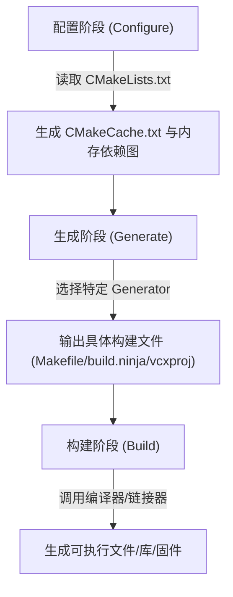

# 第一章：CMake 基础语法与核心概念

在深入探讨复杂的多目录结构与 CI/CD 自动化流水线之前，我们必须对 CMake 的生命周期、变量运行机制、作用域以及控制结构有深入且底层的认知。本章将详细剖析 CMake 的三大运行阶段、三种不同类型的变量、以及如何使用高级函数（Function）与宏（Macro）编写可重用的构建逻辑。

---

## 1. CMake 运行机理与生命周期

很多开发者常将 CMake 与编译器（如 GCC、Clang）或底层构建系统（如 Make、Ninja）混淆。实际上，CMake 并不直接编译任何源代码，它是一个**构建配置生成器（Build Generator）**。它的执行生命周期清晰地划分为三个阶段：



### 1.1 配置阶段 (Configure Phase)

配置阶段的主要任务是**解析构建逻辑并建立项目依赖关系树**。
1. **读取输入**：CMake 从指定的源目录中读取顶层 `CMakeLists.txt`。
2. **环境探测**：探测系统环境，例如检查当前主机的 C/C++ 编译器是否可用，检测系统架构（如 x86_64, ARM），查找系统库及外部依赖项。
3. **缓存维护**：在此阶段，CMake 会创建 `CMakeCache.txt` 文件。它是一个持久化的键值对数据库，用于存储编译器路径、用户自定义配置选项（如是否启用调试日志等）。
4. **语法解析**：执行所有 CMake 指令（例如 `project()`、`add_executable()` 等），在内存中生成项目的逻辑树（Targets、Properties、Dependencies）。

### 1.2 生成阶段 (Generate Phase)

配置阶段结束后，CMake 在内存中已经具备了完整的构建拓扑结构。生成阶段则负责**将这套拓扑结构翻译为特定构建工具的输入文件**。
* **生成器（Generators）**：用户通过 `-G` 参数指定生成器。例如：
  * `-G "Unix Makefiles"`：生成传统的 `Makefile`。
  * `-G "Ninja"`：生成高并发的 `build.ninja` 文件（在大型项目或 CI/CD 中极为推荐）。
  * `-G "Visual Studio 17 2022"`：生成 Windows 环境下的 `.sln` 和 `.vcxproj` 工程文件。
* **输出目录**：所有生成的临时文件、构建脚本以及目标文件都会被放置在指定的构建目录（通常为 `build/`）中。这被称为**域外构建（Out-of-Source Build）**，它能保证源代码目录的干净，防止编译产物污染源码。

### 1.3 构建阶段 (Build Phase)

这是最后的编译与链接步骤。用户可以直接调用底层构建工具（如执行 `make` 或 `ninja`），也可以使用 CMake 提供的跨平台构建抽象命令：
```bash
# 跨平台构建指令：无论底层是 Makefile 还是 Ninja，此命令均通用
cmake --build build --config Release
```
此命令的好处在于，无论底层是 Makefile 还是 MSBuild，CMake 都会自动调用对应的工具进行并行编译，大大屏蔽了操作系统的底层差异。

---

## 2. CMake 变量系统深度剖析

CMake 中的一切都可以视作字符串。变量是 CMake 维护状态的核心。CMake 拥有三种变量类型，其作用域和生命周期截然不同：

| 变量类型 | 定义方式 | 访问方式 | 物理载体 | 生存周期与作用域 |
| :--- | :--- | :--- | :--- | :--- |
| **局部变量** (Normal) | `set(VAR_NAME "val")` | `${VAR_NAME}` | 内存堆栈 | 目录与函数作用域，随作用域结束销毁 |
| **缓存变量** (Cache) | `set(VAR CACHE TYPE "doc" [FORCE])` | `${VAR}` | `CMakeCache.txt` | 全局持久化，直到手动清除缓存 |
| **环境变量** (Env) | `set(ENV{VAR_NAME} "val")` | `$ENV{VAR_NAME}` | 操作系统进程环境 | 当前 CMake 进程及其子进程的生命周期 |

### 2.1 局部变量 (Normal Variables)

局部变量仅存在于内存中。在定义局部变量时，如果值中包含空格，应当使用双引号包裹，否则会被 CMake 隐式解析为列表（List）。
```cmake
# 实际上被定义为一个 List，其在底层表示为分号分隔的字符串: "main.cpp;utils.cpp"
set(SOURCE_FILES main.cpp utils.cpp)

# 包含空格的单一字符串，必须加双引号
set(PROJECT_DESCRIPTION "This is an embedded OS kernel project")
```

#### 局部变量的作用域规则：
1. **目录作用域（Directory Scope）**：
   当父目录使用 `add_subdirectory(subdir)` 引入子目录时，子目录会**复制一份父目录当前的全部局部变量**。但是，子目录中对这些变量的任何修改或新定义，**均不会影响父目录**。这是一种典型的**写时复制（Copy-on-write）**机制。
   
   ```text
   +---------------------------------------+
   |             父目录作用域              |
   |           set(MY_VAR "Parent")        |
   +---------------------------------------+
                       |
              add_subdirectory()  (变量复制一份拷贝)
                       v
   +---------------------------------------+
   |             子目录作用域              |
   |    (初始: MY_VAR = "Parent")          |
   |    set(MY_VAR "Child")  <-- 仅修改子拷贝|
   +---------------------------------------+
                       |
             (回到父目录解析流)
                       v
   +---------------------------------------+
   |          父目录作用域 (执行后)        |
   |        (MY_VAR 依然为 "Parent")       |
   +---------------------------------------+
   ```

2. **函数作用域（Function Scope）**：
   在 `function()` 内部定义的变量是本地的。如果想在函数内部修改父作用域（即调用该函数的目录或上层函数）中的变量，必须显式使用 `PARENT_SCOPE` 关键字：
   ```cmake
   # 定义一个自增函数，演示 PARENT_SCOPE 变量回传
   function(increment_counter VAR_NAME)
       # ${${VAR_NAME}} 为双重解引用，用于读取传入变量名所对应的具体值
       math(EXPR TEMP "${${VAR_NAME}} + 1")
       
       # 将计算出来的临时值 TEMP 写入父作用域的变量中
       set(${VAR_NAME} ${TEMP} PARENT_SCOPE) 
   endfunction()
   ```

### 2.2 缓存变量 (Cache Variables)

缓存变量被写入 `CMakeCache.txt` 中。它们被用作全局参数，通常用于提供给用户在命令行进行定制。例如：
```cmake
# 声明一个 CACHE 变量，类型为布尔，附带描述信息，默认值为 ON
set(ENABLE_LTO ON CACHE BOOL "Enable Link Time Optimization (LTO)")
```
* **非覆盖性**：如果在 CMakeLists.txt 中重复调用该指令，只要 `CMakeCache.txt` 中已经存在 `ENABLE_LTO` 键值，它就不会被重新覆盖。除非用户在命令行中显式更新：`cmake -DENABLE_LTO=OFF ..`，或者在代码中附加 `FORCE` 关键字。

### 2.3 列表（List）的操作本质

CMake 的列表在底层只是以分号 `;` 分隔的单字符串。例如 `set(MY_LIST a b c)` 实际上就是字符串 `"a;b;c"`。
因此，我们可以通过 `list` 命令对列表进行高效维护：
```cmake
# 初始化列表
set(MY_FILES "main.c")

# 追加元素，此时 MY_FILES 的值在内存中表现为 "main.c;helper.c;driver.c"
list(APPEND MY_FILES "helper.c" "driver.c") 

# 获取列表长度，并存储在 LIST_LEN 变量中
list(LENGTH MY_FILES LIST_LEN)              

# 移除特定元素
list(REMOVE_ITEM MY_FILES "driver.c")       
```

---

## 3. 控制流与分支逻辑

CMake 提供了完备的逻辑控制语法，用于根据不同的编译目标、平台及编译器使能不同的配置。

### 3.1 条件分支 (`if` / `elseif` / `else` / `endif`)

CMake 对条件表达式的评估有一套特殊的真假值定义：
* **真值 (True)**：`1`、`ON`、`YES`、`TRUE`、`Y`、或非空且不为假值常量的任意字符串（如路径或文件名）。
* **假值 (False)**：`0`、`OFF`、`NO`、`FALSE`、`N`、`IGNORE`、`NOTFOUND`、以 `-NOTFOUND` 结尾的字符串、或空字符串 `""`。

```cmake
# 定义编译选项供外部选择
option(BUILD_TESTS "Build unit tests" ON)

if(BUILD_TESTS)
    message(STATUS "Unit tests are enabled.")
    # 执行测试相关的配置逻辑
elseif(NOT CMAKE_BUILD_TYPE)
    message(WARNING "Build type not specified. Defaulting to Debug.")
    # 强制将缓存变量 CMAKE_BUILD_TYPE 修改为 Debug
    set(CMAKE_BUILD_TYPE Debug CACHE STRING "Choose the type of build." FORCE)
else()
    message(STATUS "Build type is set to: ${CMAKE_BUILD_TYPE}")
endif()
```

> [!IMPORTANT]
> 在 CMake 3.1 之后，`if(VAR)` 会自动评估变量 `VAR` 的值。**不要**写成 `if(${VAR})`，因为如果 `VAR` 本身的值也是一个变量名，这会导致双重解引用，在某些复杂场景下引发意料之外的逻辑错误。

### 3.2 循环结构 (`foreach` / `while`)

循环结构常用于批量处理源文件、动态遍历目标或平台配置项：
```cmake
# 遍历列表中的每一个编译标志
set(COMPILER_FLAGS "-Wall" "-Wextra" "-Werror")
foreach(FLAG IN LISTS COMPILER_FLAGS)
    message(STATUS "Enabling compiler flag: ${FLAG}")
endforeach()

# 范围循环 (从 0 遍历到 4，一共 5 次迭代)
foreach(INDEX RANGE 4)
    message(STATUS "Processing core index: ${INDEX}")
endforeach()
```

---

## 4. 宏与函数：定义、作用域及参数解析

在工程规模扩大后，代码重复度会上升。CMake 提供了宏（Macro）和函数（Function）来实现逻辑封装。然而，这两者在底层机制上有着决定性的不同。

### 4.1 宏与函数的根本区别

| 特性 | 函数 (Function) | 宏 (Macro) |
| :--- | :--- | :--- |
| **作用域** | 拥有独立的局部变量作用域（函数结束自动清理） | 没有独立作用域，完全等同于代码在调用处就地展开 |
| **参数变量** | 参数（如 `${ARGV}`）是标准的 CMake 变量 | 参数并不是真正的变量，而是文本替换占位符 |
| **`PARENT_SCOPE`** | 支持，用于将值向外传递至调用者作用域 | 不支持，在宏内部使用会直接透传至上层目录的父作用域 |

#### 验证示例：
```cmake
macro(test_macro)
    # 由于没有独立作用域，此变量在调用宏的上下文中是可见的
    set(MACRO_VAR "I am macro")
endmacro()

function(test_function)
    # 函数内部变量，在函数退出时即被销毁
    set(FUNC_VAR "I am function")
endfunction()

# 调用宏与函数
test_macro()
test_function()

message(STATUS "MACRO_VAR: ${MACRO_VAR}") # 能够输出: "MACRO_VAR: I am macro"
message(STATUS "FUNC_VAR: ${FUNC_VAR}")   # 输出为空，因为 FUNC_VAR 已经随着函数栈帧退出而被销毁
```

### 4.2 参数解析机制：`${ARGC}`, `${ARGN}` 与 `cmake_parse_arguments`

当编写一个库构建宏或通用配置函数时，我们需要函数能够支持可选参数、单值参数和多值列表参数。
* `${ARGC}`：传入参数的总个数。
* `${ARGV}`：所有参数构成的列表。
* `${ARGN}`：未命名（超出定义个数）参数的列表。

对于现代 CMake，推荐使用内建的 `cmake_parse_arguments` 来解析复杂的命名参数，代替老旧的手动遍历参数列表。

#### 实战：设计一个高容错性的库构建宏

该宏支持配置库的名称、源文件、头文件路径以及是否为静态库的选项。

```cmake
# ==============================================================================
# 自定义库声明函数 - declare_embedded_library
# ==============================================================================
function(declare_embedded_library TARGET_NAME)
    # 定义参数规范
    # 1. 选项参数（Options）：无值的开关，非 ON 即 OFF
    set(OPTIONS STATIC_LINK ENABLE_LTO)
    # 2. 单值参数（One-value arguments）：形如 KEY VALUE
    set(ONE_VALUE_ARGS VERSION OUTPUT_DIRECTORY)
    # 3. 多值参数（Multi-value arguments）：形如 KEY VAL1 VAL2 VAL3...
    set(MULTI_VALUE_ARGS SOURCES HEADERS LINK_LIBRARIES)

    # 解析参数，前缀设置为 "ARG"
    # ARGN 会捕获 TARGET_NAME 后传入的所有其余参数并传入此函数解析
    cmake_parse_arguments(ARG 
        "${OPTIONS}" 
        "${ONE_VALUE_ARGS}" 
        "${MULTI_VALUE_ARGS}" 
        ${ARGN}
    )

    # 1. 验证关键参数：必须提供源文件
    if(NOT ARG_SOURCES)
        message(FATAL_ERROR "declare_embedded_library failed: TARGET '${TARGET_NAME}' must specify SOURCES!")
    endif()

    # 2. 决定是构建静态库还是共享库
    if(ARG_STATIC_LINK)
        add_library(${TARGET_NAME} STATIC ${ARG_SOURCES})
    else()
        add_library(${TARGET_NAME} SHARED ${ARG_SOURCES})
    endif()

    # 3. 配置头文件搜索路径 (使用 PUBLIC 确保链接者自动继承)
    if(ARG_HEADERS)
        target_include_directories(${TARGET_NAME} PUBLIC ${ARG_HEADERS})
    endif()

    # 4. 配置目标链接依赖 (使用 PRIVATE 实现本库内部细节的封装)
    if(ARG_LINK_LIBRARIES)
        target_link_libraries(${TARGET_NAME} PRIVATE ${ARG_LINK_LIBRARIES})
    endif()

    # 5. 配置输出目录 (通过 set_target_properties 设置 Target 属性)
    if(ARG_OUTPUT_DIRECTORY)
        set_target_properties(${TARGET_NAME} PROPERTIES
            ARCHIVE_OUTPUT_DIRECTORY "${ARG_OUTPUT_DIRECTORY}"
            LIBRARY_OUTPUT_DIRECTORY "${ARG_OUTPUT_DIRECTORY}"
        )
    endif()

    # 6. 配置链接时优化 (LTO) 属性
    if(ARG_ENABLE_LTO)
        set_target_properties(${TARGET_NAME} PROPERTIES INTERPROCEDURAL_OPTIMIZATION TRUE)
        message(STATUS "[${TARGET_NAME}] Link Time Optimization (LTO) enabled.")
    endif()

    message(STATUS "Successfully declared library target: ${TARGET_NAME}")
endfunction()
```

#### 调用该函数的示范：
```cmake
# 在具体项目的 CMakeLists.txt 中调用自定义声明函数：
declare_embedded_library(sensor_drv
    STATIC_LINK
    ENABLE_LTO
    VERSION "1.2.0"
    OUTPUT_DIRECTORY "${CMAKE_BINARY_DIR}/libs"
    SOURCES 
        "drivers/sensor.c"
        "drivers/sensor_calib.c"
    HEADERS 
        "drivers/include"
    LINK_LIBRARIES 
        hal_bus
)
```

通过这种架构设计的 CMake 宏与函数，能够最大化保证构建逻辑的整洁和高复用性，规避了大量重复的 `set_target_properties` 以及编译参数的硬编码。在下一章中，我们将把这些基础语法运用到完整的多目录真实项目布局中。
