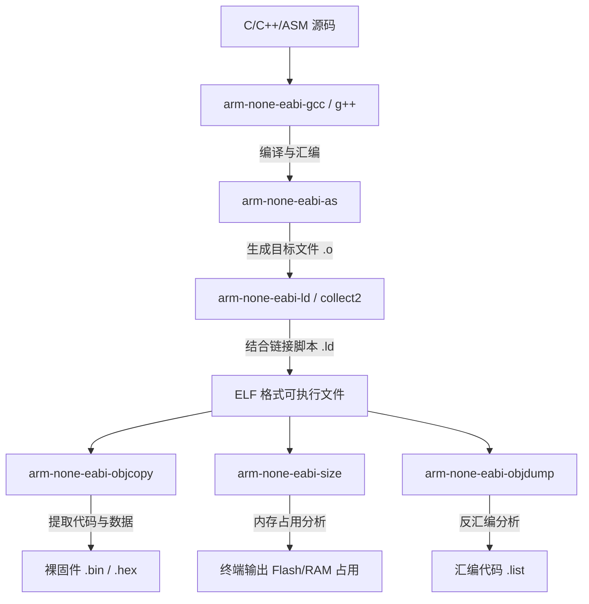

# 第一章：嵌入式交叉编译核心概念

在深入使用 CMake 配置交叉编译之前，必须清晰地理解**交叉编译（Cross Compilation）**的物理本质、目标平台的硬件约束以及编译器与底层运行时库的协作关系。本章将详细剖析交叉编译的基本概念、目标三元组、工具链构成、裸机引导机制以及 C 标准库在嵌入式系统中的重定向原理。

---

## 1.1 什么是交叉编译？

在传统的桌面软件开发中，我们通常在 x86_64 架构的 CPU 上编译代码，并且编译出来的程序同样运行在该 x86_64 的操作系统（如 Windows、Linux）上。这种“编译平台”与“运行平台”相同的模式被称为**本地编译（Native Compilation）**。

而在嵌入式开发中，目标硬件通常是基于 ARM Cortex-M、RISC-V、Xtensa 或 AVR 架构的微控制器（MCU）。这些微控制器计算资源有限，无法直接在其内部运行复杂的编译器（如 GCC、Clang）来编译自身运行的代码。因此，我们必须在资源丰富的通用计算机上编译代码，然后将生成的二进制固件下载到目标板上运行。这种**“在平台 A（主机/Host）上编译，在平台 B（目标机/Target）上运行”**的编译模式即为**交叉编译（Cross Compilation）**。

### Host 与 Target 的本质区别

| 特性 | 主机 (Host / Build Machine) | 目标机 (Target Machine / Device) |
| :--- | :--- | :--- |
| **CPU 架构** | x86_64, AArch64 (如 Apple Silicon) | ARM Cortex-M0+/M3/M4/M7, RISC-V 等 |
| **操作系统** | Windows, Linux, macOS | 裸机 (Bare-metal) 或 RTOS (FreeRTOS, RT-Thread) |
| **内存管理** | 虚拟内存，大容量 RAM (GB 级) | 只有物理内存，小容量 SRAM (KB 级) |
| **存储介质** | SSD, HDD (文件系统) | 内置 Flash ROM (无文件系统或简单的 FAT/LittleFS) |
| **指令执行** | 乱序执行、多级缓存、主频 GHz 级 | 顺序执行、极简流水线、主频 MHz 级 |

---

## 1.2 目标三元组（Target Triplet）

在交叉编译领域，为了唯一标识一个工具链所针对的目标平台，引入了**目标三元组（Target Triplet）**的概念。它的标准格式通常为：

$$\text{Architecture} - \text{Vendor} - \text{Operating System} - \text{Application Binary Interface (ABI)}$$

例如，最常见的 ARM 裸机交叉编译器名为 `arm-none-eabi-gcc`，其目标三元组即为 `arm-none-eabi`：

```text
arm  -  none  -  eabi
 │        │        │
 │        │        └─ ABI (Embedded ABI, 嵌入式应用二进制接口)
 │        └────────── Vendor (无特定厂商/通用)
 └─────────────────── Architecture (ARM 架构，具体包含 Thumb/Thumb-2 指令集)
```

### 三元组各字段深度拆解

1. **Architecture（架构）**：
   - 指明目标 CPU 的指令集架构。例如：`arm`（32位 ARM）、`aarch64`（64位 ARM）、`riscv32` / `riscv64`（32/64位 RISC-V）、`x86_64`。
2. **Vendor（厂商）**：
   - 标识工具链的发行商或目标硬件厂商。在开源工具链中通常为 `none`（无）或 `unknown`（未知）。少数情况下为特定厂商，如 `w64` (Windows-w64 社区)、`apple`。
3. **Operating System（操作系统）**：
   - 目标机运行的内核/OS。
   - 对于嵌入式裸机开发，因为没有任何操作系统，该字段直接被**省略**或写为 `none` / `elf`（代表直接输出 ELF 格式的裸机程序）。
   - 若运行在嵌入式 Linux 上，则该字段为 `linux`。
4. **ABI / Environment（应用二进制接口与环境）**：
   - 规定了函数调用时参数如何通过寄存器传递、栈帧如何分布、数据类型的大小及对齐方式等。
   - `eabi`：嵌入式 ABI，使用通用的软浮点或特定的寄存器传参规则。
   - `gnueabi`：针对 Linux + GNU 运行库的 ABI。
   - `gnueabihf`：`hf` 代表 **Hard Float**。表示目标 CPU 拥有硬件浮点运算单元（FPU），且编译出的函数调用直接使用 FPU 寄存器（如 `s0-s15`）来传递浮点数参数，而不是通过通用寄存器（如 `r0-r3`）进行软模拟传递。

---

## 1.3 交叉编译工具链的内部组成

一套完整的交叉编译工具链（以 `arm-none-eabi-` 为例）不仅包含编译器本身，还包含了汇编器、链接器以及一系列处理二进制文件的实用工具（Binutils）。



### 关键组件功能详述

*   **`arm-none-eabi-gcc` / `arm-none-eabi-g++`**：
    编译器前端。负责将 C/C++ 源代码进行预处理、语法分析、语义分析、优化，最终生成对应目标架构的汇编代码。
*   **`arm-none-eabi-as`**：
    汇编器。将汇编代码转换为机器指令，生成重定位的目标文件（`.o`）。
*   **`arm-none-eabi-ld`**：
    链接器。根据用户指定的**链接脚本（Linker Script, `.ld`）**，将所有的 `.o` 文件与系统静态库（`.a`）合并，重新分配物理内存地址，解析符号引用，最终生成含有调试信息的 `ELF` 格式文件。
*   **`arm-none-eabi-objcopy`**：
    目标拷贝工具。嵌入式 MCU 的 Flash 闪存无法直接解析复杂的 ELF 格式（ELF 包含大量段表、调试符号表和主机的元数据）。`objcopy` 用于从 ELF 文件中提取出纯粹的机器指令段（`.text`）和已初始化数据段（`.data`），生成直接可以烧录进 Flash 的 `.bin`（原始二进制流）或 `.hex`（Intel HEX 文本格式）文件。
*   **`arm-none-eabi-size`**：
    空间分析工具。用于读取 ELF 文件的段大小，报告程序所占用的 Flash（`.text` + `.data`）和 RAM（`.data` + `.bss`）的大小。
*   **`arm-none-eabi-objdump`**：
    反汇编器。将二进制目标文件或 ELF 文件反汇编为可读的汇编代码，是底层调试、指令级性能优化和死机异常分析（如 HardFault）的利器。

---

## 1.4 裸机内存布局与引导机制

在没有操作系统的裸机环境（Bare-metal）中，程序的加载与运行完全依赖硬件的物理机制。理解这一过程是编写工具链文件与链接脚本的核心前提。

### 1.4.1 Flash 与 RAM 的物理分割

嵌入式 MCU 的内存物理上分为两大块：
1.  **Flash ROM**：非易失性存储介质。断电后数据不丢失，用于存放编译后的机器码（`.text`）以及常量数据（`.rodata`）。
2.  **SRAM**：易失性随机存储器。读写速度极快，断电后数据丢失。用于存放栈（Stack）、堆（Heap）、已初始化的全局变量（`.data`）以及未初始化的全局变量（`.bss`）。

### 1.4.2 中断向量表（Vector Table）与引导流程

以 ARM Cortex-M 架构为例，其物理引导流程如下：

1.  **上电复位**：MCU 内部硬件逻辑将 Flash 的起始地址（通常是 `0x08000000` 或 `0x00000000`）映射到地址 `0x00000000`。
2.  **获取栈顶指针**：硬件自动读取地址 `0x00000000` 处的 32 位数据，将其送入主栈指针寄存器 **MSP (Main Stack Pointer)**。这为后续的 C 语言函数调用建立了栈空间。
3.  **跳转复位向量**：硬件自动读取地址 `0x00000004` 处的 32 位数据，将其送入程序计数器 **PC (Program Counter)**。该地址即为复位中断服务函数 `Reset_Handler` 的入口。
4.  **执行启动汇编**：PC 寄存器指向 `Reset_Handler`，处理器开始执行汇编启动代码（通常由芯片厂商提供，如 `startup_stm32f407xx.s`）。

```text
地址: 0x00000000  ┌─────────────────────────┐
                 │ MSP 栈顶指针初始值      │  ──> 硬件自动加载至 SP
地址: 0x00000004  ├─────────────────────────┤
                 │ Reset Vector (复位向量)  │  ──> 硬件自动加载至 PC 并跳转执行
地址: 0x00000008  ├─────────────────────────┤
                 │ NMI Vector              │
                 ├─────────────────────────┤
                 │ HardFault Vector        │
                 ├─────────────────────────┤
                 │ ... 其他中断向量        │
                 └─────────────────────────┘
```

### 1.4.3 Reset_Handler 的核心职责：构建 C 运行时环境

C 语言规范要求：在进入 `main()` 函数之前，全局已初始化变量（如 `int g_var = 100;`）必须已经分配好正确的值，且未初始化全局变量（如 `int g_zero;`）必须全部清零。在裸机系统中，这些工作必须由 `Reset_Handler` 纯手工完成：

1.  **`.data` 段的数据迁移**：
    由于 SRAM 断电后数据丢失，已初始化的全局变量的**初始值**是随程序一起烧录在 Flash 中的（这一地址称为**加载域地址, LMA**）。在 `Reset_Handler` 中，必须通过循环将这些初始值从 Flash 拷贝到 SRAM 中变量的实际运行地址（这一地址称为**运行域地址, VMA**）。
2.  **`.bss` 段的清零**：
    未初始化的全局变量和静态变量在 SRAM 中对应的区域（`.bss` 段）必须在进入 `main` 之前被清空（全部填 `0`）。
3.  **时钟与外设初始化**：
    调用 `SystemInit` 函数，配置 MCU 的系统时钟（如使能外部晶振 PLL，提升主频）。
4.  **全局构造函数调用**：
    如果是 C++ 项目，调用 `__libc_init_array`，触发静态对象的构造函数。
5.  **跳转入口**：
    调用 `main()` 函数。若 `main()` 函数意外退出，程序通常会进入一个死循环。

---

## 1.5 C 标准库与系统调用打桩

在嵌入式裸机开发中，许多 C 标准库函数无法直接开箱即用。例如，使用 `printf()` 打印调试信息，或者使用 `malloc()` 动态分配内存。

### 1.5.1 为什么会发生链接错误？

在桌面操作系统中，`printf` 最终会发起系统调用（Syscall），请求 OS 内核将字符输出到控制台。而在裸机中：
- 没有操作系统内核提供系统调用支持。
- 没有标准输出设备（Stdout），必须由开发者指定使用哪个硬件串口（UART）或者 ITM（仿真器追踪）来进行输出。

如果直接链接标准的 `libc.a`，链接器会报错提示找不到 `_write`、`_read`、`_sbrk` 等系统依赖函数。

### 1.5.2 Newlib 与 Newlib-Nano

针对这一痛点，嵌入式工具链提供了 **Newlib**。Newlib 是一个专为嵌入式系统设计的开源 C 运行库。
为了进一步压缩空间，GCC 提供了 **Newlib-Nano**。它针对微控制器进行了极致裁减：
- 默认不支持 `printf` 的浮点数格式化输出（`%f`），从而省去了庞大的浮点运算格式化逻辑（如果需要，可以通过链接选项手动开启）。
- 移除了许多不常用的宽字符处理函数。
- 极大地降低了静态内存开销。

### 1.5.3 关键系统调用打桩（Syscalls Retargeting）

为了让标准库函数正常工作，开发者必须提供这些缺失系统调用的具体实现。这就是“桩函数（Stub Functions）”或“重定向（Retargeting）”。

#### 1. 串口打印重定向 (`_write`)
`printf`、`puts` 等标准输出函数在底层都会调用 `_write`。通过重写该函数，可以将输出流导向物理串口：

```c
#include <sys/types.h>

// 声明外部串口发送函数（由具体的硬件抽象层 HAL 提供）
extern void UART_TransmitChar(char ch);

int _write(int file, char *ptr, int len) {
    // 过滤掉非标准输出/错误输出的文件描述符
    if (file != 1 && file != 2) {
        return -1;
    }
    
    // 循环发送每一个字符
    for (int i = 0; i < len; i++) {
        // 如果遇到换行符 '\n'，在很多串口终端中需要转换为 '\r\n'
        if (ptr[i] == '\n') {
            UART_TransmitChar('\r');
        }
        UART_TransmitChar(ptr[i]);
    }
    return len;
}
```

#### 2. 动态内存分配重定向 (`_sbrk`)
`malloc` 和 `free` 底层依赖 `_sbrk`（Increment data segment size）。在裸机中，我们需要划分一块名为 **Heap** 的物理内存区，并让 `_sbrk` 在该区域内移动堆指针：

```c
#include <sys/types.h>
#include <errno.h>

// 链接脚本中定义的堆边界符号
extern char _end; // 堆的起始地址（通常在 .bss 段之后）
extern char _estack; // 栈顶地址，用于防止堆栈冲突

int _sbrk(int incr) {
    static char *heap_end = NULL;
    char *prev_heap_end;

    if (heap_end == NULL) {
        heap_end = &_end;
    }

    prev_heap_end = heap_end;

    // 防止堆栈越界冲突（简单的边界检查）
    // 假设栈是从高地址向低地址增长，堆是从低地址向高地址增长
    if (heap_end + incr > &_estack) {
        errno = ENOMEM; // 内存不足
        return (caddr_t)-1;
    }

    heap_end += incr;
    return (caddr_t)prev_heap_end;
}
```

在接下来的章节中，我们将学习如何利用 CMake 工具链文件将上述底层编译逻辑、处理器架构特性与标准的构建流程有机结合。
