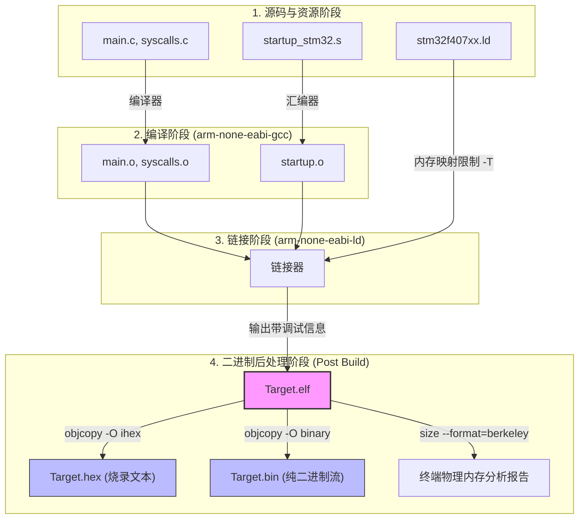

# 第三章：MCU 实战项目构建与编译流程

在前两章中，我们理解了交叉编译的底层原理并设计好了通用的 CMake 工具链描述文件。本章将进入实战阶段，展示如何基于 **Modern CMake（目标导向设计）** 规范构建一个完整的微控制器（MCU）裸机项目，并将汇编启动文件、链接脚本、C/C++ 源码混合编译，最终输出可以直接烧录的二进制固件。

---

## 3.1 项目拓扑结构设计

下面是一个典型的基于 STM32F407 微控制器的现代 CMake 项目目录布局：

```text
my_mcu_project/
├── CMakeLists.txt              # 主构建脚本
├── arm-none-eabi.cmake         # 交叉编译工具链文件 (第二章设计)
├── stm32f407vetx_flash.ld      # 芯片物理内存链接脚本
├── startup_stm32f407vetx.s     # 汇编启动文件
├── include/                    # 头文件目录
│   └── main.h
└── src/                        # 源码目录
    ├── main.c                  # 主程序
    ├── syscalls.c              # 串口及堆重定向桩函数 (第一章设计)
    └── system_stm32f4xx.c      # 时钟初始化
```

---

## 3.2 Modern CMake 与 Target 级设计

在编写构建脚本前，必须指出嵌入式开发中常见的一个误区：**滥用全局变量**。
传统的 CMake 脚本往往充斥着 `include_directories()`、`add_definitions()` 和 `link_libraries()` 等全局指令。这会导致项目内部的多个模块（如第三方协议栈、HAL 库、用户应用代码）之间产生严重的污染与耦合。

### 推荐做法：Target-Based CMake (基于目标的 CMake)

Modern CMake 将构建逻辑抽象为一个个**目标（Targets）**（可以是可执行文件或静态库）。每个目标拥有自己的**属性（Properties）**，例如包含路径、宏定义、链接选项等。我们通过控制属性在目标间的**传播范围（Visibility）**来管理依赖关系：
*   `PRIVATE`：只对当前目标有效。
*   `PUBLIC`：对当前目标有效，且会传播给任何链接到该目标的其他目标。
*   `INTERFACE`：对当前目标无效，但会传播给链接到该目标的其他目标（例如纯头文件库）。

---

## 3.3 实战：编写 `CMakeLists.txt`

以下是为该 STM32 项目定制的 `CMakeLists.txt`，它完整展示了如何引入启动文件、强制链接脚本选项、并设置生成目标。

```cmake
# ==============================================================================
# CMakeLists.txt
# STM32F407 MCU 裸机工程构建脚本
# ==============================================================================

# 1. 声明 CMake 最低版本要求
cmake_minimum_required(VERSION 3.16)

# 2. 声明工程名称，并显式启用 C、C++ 以及 ASM (汇编) 语言支持
project(stm32_demo C CXX ASM)

# 3. 设置 C/C++ 语言标准
set(CMAKE_C_STANDARD 11)
set(CMAKE_C_STANDARD_REQUIRED ON)
set(CMAKE_CXX_STANDARD 17)
set(CMAKE_CXX_STANDARD_REQUIRED ON)

# 4. 定义可执行文件目标
# 注意：在嵌入式开发中，汇编启动文件 (.s) 必须像普通 C 文件一样作为源码加入目标
add_executable(${PROJECT_NAME})

# 5. 声明目标源文件（使用相对路径，避免使用 GLOB）
target_sources(${PROJECT_NAME} PRIVATE
    src/main.c
    src/syscalls.c
    src/system_stm32f4xx.c
    startup_stm32f407vetx.s # 启动文件
)

# 6. 配置目标头文件包含路径
# PRIVATE 保证头文件路径不会意外向外泄露
target_include_directories(${PROJECT_NAME} PRIVATE
    include
)

# 7. 配置编译宏定义
# 传递芯片型号，使能厂商 HAL 库配置等
target_compile_definitions(${PROJECT_NAME} PRIVATE
    STM32F407xx
    USE_HAL_DRIVER
)

# 8. 核心步骤：绑定链接脚本 (Linker Script) 与链接参数
# 链接脚本定义了 Flash 与 SRAM 的物理边界。
# 我们必须通过 "-T" 选项传递给底层链接器 (ld)。
set(LINKER_SCRIPT "${CMAKE_CURRENT_SOURCE_DIR}/stm32f407vetx_flash.ld")

target_link_options(${PROJECT_NAME} PRIVATE
    "-T${LINKER_SCRIPT}"             # 指定链接脚本路径
    "-Wl,-Map=${CMAKE_BINARY_DIR}/${PROJECT_NAME}.map"  # 输出内存映射文件
    "-Wl,--gc-sections"              # 垃圾回收：剔除未使用的死代码及段以压缩 Flash 空间
    "-Wl,--print-memory-usage"       # 链接完成时让链接器在控制台输出物理内存占用报告
)

# 9. 生成发布级二进制固件 (.hex / .bin) 与静态空间评估
# 默认的 add_executable 只会输出带有调试符号的 ELF 文件，我们需要在此基础上挂载自定义命令
if(CMAKE_OBJCOPY AND CMAKE_SIZE)
    
    # 获取可执行目标文件名和路径
    set(ELF_FILE $<TARGET_FILE:${PROJECT_NAME}>)
    set(HEX_FILE ${CMAKE_BINARY_DIR}/${PROJECT_NAME}.hex)
    set(BIN_FILE ${CMAKE_BINARY_DIR}/${PROJECT_NAME}.bin)

    # 挂载 POST_BUILD 自定义命令：在 ELF 编译完成后立刻执行
    add_custom_command(
        TARGET ${PROJECT_NAME}
        POST_BUILD
        # A. 提取 Intel HEX 文件
        COMMAND ${CMAKE_OBJCOPY} -O ihex ${ELF_FILE} ${HEX_FILE}
        # B. 提取原始 BIN 二进制流
        COMMAND ${CMAKE_OBJCOPY} -O binary ${ELF_FILE} ${BIN_FILE}
        # C. 打印 Flash/RAM 段大小报告
        COMMAND ${CMAKE_SIZE} --format=berkeley ${ELF_FILE}
        COMMENT "Generating HEX/BIN files and analyzing memory footprint..."
    )

endif()
```

---

## 3.4 完整编译管道可视化

下面展示了通过工具链文件与构建脚本组织起来的完整编译与固件转化流水线：



---

## 3.5 如何运行与交付编译

当配置好上述所有的文件后，你只需要通过简单的命令行，即可在主机的任意目录下拉起交叉编译：

### Step 1: 配置项目（Generate）
指定 CMake 的工具链配置文件，并生成 Ninja 或者 Makefile 构建文件。

```bash
# 推荐使用 Ninja，其拥有极速的并行编译性能
cmake -DCMAKE_TOOLCHAIN_FILE=arm-none-eabi.cmake -B build -G Ninja
```

*参数解析*：
*   `-DCMAKE_TOOLCHAIN_FILE=arm-none-eabi.cmake`：将我们在第二章中设计的工具链文件注入 CMake，重定向编译器路径并锁死系统变量。
*   `-B build`：指定构建缓存与临时文件输出至 `build` 文件夹。
*   `-G Ninja`：指定生成器为 Ninja。如果不指定，在 Windows 上 CMake 会默认寻找 Visual Studio 编译器（这会导致交叉编译冲突），在 Linux 上会默认生成 Unix Makefiles。

### Step 2: 执行编译（Build）
使用 CMake 统一的构建命令触发编译，这保证了底层无论使用 Ninja 还是 Make，命令都完全一致：

```bash
cmake --build build -j 8
```

*参数解析*：
*   `--build build`：调用 `build` 目录下的 Ninja/Make 去执行真正的编译步骤。
*   `-j 8`：启用 8 线程并行编译。

### Step 3: 查看输出
编译完成后，你会在 `build` 目录下看到以下几个核心文件：
1.  **`stm32_demo.elf`**：包含 GDB 调试信息的 ELF 文件。可以配合 OpenOCD 和 GDB 进行板载在线调试与单步断点。
2.  **`stm32_demo.hex`** 和 **`stm32_demo.bin`**：可以直接通过 ST-Link Utility、J-Flash 或 STM32CubeProgrammer 烧录进芯片 Flash 的物理数据文件。
3.  **`stm32_demo.map`**：内存映射文本。记录了每一个全局变量、函数名以及汇编段在 Flash 和 SRAM 中的绝对物理地址，是静态排查物理内存溢出的最重要文档。
