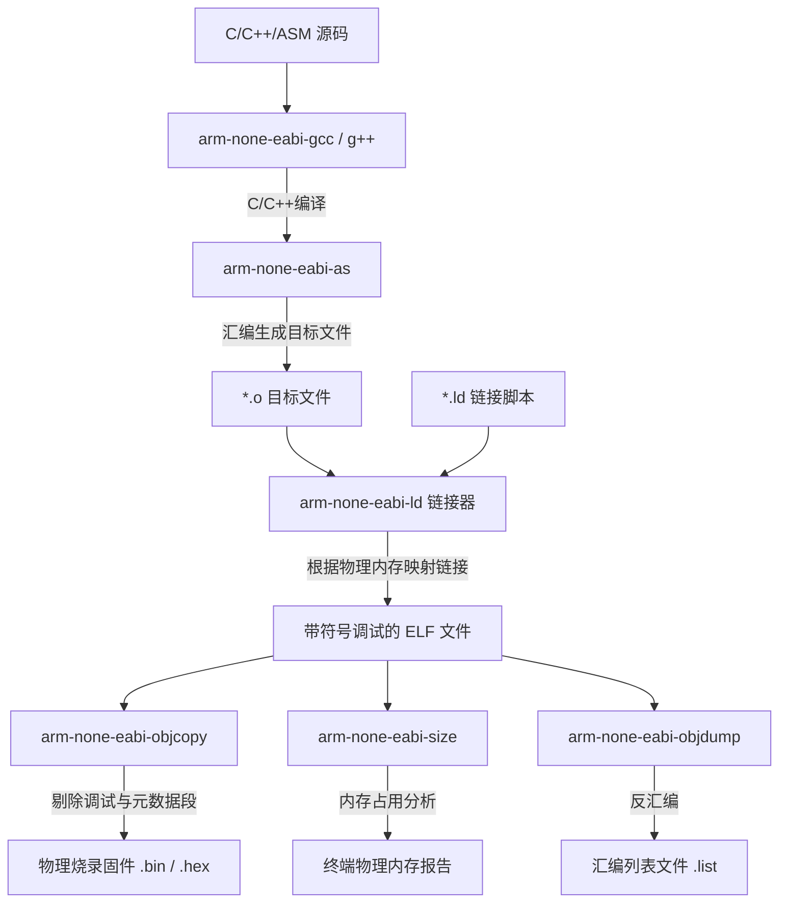

# 第一章：交叉编译核心概念与编译器寻址规则

在深入使用 CMake 配置交叉编译之前，必须清晰地理解**交叉编译（Cross Compilation）**的物理本质、目标平台的硬件约束、编译器与底层运行时库的协作关系，以及编译器的寻址与隔离规则。本章将从底层硬件架构、工具链组成、内存物理布局以及 C 标准库移植等维度进行系统性的深度剖析。

---

## 1.1 什么是交叉编译？

在传统的桌面软件开发中，我们通常在 x86_64 架构的 CPU 上编译代码，并且编译出来的可执行二进制程序同样运行在该 x86_64 的操作系统（如 Windows、Linux）上。这种“编译平台”与“运行平台”相同的模式被称为**本地编译（Native Compilation）**。

而在嵌入式开发中，目标硬件通常是基于 ARM Cortex-M、RISC-V、Xtensa 或 AVR 架构的微控制器（MCU）。这些微控制器的硬件资源（Flash/SRAM、主频）非常有限，无法在其内部运行庞大且复杂的编译器（如 GCC、Clang）来编译自身运行的代码。因此，我们必须在计算资源丰富、存储空间巨大的通用计算机（Host）上运行交叉编译工具链，生成目标芯片能够识别的机器指令，然后通过物理仿真器（如 J-Link、ST-Link）将固件烧录到目标板上运行。这种**“在平台 A（主机）上编译，在平台 B（目标机）上运行”**的编译模式即为**交叉编译（Cross Compilation）**。

### 1.1.1 主机（Host）与目标机（Target）的硬件特征比对

为了更清晰地理解交叉编译的物理背景，我们需要对比主机与目标机在底层硬件设计上的关键差异：

| 特性维度 | 主机 (Host / Build Machine) | 目标机 (Target Machine / Device) |
| :--- | :--- | :--- |
| **CPU 架构** | x86_64 (Intel/AMD), AArch64 (Apple M系列) | ARM Cortex-M0+/M3/M4/M7, RISC-V, ESP32 等 |
| **指令集体系** | 复杂指令集 (CISC) 或 高阶精简指令集 (RISC) | 极简精简指令集 (RISC，如 ARM Thumb/Thumb-2, RISC-V 32I) |
| **执行模式** | 多级特权模式（用户态/内核态），支持 MMU 虚实映射 | 单一或双特权级（Thread/Handler 模式），通常无 MMU (物理寻址) |
| **内存/存储** | 物理内存 GB 级，支持虚拟内存交换，TB 级 NVMe 固态硬盘 | 物理内存 KB 级（SRAM），存储 KB~MB 级（On-chip Flash） |
| **运行介质** | 从磁盘加载程序至 RAM 后执行 | **原地执行 (Execute-in-Place, XIP)**：直接在 Flash 中读指令运行 |
| **时钟主频** | 2.0 GHz ~ 5.0 GHz (超标量、多核、乱序执行) | 8 MHz ~ 400 MHz (单发射、顺序执行、超低功耗流水线) |

### 1.1.2 编译寻址与隔离规则：防止路径越界

在交叉编译中，最关键的规则是**环境隔离**。主机编译器与交叉编译器拥有不同的搜索路径：

```text
主机搜索路径 (Native Paths)             目标机系统根目录 (Target Sysroot)
+-----------------------------+         +-------------------------------------+
| /usr/include                |         | arm-none-eabi/include               |
| /usr/lib                    |         | arm-none-eabi/lib (libc.a, libm.a)  |
| /usr/local/lib              |         | lib/gcc/arm-none-eabi/10.3.1/       |
+-----------------------------+         +-------------------------------------+
               |                                           |
    [ 主机 GCC / Clang 搜索 ]                    [ 交叉编译器 arm-none-eabi-gcc 搜索 ]
               |                                           |
               v                                           v
    生成运行于 Host 的 x86_64 库                 生成运行于 Target 的 ARM 机器码
```

> [!CAUTION]
> **绝对路径越界污染**：如果在为目标机（如 Cortex-M4）编译项目时，由于 CMake 配置不当，头文件包含路径意外指向了主机的 `/usr/include`，编译器可能会读入主机操作系统的 `stdio.h`。由于主机系统的标准库头文件中包含大量与操作系统内核、POSIX 线程或 64 位数据类型相关的定义，这会在编译时产生各种难以理解的结构体大小冲突、未定义符号，或者在链接阶段将 x86 架构的预编译库链接进去，从而导致构建彻底失败。

---

## 1.2 目标三元组（Target Triplet）

在交叉编译工具链中，**目标三元组（Target Triplet）**用于唯一且精确地标识编译出的二进制程序所针对的运行平台。它的标准规范格式为：

$$\text{Architecture} - \text{Vendor} - \text{Operating System} - \text{Application Binary Interface (ABI)}$$

### 1.2.1 常见交叉编译器三元组对比

| 工具链名称 | 目标三元组 | 适用场景 |
| :--- | :--- | :--- |
| `arm-none-eabi-gcc` | `arm-none-eabi` | ARM Cortex-M/R 裸机（无 OS 或搭载 RTOS）开发 |
| `arm-linux-gnueabihf-gcc` | `arm-linux-gnueabihf` | 运行嵌入式 Linux 的 32 位 ARM (如 Raspberry Pi 3) |
| `riscv32-unknown-elf-gcc` | `riscv32-unknown-elf` | RISC-V 32位裸机嵌入式系统，生成 ELF 格式 |
| `x86_64-w64-mingw32-gcc` | `x86_64-w64-mingw32` | 在 Linux 主机上交叉编译 Windows x64 平台的可执行程序 |

### 1.2.2 `arm-none-eabi` 字段深度拆解

```text
arm  -  none  -  eabi
 │        │        │
 │        │        └─ ABI (Embedded ABI, 嵌入式应用二进制接口，定义传参和对齐规则)
 │        └────────── Vendor (无特定硬件厂商，指通用工具链)
 └─────────────────── Architecture (ARM 32位架构，生成 Thumb/Thumb-2 指令)
```

1.  **Architecture (架构)**：
    指明目标 CPU 的基础指令集架构。如 `arm` 代表 32 位 ARM 架构，`aarch64` 代表 64 位 ARM 架构，`riscv32` / `riscv64` 代表 32/64 位 RISC-V 架构。
2.  **Vendor (厂商)**：
    标识工具链发行商。在多数开源交叉工具链中，此字段为 `none` 或 `unknown`。少数情况下会标记厂商名（如 `apple`、`w64`）。
3.  **Operating System (操作系统)**：
    说明二进制文件运行的目标操作系统。
    对于裸机（Bare-metal）环境，由于没有任何操作系统，该字段通常被设置为 `none`、`elf`（表示直接输出 ELF 格式的裸机程序）或者干脆省略。
4.  **ABI / Environment (应用二进制接口)**：
    ABI 规定了函数调用时的栈帧结构、参数在寄存器与栈之间的分配方式、基本数据类型的大小和内存对齐规范。
    *   `eabi`：Embedded ABI。专为嵌入式裸机优化的二进制接口。
    *   `gnueabi`：针对运行 Linux 操作系统的 ARM 平台，使用 GNU C 库（glibc）。
    *   `gnueabihf`：其中的 **`hf` (Hard Float)** 代表硬件浮点。这要求目标 CPU 物理上配备了 FPU（浮点运算单元）。在进行浮点运算时，函数调用的参数直接通过专用的 FPU 寄存器（如 ARM 的 `s0`~`s15`）进行传递，而不是通过通用寄存器（如 `r0`~`r3`）进行软模拟传递。

#### 浮点 ABI 参数配置对比（`-mfloat-abi`）

在编译 ARM 芯片（例如 Cortex-M4/M7）时，GCC 提供了三种浮点 ABI 配置参数，它们决定了浮点代码的生成质量：

*   **`soft`**：纯软件浮点模拟。所有的浮点运算都被编译器转换为对标准库中浮点模拟函数（如 `__aeabi_fadd`）的调用，不使用 FPU 硬件指令，参数通过通用寄存器 `r0`~`r3` 传递。
*   **`softfp`**：允许使用 FPU 硬件指令进行浮点计算，但在函数调用时，浮点参数仍然遵循 `soft` 规则，即放入通用寄存器 `r0`~`r3` 传递。这常用于保持与没有 FPU 的老旧库文件的二进制兼容性，但会引入寄存器之间数据搬运的额外开销。
*   **`hard`**：完全启用硬件浮点。直接使用 FPU 指令进行计算，且在函数调用时，浮点数参数直接装载入 FPU 寄存器（`s0`~`s15` / `d0`~`d7`）进行高速传递，执行效率最高。

---

## 1.3 交叉编译工具链的内部组成

一套完整的交叉编译工具链（以 `arm-none-eabi-` 为例）由编译器前端、汇编器、链接器以及一系列二进制处理分析工具（统称为 Binutils）构成：



### 1.3.1 关键组件及职责详述

*   **`arm-none-eabi-gcc` / `arm-none-eabi-g++`**：
    编译器前端。它负责读取 C/C++ 源代码，进行预处理（展开宏、包含头文件）、语法分析、语义分析、代码优化，生成高度适配目标 CPU 指令集的汇编代码。
*   **`arm-none-eabi-as`**：
    汇编器。将汇编语言代码转换为机器指令，生成不可执行的重定位目标文件（`.o`）。
*   **`arm-none-eabi-ld`**：
    链接器。这是编译链中最关键的步骤之一。链接器读取所有的 `.o` 目标文件、编译器自带的系统库（`libc.a` 等），并根据开发者提供的**链接脚本（Linker Script, `.ld`）**规定的物理地址边界，解析全局符号，分配段地址，最终生成包含完整调试信息（如 DWARF 格式）的 `ELF`（Executable and Linkable Format）文件。
*   **`arm-none-eabi-objcopy`**：
    目标拷贝与转换工具。MCU 的内置 Flash 物理上只认连续的机器指令和数据，无法识别 ELF 文件复杂的头部段表结构。`objcopy` 用于从 ELF 文件中提取出 `.text`（代码段）、`.data`（已初始化数据段）等物理段，并将其写入纯二进制文件 `.bin`（Raw Binary）或带有地址校验的 ASCII 文本格式 `.hex`（Intel Hex）中，供烧录器使用。
*   **`arm-none-eabi-size`**：
    空间占用分析器。读取 ELF 文件并统计其各个段的内存大小。在编译结束时，它能输出程序所占用的 Flash 和 RAM 空间，是防止内存溢出（Out of Memory）的哨兵。
*   **`arm-none-eabi-objdump`**：
    反汇编器。能够将 ELF 或目标文件逆向转换为汇编指令。在定位 HardFault（硬件死机异常）、分析编译器优化行为时极其有用。

---

## 1.4 裸机内存布局与引导机制

在没有操作系统的裸机（Bare-metal）环境中，程序无法依赖 OS 的加载器（如 Linux 的 `ld.so`）来动态载入内存和分配栈空间。一切必须由硬件的物理特性与启动汇编代码来共同保障。

### 1.4.1 物理存储介质的划分：Flash 与 SRAM

微控制器中的存储器主要分为两大类：
1.  **Flash ROM (非易失性存储)**：
    断电后数据不丢失，读取速度较快，支持**原地执行 (XIP)**。用于存放 CPU 执行的机器码（`.text` 段）以及只读常量数据（`.rodata` 段）。
2.  **SRAM (易失性随机存储器)**：
    断电后数据全部丢失，读写速度极快。用于存放已初始化的全局/静态变量（`.data` 段）、未初始化的全局/静态变量（`.bss` 段）、以及运行时动态分配的堆（Heap）和函数调用上下文所需的栈（Stack）。

### 1.4.2 中断向量表与硬件引导流程（以 ARM Cortex-M 为例）

当微控制器完成复位（如上电、看门狗复位或手动复位）时，其内部的硬件状态机将按照如下固定的硬件逻辑进行引导：

1.  **物理地址映射**：
    芯片内部将主 Flash 的起始地址（例如 STM32 的 `0x08000000`）映射到 CPU 的 `0x00000000` 虚拟首地址。
2.  **加载主栈指针 (MSP)**：
    硬件自动读取物理首地址 `0x00000000` 处的 32 位字（Dword），并将其装载入主栈指针寄存器 **MSP**。这瞬间确立了 C 语言函数调用所必须的物理栈边界。
3.  **跳转复位中断向量**：
    硬件自动读取物理地址 `0x00000004` 处的 32 位字，该值即为复位中断服务函数 `Reset_Handler` 的物理入口地址。接着硬件将此地址写入程序计数器 **PC**，CPU 开始执行第一条汇编指令。

```text
物理地址首部 (中断向量表)
+----------------------------+ 0x00000000
|  MSP Stack Pointer Top      |  ==> 硬件自动装载到 SP (栈顶指针)
+----------------------------+ 0x00000004
|  Reset Vector (Reset_Handler)|  ==> 硬件自动装载到 PC (程序计数器) 并跳转
+----------------------------+ 0x00000008
|  NMI Exception Vector      |
+----------------------------+ 0x0000000C
|  HardFault Exception Vector|
+----------------------------+
|  ... 其余外设中断向量       |
+----------------------------+
```

### 1.4.3 Reset_Handler 汇编的核心任务：构建 C 运行时环境

C 语言规范有一项基本假设：在 `main()` 函数被执行前，所有已初始化的全局和静态变量（如 `int a = 42;`）必须已被赋予初值，且所有未初始化的全局和静态变量（如 `int b;`）必须全部为零。

由于芯片断电后 SRAM 的内容是随机的，而这些初值是随编译好的固件一同存放在 Flash 中的。因此，在调用 `main()` 之前，启动汇编 `Reset_Handler` 必须亲自动手建立 C 语言所需的运行时环境：

1.  **`.data` 数据段的迁移**：
    将已初始化变量的初值从其 Flash 存储地址（**LMA，加载域地址**）拷贝到其物理运行的 SRAM 地址（**VMA，运行域地址**）。
2.  **`.bss` 段清零**：
    在 SRAM 中为未初始化变量预留的 `.bss` 段物理区间内，写入全 `0`。
3.  **时钟与硬件基础配置**：
    调用 `SystemInit` 阶段函数（通常由厂商库提供），启动外部锁相环时钟（HSE/PLL），使 CPU 运行在预定主频。
4.  **C++ 静态对象初始化**：
    如果是 C++ 工程，通过调用 `__libc_init_array` 函数来依次触发全局和静态对象的构造函数。
5.  **跳转执行**：
    调用 `main()` 函数。若 `main()` 意外返回，汇编将陷入无限死循环，防止 CPU 指令计数器跑飞。

---

## 1.5 C 标准库与系统调用打桩 (Syscalls Retargeting)

在没有操作系统（Bare-metal）的嵌入式环境中，使用 C/C++ 标准库函数会面临极大的物理障碍。最典型的例子就是在裸机下直接调用 `printf("Hello World\n");` 或 `malloc(128);`。

### 1.5.1 链接错误的本质

标准的 GCC `libc.a`（如桌面级 Linux 使用的 glibc）在执行诸如文件读写、内存分配、时间获取等操作时，底层是通过触发 CPU 异常来向 Linux 内核发起**系统调用（Syscalls）**。
然而，在裸机环境中，既没有 OS 内核来响应这些中断，也没有标准输出设备（Stdout）的物理接口（如屏幕或终端）。如果不加任何处理直接编译，链接器将抛出大量找不到系统接口的错误（未定义符号）：

```text
arm-none-eabi/lib/libc.a(lib_a-writer.o): In function `_write_r':
writer.c:(.text+0x18): undefined reference to `_write'
arm-none-eabi/lib/libc.a(lib_a-sbrkr.o): In function `_sbrk_r':
sbrkr.c:(.text+0x12): undefined reference to `_sbrk'
```

### 1.5.2 Newlib 与 Newlib-Nano 的适配

为了解决裸机对 C 标准库的支持问题，ARM 的 GNU 工具链默认打包了 **Newlib** 运行库。
为了适应微控制器极其宝贵的 Flash 和 RAM 资源，工具链中还提供了一个裁剪版：**Newlib-Nano**。
*   **内存优化**：移除了浮点数格式化输出的支持（即默认 `printf` 无法打印 `%f`，需要通过链接标志 `-u _printf_float` 手动开启），大大减小了 `.text` 段体积。
*   **轻量化接口**：精简了宽字符支持和多字节转换函数。
*   **打桩机制**：Newlib 要求开发者在用户层提供 17 个底层系统调用存根函数（Stub Functions），也称作**重定向（Retargeting）**，来接管标准库的底层 IO。

### 1.5.3 生产级 C 标准库桩函数（Syscalls.c）实现

在嵌入式开发中，我们通常需要创建一个 `syscalls.c` 文件并编译进工程，以重写底层函数。以下是一份高度注释的生产级系统调用打桩实现：

```c
/**
 * ******************************************************************************
 * @file    syscalls.c
 * @brief   针对 ARM Cortex-M 裸机环境的 Newlib-Nano 系统调用桩函数重定向实现
 * ******************************************************************************
 */

#include <sys/stat.h>
#include <sys/types.h>
#include <errno.h>
#include <stdio.h>
#include <unistd.h>

/* 定义 errno 的外部声明 */
#undef errno
extern int errno;

/* 声明外设底层的物理发送函数，由具体的硬件驱动库（如 STM32 HAL / LL）提供 */
extern int UART_Transmit(uint8_t *pData, uint16_t Size);

/**
 * @brief  重定向标准输出/错误输出函数 (_write)
 * @param  file: 文件描述符。在裸机下：
 *               1 代表 stdout (标准输出)
 *               2 代表 stderr (标准错误输出)
 * @param  ptr: 指向要发送的字符缓冲区指针
 * @param  len: 发送的数据字节长度
 * @return 实际发送的字节数，若出错则返回 -1
 */
int _write(int file, char *ptr, int len) {
    if (file == STDOUT_FILENO || file == STDERR_FILENO) {
        /* 调用物理串口驱动发送数据 */
        if (UART_Transmit((uint8_t *)ptr, (uint16_t)len) == 0) {
            return len;
        } else {
            errno = EIO; /* I/O 错误 */
            return -1;
        }
    }
    errno = EBADF; /* 错误的文件描述符 */
    return -1;
}

/**
 * @brief  重定向标准输入函数 (_read)
 *         在裸机环境下，若不需要从标准输入读数据，可以直接返回 0 或读取物理串口
 */
int _read(int file, char *ptr, int len) {
    if (file == STDIN_FILENO) {
        /* 此处可以对接物理串口的接收函数 */
        return 0;
    }
    errno = EBADF;
    return -1;
}

/**
 * @brief  重定向动态堆内存分配函数 (_sbrk)
 *         C 语言的 malloc() 和 free() 底层会调用此函数来申请与释放连续的物理内存。
 *         堆是从低地址（通常緊随 .bss 段之后）向高地址（栈底）增长的物理区域。
 */
int _sbrk(int incr) {
    /* 引入链接脚本中定义的物理边界符号 */
    extern char _end;     /* 堆的物理起始地址（在链接脚本中定义） */
    extern char _estack;  /* 物理栈顶地址，用于作边界溢出保护 */
    
    static char *current_heap_end = NULL;
    char *previous_heap_end;

    /* 首次调用时，初始化堆指针为链接脚本中定义的起始地址 */
    if (current_heap_end == NULL) {
        current_heap_end = &_end;
    }

    previous_heap_end = current_heap_end;

    /* 溢出防护检查：堆和栈在内存中相对增长，必须防止堆越界撞击栈空间 */
    /* 假设保留 2KB 的物理安全区以防栈溢出崩溃 */
    if (current_heap_end + incr > (&_estack - 2048)) {
        errno = ENOMEM; /* 物理内存不足 */
        return (int)-1;
    }

    /* 移动堆边界指针 */
    current_heap_end += incr;

    /* 返回分配前的堆起始指针，即本次分配的内存首地址 */
    return (int)previous_heap_end;
}

/**
 * @brief  查询文件状态 (_fstat)
 *         裸机无真正文件系统，但标准库格式化时需要此接口报告流属性
 */
int _fstat(int file, struct stat *st) {
    if (file == STDOUT_FILENO || file == STDERR_FILENO || file == STDIN_FILENO) {
        st->st_mode = S_IFCHR; /* 标记为字符设备（如终端串口） */
        return 0;
    }
    errno = EBADF;
    return -1;
}

/**
 * @brief  判断文件描述符是否关联到终端/字符设备 (_isatty)
 */
int _isatty(int file) {
    if (file == STDOUT_FILENO || file == STDERR_FILENO || file == STDIN_FILENO) {
        return 1; /* 是字符设备 */
    }
    return 0;
}

/**
 * @brief  文件定位 (_lseek)
 *         由于串口和裸机流无法寻道，返回 0 即可
 */
int _lseek(int file, int ptr, int dir) {
    (void)file;
    (void)ptr;
    (void)dir;
    return 0;
}

/**
 * @brief  关闭文件描述符 (_close)
 */
int _close(int file) {
    (void)file;
    return -1;
}

/**
 * @brief  异常结束进程 (_exit)
 *         在裸机中代表系统崩溃，通常直接关闭中断并进入死循环，或触发复位
 */
void _exit(int status) {
    (void)status;
    __disable_irq(); /* 禁用所有中断 */
    while (1) {
        /* 可在此处加入看门狗复位或软复位 */
    }
}

/**
 * @brief  发送信号 (_kill)
 */
int _kill(int pid, int sig) {
    (void)pid;
    (void)sig;
    errno = EINVAL;
    return -1;
}

/**
 * @brief  获取进程 ID (_getpid)
 */
int _getpid(void) {
    return 1;
}
```

这些底层的重定向不仅是让代码能够成功通过链接的关键，更是后续能够使用 `printf` 输出日志、使用动态数据结构的前提。在下一章中，我们将展示如何通过 CMake 编写完美的工具链描述文件，将这些繁琐的编译与链接设置全部封装起来。
