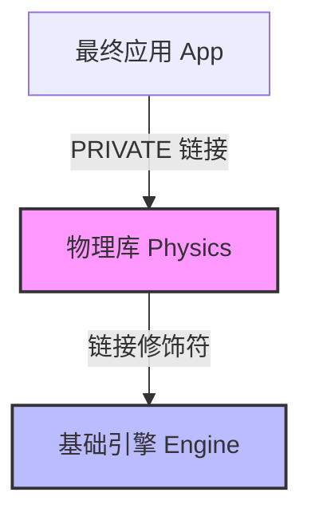

# 2. 现代 CMake 目标属性与传播机制

现代 CMake 的核心思想是**面向对象编程**的延伸：将每个构建产物（可执行文件或库）抽象为**目标（Target）**，而控制构建行为的规则则被封装为目标的**属性（Properties）**。

本章将详细探讨 CMake 目标属性的分类、属性在依赖树中的传播逻辑（`PRIVATE` / `PUBLIC` / `INTERFACE`），以及如何利用生成器表达式（Generator Expressions）解决构建期与安装期路径冲突的难题。

---

## 1. 目标属性模型：从目录级命令到目标级命令

在传统的 CMake 中，我们常用全局或目录级命令来管理配置。例如：

```cmake
# 传统 CMake（不推荐）：污染全局，导致所有子目录目标都继承这些配置
include_directories(${CMAKE_CURRENT_SOURCE_DIR}/include)
add_definitions(-DDEBUG_MODE=1)
link_libraries(pthread)
```

而在现代 CMake 中，我们应当仅使用目标级命令：

```cmake
# 现代 CMake（强烈推荐）：精准限定配置的作用域
target_include_directories(my_lib PUBLIC include/)
target_compile_definitions(my_lib PRIVATE DEBUG_MODE=1)
target_link_libraries(my_lib PRIVATE pthread)
```

### 1.1 内部属性与导出属性的映射关系

在底层，每个目标均维护着两套独立的属性列表：
1.  **内部属性**：仅在编译**目标自身**时生效。
2.  **接口（导出）属性**：当其他目标链接该目标时，这些属性会**传播**给下游消费者。

CMake 预定义了如下属性映射关系：

| 目标级设置命令 | 影响自身的内部属性 | 传播给消费者的接口属性 | 统一控制属性 |
| :--- | :--- | :--- | :--- |
| `target_include_directories` | `INCLUDE_DIRECTORIES` | `INTERFACE_INCLUDE_DIRECTORIES` | 头文件搜索路径 |
| `target_compile_definitions` | `COMPILE_DEFINITIONS` | `INTERFACE_COMPILE_DEFINITIONS` | 预处理器宏定义 |
| `target_compile_options` | `COMPILE_OPTIONS` | `INTERFACE_COMPILE_OPTIONS` | 编译器选项（如 `-Wall`） |
| `target_link_libraries` | `LINK_LIBRARIES` | `INTERFACE_LINK_LIBRARIES` | 依赖链接库 |
| `target_link_options` | `LINK_LINK_OPTIONS` | `INTERFACE_LINK_OPTIONS` | 链接器参数（如 `-Wl,-rpath`） |

---

## 2. 传播可见性：PUBLIC, PRIVATE, INTERFACE

在调用 `target_link_libraries`、`target_include_directories` 等命令时，必须显式指定可见性修饰符。它们决定了属性是如何在依赖图中传递的：

*   **`PRIVATE`**：表示该依赖关系或编译属性**仅供目标自身构建时使用**。下游消费者不会继承这些属性。
*   **`INTERFACE`**：表示该依赖关系或编译属性**仅供下游消费者使用**。目标自身在编译时并不需要。这常用于 Header-only 库或仅在头文件中暴露的依赖。
*   **`PUBLIC`**：它是 `PRIVATE` 与 `INTERFACE` 的结合体。表示该依赖关系或属性**既用于编译目标自身，也必须传递给下游消费者**。

### 2.1 依赖传播模型与图解

为了清晰描述这三者的传播特征，我们构建一个经典的多级依赖场景。
假设有一个基础库 `Engine`、一个中间库 `Physics` 和一个最终应用 `App`：



当 `Physics` 链接 `Engine` 时，使用不同的修饰符会产生完全不同的属性链条：

#### 场景 A：`Physics` 以 **`PRIVATE`** 方式链接 `Engine`
```cmake
target_link_libraries(Physics PRIVATE Engine)
```
*   **构建 `Physics` 时**：`Physics` 可以访问 `Engine` 的头文件，并链接 `Engine` 的二进制文件。
*   **构建 `App` 时**：`App` 链接 `Physics` 时，**不会**自动获得 `Engine` 的头文件路径。如果 `Physics` 的公共头文件中包含了 `Engine` 的头文件，`App` 将会报“找不到头文件”编译错误。

#### 场景 B：`Physics` 以 **`PUBLIC`** 方式链接 `Engine`
```cmake
target_link_libraries(Physics PUBLIC Engine)
```
*   **构建 `Physics` 时**：同上，`Physics` 正常使用 `Engine`。
*   **构建 `App` 时**：`App` 链接 `Physics` 后，CMake 会自动将 `Engine` 的 `INTERFACE_INCLUDE_DIRECTORIES` 与 `INTERFACE_LINK_LIBRARIES` 传播给 `App`。`App` 无需显式链接 `Engine` 即可成功编译并链接。

#### 场景 C：`Physics` 以 **`INTERFACE`** 方式链接 `Engine`
```cmake
target_link_libraries(Physics INTERFACE Engine)
```
*   **构建 `Physics` 时**：`Physics` 自身在编译时不使用 `Engine`（例如 `Physics` 自身不编译任何源文件，或者 `Engine` 的类仅在 `Physics` 的对外模板头文件中被引用）。
*   **构建 `App` 时**：`App` 链接 `Physics` 时，会自动继承对 `Engine` 的链接和头文件引用。

---

## 3. 生成器表达式（Generator Expressions）与路径解耦

在定义库目标的包含目录（Include Directories）时，会面临一个典型的生命周期问题：
*   **构建期（Build Tree）**：开发阶段，库的头文件位于本机的物理源文件目录（如 `C:/project/my_lib/include`）。
*   **安装期（Install Tree）**：分发阶段，库的头文件已被复制到系统或指定安装目录（如 `/usr/local/include` 或 `relative/path/to/prefix/include`）。

如果在定义目标属性时直接写入绝对路径：
```cmake
# 错误示范：此绝对路径会被固化写入导出的 CMake 配置文件中，下游用户引用时必然报错
target_include_directories(my_lib PUBLIC ${CMAKE_CURRENT_SOURCE_DIR}/include)
```

为了解决这种“一库两路径”的冲突，CMake 引入了**生成器表达式**中的 `$<BUILD_INTERFACE:...>` 与 `$<INSTALL_INTERFACE:...>`。

*   **`$<BUILD_INTERFACE:paths...>`**：仅在当前 CMake 构建树中生效（如执行 `cmake --build` 编译本项目或通过 `add_subdirectory` 引用本项目时）。
*   **`$<INSTALL_INTERFACE:paths...>`**：仅在下游用户通过 `find_package()` 载入已安装的包时生效。

### 3.1 最佳实践模板

在现代 CMake 中，定义包含路径的规范格式如下：

```cmake
target_include_directories(my_lib
    PUBLIC
        # 1. 构建期：指向本地的源文件目录
        $<BUILD_INTERFACE:${CMAKE_CURRENT_SOURCE_DIR}/include>
        
        # 2. 安装期：指向安装后的相对路径（相对于 CMAKE_INSTALL_PREFIX）
        $<INSTALL_INTERFACE:include>
)
```

当执行安装操作并将该目标导出为 CMake 配置文件时，CMake 会自动剔除 `$<BUILD_INTERFACE:...>` 中的本地绝对路径，并仅保留 `$<INSTALL_INTERFACE:include>` 属性。这就确保了生成的配置文件在任何其他机器上都能正确运行，不会携带当前开发机特有的绝对路径。
