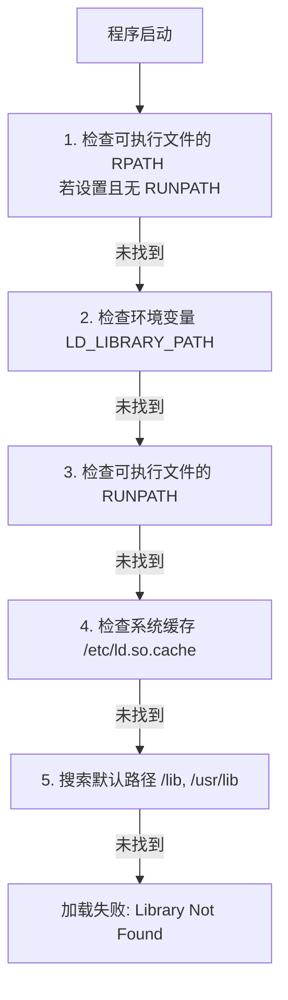

# 3. 库的分发、导出与 RPATH 规范管理

在生产环境中，开发完一个 C/C++ 库后，最关键的一步是将其**正确地打包分发**，使得下游项目能够通过现代 CMake 的 `find_package(PackageName CONFIG REQUIRED)` 一键引入，并且在部署到目标机时不会因为动态库加载路径问题报错。

本章将提供一套完整的工业级分发模板，深度剖析包配置文件的生成逻辑，并系统性地梳理 RPATH/RUNPATH 的配置规范。

---

## 1. 动态库加载寻址：RPATH 与 RUNPATH

在 Linux 和 macOS 等 Unix-like 系统上，可执行文件链接动态库（`.so`/`.dylib`）时，系统动态链接器（在 Linux 上是 `ld.so` 或 `ld-linux.so`）在运行时需要定位这些库。

动态链接器的默认库查找顺序如下：



### 1.1 RPATH 与 RUNPATH 的区别

*   **RPATH（Run Path）**：具有最高优先级，甚至优先于 `LD_LIBRARY_PATH`。但是它不够灵活，一旦写入可执行文件，很难在不修改二进制文件的前提下通过环境变量覆盖。
*   **RUNPATH**：其优先级低于 `LD_LIBRARY_PATH`。这允许系统管理员通过环境变量覆盖库搜索路径，是目前现代 Linux 发行版（如 Ubuntu 18.04+ 等默认启用 `--enable-new-dtags` 链接器选项）推荐的机制。

### 1.2 相对定位技术：`$ORIGIN` 与 `@loader_path`

为了让发布包具备“开箱即用”的便携性（Portable），不应将 RPATH 写死为开发机上的绝对路径（如 `/home/user/libs`），而应采用**相对可执行文件自身路径的定位技术**：
*   **Linux**：使用 `$ORIGIN`。例如，`$ORIGIN/../lib` 表示在当前运行程序所在目录的上一级 `lib/` 目录下寻找动态库。
*   **macOS**：使用 `@loader_path`，行为与 Linux 的 `$ORIGIN` 类似。

### 1.3 CMake 的 RPATH 自动管理机制

默认情况下，CMake 会在构建阶段和安装阶段采取不同的 RPATH 策略：
1.  **构建树中（Build Tree）**：CMake 会自动向生成的二进制文件中写入绝对路径的 RPATH，指向当前编译输出的目录，以便开发人员可以直接在编译目录下运行测试程序。
2.  **安装树中（Install Tree）**：在执行 `cmake --install` 时，CMake 会默认**擦除**构建期的绝对路径 RPATH。如果不做显式配置，安装后的二进制文件将不带任何 RPATH，容易导致运行时加载失败。

#### 生产级 RPATH 推荐配置

```cmake
# 避免在构建期和安装期重复链接（仅在安装时通过 CMake 改变 RPATH）
set(CMAKE_BUILD_WITH_INSTALL_RPATH OFF)

# 确保安装后的二进制文件包含 RPATH
set(CMAKE_INSTALL_RPATH_USE_LINK_PATH ON)

# 根据平台动态决定使用 $ORIGIN 还是 @loader_path
if(APPLE)
    set(CMAKE_INSTALL_RPATH "@loader_path/../lib")
else()
    # 注意：在 CMake 中使用 $ORIGIN 时，需要对 $ 进行转义阻止 CMake 解析它
    set(CMAKE_INSTALL_RPATH "\$ORIGIN/../lib")
endif()
```

---

## 2. 工业级库目标安装与导出规范

一个能够被其他项目完美集成的 CMake 包，通常需要安装以下内容：
1.  **二进制文件**：静态库（`.a`/`.lib`）、动态库（`.so`/`.dll`）、动态库的导入库（仅 Windows 平台需要的 `.lib`）、可执行工具。
2.  **头文件**：库暴露的公共接口头文件。
3.  **CMake 导出描述文件（Target Export Files）**：描述各库目标属性与依赖关系的 `.cmake` 脚本。
4.  **包配置文件（Package Config Files）**：提供给 `find_package` 使用的配置文件。

我们以一个名为 `MyMathLib` 的 C++ 项目为例，演示完整的配置流程。

### 2.1 依赖关系描述文件模板：`MyMathLibConfig.cmake.in`

在项目根目录下创建该文件，它作为 `find_package` 的入口模板。当库本身依赖第三方包时，必须在此处安全地导入依赖。

```cmake
@PACKAGE_INIT@

# 引入本库所依赖的第三方库（例如下游使用时也必须引入的 Threads）
include(CMakeFindDependencyMacro)
find_dependency(Threads REQUIRED)

# 导入 CMake 自动生成的导出目标文件
include("${CMAKE_CURRENT_LIST_DIR}/MyMathLibTargets.cmake")

# 检查导入的目标是否完备
check_required_components(MyMathLib)
```

### 2.2 完整的构建、安装与打包 `CMakeLists.txt`

下面是核心 `CMakeLists.txt` 的编写，展示了如何使用 `CMakePackageConfigHelpers` 自动生成版本和路径匹配的配置文件。

```cmake
cmake_minimum_required(VERSION 3.15)
project(MyMathLib VERSION 1.2.3 LANGUAGES CXX)

# 1. 强制设定 C++ 标准与 RPATH 规则
set(CMAKE_CXX_STANDARD 17)
set(CMAKE_CXX_STANDARD_REQUIRED ON)

# RPATH 相对路径配置
if(APPLE)
    set(CMAKE_INSTALL_RPATH "@loader_path/../lib")
else()
    set(CMAKE_INSTALL_RPATH "\$ORIGIN/../lib")
endif()
set(CMAKE_INSTALL_RPATH_USE_LINK_PATH ON)

# 2. 引入外部依赖（作为演示，这里引入线程库）
find_package(Threads REQUIRED)

# 3. 声明库目标（这里以 SHARED 动态库为例）
add_library(my_math_lib SHARED
    src/adder.cpp
    src/multiplier.cpp
)

# 4. 配置目标属性与路径解耦
target_include_directories(my_math_lib
    PUBLIC
        $<BUILD_INTERFACE:${CMAKE_CURRENT_SOURCE_DIR}/include>
        $<INSTALL_INTERFACE:include>
)

target_link_libraries(my_math_lib
    PUBLIC
        Threads::Threads
)

# 5. 定义安装路径的变量（遵循 GNU 标准目录命名）
include(GNUInstallDirs)

# 6. 安装二进制目标，并关联到名为 "MyMathLibTargets" 的导出集合中
install(TARGETS my_math_lib
    EXPORT MyMathLibTargets
    ARCHIVE DESTINATION ${CMAKE_INSTALL_LIBDIR}  # 静态库安装路径 (lib/)
    LIBRARY DESTINATION ${CMAKE_INSTALL_LIBDIR}  # 动态库安装路径 (lib/)
    RUNTIME DESTINATION ${CMAKE_INSTALL_BINDIR}  # 可执行文件与 Windows DLL 安装路径 (bin/)
    INCLUDES DESTINATION ${CMAKE_INSTALL_INCLUDEDIR} # 声明安装后的头文件根路径
)

# 7. 安装头文件到 include 目录
install(DIRECTORY include/
    DESTINATION ${CMAKE_INSTALL_INCLUDEDIR}
    FILES_MATCHING PATTERN "*.h" PATTERN "*.hpp"
)

# 8. 生成并安装 "MyMathLibTargets.cmake" 文件
# 此文件记录了 my_math_lib 的属性以及其对 Threads::Threads 的依赖
install(EXPORT MyMathLibTargets
    FILE MyMathLibTargets.cmake
    NAMESPACE MyMathLib::            # 导出目标的前缀，防止命名冲突
    DESTINATION ${CMAKE_INSTALL_LIBDIR}/cmake/MyMathLib
)

# 9. 利用 CMakePackageConfigHelpers 自动生成包配置文件
include(CMakePackageConfigHelpers)

# 生成版本检测文件 (检测 major/minor 兼容性)
write_basic_package_version_file(
    "${CMAKE_CURRENT_BINARY_DIR}/MyMathLibConfigVersion.cmake"
    VERSION ${PROJECT_VERSION}
    COMPATIBILITY SameMajorVersion
)

# 生成包配置文件 (填充 @PACKAGE_INIT@ 等占位符)
configure_package_config_file(
    "${CMAKE_CURRENT_SOURCE_DIR}/MyMathLibConfig.cmake.in"
    "${CMAKE_CURRENT_BINARY_DIR}/MyMathLibConfig.cmake"
    INSTALL_DESTINATION ${CMAKE_INSTALL_LIBDIR}/cmake/MyMathLib
)

# 安装这两个生成的配置文件
install(FILES
    "${CMAKE_CURRENT_BINARY_DIR}/MyMathLibConfig.cmake"
    "${CMAKE_CURRENT_BINARY_DIR}/MyMathLibConfigVersion.cmake"
    DESTINATION ${CMAKE_INSTALL_LIBDIR}/cmake/MyMathLib
)
```

---

## 3. 下游项目集成演示

当上述库被安装到系统目录（或用户指定目录，如 `/opt/my_math`）后，下游项目可以通过极简的现代 CMake 语法无缝集成该库。

### 下游项目 `CMakeLists.txt`

```cmake
cmake_minimum_required(VERSION 3.15)
project(AppRunner CXX)

set(CMAKE_CXX_STANDARD 17)

# 1. 寻找已安装的包
# 如果安装在非标准路径，下游编译时可以通过传入 -DMyMathLib_DIR=/opt/my_math/lib/cmake/MyMathLib 来定位
find_package(MyMathLib 1.2 CONFIG REQUIRED)

# 2. 声明可执行文件
add_executable(app_runner main.cpp)

# 3. 一键链接目标
# 此命令会自动让 app_runner 继承包含目录（include/）、链接库文件（my_math_lib.so），以及多级依赖（Threads）
target_link_libraries(app_runner PRIVATE MyMathLib::my_math_lib)
```

### 下游项目源码 `main.cpp`

```cpp
#include <iostream>
#include <my_math/adder.h> // 正常包含头文件，无需手动配置 include 路径

int main() {
    int sum = my_math::add(10, 20);
    std::cout << "10 + 20 = " << sum << std::endl;
    return 0;
}
```

通过这套规范化构建与分发方案，上游库的开发者能够向外界交付高标准、强鲁棒性的 SDK。下游使用者无需感知库底层的构建细节与第三方依赖，即可快速构建并可靠运行自己的应用程序。
