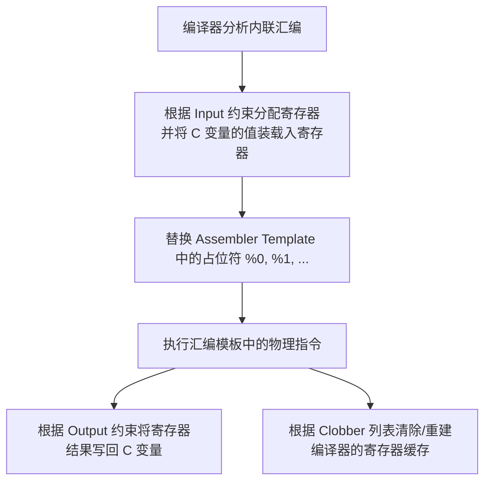

# GCC 内联汇编与约束规则

当 C 语言的高级抽象无法直接操纵底层硬件寄存器、特殊 CPU 指令（如禁用中断、执行原子操作或利用特定的向量指令），或者当我们需要手工编写绝对极致的代码路径时，**GCC 内联汇编（Inline Assembly）** 是必不可少的手段。

然而，内联汇编也是 C 语言中最容易出错、最难调试的领域之一。如果声明的约束（Constraints）不当，编译器会在寄存器分配、代码重排中引入极其隐蔽的 Bug。本章将系统解析内联汇编的底层语法、约束修饰符以及多架构下的实战代码。

---

## 1. 扩展内联汇编的四段式语法

在 C 语言中，我们通常使用**扩展内联汇编（Extended Assembly）**，其核心结构如下：

```c
__asm__ __volatile__ (
    "Assembler Template" // 汇编指令模板（以字符串形式编写，多行指令用 \n\t 分隔）
    : OutputOperands     // 输出操作数列表
    : InputOperands      // 输入操作数列表
    : Clobbers           // 破坏描述符列表（Clobber List）
);
```

### 1.1 关键修饰符说明
* `__asm__` 或 `asm`：声明内联汇编块的开始。
* `__volatile__` 或 `volatile`：**极其重要**。它指示编译器**禁用对该汇编块的优化**。防止编译器因为“误以为该汇编块没有副作用”而将其整块消除，或者将其移出循环、重排其位置。在操作系统内核、硬件寄存器访问和临界区保护中，必须使用 `__volatile__`。

### 1.2 四段式结构的工作原理



---

## 2. 约束限制（Constraints）与修饰符（Modifiers）

约束是连接 C 语言变量与汇编寄存器的桥梁。它们告诉 GCC 可以将变量放在何处，以及如何安全地对其进行操作。

### 2.1 常见寄存器与内存约束

| 约束符 | 适用架构 | 含义 |
| :--- | :--- | :--- |
| **`r`** | 通用 | 允许编译器分配任意可用的**通用寄存器（General Purpose Register）**。 |
| **`m`** | 通用 | 直接使用**内存地址**，不载入寄存器。常用于避免寄存器溢出或直接操作内存。 |
| **`i`** | 通用 | 允许一个**立即数（Immediate Integer）**，在编译期即可确定的常数。 |
| **`I`** | 架构相关 | 依赖架构的限制性立即数（如 ARM 下的 8 位常数，通过循环右移产生）。 |
| **`g`** | 通用 | 允许使用寄存器、内存或立即数中的任意一种（由编译器决定最优选择）。 |
| **`a`/`b`/`c`/`d`**| x86_64 | 显式指定 x86 的 `%eax`、`%ebx`、`%ecx`、`%edx` 寄存器。 |
| **`w`** | ARM | 向量寄存器（如 VFP/NEON 寄存器）。 |

---

### 2.2 操作数修饰符（Constraint Modifiers）

约束符前的符号决定了变量的读写属性：

#### `=` (只写修饰符)
表示该操作数是只写的。该操作数对应的原值会被直接覆盖，并且该变量在进入汇编块前不需要被初始化（编译器不会生成将原值载入寄存器的指令）。

#### `+` (可读可写修饰符)
表示该操作数既是输入又是输出。编译器在执行汇编块前，必须先将该变量的值载入寄存器，并且在汇编块结束后，将最终结果写回该变量。

#### `&` (早期擦除修饰符, Earlyclobber)
**这是解决内联汇编 Bug 的核心利器**。
* **现象**：默认情况下，GCC 认为输入变量在汇编块的第一条指令执行时就已经被“消费”完毕。因此，为了节省寄存器，GCC 可能会为某个**输出操作数**分配与**输入操作数**相同的寄存器。
* **危机**：如果你的汇编指令有多条，且在消费完所有输入之前，就已经对输出寄存器进行了写入，那么输入寄存器的值就会被提前破坏。
* **解决**：修饰符 `&` 强制告诉编译器：“这个输出寄存器在指令块的早期就会被写入，绝对不能与任何输入操作数共享同一个物理寄存器。”

---

### 2.3 Clobber List（破坏列表）与内存屏障

Clobber List 告诉编译器，汇编指令在运行过程中，除了输出操作数外，还间接破坏（修改）了哪些寄存器或系统状态。

#### 1. 显式寄存器破坏
如果在汇编中手动修改了某个特定寄存器（例如 x86 下的 `%rax` 或是 ARM 的 `r4`），且该寄存器未被列在 Output/Input 中，必须将其加入 Clobber 列表（如 `"rax"`）。编译器在调用该汇编块前，会先将该寄存器内原有的有用数据暂存到栈中，并在汇编结束后恢复。

#### 2. 标志位破坏 `"cc"`
如果汇编指令修改了 CPU 的状态寄存器（条件标志位，如溢出、零标志、进位等），必须添加 `"cc"`。在 x86 和 ARM 下的大多数算术比较指令都会隐式修改标志位。

#### 3. 内存破坏与编译器屏障 `"memory"`
**最强力的 Clobber**：`"memory"`。
* 告诉 GCC，该汇编块会对不可预知的内存地址进行读写（例如通过指针修改内存），且这些内存与输入/输出列表没有直接关联。
* **底层效应**：GCC 将执行一次**编译器屏障（Compiler Barrier）**。它强制要求：
  1. 在进入该汇编块前，所有缓存在寄存器中的内存数据必须写回（Flush）到物理 RAM 中。
  2. 退出该汇编块后，后续代码若需使用这些内存变量，必须重新从物理 RAM 中读取（Reload），不能使用之前的寄存器缓存。
  3. 编译器不得将该汇编块之前的内存读写操作与该汇编块之后的内存读写操作进行指令重排。

---

## 3. 多架构生产级内联汇编实战

### 3.1 ARM Cortex-M (ARMv7-M) 实战

在嵌入式开发（如 STM32）中，精确控制中断和实现无锁（Lock-free）原子操作是核心需求。

#### 示例一：临界区保护（关中断与开中断）
通过直接操纵 `PRIMASK` 寄存器实现极其高效的临界区保护。

```c
#include <stdint.h>

// 禁用全局中断，并返回修改前的值
static inline uint32_t disable_interrupts(void) {
    uint32_t result;
    __asm__ __volatile__ (
        "mrs %0, primask\n\t"  // 读取当前的全局中断屏蔽标志 (PRIMASK) 到 result
        "cpsid i"              // 关闭中断 (Change Processor State, Disable Interrupts)
        : "=r" (result)        // 输出：通过通用寄存器写入 result
        :                      // 无输入
        : "memory"             // 破坏列表：内存屏障，防止临界区内的代码被重排到关中断之前
    );
    return result;
}

// 恢复先前的中断状态
static inline void restore_interrupts(uint32_t mask) {
    __asm__ __volatile__ (
        "msr primask, %0"      // 将保存的掩码写回 PRIMASK 寄存器
        :
        : "r" (mask)           // 输入：传入的中断状态变量
        : "memory"             // 破坏列表：内存屏障，防止临界区内的代码被重排到开中断之后
    );
}
```

---

#### 示例二：无锁原子自增操作（LDREX / STREX）
ARM 架构下使用独占加载（LDREX）和独占存储（STREX）实现原子操作。

```c
#include <stdint.h>

// 实现原子自增并返回新值
int32_t atomic_increment(volatile int32_t *addr) {
    int32_t temp_val;
    int32_t store_status;
    int32_t result;

    __asm__ __volatile__ (
        "1:\n\t"
        "ldrex  %0, [%3]\n\t"          // 独占加载旧值到 temp_val (addr -> %3)
        "add    %0, %0, #1\n\t"        // 自增：temp_val = temp_val + 1
        "strex  %1, %0, [%3]\n\t"      // 独占存储新值，保存写入状态到 store_status (%1)
                                       // 若写入成功，%1 = 0；若被其他核/上下文打断导致失效，%1 = 1
        "teq    %1, #0\n\t"            // 测试 store_status 是否为 0
        "bne    1b"                    // 若不为 0 (失败)，跳转回标签 1 重新尝试
        : "=&r" (temp_val), "=&r" (store_status), "=r" (result)
        : "r" (addr)
        : "cc", "memory"               // 破坏了状态标志位 "cc" 和内存
    );

    // 此时 temp_val 保存了最终成功写入的新值
    result = temp_val;
    return result;
}
```
* **注意点**：此处 `temp_val` 和 `store_status` 使用了 `"=&r"`。这是典型的 **Earlyclobber** 场景。如果不用 `&`，GCC 极有可能会把输入指针 `addr` 放入与 `temp_val` 相同的寄存器中。一旦在首条指令 `ldrex` 执行完毕后，`addr` 的寄存器被自增破坏，随后的 `strex %1, %0, [%3]` 将读取错误的地址，导致灾难性的内存崩溃。

---

### 3.2 x86_64 架构实战

#### 示例一：精确读取 CPU 时间戳计数器 (RDTSC)
RDTSC 指令将高 32 位时间戳存入 `%edx`，低 32 位存入 `%eax`。我们需要利用约束精细读取并拼装为 64 位无符号整数。

```c
#include <stdint.h>

uint64_t read_tsc(void) {
    uint32_t low, high;
    
    // rdtsc 指令的输出是固定寄存器的 (edx:eax)
    __asm__ __volatile__ (
        "rdtsc"
        : "=a" (low), "=d" (high) // 绑定：%eax -> low, %edx -> high
        :                         // 无输入
        : "cc"                    // 破坏了标志位
    );
    
    return ((uint64_t)high << 32) | low;
}
```

---

#### 示例二：高效内存填充（`rep stosq`）
在不需要依赖 C 标准库 `memset` 的底层系统开发中，使用 CPU 原生的字符串操作指令快速填充一块内存。

```c
#include <stddef.h>
#include <stdint.h>

void fast_memset_u64(uint64_t *dest, uint64_t value, size_t count) {
    // x86_64 下 rep stosq 需要将值存入 rax，目标地址存入 rdi，计数存入 rcx
    __asm__ __volatile__ (
        "cld\n\t"             // 清除方向标志位 (Direction Flag), 确保递增填充
        "rep stosq"           // 重复执行 stosq 直到 rcx 为 0
        : "+D" (dest), "+c" (count)  // 输出/输入：rdi (%0) 和 rcx (%1) 会被指令隐式修改，使用 "+" 约束
        : "a" (value)                // 输入：rax (%2)
        : "memory"                   // 破坏了广泛的内存结构，强制内存屏障
    );
}
```
* **约束解析**：
  * `D` 代表 `%rdi`，`c` 代表 `%rcx`，`a` 代表 `%rax`。
  * 由于 `rep stosq` 执行时会递增寄存器 `%rdi` 并且递减 `%rcx` 至 0，所以必须声明为可读可写的 `"+"`，否则编译器在汇编结束后若继续复用这两个寄存器，将会引用到已被修改的脏值。
