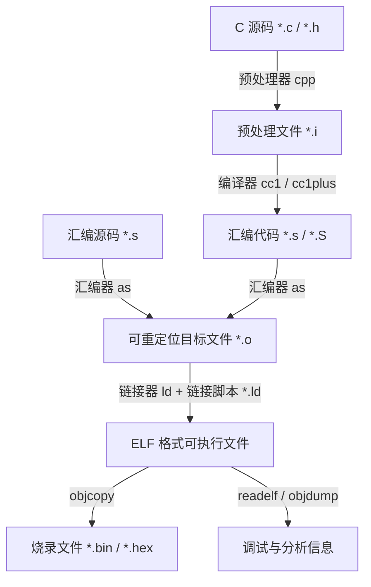

# 第一章：链接原理与语法基础

在嵌入式 C 语言开发中，从编写源代码到最终生成可在微控制器（MCU）上运行的二进制固件，需要经过预处理、编译、汇编和链接四个主要阶段。理解链接器（Linker）的工作原理，是掌握链接脚本语法和内存布局的基础。

---

## 1. GNU 工具链的编译与链接流水线

构建系统的输入是若干个源文件，输出是可在裸机上运行的固件。其核心工作流如下所示：



### 1.1 可重定位目标文件（Relocatable Object File）
汇编器输出的 `.o` 文件是符合 ELF（Executable and Linkable Format）标准的二进制文件。在这一阶段，目标文件包含以下关键结构：
*   **ELF 头（ELF Header）**：描述文件类型、目标架构（如 ARM Cortex-M）和 Section 头表的位置。
*   **Section**：代码与数据的载体。例如 `.text`（代码）、`.data`（已初始化全局变量）、`.bss`（未初始化全局变量）以及 `.rodata`（只读数据）。
*   **符号表（Symbol Table, `.symtab`）**：记录当前文件中定义和引用的所有符号（如函数名、全局变量名）及其相对偏移地址。
*   **重定位段（Relocation Sections, `.rel.text` / `.rel.data`）**：记录当前文件内哪些指令或数据引用了外部符号。在编译阶段，编译器由于无法得知外部符号的绝对地址，会暂时在对应位置填入占位符（如 `0x00000000`），并在此重定位表中登记一条记录，告知链接器“在此处填充符号 X 的真实地址”。

### 1.2 链接器的核心机制
链接器（`ld`）的主要任务是将多个可重定位的 `.o` 文件以及静态链接库（`.a`）融合成一个统一的、地址确定的 ELF 可执行文件。其工作包含两大核心阶段：

1.  **符号解析（Symbol Resolution）**：
    链接器遍历所有输入目标文件，将每个未解析的符号引用与符号表中的符号定义进行匹配。如果某个源文件调用了 `void delay(void)` 但自身未定义，链接器必须在其他 `.o` 或 `.a` 中找到 `delay` 的定义。如果找不到，则报错 `undefined reference to 'delay'`；如果找到多处重名定义，则报 `multiple definition` 错误。
2.  **重定位（Relocation）**：
    *   **Section 合并**：链接器读取各个 `.o` 文件，将同名或性质相近的 Section 合并。例如，将所有输入文件的 `.text` 段拼装成一个连续的大 `.text` 段，将所有 `.data` 段合并成一个大 `.data` 段。
    *   **地址分配**：链接器根据用户提供的**链接器脚本**，计算出每个合并后 Section 的起始虚拟内存地址（VMA）和加载存储地址（LMA）。
    *   **指令修正**：根据分配得到的符号绝对地址，修改所有需要重定位的机器指令。例如，将跳转指令 `BL 0` 修改为 `BL <Reset_Handler>` 的真实物理偏移量，将 `LDR r0, =global_var` 指令中的占位符替换为 `global_var` 的绝对物理地址。

---

## 2. 链接器脚本（Linker Script）语法详解

链接器脚本（通常以 `.ld` 为后缀）是纯文本文件，用于指示链接器如何将输入文件中的 Section 映射到输出文件的内存布局中。

### 2.1 整体骨架
一个典型的嵌入式链接器脚本通常包含三大部分：
1.  **入口点声明**：`ENTRY(Reset_Handler)`
2.  **物理存储区描述**：`MEMORY` 块，定义硬件的 Flash、RAM 等区域。
3.  **段输出规则**：`SECTIONS` 块，描述具体的 Section 存放到哪个 `MEMORY` 区。

---

## 3. MEMORY 命令：物理存储空间布局

`MEMORY` 指令用于向链接器宣告目标微控制器的物理存储映射。每个硬件平台的内存分布都是由芯片手册（Datasheet）决定的，链接脚本必须与之严格匹配。

### 3.1 语法结构
```ld
MEMORY
{
    region_name (attr) : ORIGIN = start_address, LENGTH = size
    ...
}
```

*   **`region_name`**：存储区的用户自定义名称（如 `FLASH`、`RAM`、`CCM_RAM`）。该名称只在链接脚本内部有效，与 C 语言无直接绑定关系。
*   **`attr`（属性属性标志）**：描述该存储区的物理特性，告知链接器该区域可存放哪些性质的段。常用属性包括：
    *   **`r` (read-only)**：只读区。通常用于 Flash，用于存放代码和常量。
    *   **`w` (read-write)**：读写区。通常用于 SRAM，用于存放可变变量。
    *   **`x` (executable)**：可执行区。包含微控制器可直接读取并执行的代码指令。
    *   **`a` (allocatable)**：可分配区。表示该存储区上电时有物理实体支持。
    *   **`i` / `l` (initialized)**：已初始化区。
    如果 Section 匹配时不指定任何存储属性，链接器会根据 Section 的读写属性自动将其分发到满足对应属性标志的 `MEMORY` 区域。
*   **`ORIGIN`（或简写 `org`, `o`）**：该物理存储区的起始地址，必须是硬件实际支持的绝对地址（例如 ARM Cortex-M3/M4 的 Flash 起始地址通常为 `0x08000000`）。
*   **`LENGTH`（或简写 `len`, `l`）**：该存储区的大小，可以使用以太字节 `K` 或兆字节 `M` 为单位（如 `512K` 或 `1M`）。

### 3.2 生产级实例：ARM Cortex-M 存储布局
```ld
MEMORY
{
    /* 内置 Flash：只读，可执行，起始地址 0x08000000，大小为 512KB */
    FLASH (rx)      : ORIGIN = 0x08000000, LENGTH = 512K
    
    /* 内置 SRAM：可读写，可执行，起始地址 0x20000000，大小为 128KB */
    RAM (rwx)       : ORIGIN = 0x20000000, LENGTH = 128K
    
    /* 紧耦合内存 CCMRAM：仅特定处理器支持，可读写，起始地址 0x10000000，大小为 64KB */
    CCMRAM (rw)     : ORIGIN = 0x10000000, LENGTH = 64K
}
```

---

## 4. SECTIONS 命令与定位计数器（Location Counter）

`SECTIONS` 块是链接脚本的灵魂，它决定了输入目标文件中的各个段如何被组织并放置到 `MEMORY` 中。

### 4.1 定位计数器（Location Counter）
在链接脚本中，句点字符 `.` 代表**定位计数器（Location Counter）**。
*   **只读与自增**：在分配段时，`.` 自动指向当前输出 Section 的当前 VMA（虚拟内存地址）。随着段中内容的不断写入，`.` 会随着段的大小自动向前累加。
*   **手动赋值**：用户可以直接修改 `.` 的值，实现强制跳转或地址对齐。例如：`. = 0x20001000;` 迫使下一个输出段从 `0x20001000` 开始排布。
*   **作用域限制**：
    *   在 `SECTIONS` 块的最外层，`.` 代表绝对的物理/虚拟地址。
    *   在某个具体输出 Section 内部，`.` 代表相对于该 Section 起始位置的**相对偏移量**（在有些旧版 ld 中代表绝对地址，但最佳实践是将其视为在当前段的累加值，并通过对齐语句修改之）。

> [!IMPORTANT]
> 定位计数器 `.` **只能向前移动，绝不能向后回退**。例如执行 `. = . - 0x10;` 会导致链接器报错，因为链接器无法将已经写入的二进制数据擦除或重叠覆盖。

### 4.2 内存对齐：ALIGN 指令
微控制器在访问未对齐的内存地址时，可能会触发**硬件总线错误（BusFault / HardFault）**，或者需要多个时钟周期才能完成一次读取，极大地拖累执行性能。
*   **`ALIGN(align_size)`**：将定位计数器 `.` 向上对齐到 `align_size` 的整数倍。
*   例如，当前定位计数器 `.` 的值为 `0x20000003`，执行 `. = ALIGN(4);` 后，`.` 将被修正为 `0x20000004`。

---

## 5. 核心链接器指令与机制

### 5.1 KEEP 指令与垃圾回收（Garbage Collection）
在构建高能效、精简的嵌入式程序时，我们通常会开启编译器优化选项：
*   `-ffunction-sections`：让编译器将每个函数单独编译进独立的段中（如将 `void delay()` 编入 `.text.delay`）。
*   `-fdata-sections`：将每个全局/静态变量单独放入独立的段中。
*   在链接时，配合 `--gc-sections` 选项，链接器会自动扫描符号调用树，自动剔除程序中从未被调用过的垃圾函数和变量，以节约存储空间。

然而，在裸机系统中，有些段非常特殊，虽然在 C 语言的调用树中不可达，但硬件在特定事件发生时会自动读取它们。最典型的例子就是**中断向量表（Vector Table）**。
如果链接器发现整个程序没有显式调用中断向量表中的内容，它就会在 `--gc-sections` 作用下将其剪裁掉。
为了防止这种行为，必须在链接脚本中使用 `KEEP()` 包裹该段：
```ld
KEEP(*(.isr_vector)) /* 强制链接器保留该段，严禁将其当作无用代码剪裁 */
```

### 5.2 PROVIDE 与 PROVIDE_HIDDEN 指令
在嵌入式底层开发中，链接器脚本经常需要定义一些特殊的边界变量（例如堆栈的顶端地址），以便 C 语言的启动文件读取。
*   **`PROVIDE(symbol = expression);`**：定义一个链接器符号。只有当 C/汇编源码中**引用了该符号但未显式定义**时，该符号才会被加入符号表。
*   **`PROVIDE_HIDDEN(symbol = expression);`**：与 `PROVIDE` 类似，但该符号被定义为**局部隐藏**，其可见性仅限于当前 ELF 可执行程序内部，在外部动态链接时不可见（对于完全静态链接的微控制器裸机程序，二者效果基本一致）。

### 5.3 ENTRY 指令
`ENTRY(symbol)` 用于定义整个程序执行的起点，即 CPU 上电复位后或者被调试器加载后执行的第一条指令。
对于 ARM Cortex-M，程序入口点通常是 `Reset_Handler`。
```ld
ENTRY(Reset_Handler)
```
虽然 Cortex-M 硬件上电时是从中断向量表的第二项（Reset 向量）读取地址并跳转，但设置 `ENTRY` 指令对于调试器（如 GDB、J-Link）非常重要。调试器在加载 ELF 文件后，会直接读取 ELF 的 Entry Point 字段，并将 CPU 的程序计数器（PC 寄存器）初始化到该地址。
